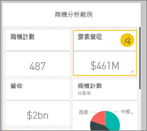
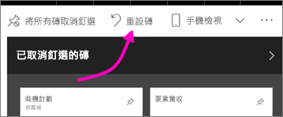

# 為行動電話最佳化儀表板 - Power BI 
當您在手機上以直向模式檢視儀表板時，會注意到儀表板磚的版面配置是並排排列而成，而且大小完全相同。 在 Power BI 服務中，您可以為儀表板建立專供手機直向模式使用的自訂檢視。 即使您建立了手機檢視，當您旋轉手機時，您還是會看到儀表板在服務中的版面配置方式。

正在尋找在行動裝置上檢視儀表板的資訊嗎？ 請改為嘗試此快速入門：[探索 Power BI 行動裝置應用程式中的儀表板和報表](consumer/mobile/mobile-apps-quickstart-view-dashboard-report.md)。

> [!NOTE]
> 當您編輯手機檢視時，所有檢視手機儀表板的人都會立刻看到您所做的變更。 例如，如果您取消釘選儀表板手機檢視上所有的磚，手機儀表板就會突然沒有任何磚。 
> 
> 

## 建立儀表板的手機檢視
1. 在 Power BI 服務中開啟儀表板。
2. 選取右上角 [Web 檢視]  旁的箭號 > 選取 [手機檢視]  。

    

    如果您不是儀表板擁有者，就看不到這個選項。

    

    手機儀表板的編輯檢視隨即開啟。 您可以在這裡取消釘選、調整大小和重新排列磚，使其符合手機畫面。 網頁版的儀表板不會變更。

1. 選取磚來拖曳、調整大小或取消釘選。 您會注意到，當您拖曳磚時，其他磚會移開。
   
    
   
    取消釘選的磚會進入 [已取消釘選的磚] 窗格並停留在該處，除非您將其加回。
   
    
2. 如果您改變心意，請選取 [重設磚]  依原來的大小和順序將它們放回去。
   
    
   
    只要在 Power BI 服務中開啟 [Phone Edit]\(手機編輯) 檢視，即可稍加變更手機上的磚大小和形狀。 因此，若要返回在 [Phone Edit]\(手機編輯) 檢視中開啟前的儀表板實際狀態，請選取 [重設磚]  。
3. 當您滿意了手機儀表板的版面配置後，請選取右上角 [手機檢視]  旁的箭號 > 選取 [Web 檢視]  。
   
    Power BI 會自動儲存手機版面配置。

## 後續步驟
* [建立為 Power BI 手機應用程式最佳化的報表](desktop-create-phone-report.md)
* [建立適用於任何大小的回應式視覺效果](visuals/desktop-create-responsive-visuals.md)
* 有其他問題嗎？ [嘗試在 Power BI 社群提問](https://community.powerbi.com/)

