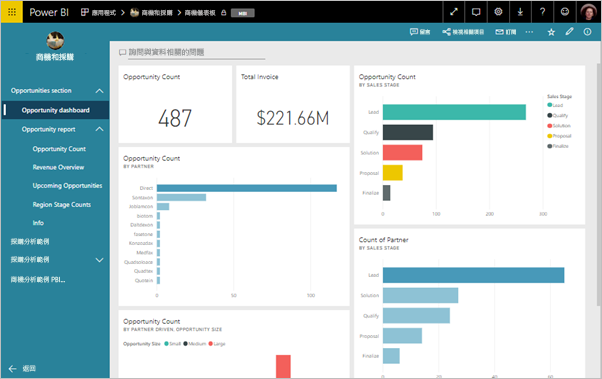
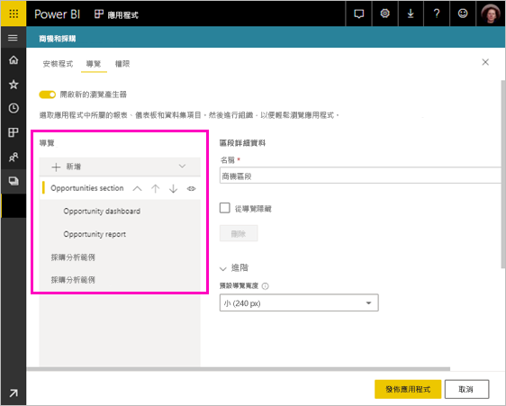
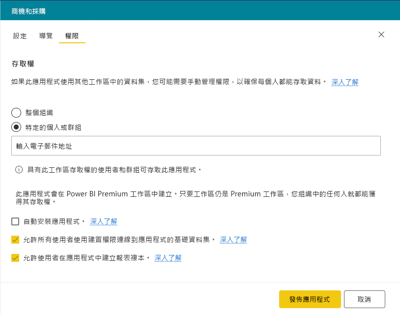
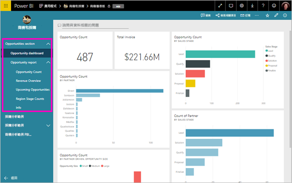

# 使用 Power BI 發佈應用程式

在 Power BI 中，您可以建立正式封裝的內容，然後將它以*應用程式*的形態散發給廣大群眾。 請在「應用程式工作區」  中建立應用程式，您可以在其中與同事對 Power BI 內容進行共同作業。 然後，您可以將已完成的應用程式發佈到組織中的大型人員群組。 

商務使用者通常需要多個 Power BI 儀表板和報表來執行業務。 透過 Power BI 應用程式，您可以建立多組儀表板和報表，然後將這些應用程式發佈至整個組織、特定人員或群組。 如果您是報表建立者或系統管理員，應用程式可讓您更輕鬆地管理這些集合的權限。

商務使用者取得您應用程式的不同方式：

- 他們可以從 Microsoft AppSource 尋找並安裝您的應用程式
- 您可以向他們傳送直接連結。
- 如果 Power BI 系統管理員賦予您權限，您可以在您同事的 Power BI 帳戶中自動安裝應用程式。

您可以建立具備內建瀏覽功能的應用程式，讓使用者可以在您內容中輕鬆找到他們的方式。 他們無法修改應用程式的內容。 但可以在 Power BI 服務或其中一個行動裝置應用程式中與其互動 - 自行篩選、醒目提示和排序資料。 他們會自動取得更新，而且您可以控制資料重新整理的頻率。 深入了解[商務使用者的應用程式體驗](consumer/end-user-apps.md)。

## 應用程式的授權
您需要 Power BI Pro 授權才能建立或更新應用程式。 應用程式「取用者」  有兩個選項。

* 選項 1：所有商務使用者都需要 **Power BI Pro** 授權，才能檢視您的應用程式。 
* 選項 2：如果您的應用程式工作區位於 Power BI Premium 容量中，則組織中的免費使用者就可以檢視應用程式內容。 如需詳細資訊，請參閱[什麼是 Power BI Premium？](service-premium.md)。

## 發佈您的應用程式
當工作區中的儀表板和報表就緒時，您可以選擇想要發佈的儀表板和報表，然後將它們發佈為應用程式。 

1. 在 [工作區] 清單檢視中，決定您想要**包含在應用程式中**的儀表板和報表。

     

     如果您選擇不包含相關儀表板的報表，您會在報表旁看到警告。 您仍然可以發佈應用程式，但相關儀表板不會有該報表的磚。

     

2. 選取右上角的 [發佈應用程式]  按鈕，啟動在工作區中建立和發佈應用程式的程序。
   
     

3. 在 [安裝程式]  中，填寫名稱和描述，以利尋找應用程式。 您可以設定個人化的佈景主題色彩。 也可以新增支援網站的連結。
   
     

4. 在 [瀏覽]  中，選取要發佈為應用程式一部分的內容。 然後，新增應用程式瀏覽，按節整理排列內容。 如需詳細資訊，請參閱本文中的[設計應用程式的瀏覽體驗](#design-the-navigation-experience-for-your-app)。
   
     

5. 在 [權限]  上，決定誰可以存取應用程式，以及他們可以用它做什麼。 
    - 在[傳統工作區](service-create-workspaces.md)中：您組織中的每個人、特定人員或 Azure Active Directory (AAD) 安全性群組。
    - 在[新體驗工作區](service-create-the-new-workspaces.md)中：特定人員、AAD 安全性群組和通訊群組清單，以及 Office 365 群組。 系統會自動為所有工作區使用者授與對工作區應用程式的存取權。
    - 您可以允許應用程式使用者使用「建置」權限連線到應用程式的底層資料集。 這些資料集將會出現在資料集搜尋體驗中。
    - 您可以允許應用程式使用者將此應用程式中的報表複製到其「我的工作區」。 
    
    >[!IMPORTANT]
    >若您的應用程式仰賴來自其他工作區的資料集，您必須負責確保所有應用程式使用者都能存取底層資料集。
> 
>     

6. 如果您的 Power BI 管理員已在 Power BI 管理入口網站中為您啟用此設定，您就可以為收件者自動安裝應用程式。 深入了解本文中的[自動安裝應用程式](#automatically-install-apps-for-end-users)。

     

7. 當您選取 [發佈應用程式]  時，會看到確認它已準備好要發佈的訊息。 在 [共用此應用程式]  對話方塊中，您可以複製此應用程式直接連結的 URL。
   
     

您可以將該直接連結傳送給已共用的對象，或他們可以移至 [從 AppSource 下載和探索更多應用程式]  ，在 [應用程式] 索引標籤中找到您的應用程式。 深入了解[商務使用者的應用程式體驗](consumer/end-user-apps.md)。

## 變更已發佈的應用程式
在您發佈應用程式之後，可能想要進行變更或更新。 如果您是新應用程式工作區的管理員或成員，就可以輕鬆更新它。 

1. 開啟對應至應用程式的應用程式工作區。 
   
     

2. 對儀表板或報表執行您想要的任何變更。
 
     應用程式工作區是暫存區域；因此，您的變更在重新發佈之前不會在應用程式中生效。 這可讓您進行變更，而不影響已發佈的應用程式。  
 
    > [!IMPORTANT]
    > 如果您移除報表並更新應用程式，即使您將報表新增回應用程式，您的應用程式取用者仍會遺失所有自訂項目，例如書籤、註解等。  
 
3. 回到內容的應用程式工作區清單，然後選取右上角的 [更新應用程式]  。
   
1. 更新 [安裝程式]  、[瀏覽]  和 [權限]  (如有需要)，然後選取 [更新應用程式]  。
   
您已對其發佈應用程式的人員會自動看到應用程式的已更新版本。 

## 設計應用程式的瀏覽體驗
[新瀏覽產生器]  選項可讓您建置應用程式的自訂瀏覽。 自訂瀏覽可讓使用者更容易尋找及使用應用程式中內容。 現有的應用程式已關閉此選項，而新的應用程式預設開啟此選項。

當此選項關閉時，您可以選取 [應用程式登陸頁面]  為 [特定內容]  (例如儀表板或報表)，或選取 [無]  ，向使用者顯示內容的基本清單。

當您開啟 [新瀏覽產生器]  時，您可以設計自訂的瀏覽。 根據預設，您在應用程式中包含的所有報表、儀表板和 Excel 活頁簿都會列為一般清單。 

您可以進一步自訂應用程式瀏覽，藉由：
* 使用向上/向下鍵重新排列項目。 
* 重新命名 [報告詳細資料]  、[儀表板詳細資料]  和 [活頁簿詳細資料]  中的項目。
* 隱藏瀏覽中的特定項目。
* 使用 [新增]  選項將**各節**新增至群組相關內容。
* 使用 [新增]  選項將**連結**新增至左側瀏覽的外部資源。 

當您新增**連結**時，您可在 [連結詳細資料]  中選擇在何處開啟該連結。 根據預設，連結會在 [目前索引標籤]  中開啟，但您可以選取 [新索引標籤]  或 [內容區域]  。 

### 使用 [新瀏覽產生器] 選項的考量
使用 [新瀏覽產生器] 時，請牢記以下一般事項：
* 報表頁面會顯示在應用程式的瀏覽區域，為可展開的區段
* 如果您關閉 [新瀏覽產生器]，然後發佈或更新您的應用程式，您會遺失已建立的自訂內容。 例如，瀏覽項目的區段、排序、連結和自訂名稱全都會遺失。

當您將連結新增至應用程式瀏覽並選取 [內容區域] 選項時：
* 請確定連結可內嵌。 某些服務會在第三方網站中封鎖內嵌其內容，例如 Power BI。
* 在不支援的其他工作區中內嵌 Power BI 服務內容，例如報表或儀表板。 
* 從內部部署的部署，透過其原生內嵌 URL 內容內嵌 Power BI 報表伺服器內容。 使用[建立 Power BI 報表伺服器 URL](https://docs.microsoft.com/power-bi/report-server/quickstart-embed#creating-the-power-bi-report-server-report-url) 中的這些步驟取得 URL。 請注意，因為適用一般驗證規則，所以檢視內容需要 VPN 連線到內部部署伺服器。 
* 在內嵌內容的頂端會顯示安全性警告，表示此非 Power BI 的內容。

## 自動為終端使用者安裝應用程式
如果管理員授與您權限，您可以自動安裝應用程式，將它們「推播」  給終端使用者。 這項推播功能，可讓您更容易向適當的人員或群組散發正確應用程式。 應用程式會自動出現在您終端使用者的應用程式內容清單中。 他們不必從 Microsoft AppSource 中尋找，或追蹤安裝連結。 請參閱 Power BI 管理入口網站文章，了解管理員如何[向終端使用者推播應用程式](service-admin-portal.md#push-apps-to-end-users)。

### 如何向使用者自動推播應用程式
系統管理員為您指派權限之後，您有新的選項用來**自動安裝應用程式**。 當您核取此方塊並選取 [發佈應用程式]  (或 [更新應用程式]  ) 後，就會將應用程式推播至在 [存取]  索引標籤之應用程式 [權限]  區段中定義的所有使用者或羣組。

### 使用者如何取得您推播給他們的應用程式
應用程式推播後，就會自動出現在他們的 [應用程式] 清單中。 以此方式，您就可以讓組織中特定使用者或工作角色輕鬆取得他們需要的應用程式。

### 自動安裝應用程式的考量
推送應用程式給終端使用者時，請記住下列事項：

* 自動為使用者安裝應用程式可能需要時間。 大部分的應用程式會立即為使用者安裝，但推播應用程式可能要花點時間。  這取決於應用程式中的項目數及有權存取的人數。 建議在使用者需要之前，於時間充足的下班時間推送應用程式。 與幾位使用者確認，再廣泛宣傳應用程式可供使用。

* 重新整理瀏覽器。 使用者可能需要重新整理，或關閉並重新開啟其瀏覽器，才能在 [應用程式] 清單中看到推送的應用程式。

* 如果使用者不能立即在 [應用程式] 清單中看到應用程式，他們應該重新整理，或關閉並重新開啟其瀏覽器。

* 盡量不要造成使用者太多負擔。 請小心不要推送太多應用程式，這樣使用者才能認定預先安裝的應用程式對他們有用。 為調配時間，最好控制誰可以將應用程式推送給終端使用者。 建立連絡點，將組織中的應用程式推播給使用者。

* 不會為未接受邀請的來賓使用者自動安裝應用程式。  

## 允許使用者連線到應用程式的底層資料集
透過選取選項以允許所有使用者連線到應用程式的底層資料集，應用程式使用者可接收底層資料集上的「建置」權限。 這可讓使用者[跨工作區使用應用程式資料集](service-datasets-across-workspaces.md)在 Power BI Desktop 中搜尋這些資料集，而且服務會取得資料體驗，以及此用這些資料集建立報表與儀表板。 

當您取消選取此選項時，您新增到應用程式的新使用者將無法再獲得「建置」權限。 不過，底層資料集上的現有權限不會變更。 您可以使用提供的使用者介面手動從不應該再擁有「建置」權限的使用者移除該權限。 深入了解[建置權限](service-datasets-build-permissions.md#build-permissions-for-shared-datasets)。

## 允許使用者在應用程式中建立報表複本
透過選取[允許使用者在此應用程式中複製應用程式報表]  ，您允許使用者將應用程式中的任何報表儲存到其「我的工作區」。 他們接著可以根據其獨特需求自訂報表。 此選項要求您必須啟用 [允許所有使用者使用組建權限來連線至應用程式的基礎資料集]  。 此功能的運作方式就像新的[從其他工作區複製報表](service-datasets-copy-reports.md)功能一樣。

## 解除發佈應用程式
應用程式工作區的任何成員都可以解除發佈應用程式。

>[!IMPORTANT]
>當您解除發佈應用程式時，應用程式使用者會失去其自訂項目。 他們會遺失所有與應用程式內容建立關聯的個人書籤、註解或訂閱。 只有在您需要移除應用程式時，才解除發佈該應用程式。
> 
> 

* 在應用程式工作區中，選取右上角的省略符號 ( **...** ) > [Unpublish app]\(解除發佈應用程式)  。
  
     

這個動作會解除安裝您發佈給每個人的應用程式，而且他們將無法再存取該應用程式。 它不會刪除應用程式工作區或其內容。

## 檢視已發佈的應用程式

當您的應用程式取用者開啟應用程式時，他們會看到您建立的瀏覽，而不是標準的 Power BI 左側瀏覽窗格。 應用程式瀏覽會列出已定義區段中的報表和儀表板。 它也會列出每份報表的個別頁面，而不僅是報表名稱。

## 後續步驟
* [建立應用程式工作區](service-create-workspaces.md)
* [在 Power BI 中安裝和使用應用程式](consumer/end-user-apps.md)
* [外部服務的 Power BI 應用程式](service-connect-to-services.md)
* [Power BI 管理入口網站](https://docs.microsoft.com/power-bi/service-admin-portal)
* 有問題嗎？ [嘗試在 Power BI 社群提問](http://community.powerbi.com/)
