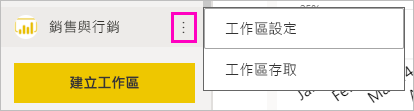
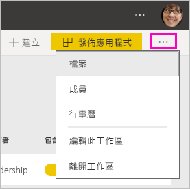
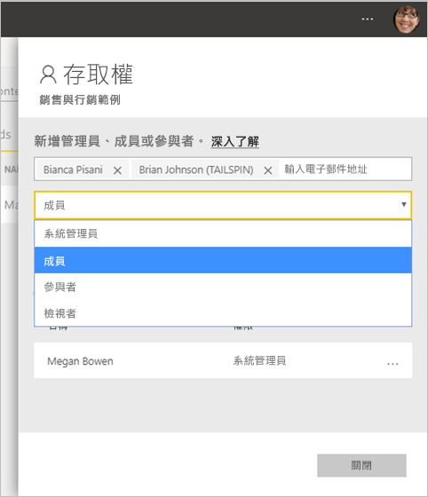

# 在 Power BI 中建立新工作區

Power BI 正在引進新工作區體驗。 「工作區」仍然是要與同事共同合作來建立儀表板、報表和編頁報表集合的地方。 然後，您可以將這些集合組合成「應用程式」  ，並散發給整個組織或是特定人員或群組。 

以下是不同的地方。 在新工作區中，您可以：

- 將工作區角色指派給使用者群組：安全性群組、通訊群組清單、Office 365 群組，以及個人。
- 在 Power BI 中建立工作區，而不建立 Office 365 群組。
- 使用更精細的工作區角色，在工作區中進行更有彈性的權限管理。

> [!NOTE]
> 若要強制執行資料列層級安全性 (RLS)，讓 Power BI Pro 使用者瀏覽工作區中的內容，請繼續使用[傳統工作區](service-create-workspaces.md)。 選取 [成員只可檢視 Power BI 內容]  選項。 或者，將 Power BI 應用程式發佈給這些使用者，或使用「共用」來散發內容。 即將推出的「檢閱者角色」將會在未來的新工作區體驗工作區中啟用此情節。

如需詳細背景，請參閱[新工作區](service-new-workspaces.md)一文。

## 建立其中一個新工作區

1. 開始建立工作區。 選取 [工作區]   > [建立工作區]  。
   
     

2. 您會自動建立已升級的工作區，除非您選擇**還原至典型**。
   
     
     
     如果您選取 [還原至典型]  ，您會建立以 Office 365 群組為基礎的工作區。 如果您需要 [成員只可檢視 Power BI 內容]  選項針對工作區成員強制執行資料列層級安全性 (RLS)，請使用此選項。

2. 提供工作區的名稱。 如果該名稱無法使用，請將它編輯為唯一名稱。
   
     工作區的應用程式將具有與工作區相同的名稱和圖示。
   
1. 以下是您可以為工作區設定的一些選擇性項目：

    上傳**工作區影像**。 檔案可為 .png 或 .jpg 格式。 檔案大小必須小於 45 KB。
    
    [新增**連絡人清單**](#workspace-contact-list)。 根據預設，工作區系統管理員是連絡人。 
    
    只要鍵入現有 Office 365 群組的名稱 (不是 URL)，就能[指定**工作區 OneDrive**](#workspace-onedrive)。 現在，此工作區可以使用該 Office 365 群組的檔案儲存位置。 

    

    若要將工作區指定為**專用容量**，請在 [Premium]  索引標籤上，選取 [專用容量]  。
     
    

1. 選取 [儲存]  。

    Power BI 會建立並開啟工作區。 您會在您所屬的工作區清單中看到它。 

## 工作區連絡人清單

新的工作空間連絡人清單可讓您指定哪些使用者會收到工作區中發生問題的通知。 根據預設，指定為工作區系統管理員的任何使用者或群組都會收到通知，但您可以自訂清單。 連絡人清單中所列的使用者或群組將會顯示在使用者介面 (UI) 中，以協助使用者取得與工作區相關的說明。

1. 使用兩個方法其中之一存取新 [連絡人清單]  設定：

    當您第一次建立工作區時，在 [建立工作區]  窗格中。

    在左導覽窗格中，選取 [工作區]  旁邊的箭號，選取工作區名稱旁邊的省略符號 (...) > [工作區設定]  。 [設定]  窗格隨即開啟。

    

2. 在 [進階]   > [連絡人清單]  底下，接受預設值 ([工作區系統管理員]  )，或新增您自己的 [特定使用者或群組]  清單。 
3. 選取 [儲存]  。

## 工作區 OneDrive

工作區 OneDrive 功能可讓您設定 Office 365 群組，其 SharePoint 文件庫的檔案儲存體可供工作區使用者使用。 您先在 Power BI 外建立群組。 

Power BI 不會同步處理使用者或群組的權限，而這些使用者或群組會設定為可利用 Office 365 群組成員資格存取工作區。 最佳做法是，將[工作區存取權](#give-access-to-your-workspace)授與您在此設定 Office 365 群組所設定檔案儲存體的相同 Office 365 群組。 然後藉由管理 Office 365 群組的成員資格來管理工作區存取權。 

1. 使用兩個方法其中之一存取新 [工作區 OneDrive]  設定：

    當您第一次建立工作區時，在 [建立工作區]  窗格中。

    在左導覽窗格中，選取 [工作區]  旁邊的箭號，選取工作區名稱旁邊的省略符號 (...) > [工作區設定]  。 [設定]  窗格隨即開啟。

    

2. 在 [進階]   > [工作區 OneDrive]  底下，鍵入您稍早所建立 Office 365 群組的名稱。 Power BI 會自動為該群組挑選 OneDrive。

    

3. 選取 [儲存]  。

### 存取工作區 OneDrive 位置

當您設定 OneDrive 位置之後，您可以在工作區中幾個不同地方取得它：

- 選取 [工作區]   > 「工作區名稱」  > 省略符號 ( **...** ) 功能表 > [檔案]  。 

    

- 選取工作區右上角的省略符號 ( **...** ) 功能表 > [檔案]  。

    
    
- 在 [取得資料]   > [檔案]  體驗中。 [OneDrive – 商務用]  項目是您自己的商務用 OneDrive。 第二個 OneDrive 是您新增的。

    

## 將內容新增至工作區

在您建立新工作區體驗工作區之後，就可以於其中新增內容。 在新工作區中新增內容與在傳統工作區類似。 使用 [建立] 按鈕或使用 [取得資料] 來新增內容到工作區。

1. 在新工作區的**歡迎使用**畫面中，您可以新增內容。 

    

1. 例如，選取 [範例]   > [客戶獲利率範例]  。

> [!NOTE]
> 您無法將組織內容套件或協力廠商內容套件新增到新工作區。 許多您先前使用的協力廠商內容套件都提供應用程式。 如果您需要繼續使用內容套件，請使用傳統工作區。 內容套件已經被淘汰，所以最佳做法是改為使用應用程式。

當您在工作區的內容清單中檢視內容時，工作區的名稱就會列為擁有者。

### 在新工作區中連線至協力廠商服務

在新的工作區體驗中，我們將進行變更以專注於「應用程式」  。 適用於協力廠商服務的應用程式，可為使用者輕鬆地從他們所使用的服務取得資料，例如 Microsoft Dynamics CRM、Salesforce 或 Google Analytics。

在新工作區體驗中，您無法建立或取用組織內容套件。 相反地，您可以使用提供的應用程式連線到協力廠商服務，或要求您的內部小組為您目前所使用的任何內容套件提供應用程式。 

## 提供您工作區的存取權

1. 在工作區內容清單中，因為您是系統管理員，所以會看到新的 [存取]  動作。

    

1. 選取 [存取]  。

1. 在這些工作區中，將安全性群組、通訊群組清單、Office 365 群組或個人新增為成員、參與者或系統管理員。 請參閱[新工作區中的角色](service-new-workspaces.md#roles-in-the-new-workspaces)，以取得不同角色的說明。

    

9. 選取 [新增]   > [關閉]  。

## 散發應用程式

若您想要將正式內容散發至您組織中較大的群體，您可以從工作區發佈應用程式。  當內容就緒時，您可以選擇想要發佈的儀表板和報表，然後將其發佈為「應用程式」  。 您可以從每個工作區建立一個應用程式。

請閱讀[從新工作區發佈應用程式](service-create-distribute-apps.md)

## 後續步驟
* 請閱讀[在 Power BI 的新工作區體驗中組織工作](service-new-workspaces.md)
* [建立傳統工作區](service-create-workspaces.md)
* [在 Power BI 中從新工作區發佈應用程式](service-create-distribute-apps.md)
* 有問題嗎？ [嘗試在 Power BI 社群提問](http://community.powerbi.com/)
