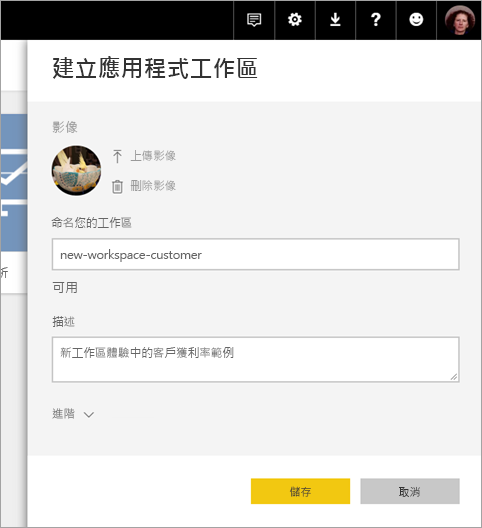
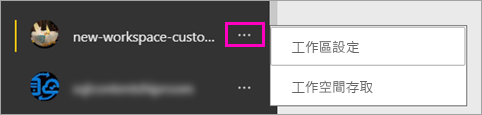

# 在 Power BI 中建立新的工作區 (預覽)

Power BI 正在引進新的工作區體驗作為預覽。 工作區仍然是與同事共同作業來建立儀表板和報表集合的地方，您可以將這些儀表板和報表集合組合成「應用程式」，並散發給整個組織或是特定人員或群組。 

使用新的工作區預覽，您現在可以：

- 將工作區角色指派給使用者群組：安全性群組、通訊群組清單、Office 365 群組，以及個人。
- 在 Power BI 中建立工作區，而不建立 Office 365 群組。
- 使用更精細的工作區角色，在工作區中進行更有彈性的權限管理。

如需詳細背景，請參閱[新的工作區 (預覽)](service-new-workspaces.md)一文。

## 建立其中一個新的應用程式工作區

1. 從建立應用程式工作區開始。 選取 [工作區] > [建立應用程式工作區]。
   
     

2. 在 [預覽改善的工作區] 中，選取 [立即試用]。
   
     

2. 提供工作區的名稱。 如果該名稱無法使用，請編輯它，使其具有唯一識別碼。
   
     應用程式將具有與工作區相同的名稱。
   
1. 需要的話，請新增影像。 檔案大小必須小於 45 KB。
 
    

1. 選取 [儲存]。

    在新工作區的**歡迎使用**畫面中，您可以新增資料。 

    

1. 例如，選取 [範例] > [客戶獲利率範例]。

    現在，在工作區內容清單中，您會看到 [新的工作區預覽]。 因為您是系統管理員，所以也會看到新的 [存取] 動作。

    

1. 選取 [存取]。

1. 在這些工作區中，將安全性群組、通訊群組清單、Office 365 群組或個人新增為成員、參與者或系統管理員。 請參閱[新工作區中的角色](service-new-workspaces.md#roles-in-the-new-workspaces)，以取得不同角色的說明。

    

9. 選取 [新增] > [關閉]。

1. Power BI 會建立並開啟工作區。 您會在您所屬的工作區清單中看到它。 因為您是系統管理員，所以您可以選取省略符號 (…) 以返回，並透過新增成員或變更其權限來變更工作區設定。

     

## 將內容新增至應用程式工作區

在您建立新樣式的應用程式工作區之後，就可以在其中新增內容。 在新舊樣式工作區中新增內容的操作很類似，但有一個例外狀況。 位於任一個應用程式工作區時，您可以上傳或連線至檔案，就像在您自己的 [我的工作區] 中一樣。 在新的工作區中，您無法連線至組織內容套件，或協力廠商內容套件 (例如 Microsoft Dynamics CRM、Salesforce 或 Google Analytics)。 在目前的工作區中，您可以連線至內容套件。

當您在應用程式工作區的內容清單中檢視內容時，應用程式工作區的名稱就會列為擁有者。

### 在新的工作區 (預覽) 中連線至協力廠商服務

在新的工作區體驗中，我們將進行變更以專注於「應用程式」。 適用於協力廠商服務的應用程式，可為使用者輕鬆地從他們所使用的服務取得資料，例如 Microsoft Dynamics CRM、Salesforce 或 Google Analytics。
組織應用程式則會為使用者提供其所需的資料。 我們計劃將功能新增至組織應用程式，因此使用者可以自訂他們在應用程式內找到的內容。 這項功能將不再需要內容套件。 

使用新的工作區預覽，您無法建立或自訂組織內容套件。 相反地，您可以使用提供的應用程式連線到協力廠商服務，或要求您的內部小組為您目前所使用的任何內容套件提供應用程式。 

## 散發應用程式

當內容就緒時，您可以選擇想要發佈的儀表板和報表，然後將其發佈為「應用程式」。 您可以從每個工作區建立一個應用程式。 您的同事可透過幾種不同的方式取得應用程式。 如果 Power BI 系統管理員賦予您權限，您可以在您同事的 Power BI 帳戶中自動安裝應用程式。 否則，他們可以從 Microsoft AppSource 找到並安裝您的應用程式，或者您可以將直接連結傳送給他們。 他們會自動取得更新，而且您可以控制資料重新整理的頻率。 如需詳細資料，請參閱[在 Power BI　中發佈具有儀表板和報表的應用程式](service-create-distribute-apps.md)。

## 將舊的應用程式工作區轉換成新的應用程式工作區

在預覽期間，您無法將舊的應用程式工作區自動轉換成新的應用程式工作區。 不過，您可以建立新的應用程式工作區，並將內容發佈到新的位置。 

當新的工作區正式推出 (GA) 時，可以選擇自動移轉舊的工作區。 在 GA 後的某個時間點，您必須將其移轉。

## 後續步驟
* 請閱讀[在 Power BI 的新工作區 (預覽) 中組織工作](service-new-workspaces.md)
* [建立目前的工作區](service-create-workspaces.md)
* [在 Power BI 中安裝和使用應用程式](service-create-distribute-apps.md)
* 有問題嗎？ [嘗試在 Power BI 社群提問](http://community.powerbi.com/)
