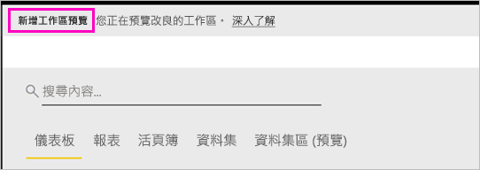
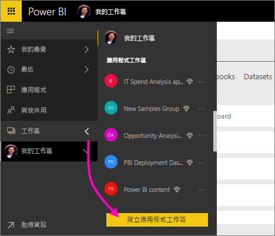
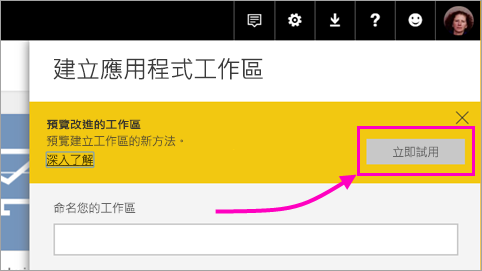
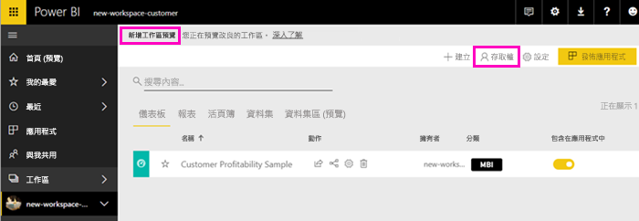
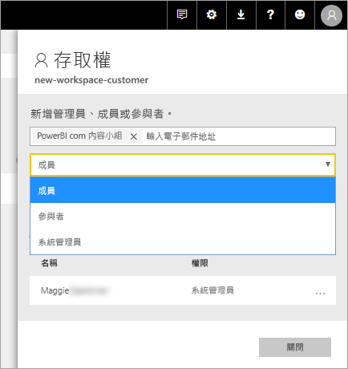
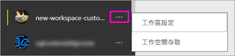

# 在 Power BI 中建立新的工作區 (預覽)

Power BI 正在引進新的工作區體驗作為預覽。 工作區仍然是與同事共同作業來建立儀表板和報表集合的地方，您可以將這些儀表板和報表集合組合成「應用程式」，並散發給整個組織或是特定人員或群組。 

使用新的工作區預覽，您現在可以：

- 將工作區角色指派給使用者群組：安全性群組、通訊群組清單、Office 365 群組，以及個人。
- 在 Power BI 中建立工作區，而不建立 Office 365 群組。
- 使用更精細的工作區角色，在工作區中進行更有彈性的權限管理。
 
當您建立其中一個新工作區時，不會建立基礎的相關聯 Office 365 群組。 所有工作區管理都是在 Power BI 中進行，而不是 Office 365。 您仍然可以將 Office 365 群組新增至工作區，繼續透過 Office 365 群組管理使用者對內容的存取權。 不過，您可以在 Power BI　內另外使用安全性群組、通訊群組清單，以及直接新增個人，讓您能夠彈性地管理工作區存取權

請在新的工作區中，將使用者群組或個人新增為成員、參與者或系統管理員。 使用者群組中的每個人都會取得您已定義的角色。 如果個人在多個使用者群組中，他們會取得角色所提供的最高層級權限。  如需不同角色的說明，請參閱本文稍後的[新工作區中的角色](#roles-in-the-new-workspaces)。

新增至應用程式工作區的每個人都必須有 Power BI Pro 授權。 在工作區中，這些使用者皆可在儀表板和報表上共同作業，以準備發佈給更多對象，甚至整個組織。 如果您想要將內容散發給組織內的其他人，則可以將 Power BI Pro 授權指派給這些使用者，或將工作區置於 Power BI Premium 容量中。
因為這是一項預覽功能，所以您應該要注意一些限制。 請參閱 <section link> 本文稍後以取得目前限制的說明。 我們使用新的工作區重新設計了一些功能。 請參閱本文稍後的＜章節連結＞，以取得可預期為永久性變更以及預覽的說明。

## 推出新的應用程式工作區

在預覽期間，新舊工作區可以並排共存，您可以建立任一個工作區。 當新工作區的預覽結束，並且正式推出這些工作區時，舊的工作區仍然可以存在一段時間。 您將無法建立它們，而且必須準備將您的工作區移轉到新的工作區基礎結構。 別擔心，您有幾個月的時間來完成移轉。

## 建立其中一個新的應用程式工作區

1. 從建立應用程式工作區開始。 選取 [工作區] > [建立應用程式工作區]。
   
     

2. 在 [預覽改善的工作區] 中，選取 [立即試用]。
   
     

2. 提供工作區的名稱。 如果該名稱無法使用，請編輯它，使其具有唯一識別碼。
   
     應用程式將具有與工作區相同的名稱。
   
1. 需要的話，請新增影像。 檔案大小必須小於 45 KB。
 
    

1. 選取 [儲存]。

    在新工作區的**歡迎使用**畫面中，您可以新增資料。 

    

1. 例如，選取 [範例] > [客戶獲利率範例]。

    現在，在工作區內容清單中，您會看到 [新的工作區預覽]。 因為您是系統管理員，所以也會看到新的 [存取] 動作。

    

1. 選取 [存取]。

1. 在這些工作區中，將安全性群組、通訊群組清單、Office 365 群組或個人新增為成員、參與者或系統管理員。 如需不同角色的說明，請參閱本文稍後的[新工作區中的角色](#roles-in-the-new-workspaces)。

    

9. 選取 [新增] > [關閉]。

1. Power BI 會建立並開啟工作區。 它會出現在您所屬的工作區清單中。 因為您是系統管理員，所以您可以選取省略符號 (…) 以返回，並透過新增成員或變更其權限來變更工作區設定。

     

## 將內容新增至應用程式工作區

在您建立新樣式的應用程式工作區之後，就可以在其中新增內容。 在新舊樣式工作區中新增內容的操作很類似，但有一個例外狀況。 位於任一個應用程式工作區時，您可以上傳或連線至檔案，就像在您自己的 [我的工作區] 中一樣。 在新的工作區中，您無法連線至組織內容套件，或協力廠商內容套件 (例如 Microsoft Dynamics CRM、Salesforce 或 Google Analytics)。 在目前的工作區中，您可以連線至內容套件。

當您在應用程式工作區的內容清單中檢視內容時，應用程式工作區的名稱就會列為擁有者。

### 在新的工作區 (預覽) 中連線至協力廠商服務

在新的工作區體驗中，我們將進行變更以專注於應用程式。 適用於協力廠商服務的應用程式，可為使用者輕鬆地從他們所使用的服務取得資料，例如 Microsoft Dynamics CRM、Salesforce 或 Google Analytics。
組織應用程式則會為使用者提供其所需的資料。 我們計劃將功能新增至組織應用程式，因此使用者可以自訂他們在應用程式內找到的內容。 這將移除對內容套件的需求。 

使用新的工作區預覽，您無法建立或自訂組織內容套件。 相反地，您可以使用提供的應用程式連線到協力廠商服務，或要求您的內部小組為您目前所使用的任何內容套件提供應用程式。 

## 新工作區中的角色

角色可讓您管理誰可以在工作區中做什麼，因此小組可以共同作業。 新的工作區可讓您將角色指派給個人和使用者群組：安全性群組、Office 365 群組，以及通訊群組清單。 

當您將角色指派給使用者群組時，群組中的個人可以存取內容。 如果巢狀處理使用者群組，則所有包含的使用者都具有權限。 在數個使用者群組中具有不同角色的使用者，會獲得授與他們的最高層級權限。 

新的工作區提供三種角色：系統管理員、成員和參與者。

**系統管理員可以：**

- 更新和刪除工作區。 
- 新增/移除人員，包括其他系統管理員。
- 執行成員可執行的所有項目。

**成員可以：** 

- 新增具有較低權限的成員或其他人。
- 發佈和更新應用程式。
- 共用項目或共用應用程式。
- 允許其他人再次共用項目。
- 執行參與者可執行的所有項目。

**參與者可以：** 

- 建立、編輯和刪除工作區中的內容。 
- 將報表發佈至工作區、刪除內容。
- 無法為新使用者提供內容存取權；無法共用新的內容，但可以與已共用工作區、項目或應用程式的其他人共用。 
- 無法修改群組的成員。
 
我們將在服務中建置要求存取工作流程；因此，無權存取的使用者可以要求它。 儀表板、報表和應用程式目前有要求存取工作流程。

## 散發應用程式

當內容就緒時，您可以選擇想要發佈的儀表板和報表，然後將其發佈為「應用程式」。 您可以從每個工作區建立一個應用程式。 您的同事可透過幾種不同的方式取得應用程式。 如果 Power BI 系統管理員賦予您權限，您可以在您同事的 Power BI 帳戶中自動安裝應用程式。 否則，他們可以從 Microsoft AppSource 找到並安裝您的應用程式，或者您可以將直接連結傳送給他們。 他們會自動取得更新，而且您可以控制資料重新整理的頻率。 如需詳細資料，請參閱[在 Power BI　中發佈具有儀表板和報表的應用程式](service-create-distribute-apps.md)。

## 將舊的應用程式工作區轉換成新的應用程式工作區

在預覽期間，您無法將舊的應用程式工作區自動轉換成新的應用程式工作區。 不過，您可以建立新的應用程式工作區，並將內容發佈到新的位置。 

當新的工作區正式推出 (GA) 時，可以選擇自動移轉舊的工作區。 在 GA 後的某個時間點，您必須將其移轉。

## Power BI 應用程式常見問題集

### 新的應用程式工作區與目前的應用程式工作區有何不同？
* 與目前的應用程式工作區不同，建立應用程式工作區並不會在 Office 365 中建立對應實體。 (您仍然可以為 Office 365 群組指派角色，藉以將其新增至工作區)。 
* 在目前的應用程式工作區中，您只能將個人新增至成員和系統管理員清單。 在新的應用程式工作區中，您可以將多個 AD 安全性群組、通訊群組清單或 Office 365 群組新增至這些清單，以便能夠更輕鬆地進行使用者管理。 
- 您可以從目前的應用程式工作區建立組織內容套件。 但無法從新的應用程式工作區建立組織內容套件。
- 您可以從目前的應用程式工作區使用組織內容套件。 但無法從新的應用程式工作區使用組織內容套件。
- 在預覽期間，新的應用程式工作區尚未啟用某些功能。 如需詳細資料，請參閱下一節[其他規劃的新工作區功能](service-create-the-new-workspaces.md#other-planned-new-app-workspace-preview-features)。

## 規劃的新應用程式工作區預覽功能

一些其他的新應用程式工作區預覽功能仍在開發中，但在我們啟動預覽時尚未提供：

- 沒有 [離開工作區] 按鈕。
- 尚未支援使用計量。
- Premium 的運作方式：您可以在 Premium 容量中指派和建立工作區，但若要在容量之間移動工作區，請移至工作區的設定。
- 尚未支援 SharePoint Web 組件內嵌。
- Office 365 群組在 [取得資料/檔案] 中沒有 [OneDrive] 按鈕。

## 運作方式不同的應用程式工作區功能

某些功能在新應用程式工作區的運作方式，不同於目前的應用程式工作區。 根據我們從客戶收到的意見反應，這些差異是刻意設計的，可啟用更彈性方法，以便與工作區共同作業：

- 成員可以或無法再次共用：取代為「參與者」角色
- 唯讀的工作區：無需將工作區的唯讀存取權授與使用者，您可以將使用者指派給即將推出的「檢視者」角色，這會允許工作區中內容的類似唯讀存取權。

## 已知問題

以下是已知問題，且修正程式正在開發中：

- 新增為電子郵件訂用帳戶收件者的免費使用者或使用者群組可能不會收到電子郵件，但他們應該收到電子郵件。 新的工作區體驗工作區是在 Premium 容量中，但建立訂用帳戶的使用者若其 [我的工作區] 不在 Premium 容量中時，就會發生此問題。 如果 [我的工作區] 是在 Premium 容量中，則免費使用者和使用者群組將會收到電子郵件。
- 工作區從 Premium 容量移到共用容量之後，在某些情況下，免費使用者和使用者群組將會繼續收到電子郵件，但他們不應該收到電子郵件。 建立訂用帳戶的使用者若其 [我的工作區] 是在 Premium 容量中時，就會發生此問題。

## 後續步驟

- [建立目前的工作區](service-create-workspaces.md)
* [在 Power BI 中安裝和使用應用程式](service-install-use-apps.md)
* 有問題嗎？ [嘗試在 Power BI 社群提問](http://community.powerbi.com/)
