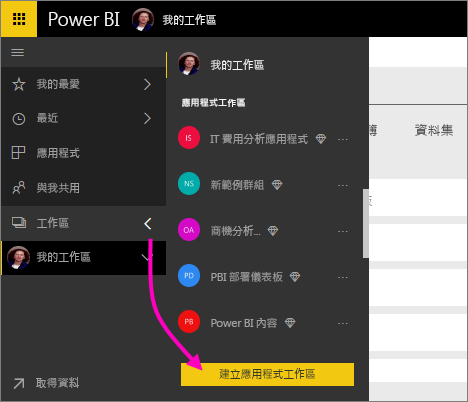
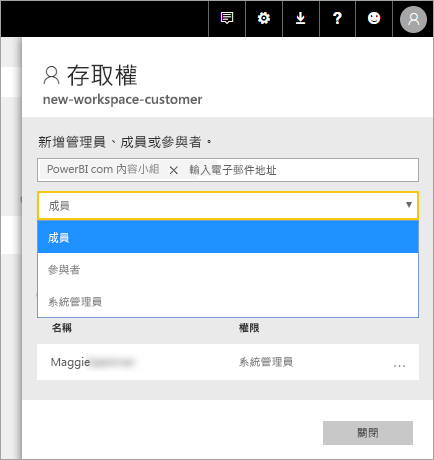

# 在 Power BI 中建立新的工作區

Power BI 引進了新的工作區體驗。 工作區仍是建立集合的儀表板、 報表和編頁的報表的同事共同作業的位置。 然後您可以組合成該集合*應用程式*並將其散發給整個組織，或是特定人員或群組。 

以下是有何不同。 在新的工作區中，您可以：

- 將工作區角色指派給使用者群組：安全性群組、通訊群組清單、Office 365 群組，以及個人。
- 在 Power BI 中建立工作區，而不建立 Office 365 群組。
- 使用更精細的工作區角色，在工作區中進行更有彈性的權限管理。

> [!NOTE]
> 若要強制執行瀏覽工作區中的內容的 Power BI Pro 使用者的資料列層級安全性 (RLS)，請繼續使用[傳統的工作區](service-create-workspaces.md)。 選取 **成員只能檢視 Power BI 內容**選項。 或者，將 Power BI 應用程式發行給這些使用者，或使用 「 共用 」 來發佈內容。 即將推出的檢視器角色將會啟用此案例在未來，新的工作區體驗工作區中。

如需詳細背景，請參閱 <<c0> [ 新的工作區](service-new-workspaces.md)文章。

## 建立其中一個新的應用程式工作區

1. 從建立應用程式工作區開始。 選取 [工作區]   > [建立應用程式工作區]  。
   
     

2. 除非您選擇要自動建立升級工作區中，**還原為傳統**。
   
     
     
     如果您選取**還原為傳統**，您建立 Office 365 群組為基礎的工作區。 如果您需要使用此選項**成員只能檢視 Power BI 內容**選項會強制執行的工作區成員的資料列層級安全性 (RLS)。

2. 提供工作區的名稱。 如果名稱無法使用，請編輯它，使其具有唯一的名稱。
   
     應用程式工作區會與工作區有相同的名稱和圖示。
   
1. 以下是一些您可以設定您的工作區的選用項目：

    上傳**工作區影像**。 檔案可以是.png 或.jpg 格式。 檔案大小必須小於 45 KB。
    
    [新增**連絡人清單**](#workspace-contact-list)。 根據預設，工作區系統管理員會是連絡人。 
    
    [指定**工作區 OneDrive** ](#workspace-onedrive)輸入現有 Office 365 的群組，不是 URL 的名稱。 現在此工作區可以使用該 Office 365 群組的檔案儲存體位置。 

    

    若要指派工作區來**專用容量**上**Premium**索引標籤上選取**專用容量**。
     
    

1. 選取 [儲存]  。

    Power BI 會建立並開啟工作區。 您會在您所屬的工作區清單中看到它。 

## 工作區中的連絡人清單

新的工作區連絡人清單可讓您指定哪些使用者會收到通知的方式在工作區中所發生的問題。 根據預設，任何使用者或群組指定為工作區系統管理員會收到通知，但您可以自訂清單。 使用者或連絡人清單中所列的群組將會顯示在使用者介面 (UI)，以協助使用者取得與工作區相關的協助。

1. 存取新**連絡人清單**設定中有兩種：

    在 **建立工作區**窗格中，當您第一次建立時。

    在左側的導覽窗格中，選取箭號旁**工作區**，選取工作區名稱旁邊的省略符號 （...） >**工作區設定**。 **設定** 窗格隨即開啟。

    

2. 底下**進階** > **連絡人清單**，接受預設位置，**工作區管理員**，或新增您自己的清單**特定使用者或群組**. 
3. 選取 [儲存]  。

## Workspace OneDrive

工作區 OneDrive 功能可讓您設定 Office 365 群組的 SharePoint 文件庫的檔案儲存體可供工作區的使用者。 您第一次建立 Power BI 外部群組。 

Power BI 不會同步處理使用者或群組已設定為擁有 Office 365 群組成員資格的工作區存取權的限。 最佳做法是讓相同的 Office 365 群組，您設定此設定 Office 365 群組中，其檔案儲存體[存取工作區](#give-access-to-your-workspace)。 然後藉由管理 Office 365 群組的成員資格管理工作區的存取。 

1. 存取新**工作區 OneDrive**設定中有兩種：

    在 **建立工作區**窗格中，當您第一次建立時。

    在左側的導覽窗格中，選取箭號旁**工作區**，選取工作區名稱旁邊的省略符號 （...） >**工作區設定**。 **設定** 窗格隨即開啟。

    

2. 底下**進階** > **工作區 OneDrive**，輸入您稍早建立的 Office 365 群組的名稱。 Power BI 會自動拾取群組的 OneDrive。

    

3. 選取 [儲存]  。

### 存取 OneDrive 位置的工作區

設定 OneDrive 位置之後，您可以從工作區中的幾個不同地方取得它：

- 選取 [**工作區** > *工作區名稱*> 省略符號 ( **...** )] 功能表 >**檔案**。 

    

- 選取省略符號 ( **...** ) 工作區的右上角功能表 >**檔案**。

    
    
- 在 **取得資料** > **檔案**體驗。 **OneDrive-商務**項目是您自己的 OneDrive for Business。 第二個 OneDrive 是您加入。

    

## 將內容新增至應用程式工作區

建立新的工作區體驗工作區之後，就可以在其中新增內容。 加入內容大致的新款與傳統的工作區中。 使用 建立 按鈕，或使用 將內容新增至您的工作區的 取得資料。

1. 在 **歡迎**螢幕為您新的工作區中，您可以將內容。 

    

1. 例如，選取 [範例]   > [客戶獲利率範例]  。

> [!NOTE]
> 在新的工作區中，您無法使用組織內容套件或第三方內容套件。 應用程式所有的協力廠商內容套件，您可以使用先前用過。 如果您需要繼續使用內容套件，請使用傳統的工作區。 內容套件已被取代，所以最好改為使用應用程式。

當您在應用程式工作區的內容清單中檢視內容時，應用程式工作區的名稱就會列為擁有者。

### 連接到新的工作區中的第三方服務

在新的工作區體驗中，我們將進行變更以專注於「應用程式」  。 適用於協力廠商服務的應用程式，可為使用者輕鬆地從他們所使用的服務取得資料，例如 Microsoft Dynamics CRM、Salesforce 或 Google Analytics。

在新的工作區體驗中，您無法建立或使用組織內容套件。 相反地，您可以使用提供的應用程式連線到協力廠商服務，或要求您的內部小組為您目前所使用的任何內容套件提供應用程式。 

## 允許存取您的工作區

1. 在工作區內容清單中，因為您是系統管理員，所以您會看到新的動作，請**存取**。

    

1. 選取 [存取]  。

1. 在這些工作區中，將安全性群組、通訊群組清單、Office 365 群組或個人新增為成員、參與者或系統管理員。 請參閱[新工作區中的角色](service-new-workspaces.md#roles-in-the-new-workspaces)，以取得不同角色的說明。

    

9. 選取 [新增]   > [關閉]  。

## 散發應用程式

如果您想要發佈給大量使用者在組織內的官方內容，您可以從您的工作區中發佈應用程式。  內容準備就緒時，您選擇的儀表板和報表，您想要發佈，然後發佈為*應用程式*。 您可以從每個工作區建立一個應用程式。

了解[發佈應用程式，從新的工作區](service-create-distribute-apps.md)

## 後續步驟
* 了解[組織在新的工作區體驗，在 Power BI 中的工作](service-new-workspaces.md)
* [建立傳統的工作區](service-create-workspaces.md)
* [在 Power BI 中發行的應用程式，從新的工作區](service-create-distribute-apps.md)
* 有問題嗎？ [嘗試在 Power BI 社群提問](http://community.powerbi.com/)
