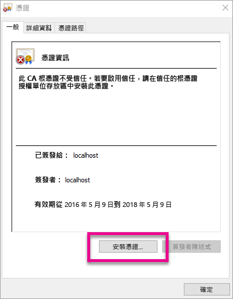
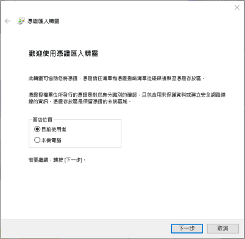
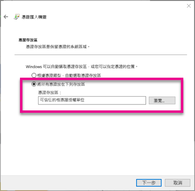
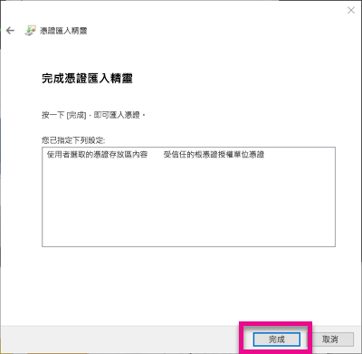
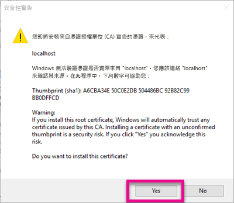
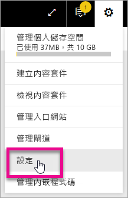

# <a name="use-developer-tools-to-create-custom-visuals"></a>使用開發人員工具建立自訂視覺效果
自訂視覺效果可讓您滿足使用者的需求，並契合應用程式的設計。 您可以使用開發人員工具來建立 Power BI 的自訂視覺效果。

> [!NOTE]
> 這份文件可讓您輕鬆上手。 如需深入的詳細資訊，請參閱 [Power BI 視覺效果 Git 存放庫](https://github.com/Microsoft/PowerBI-visuals)中的參考資訊。
> 
> 

## <a name="requirements"></a>需求
* 需具備 NodeJS 4.0 以上的版本 (建議 5.0 或更新版本) [下載 NodeJS](https://nodejs.org)

## <a name="install-nodejs-and-the-power-bi-tools"></a>安裝 NodeJS 和 Power BI 工具
若要建立自訂視覺效果，您必須安裝 NodeJS。 若要執行命令列工具，需具備 NodeJS。

1. 下載並安裝 [NodeJS](https://nodejs.org)。 需具備 4.0 或更新版本，但建議使用 5.0 或更新版本。
2. 安裝命令列工具。 在命令提示字元中，執行下列命令。
   
        npm install -g powerbi-visuals-tools
3. 您可以執行下列命令，不需任何參數，即可確認工具是否安裝。
   
        pbiviz
   
    您應該會看到下列說明的輸出。
   
    <pre><code>
         +syyso+/
    oms/+osyhdhyso/
    ym/       /+oshddhys+/
    ym/              /+oyhddhyo+/
    ym/                     /osyhdho
    ym/                           sm+
    ym/               yddy        om+
    ym/         shho /mmmm/       om+
     /    oys/ +mmmm /mmmm/       om+
    oso  ommmh +mmmm /mmmm/       om+
   ymmmy smmmh +mmmm /mmmm/       om+
   ymmmy smmmh +mmmm /mmmm/       om+
   ymmmy smmmh +mmmm /mmmm/       om+
   +dmd+ smmmh +mmmm /mmmm/       om+
         /hmdo +mmmm /mmmm/ /so+//ym/
               /dmmh /mmmm/ /osyhhy/
                 //   dmmd
                       ++
   
       PowerBI Custom Visual Tool
   
    Usage: pbiviz [options] [command]
   
    Commands:
   
    new [name]        Create a new visual
    info              Display info about the current visual
    start             Start the current visual
    package           Package the current visual into a pbiviz file
    update [version]  Updates the api definitions and schemas in the current visual. Changes the version if specified
    help [cmd]        display help for [cmd]
   
    Options:
   
    -h, --help      output usage information
    -V, --version   output the version number
    --install-cert  Install localhost certificate
    </code></pre>

<a name"ssl-setup"></a>

### <a name="server-certificate-setup"></a>伺服器憑證安裝
若要啟用視覺效果的即時預覽，需具備受信任的 HTTPS 伺服器。 在開始之前，您必須先安裝 SSL 憑證，才能將視覺效果資產載入網頁瀏覽器。 

> [!NOTE]
> 這是用於開發人員工作站的一次性安裝。
> 
> 

若要新增憑證，請執行下列命令。

    pbiviz --install-cert

**Windows OS**

1. 選取 [安裝憑證...]。
   
    
2. 依序選取 [目前使用者] 和 [下一步]。
   
    
3. 依序選取 [Place all certificate in the following store] \(將所有憑證放在下列存放區) 和 [瀏覽]。
4. 依序選取 [信任的根憑證授權] 和 [確定]。 選取 [下一步] 。
   
    
5. 選取 [完成] 。
   
    
6. 在安全性警告對話方塊中，選取 [是]。
   
    
7. 關閉任何已開啟的瀏覽器。

> [!NOTE]
> 如果系統無法辨識憑證，您可能需要重新啟動電腦。
> 
> 

**OSX**

1. 如果左上方的鎖為鎖定狀態，請選取該鎖以解除鎖定。 搜尋 *localhost* 並連按兩下憑證。
   
    
2. 選取 [永遠信任]，然後關閉視窗。
   
    
3. 輸入您的使用者名稱和密碼。 選取 [更新設定]。
   
    
4. 關閉任何已開啟的瀏覽器。

> [!NOTE]
> 如果系統無法辨識憑證，您可能需要重新啟動電腦。
> 
> 

## <a name="enable-live-preview-of-developer-visual"></a>啟用開發人員視覺效果的即時預覽
若要啟用自訂視覺效果的即時預覽，請遵循下列步驟。 這可讓您在編輯報表時，於 Power BI 服務中使用視覺效果。

1. 瀏覽並登入 [app.powerbi.com](https://app.powerbi.com)。
2. 選取**齒輪圖示**，然後選取 [設定]。
   
    
3. 依序選取 [開發人員] 和 [啟用開發人員視覺效果以供測試]。
   
    
4. 在 [視覺效果] 窗格中，選取 [開發人員視覺效果]。
   
    
   
   > [!NOTE]
   > 您必須已從開發電腦的視覺效果資料夾執行 `pbiviz start`，才能進行此動作。 如需如何建立視覺效果的詳細資訊，請參閱本文的[建立新的視覺效果](#create-a-new-visual)。
   > 
   > 
5. 在報表畫布中選取視覺效果。 您可以使用繫結其他視覺效果的相同方式來繫結資料。

現在，您可以著手開發自己的視覺效果。

## <a name="create-a-new-visual"></a>建立新的視覺效果
您可以執行下列命令來建立新的視覺效果專案。

```
pbiviz new My Visual name
```

您可以將 *My Visual Name* 取代為想要提供給視覺效果的名稱。 之後，您也可以在產生的 `pbiviz.json` 檔案中，修改 `name` 和 `displayName` 欄位以進行變更。

此命令會在命令執行所在目錄中建立新的資料夾， 並會產生視覺效果的基本入門範本。 當命令完成時，您可以開啟該目錄，並使用喜好的編輯器以開始使用新的視覺效果。

## <a name="testing-your-visual-in-power-bi"></a>在 Power BI 中測試視覺效果
您可以在 Power BI 服務的報表和儀表板中測試視覺效果。

<a name="running-your-visual"></a>

### <a name="running-your-visual"></a>執行視覺效果
您可以透過下列方式來執行視覺效果：

1. 開啟提示。
2. 將目錄變更為您的視覺效果資料夾。 這是包含 `pbiviz.json` 檔案的資料夾。
3. 執行下列命令：
   
    ```
    pbiviz start
    ```
   
    

如果您的位置錯誤，則會看到類似如下的錯誤：

```
    error  LOAD ERROR Error: pbiviz.json not found. You must be in the root of a visual project to run this command.
        at e (C:\Users\[user]\AppData\Roaming\npm\node_modules\powerbi-visuals-tools\lib\VisualPackage.js:67:35)
        at Function.loadVisualPackage (C:\Users\[user]\AppData\Roaming\npm\node_modules\powerbi-visuals-tools\lib\VisualPackage.js:62:16)
        at Object.<anonymous> (C:\Users\[user]\AppData\Roaming\npm\node_modules\powerbi-visuals-tools\bin\pbiviz-start.js:43:15)
        at Module._compile (module.js:556:32)
        at Object.Module._extensions..js (module.js:565:10)
        at Module.load (module.js:473:32)
        at tryModuleLoad (module.js:432:12)
        at Function.Module._load (module.js:424:3)
        at Module.runMain (module.js:590:10)
        at run (bootstrap_node.js:394:7)
```

### <a name="viewing-your-visual-in-power-bi"></a>在 Power BI 中檢視視覺效果
若要在報表中檢視視覺效果，請移至該報表，然後選取 [視覺效果] 窗格中的視覺效果。

> [!NOTE]
> 在進行此動作之前，您必須先執行 `pbiviz start` 命令 (如[執行視覺效果](#running-your-visual)一節所述)。
> 
> 


接著，即會顯示視覺效果的入門範本。


| 工具列項目 | 描述 |
| --- | --- |
| 重新整理視覺效果 |如果已停用自動重新載入，請手動重新整理視覺效果。 |
| 切換自動重新載入 |開啟時，系統即會在每次儲存視覺效果檔案時自動更新視覺效果。 |
| 顯示資料檢視 |顯示視覺效果的基礎資料檢視以進行偵錯 |
| 取得說明 |GitHub 中的文件 |
| 傳送意見反應 |如果您有可以改善體驗的建議，歡迎告訴我們！ (需要 GitHub 帳戶) |

## <a name="package-your-visual-for-use-in-power-bi-desktop-and-distribution"></a>封裝視覺效果以用於 Power BI Desktop 並進行發佈
若要將視覺效果載入 [Power BI Desktop](https://powerbi.microsoft.com/desktop/)，或在 [Power BI 視覺化組件庫](https://visuals.powerbi.com)中與社群分享，您必須先產生 `pbiviz` 檔案。

您可以透過下列方式來封裝視覺效果：

1. 開啟提示。
2. 將目錄變更為您的視覺效果資料夾。 這是包含 `pbiviz.json` 檔案的資料夾。
3. 執行下列命令：
   
    ```
    pbiviz package
    ```

此命令會在視覺化專案的 `dist/` 目錄中建立 `pbiviz`。 它會覆寫已存在的 `pbiviz` 檔案 (若有的話)。

## <a name="updating-the-visuals-api-version"></a>更新視覺效果 API 版本
當您使用 `pbiviz new` 建立視覺效果時，系統會將適當的 API 類型定義和 json 結構描述複本複製到您的視覺效果目錄。 您可以使用 `pbiviz update` 命令，視需要更新這些檔案。 如果我們發行過去 API 版本的修正程式，或您想要更新至最新的 API 版本，此功能就非常實用。

### <a name="updating-your-existing-api-version"></a>更新現有的 API 版本
如果我們發行現有 API 的更新，您可以透過下列方式取得最新版本。

```
#Update your version of pbiviz
npm install -g powerbi-visuals-tools

#Run update from the root of your visual project, where pbiviz.json is located
pbiviz update
```

這會從 npm 下載最新的工具，包括已更新的類型定義與結構描述。 使用 `pbiviz update` 時，最新版本即會覆寫 *pbiviz.json* 檔案的 `apiVersion` 屬性。

### <a name="upgrading-to-a-different-api-version"></a>升級至不同的 API 版本
您可以使用上述的相同步驟，更新至不同的 API 版本。 您可以明確指定您想要使用的 API 版本。

```
#Update your version of pbiviz
npm install -g powerbi-visuals-tools

#Run update from the root of your visual project, where pbiviz.json is located
pbiviz update 1.2.0
```

這會將您的視覺效果更新至 API 1.2.0 版。 您可以將 `1.2.0` 取代為任何想要使用的版本。

> [!WARNING]
> 工具所使用的預設 API 版本一律為 API 的穩定版本。 比預設 API 版本更晚的任何版本皆為不穩定版本而且可能隨時變更。 不穩定版本可能會發生非預期的行為，並在 Power BI 服務與 Power BI Desktop 之間出現不一致的行為。 如需目前的穩定 API 版本，請參閱[變更記錄檔](https://github.com/Microsoft/PowerBI-visuals/blob/master/ChangeLog.md)。 如需發行前版本的詳細資訊，請參閱[藍圖](https://github.com/Microsoft/PowerBI-visuals/blob/master/Roadmap/README.md)。
> 
> 

## <a name="inside-the-visual-project"></a>在視覺效果專案內
您的視覺效果專案是在執行 `pbiviz new` 命令時建立的資料夾。 

### <a name="file-structure"></a>檔案結構
| 項目 | 描述 |
| --- | --- |
| assets/ |用來儲存視覺效果資產 (圖示、螢幕擷取畫面等)。 |
| dist/ |當您執行 `pbiviz package` 時，會於此處產生 pbiviz 檔案。 |
| src/ |您的視覺效果的 TypeScript 程式碼。 |
| style/ |視覺效果的 Less 樣式。 |
| .gitignore |告知 git 忽略在存放庫中不應追蹤的檔案。 |
| capabilities.json |用來定義視覺效果的[功能](https://github.com/Microsoft/PowerBI-visuals/blob/master/Capabilities/Capabilities.md)。 |
| package.json |[npm](https://www.npmjs.com/) 會使用此項目來管理模組。 |
| pbiviz.json |主要設定檔。 |
| tsconfig.json |Typescript 編譯器設定。 深入了解 [tsconfig.json](https://www.typescriptlang.org/docs/handbook/tsconfig-json.html)。 |

### <a name="pbivizjson"></a>pbiviz.json
這個檔案是視覺效果的主要設定檔， 其中包含您建置視覺效果所需的中繼資料以及檔案相關資訊。

```
{
    "visual": {
        "name": "myVisual", // internal visual name (should not contain spaces)
        "displayName": "My Visual!", // visual name displayed to user (used in gallery)
        "guid": "PBI_CV_xxxxxxx", // a unique id for this visual MUST BE UNIQUE
        "visualClassName": "Visual" // the entry class for your visual
        "version": "1.0.0", // visual version. Should be semantic version (increment if you update the visual)
        "description": "", // description used in gallery
        "supportUrl": "", // url to where users can get support for this visual
        "gitHubUrl": "" // url to the source in github (if applicable)
    },
    "apiVersion": "1.0.0", //API version this visual was created with
    "author": {
        "name": "", // your name
        "email": "" // your e-mail
    },
    "assets": {
        "icon": "assets/icon.png" // relative path to your icon file (20x20 png)
    },
    "style": "style/visual.less", // relative path to your less file
    "capabilities": "capabilities.json" // relative path to your capabilities definition 
}
```

### <a name="visual-source-typescript"></a>視覺效果來源 (TypeScript)
視覺效果程式碼應該以 TypeScript 來撰寫，其為 JavaScript 的超集合並支援更進階的功能且可優先存取 ES6/ES7 功能。

所有 TypeScript 檔案應儲存在 `src/` 目錄，並新增至 `tsconfig.json` 中的 `files` 陣列。 這可讓 TypeScript 編譯器將其載入，並決定載入順序。

視覺效果建置好之後，就會將所有 TypeScript 編譯成單一的 JavaScript 檔案。 這可讓您從其他檔案參考匯出的項目，而不需手動針對檔案使用 `require` (只要 tsconfig 中列出這兩個檔案即可)。

依據視覺效果的建立需求，您可以建立任意數量的檔案與類別。

深入了解 [TypeScript](http://www.typescriptlang.org/)。

### <a name="visual-style-less"></a>視覺效果樣式 (Less)
系統會使用階層式樣式表 (CSS) 來處理視覺效果樣式。 為了便於使用，我們會使用可支援部分進階功能 (例如巢狀結構、變數、mixin、條件、迴圈等等) 的 Less 預先編譯器。如果您不想使用上述任何功能，只需在 Less 檔案中撰寫一般 CSS 即可。

您應將所有 Less 檔案儲存在 `style/` 目錄中。 系統會載入 `pbiviz.json` 檔案內之 `style` 欄位下方所指定的檔案。 若要載入任何其他檔案，則應該使用 `@import`。

深入了解 [Less](http://lesscss.org/)。

## <a name="debugging"></a>偵錯
如需偵錯自訂視覺效果的祕訣，請參閱[偵錯指南](https://github.com/Microsoft/PowerBI-visuals/blob/master/tools/debugging.md)。

## <a name="submit-your-visual-to-appsource"></a>將視覺效果提交至 AppSource
您可以列出視覺效果供其他人使用，但要將它提交至 AppSource。 如需此程序的詳細資訊，請參閱[將自訂視覺效果發佈至 AppSource](developer/office-store.md)。

## <a name="troubleshooting"></a>疑難排解
**找不到 pbiviz 命令 (或類似的錯誤)**

如果您在終端機/命令列中執行 `pbiviz`，您應該會看到說明畫面。 如果未顯示，則表示安裝有誤。 請確定您至少已安裝 NodeJS 4.0 版。

如需詳細資訊，請參閱[安裝 NodeJS 和 Power BI 工具](#install-nodejs-and-the-power-bi-tools)...

**在 [視覺效果] 索引標籤中找不到偵錯視覺效果的功能**

[視覺效果] 索引標籤中的偵錯視覺效果功能，看起來像個提示圖示。


如果未顯示，請確定您已在 Power BI 設定中加以啟用。 

> [!NOTE]
> 偵錯視覺效果功能目前僅可在 Power BI 服務中使用；Power BI Desktop 或行動裝置應用程式皆尚未提供。 封裝的視覺效果仍可在每個地方運作。
> 
> 

如需詳細資訊，請參閱[啟用開發人員視覺效果的即時預覽](#enable-live-preview-of-developer-visual)...

**聯繫不到視覺效果伺服器**

從視覺效果專案的根目錄中，透過終端機/命令列的 `pbiviz start` 命令，來執行視覺效果伺服器。 如果伺服器正在執行，原因很可能是因為您未正確安裝 SSL 憑證。

如需詳細資訊，請參閱[執行視覺效果](#running-your-visual)或[伺服器憑證安裝](#ssl-setup)。

## <a name="next-steps"></a>後續步驟
[Power BI 中的視覺效果](power-bi-report-visualizations.md)  
[Power BI 中的自訂視覺效果](power-bi-custom-visuals.md)  
[將自訂視覺效果發佈至 Office 市集](developer/office-store.md)  
[TypeScript](http://www.typescriptlang.org/)  
[Less CSS](http://lesscss.org/)  

有其他問題嗎？ [嘗試在 Power BI 社群提問](http://community.powerbi.com/)

