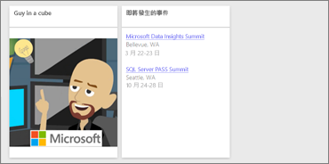
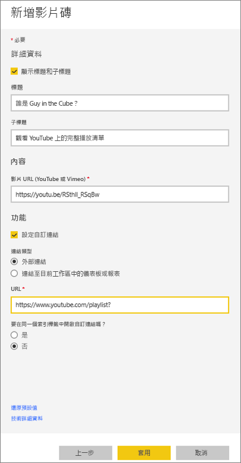
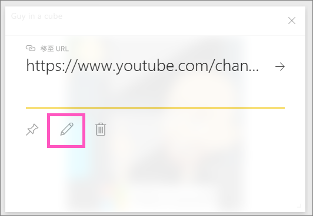

# <a name="add-image-text-video-and-more-to-your-dashboard"></a>將影像、文字、視訊和其他項目新增至儀表板
<iframe width="560" height="315" src="https://www.youtube.com/embed/e2PD8m1Q0vU" frameborder="0" allowfullscreen></iframe>


## <a name="add-tile"></a>新增磚
[新增磚] 控制項可讓您直接將影像、文字方塊、影像、串流資料或 Web 程式碼加入儀表板。

1. 從頂端功能表列選取 [新增磚]。 根據空間限制，您可能只會看到加號 。
   
    
2. 選取要新增的磚類型：**影像**、**文字方塊**、**影片**、**Web 內容**或**自訂串流資料**。
   
    

## <a name="add-an-image"></a>加入影像
假設您希望儀表板上有公司的標誌或其他影像。 您將需要線上儲存映像檔，並連結到它。 請確定不需要特殊認證以便存取映像檔。 例如，OneDrive 和 SharePoint 需要驗證，因此儲存在那裡的映像無法如此新增至儀表板。  

1. 選取 [影像] > [下一步]。
2. 將影像資訊加入 [ **圖格詳細資料** ] 窗格。
   
    
   
   * 若要在影像上方顯示標題，請選取 [ *顯示標題和副標題* ]，並輸入標題和/或副標題。
   * 輸入影像 URL
   * 若要將標題設定為超連結，請選取 [ **設定自訂連結** ]，並輸入 URL。  同事按一下此影像或標題時，便會前往此 URL。
   * 選取 [ **套用**]。  在儀表板上，視需要調整影像大小和移動影像。
     
     

## <a name="add-a-text-box-or-dashboard-heading"></a>新增文字方塊或儀表板標題
1. 選取 [文字方塊] > [下一步]。
   
    
   
   > **注意**︰若要加入儀表板標題，請在文字方塊中輸入您的標題並增加字型。
   > 
   > 
2. 設定文字方塊的格式︰
   
   * 若要在文字方塊上方顯示標題，請選取 [ **顯示標題和副標題** ]，並輸入標題和/或副標題。
   * 輸入並格式化文字方塊的內容。  
   * 或者設定標題的自訂連結。  不過在此範例中，我們已經在文字方塊內加入了超連結，因此請保持 [ **設定自訂連結** ] 的未核取狀態。
3. 選取 [ **套用**]。  在儀表板上，視需要調整文字方塊大小和移動文字方塊。
   
   

## <a name="add-a-video"></a>加入影片
將 YouTube 或 Vimeo 影片加入儀表板後，該影片就會直接在儀表板上播放。

1. 選取 [影片] > [下一步]。
2. 將影片資訊加入 [ **圖格詳細資料** ] 窗格。
   
    
   
   * 若要在影片圖格上方顯示標題和副標題，請選取 [ *顯示標題和副標題* ]，並輸入標題和/或副標題。 在此範例中，我們新增子標題，然後將其設定成返回 YouTube 完整播放清單的超連結。
   * 輸入影片 URL
   * 為標題和副標題加入超連結。  您可能希望，同事在觀看內嵌視訊後能夠檢視 YouTube 上的完整播放清單；您可以在此加入播放清單的連結。
   * 選取 [ **套用**]。  在儀表板上，視需要調整影片大小和移動影片。
     
      
3. 選取要播放影片的影片磚。
4. 選取移至 YouTube 播放清單的子標題。

## <a name="add-streaming-data"></a>新增串流資料
<iframe width="560" height="315" src="https://www.youtube.com/embed/kOuINwgkEkQ" frameborder="0" allowfullscreen></iframe>

## <a name="add-web-content"></a>加入 Web 內容
貼上或輸入任何 HTML 內容。  Power BI 會把它當成圖格加入您的儀表板。 以手動方式輸入內嵌程式碼，或從 Twitter、YouTube、embed.ly 等站台複製/貼上。

1. 選取 [Web 內容] > [下一步]。
2. 將資訊加入 [加入 Web 內容磚] 窗格。
   
    
   
   * 若要在圖格上方顯示標題，請選取 [顯示標題和副標題]  ，並輸入標題和/或副標題。
   * 輸入內嵌程式碼。 我們在這個範例會複製並貼上 Twitter 摘要。
   * 選取 [ **套用**]。  在儀表板上，視需要調整 Web 內容大小和移動 Web 內容。
     
      

## <a name="tips-for-embedding-web-content"></a>內嵌 Web 內容的提示
* 若為 Iframe，請使用安全的來源。 如果輸入 Iframe 的內嵌程式碼卻取得空白圖格，請查看 Iframe 來源是否使用了 **http** 。  如果是的話，請變更為 **https**。
  
  ```
  <iframe src="https://xyz.com">
  ```
* 編輯寬度和高度資訊。 這個內嵌程式碼會內嵌視訊，並將視訊播放程式設定為 560 x 315 像素。  當您調整圖格大小時，這個大小不會變更。
  
  ```
  <iframe width="560" height="315"
  src="https://www.youtube.com/embed/Cle_rKBpZ28" frameborder="0"
   allowfullscreen></iframe>
  ```
  
  如果您希望播放程式調整大小以符合圖格大小、請將寬度和高度設為 100%。
  
  ```
  <iframe width="100%" height="100%"
  src="https://www.youtube.com/embed/Cle_rKBpZ28" frameborder="0"
   allowfullscreen></iframe>
  ```
* 此程式碼會內嵌推文，並以個別連結的方式在儀表板上保留 **AFK** 播客、**@GuyInACube Twitter 頁面**、**關注**、**#analytics**、**回覆**、**轉推**和**喜歡**的連結。  選取圖格本身會帶您前往 Twitter 的播客。
  
  ```
  <blockquote class="twitter-tweet" data-partner="tweetdeck">
  <p lang="en" dir="ltr">Listen to
  <a href="https://twitter.com/GuyInACube">@GuyInACube</a> talk to
  us about making videos about Microsoft Business Intelligence
  platform
  <a href="https://t.co/TmRgalz7tv">https://t.co/TmRgalz7tv </a>
  <a href="https://twitter.com/hashtag/analytics?src=hash">
  #analytics</a></p>&mdash; AFTK Podcast (@aftkpodcast) <a
  href="https://twitter.com/aftkpodcast/status/693465456531771392">
  January 30, 2016</a></blockquote> <script async src="//platform.twitter.com/widgets.js" charset="utf-8"></script>
  ```

## <a name="edit-a-tile"></a>編輯磚
若要變更磚...

1. 將滑鼠暫留在圖格右上角並選取省略符號。
   
    
2. 選取編輯圖示，即可重新開啟 [ **圖格詳細資料** ] 窗格並進行變更。
   
    

## <a name="considerations-and-troubleshooting"></a>考量與疑難排解
* 若想要更輕鬆地在儀表板上移動圖格，請加入標題和/或副標題。
* 如果想要內嵌網站的某些內容，但網站未提供可供複製及貼上的內嵌程式碼，請簽出 embed.ly 以利產生內嵌程式碼。

## <a name="next-steps"></a>後續步驟
[儀表板磚](service-dashboard-tiles.md)

有其他問題嗎？ [試試 Power BI 社群](http://community.powerbi.com/)。

