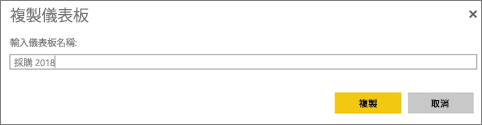
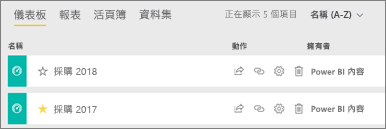

# 建立 Power BI 儀表板複本

有許多不同的原因會建立您自己的儀表板複本。 複本會儲存到使用中 (相同) 的工作區。 您可能想要進行變更，並測試其與原始版本的效能；或建立要依同事、地區或小組散發的略為不同的版本。 同事可能欣賞您的儀表板設計，並且想要使用它向經理報告。 另一個原因是您的新資料庫具有相同的資料結構和資料類型，而且想要重複使用您已建立的儀表板，這也一樣可以完成，但在 Power BI Desktop 中需要執行一些工作。 

已與您共用為應用程式的儀表板不能重複。

1. 開啟儀表板。
2. 在右上角選取省略符號 (...)，然後選擇 [複製儀表板]。
   
   
3. 提供儀表板的名稱，並選取 [複製]。 
   
   
4. 新的儀表板會儲存在與原始儀表板相同的工作區中。 
   
   

## 後續步驟
* [編輯、調整大小和移動磚](service-dashboard-edit-tile.md) 
* [設計絕佳儀表板的秘訣](service-dashboards-design-tips.md) 

有其他問題嗎？ [試試 Power BI 社群](http://community.powerbi.com/)

