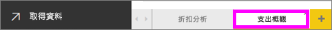
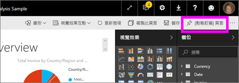
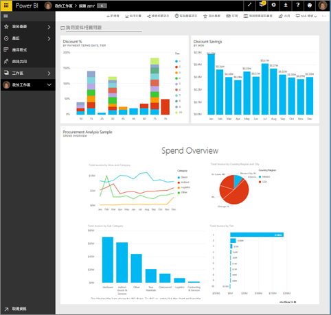

# 從報表建立 Power BI 儀表板
您已閱讀 [Power BI 的儀表板](service-dashboards.md)，現在想要建立自己的儀表板。 有許多不同的方式可以建立儀表板：從報表、從頭建立、從資料集、複製現有的儀表板等等。  

在首次接觸時，這可能會令人望而生畏，因此我們將透過釘選來自己建置報表的視覺效果，從建立快速且簡單的儀表板開始。 在您完成此快速入門之後，便能對儀表板和報表之間的關係、開啟報表編輯器中的 [編輯檢視]、釘選磚，以及在儀表板和報表之間進行瀏覽等內容，具備相當程度的了解。 接著，請使用左側的目錄，或是位於底部的＜後續步驟＞來移至更進階的主題。

## 誰可以建立儀表板？
建立儀表板為**建立者**功能，並需要報表的編輯權限。 報表的建立者，以及由建立者授予存取權限的同事皆會有編輯權限。 例如，如果 David 在 workspaceABC 中建立報表，並將您新增為該工作區的成員，您和 David 都會有編輯權限。 反過來說，如果報表是直接與您共用，或是搭配 [Power BI 應用程式](service-install-use-apps.md)與您共用 (在此情況下，您是在**取用**該報表)，您將無法將磚釘選到儀表板上。

> **注意**：儀表板是 Power BI 服務的功能，而不是 Power BI Desktop 的功能。 Power BI 行動裝置無法建立儀表板，但可以[檢視及共用](mobile-apps-view-dashboard.md)儀表板。
>
> 

## 影片：從報表釘選視覺效果和影像來建立儀表板
觀看 Amanda 釘選報表的視覺效果，建立新的儀表板。 然後請依照影片下方的步驟，使用採購分析範例自行嘗試看看。

<iframe width="560" height="315" src="https://www.youtube.com/embed/lJKgWnvl6bQ" frameborder="0" allowfullscreen></iframe>

### 先決條件
若要跟著做，您必須下載「採購分析」範例 Excel 活頁簿，並在 Power BI 服務 (app.powerbi.com) 中開啟它。

## 匯入資料集與報表
我們會匯入其中一個 Power BI 範例資料集，並用它建立新的儀表板。 要使用的範例是具有兩份 PowerView 工作表的 Excel 活頁簿。 當 Power BI 匯入活頁簿時，它會將資料集以及報表新增至您的工作區。  從 PowerView 工作表自動建立報表。

1. [選取此連結](http://go.microsoft.com/fwlink/?LinkId=529784)下載並儲存採購分析範例 Excel 檔案。 建議您將它儲存在您的商務用 OneDrive 中。
2. 在瀏覽器中開啟 Power BI 服務 (app.powerbi.com)。
3. 選取 [我的工作區]。
4. 在左側導覽中，選取 [取得資料]。

    
5. 選取 [檔案] 。

   
6. 瀏覽至您儲存採購分析範例 Excel 檔案的位置。 選取它並選擇 [連接]。

   
7. 在此練習中請選取 [匯入]。

    ![[商務用 OneDrive] 視窗](media/service-dashboard-create/power-bi-import.png)
8. 出現成功訊息時，選取 **x** 關閉它。

   

### 開啟報表並將一些磚釘選到儀表板上
1. 停留在相同的工作區，然後選取 [報表] 索引標籤。新匯入的報表會顯示黃色星號。 選取報表名稱，以開啟它。

    
2. 報表隨即在[閱讀檢視](service-reading-view-and-editing-view.md)中開啟。 請注意，它的底部有兩個索引標籤︰[折扣分析] 和 [支出概觀]。 每個索引標籤都代表報表的一個頁面。
    選取 [編輯報表] 以在 [編輯檢視] 中開啟報表。

    ![[閱讀檢視] 中的報表](media/service-dashboard-create/power-bi-reading-view.png)
3. 暫留在視覺效果上，以顯示可用的選項。 若要在儀表板上新增視覺效果，請選取釘選  圖示。

    
4. 因為要建立新的儀表板，所以選取 [新增儀表板] 選項並為它命名。

   ![[釘選到儀表板] 對話方塊](media/service-dashboard-create/power-bi-pin-tile.png)
5. 當您選取 [釘選] 時，Power BI 會在目前的工作區中建立新的儀表板。 當**已釘選到儀表板**訊息出現時，請選取 [移至儀表板]。 如果系統提示您儲存報表，請選擇 [儲存]。

     
6. Power BI 會開啟新的儀表板，其中會有一個磚，即是您剛剛釘選的視覺效果。

   
7. 若要返回報表，請選取磚。 再多釘選幾個磚到新的儀表板上。 這次，當 [釘選至儀表板] 視窗出現時，請選取 [現有儀表板]。  

   ![[釘選到儀表板] 對話方塊](media/service-dashboard-create/power-bi-existing-dashboard.png)

## 將整份報表頁面釘選至儀表板
與其一次釘選一個視覺效果，您可以[將整個報表頁面釘選為動態磚](service-dashboard-pin-live-tile-from-report.md)。 讓我們來試試看。

1. 在報表編輯器中，選取 [支出概觀] 索引標籤，以開啟報表的第 2 頁。

   

2. 我們要將這些視覺效果全都放到儀表板上。  在功能表列的右上角，選取 [[動態釘選] 頁面]。 在儀表板上，動態頁面磚會在頁面重新整理時更新。

   

3. 當 [釘選至儀表板] 視窗出現時，請選取 [現有儀表板]。

   ![[釘選到儀表板] 對話方塊](media/service-dashboard-create/power-bi-pin-live2.png)

4. 出現「成功」訊息時，請選取 [移至儀表板]。 您將能在那裡看見從報表釘選的磚。 在下列範例中，我們從報表的第 1 頁釘選了 2 個磚，並從第 2 頁釘選了一個動態磚。

   

恭喜您建立了第一個儀表板！ 現在您有了儀表板，您可以用它做很多事。  請試試下列一項建議的**後續步驟**，或自行開始使用及探索。   

## 後續步驟
* [調整大小和移動磚](service-dashboard-edit-tile.md)
* [儀表板磚的所有相關資訊](service-dashboard-tiles.md)
* [建立應用程式來共用儀表板](service-create-distribute-apps.md)
* [Power BI - 基本概念](service-basic-concepts.md)
* [設計絕佳儀表板的秘訣](service-dashboards-design-tips.md)

有其他問題嗎？ [試試 Power BI 社群](http://community.powerbi.com/)
