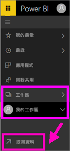
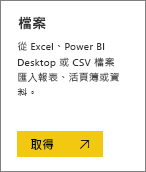
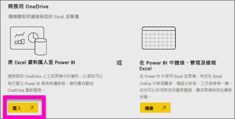
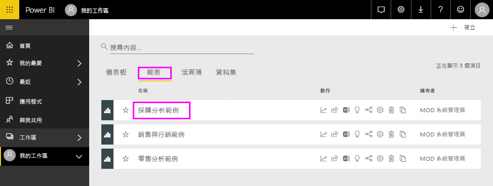
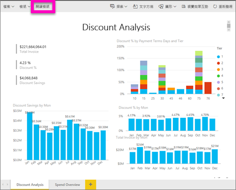
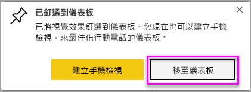
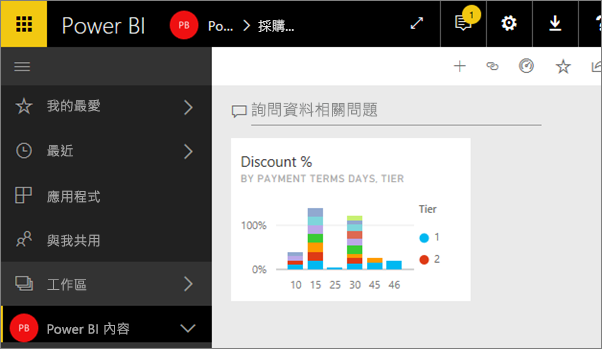
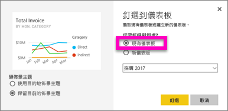

# 從報表建立 Power BI 儀表板
您已閱讀 [Power BI 的儀表板](service-dashboards.md)，現在想要建立自己的儀表板。 有許多不同的方式可以建立儀表板：從報表、從頭建立、從資料集、複製現有的儀表板等等。  本主題和影片會示範如何釘選現有報表的視覺效果，來建立新的儀表板。

> **注意**：儀表板是 Power BI 服務的功能，而不是 Power BI Desktop 的功能。 Power BI 行動裝置無法建立儀表板，但可以[檢視及共用](mobile-apps-view-dashboard.md)儀表板。
> 
> 

## 影片：從報表釘選視覺效果和影像來建立儀表板
觀看 Amanda 釘選報表的視覺效果，建立新的儀表板。 然後使用採購分析範例，依照下列影片中的步驟，自行試用看看。

<iframe width="560" height="315" src="https://www.youtube.com/embed/lJKgWnvl6bQ" frameborder="0" allowfullscreen></iframe>

## 匯入資料集與報表
我們會匯入其中一個 Power BI 範例資料集，並用它建立新的儀表板。 要使用的範例是具有兩份 PowerView 工作表的 Excel 活頁簿。 當 Power BI 匯入活頁簿時，它會將資料集以及報表新增至您的工作區。  從 PowerView 工作表自動建立報表。

1. [選取此連結](http://go.microsoft.com/fwlink/?LinkId=529784)下載並儲存採購分析範例 Excel 檔案。 建議您將它儲存在您的商務用 OneDrive 中。
2. 在瀏覽器中開啟 Power BI 服務 (app.powerbi.com)。
3. 選取現有工作區或建立新應用程式工作區。
4. 在左側導覽中，選取 [取得資料]。
   
    
5. 選取 [檔案] 。
   
   
6. 瀏覽至您儲存採購分析範例 Excel 檔案的位置。 選取它並選擇 [連接]。
   
   
7. 在此練習中請選取 [匯入]。
   
    
8. 出現成功訊息時，選取 **x** 關閉它。
   
   

### 開啟報表並將一些磚釘選到儀表板上
1. 停留在相同的工作區，然後選取 [報表] 索引標籤。新匯入的報表會顯示黃色星號。 選取報表名稱，以開啟它。
   
    
2. 報表隨即在[閱讀檢視](service-interact-with-a-report-in-reading-view.md)中開啟。 請注意，它的底部有兩個索引標籤︰[折扣分析] 和 [支出概觀]。 每個索引標籤都代表報表的一個頁面。
   
    
3. 暫留在視覺效果上，以顯示可用的選項。 若要在儀表板上新增視覺效果，請選取釘選  圖示。
   
    
4. 因為要建立新的儀表板，所以選取 [新增儀表板] 選項並為它命名。 
   
   
5. 當您選取 [釘選] 時，Power BI 會在目前的工作區中建立新的儀表板。 當**已釘選到儀表板**訊息出現時，請選取 [移至儀表板]。 如果系統提示您儲存報表，請選擇 [儲存]。
   
     
6. Power BI 會開啟新的儀表板及一個磚，即我們剛剛釘選的視覺效果。 
   
   
7. 若要返回報表，請選取磚。 再多釘選幾個磚到新的儀表板上。 這次，當 [釘選至儀表板] 視窗出現時，請選取 [現有儀表板]。  
   
   

恭喜您建立了第一個儀表板！ 現在您有了儀表板，您可以用它做很多事。  請試試下列一項建議的**後續步驟**，或自行開始使用及探索。   

## 後續步驟
* [調整大小和移動磚](service-dashboard-edit-tile.md)
* [儀表板磚的所有相關資訊](service-dashboard-tiles.md)
* [建立應用程式來共用儀表板](service-create-distribute-apps.md)
* [Power BI - 基本概念](service-basic-concepts.md)
* [Power BI 中的儀表板](service-dashboards.md)
* [設計絕佳儀表板的秘訣](service-dashboards-design-tips.md)

有其他問題嗎？ [試試 Power BI 社群](http://community.powerbi.com/)

