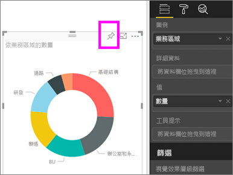
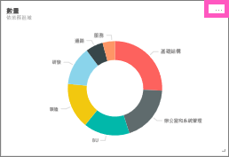
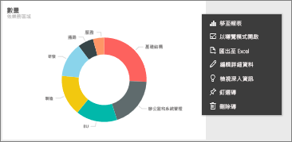
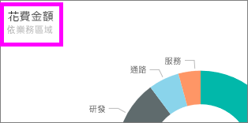

# 編輯或移除儀表板磚

## 儀表板「擁有者」與儀表板「取用者」
當您建立或擁有儀表板時，您會有許多選擇可用來變更該儀表板上的磚的外觀和預設行為。 請使用下列設定和策略，設計同事的儀表板「取用」體驗。  選取磚會開啟基礎報表、自訂 URL 還是不同的儀表板？ 也許您會[新增磚以顯示視訊或串流資料](service-dashboard-add-widget.md)？ 您甚至可能會想要[建立具有互動式交叉分析篩選器的磚](service-dashboard-pin-live-tile-from-report.md)。 身為「建立者」，您有許多選項。 

<iframe width="560" height="315" src="https://www.youtube.com/embed/lJKgWnvl6bQ" frameborder="0" allowfullscreen></iframe>

本文章涵蓋下列內容。

* [建立視覺效果並將它釘選到儀表板](#create)
* [移動磚](#move)
* [調整磚大小](#resize)
* [為磚重新命名](#rename)
* [將超連結新增至磚](#hyperlink)
* [將磚釘選至不同的儀表板](#different)
* [刪除磚](#delete)
  
 > [!TIP]
 > 若要變更磚本身顯示的視覺效果，請刪除磚再新增新的[儀表板磚](service-dashboard-tiles.md)。
 > 

 ### 先決條件
 1. 若要跟著做，請開啟 Power BI 服務 (不是 Power BI Desktop) 並[下載 IT 費用分析範例](sample-it-spend.md)。 出現「成功」訊息時，請選取 [移至儀表板]

- - -

## 建立新的視覺效果並將它釘選到儀表板
1. 從 IT 費用分析儀表板中，選取 [金額] 磚開啟報表。

    ![[金額] 磚](media/service-dashboard-edit-tile/power-bi-amount-tile.png)

2. 從頂端功能表列選取 [編輯報表]，在 [編輯檢視] 中開啟報表。

3. 選取報表底部的加號 (+)，以新增報表頁面。

    

4. 從 [欄位] 窗格中，選取 [事實] > [金額] 和 [業務區域] > [業務區域]。
 
5. 從 [視覺效果] 窗格中，選取環圈圖圖示，將視覺效果轉換為環圈圖。

    ![[視覺效果] 窗格](media/service-dashboard-edit-tile/power-bi-donut-chart.png)

5. 選取釘選圖示，然後將環圈圖釘選到 [IT 費用分析] 範例儀表板。

   

6. 出現「成功」訊息時，請選取 [移至儀表板]。 系統將提示您儲存變更。 選取 [儲存]。

- - -

## 移動圖格
在儀表板上，找到新的磚。 選取並按住圖格，將它拖曳至儀表板畫布的新位置。

- - -

## 調整圖格大小
圖格有許多大小：小至 1x1 圖格單位，大至 5x5。 選取並拖曳控點 (在右下角) 以調整磚的大小。

- - -
## 省略符號 (...) 功能表

1. 選取磚右上角的省略符號 (...)。 
   
   

2. 將滑鼠停留在 [帳戶] 磚上，選取省略符號以顯示選項。 可用的選項會因磚類型而變。  例如，動態磚的可用選項與標準視覺效果磚的可用選項不同。 此外，如果已與您共用儀表板 (您不是擁有者)，您會有較少的選項。

   

3. 選取 [編輯詳細資料] 以開啟 [磚詳細資料] 視窗。 

    變更磚的標題和預設行為。  例如，您可能會決定當「取用者」選取磚，而不是開啟用來建立該磚的報表時，會改為顯示新的儀表板。  
   

### 重新命名圖格
在 [磚詳細資料] 視窗的頂端，將 [標題] 變更為 [花費金額]。

![[磚詳細資料] 視窗](media/service-dashboard-edit-tile/power-bi-tile-title.png)

### 變更預設的超連結
根據預設，選取磚通常會回到建立磚的報表或問與答 (如果磚是在問與答中建立的)。 若要連結至某網頁、其他儀表板或報表 (在相同的工作區中)、SSRS 報表或其他線上內容，請新增自訂連結。

1. 在 [功能] 標題下，選取 [設定自訂連結]。

2. 選取 [ink to a dashboard or report in the current workspace] (連結至目前工作區中的儀表板或報表)，然後從下拉式清單中選取。  在此範例中，我已選取 [人力資源] 範例儀表板。 如果您的工作區中還沒有此範例，您可以新增它，再回到此步驟，或是選取不同的儀表板。 

    ![[功能] 對話方塊](media/service-dashboard-edit-tile/power-bi-custom-link.png)

3. 選取 [ **套用**]。

4. 新的標題會顯示在磚上。  此外，當您選取磚時，Power BI 會開啟 [人力資源] 儀表板。 

    

### 將圖格釘選至不同的儀表板
1. 從省略符號下拉式功能表中，選取 [釘選磚] 。
2. 決定要將此磚的複本釘選至現有的儀表板還是新的儀表板上。 
   
   ![[釘選到儀表板] 對話方塊](media/service-dashboard-edit-tile/pbi_pintoanotherdash.png)
3. 選取 [釘選] 。

### 刪除圖格
1. 若要永久從儀表板移除磚，請從省略符號下拉式功能表選取 [刪除磚] 。 

2. 刪除磚不會刪除基礎視覺效果。 選取 [金額] 磚，開啟基礎報表。 開啟報表的最後一頁，查看原始視覺效果未從報表刪除。 

- - -
## 後續步驟
[Power BI 的儀表板磚](service-dashboard-tiles.md)

[Power BI 中的儀表板](service-dashboards.md)

[Power BI - 基本概念](service-basic-concepts.md)

有其他問題嗎？ [試試 Power BI 社群](http://community.powerbi.com/)

