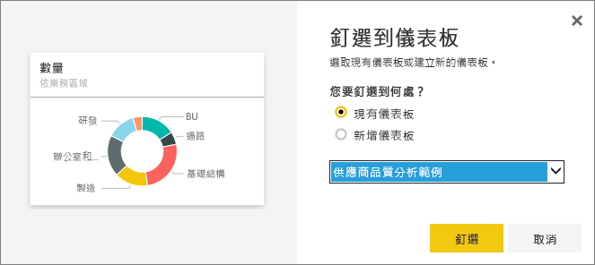

# 編輯或移除儀表板磚
您可以變更儀表板磚的外觀和預設行為。

<iframe width="560" height="315" src="https://www.youtube.com/embed/lJKgWnvl6bQ" frameborder="0" allowfullscreen></iframe>

本文章涵蓋下列內容。

* [將磚釘選至不同的儀表板](#different)
* [為磚重新命名](#rename)
* [移動磚](#move)
* [調整磚大小](#resize)
* [將超連結新增至磚](#hyperlink)
* [刪除磚](#delete)
  
  > [!TIP]
  > 若要變更磚本身顯示的視覺效果，請刪除磚再新增新的[儀表板磚](service-dashboard-tiles.md)。
  > 
  > 

## 如何開始
1. 開啟至少有一個磚的[儀表板](service-dashboards.md)。 
   
   
2. 將滑鼠停留在儀表板磚上，選取省略符號以顯示選項。
   
   

## 將磚釘選至儀表板
1. 選取**釘選磚**圖示 。
2. 決定要釘選至現有的儀表板或新的儀表板上。 
   
   
3. 選取 [釘選] 。

- - -

## 重新命名磚以及編輯磚詳細資料
選取磚詳細資料圖示 ，以編輯標題並顯示上次重新整理的時間。

- - -

## 移動圖格
選取並按住圖格，將它拖曳至儀表板畫布的新位置。

- - -

## 調整圖格大小
圖格有許多大小：小至 1x1 圖格單位，大至 5x5。 選取並拖曳控點 (在右下角) 以調整磚的大小。
    

- - -

## 變更預設的超連結
根據預設，選取磚會回到建立磚的報表或問與答 (如果磚是在問與答中建立的)。 若要連結至某網頁、其他儀表板或報表 (在相同的工作區中)、SSRS 報表或其他線上內容，請新增自訂連結：

1. 選取**編輯詳細資料**圖示  來編輯磚。
2. 核取 [設定自訂連結] 並選取連結類型。    
   
   * 外部連結請輸入 URL。     
   * 若要連結至目前工作區中的儀表板或報表，請從下拉式功能表中選取。
   
   

- - -

## 刪除圖格
* 選取**刪除磚**圖示  刪除磚。 刪除磚不會刪除基礎報表或視覺效果。

- - -
## 後續步驟
[Power BI 的儀表板磚](service-dashboard-tiles.md)

[Power BI 中的儀表板](service-dashboards.md)

[Power BI - 基本概念](service-basic-concepts.md)

有其他問題嗎？ [試試 Power BI 社群](http://community.powerbi.com/)

