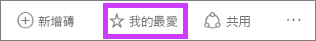
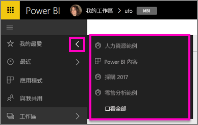
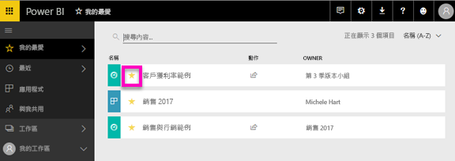

# Power BI 服務中我的最愛儀表板
當您將儀表板設為「最愛」時，便可以從所有的工作區存取它。  我的最愛通常是指您最常瀏覽的項目。

> [!NOTE]
> 本主題適用於 Power BI 服務，不適用於 Power BI Desktop。
> 
> 

您也可以選取單一儀表板作為 Power BI 中的[精選儀表板](service-dashboard-featured.md)。

## 將儀表板新增為「我的最愛」
觀看 Amanda 將 [我的最愛] 新增至工作區，然後遵循以下影片的逐步指示親自試試看。

<iframe width="560" height="315" src="https://www.youtube.com/embed/G26dr2PsEpk" frameborder="0" allowfullscreen></iframe>

1. 開啟您經常使用的儀表板。 甚至已與您共用的儀表板可以是「我的最愛」。
2. 從 Power BI 服務的右上角，選取 [我的最愛] 或星號  圖示。
   
   
   
   您也可以從工作區的 [儀表板] 索引標籤中，將儀表板設為我的最愛。
   
   

## 使用「我的最愛」
1. 若要查看您五個最新的最愛，請從任何工作區選取 [我的最愛] 右邊的箭號。  您可以從這裡選取最愛的儀表板，加以開啟。 只會列出五個最新的最愛 (依字母順序)。 如果您有五個以上的最愛，請選取 [See all] \(全部查看) 以開啟 [我的最愛] 畫面 (請參閱下面的 #2)。 
   
   
2. 若要查看您新增為我的最愛的**所有**儀表板，請在左側功能窗格中選取 [我的最愛] 或我的最愛  圖示。  
   
    
   
   您可以從這裡選取儀表板加以開啟，或與同事共用儀表板。

## 將儀表板移除最愛
不再如往常般經常使用儀表板？  您可以將其移除最愛。 將儀表板移除最愛時，儀表板就會從 [我的最愛] 中移除，但不會從 Power BI 中移除。

1. 在左側功能窗格中，選取 [我的最愛] 以開啟 [我的最愛] 畫面。
   
   
2. 選取要移除最愛的儀表板旁邊的黃色星號。

> **注意**︰您也可以從儀表板本身將儀表板從 [我的最愛] 中移除。 在儀表板的右上角，您會看到一個黃色星號和「移除最愛」這個詞組。 選取其中一個，以從我的最愛清單中移除該儀表板。 
> 
> 

## 後續步驟
[開始使用 Power BI](service-get-started.md)

[Power BI - 基本概念](service-basic-concepts.md)

有其他問題嗎？ [試試 Power BI 社群](http://community.powerbi.com/)

