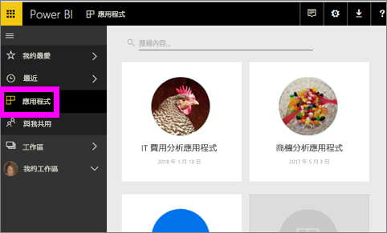
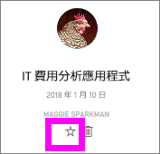
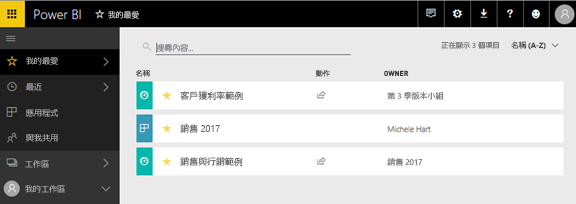

# Power BI 服務中的常用儀表板、報告和應用程式
當您將內容設為「我的最愛」時，將可從所有工作區予以存取。  我的最愛通常是您最常瀏覽的內容。

> [!NOTE]
> 本主題適用於 Power BI 服務，不適用於 Power BI Desktop。
> 
> 

您也可以選取單一儀表板作為 Power BI 服務中的[精選儀表板](service-dashboard-featured.md)。

## 將儀表板或報表新增為「我的最愛」
觀看 Amanda 將 [我的最愛] 新增至工作區，然後遵循以下影片的逐步指示親自試試看。

<iframe width="560" height="315" src="https://www.youtube.com/embed/G26dr2PsEpk" frameborder="0" allowfullscreen></iframe>

1. 開啟您常用的儀表板或報表。 即使是別人與您共用的內容，也可以設為「我的最愛」。
2. 從 Power BI 服務的右上角，選取 [我的最愛] 或星號圖示 。
   
   ![[我的最愛] 圖示](media/service-dashboard-favorite/powerbi-dashboard-favorite.png)
   
   您也可以從工作區 [儀表板] 或 [報表] 內容檢視索引標籤將儀表板或報表設為我的最愛。
   
   ![具有黃色星號的 [儀表板] 索引標籤](media/service-dashboard-favorite/power-bi-dashboard-favorite.png)

## 將應用程式新增為「我的最愛」

1. 從左側瀏覽窗格中，選取 [應用程式]。

   

2. 停留在應用程式上以顯示更多詳細資料。  選取星號   圖示以設為我的最愛。
   
   

## 使用「我的最愛」
1. 若要您的最愛，請從任何工作區，選取 [我的最愛] 右邊的彈出式箭號。  您可以在這裡選取我的最愛並加以開啟。 只會列出五個我的最愛 (依字母順序)。 如果超過五個，請選取 [查看全部] 開啟 [我的最愛] 畫面 (請參閱下文的第 2 點)。 
   
   ![[我的最愛] 飛出視窗](media/service-dashboard-favorite/power-bi-favorite-flyout-new.png)
2. 若要查看您已新增為我的最愛的**所有**內容，請在左側功能窗格中選取 [我的最愛] 或我的最愛 。  
   
    
   
   您可以在這裡執行下列動作：開啟、識別擁有者，甚至與同事共用。

## 移除最愛的內容
某份報表的使用頻率不再如往常頻繁嗎？  您可以將其移除最愛。 移除最愛的內容時，其會從 [我的最愛] 清單中移除，但不會從 Power BI 中移除。

1. 在左側功能窗格中，選取 [我的最愛] 以開啟 [我的最愛] 畫面。
   
   ![[我的最愛] 畫面](media/service-dashboard-favorite/power-bi-unfavorites-screen.png)
2. 選取內容旁的黃色星星即可移除最愛。

> **注意**︰您也可以將儀表板、報表或應用程式本身移除最愛。 只要開啟並取消選取黃色圖示就可以了。   
> 
> 

## 後續步驟
[開始使用 Power BI](service-get-started.md)

[Power BI - 基本概念](service-basic-concepts.md)

有其他問題嗎？ [試試 Power BI 社群](http://community.powerbi.com/)

