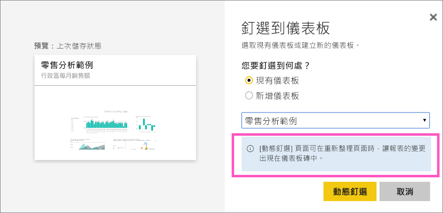
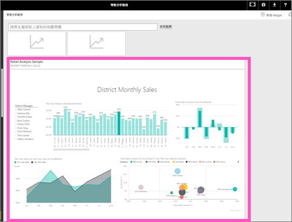

# 將整份報表頁面釘選到 Power BI 儀表板上，做為動態磚
另一種新增[儀表板磚](service-dashboard-tiles.md)的方式是釘選整份報表頁面。  這是可以一次輕鬆地釘選多個視覺效果的方法。  此外，當您釘選整個頁面時，磚即為 *動態* ；您可以直接在儀表板上與之互動。 且您對報表編輯器中任何視覺效果所做的變更 (如加入篩選或變更圖表中所使用的欄位) 也會反映在儀表板磚中。  

> [!NOTE]
> 您無法將與您共用的報表釘選為磚。
> 
> 

## 釘選報表頁面
觀賞 Amanda 如何將動態報表頁面釘選到儀表板，然後遵循影片下方的指示親自試試看。

<iframe width="560" height="315" src="https://www.youtube.com/embed/EzhfBpPboPA" frameborder="0" allowfullscreen></iframe>

1. 以[編輯檢視](service-interact-with-a-report-in-editing-view.md)開啟報表。
2. 未選取任何視覺效果時，請從功能表列中選取 [動態釘選] 頁面。
   
    
3. 將磚釘選至現有的儀表板或新的儀表板上。 請注意醒目提示的文字： *「[動態釘選] 頁面可在重新整理頁面時，讓報告的變更出現在儀表板磚中。」*
   
   * 現有儀表板：從下拉式清單中選取儀表板的名稱。 已與您共用的儀表板，不會出現在下拉式清單中。
   * 新儀表板：輸入新儀表板的名稱。
     
     
4. 選取 [ **動態釘選**]。 您可利用靠近右上角所出現的成功訊息，知道該頁面已加入儀表板成為磚。

## 開啟儀表板以查看釘選的動態磚
1. 從瀏覽窗格選取具有新動態磚的儀表板。 您可以在該處對釘選的報表頁面進行[重新命名、調整大小、連結和移動](service-dashboard-edit-tile.md)等操作。  
2. 與動態磚互動。  在以下螢幕擷取畫面中，選取直條圖上的列，其中該列已與磚上的其他視覺效果交叉篩選及交叉醒目提示。
   
    

## 後續步驟
[Power BI 中的儀表板](service-dashboards.md)

有其他問題嗎？ [試試 Power BI 社群](http://community.powerbi.com/)

