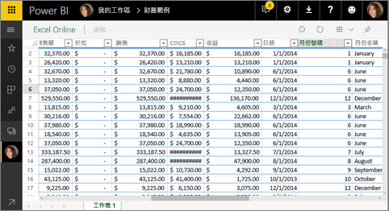
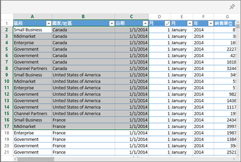
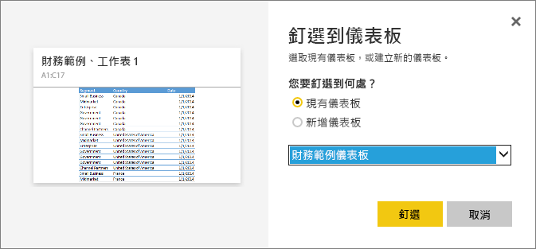

# 從 Excel 將磚釘選到 Power BI 儀表板
您要先連接活頁簿和 Power BI 服務 (app.powerbi.com)，才可以從 Excel 活頁簿釘選磚。 連接活頁簿其實就是將該活頁簿的連結唯讀版本帶入 Power BI 服務，讓您將範圍釘選到儀表板。 您甚至可以將整份工作表釘選到儀表板。  
如果活頁簿已與您共用，您就能夠檢視擁有者釘選的磚，但不能自行建立任何儀表板磚。 

如需 Excel 和 Power BI 如何合作的詳細資訊，請參閱[從 Excel 活頁簿檔案取得資料](http://go.microsoft.com/fwlink/?LinkID=521962)。

觀看 Will 示範數種連接至 Excel 活頁簿及從中匯入資料的方式。

<iframe width="560" height="315" src="https://www.youtube.com/embed/l8JoB7w0zJA" frameborder="0" allowfullscreen></iframe>

## 從商務用 OneDrive 將 Excel 活頁簿連接至 Power BI
當您選擇 [連接] 時，您的活頁簿會顯示在 Power BI 中，就像是在 Excel Online 中一樣。 但不同於 Excel Online，您有一些很棒的功能，可協助您將工作表中的項目釘選到儀表板。

您無法在 Power BI 中編輯活頁簿。 但如果您需要進行一些變更，則可以從工作區的 [活頁簿] 索引標籤中選取鉛筆圖示，然後選擇在 Excel Online 中編輯活頁簿，或在電腦上以 Excel 開啟活頁簿。 您所做的任何變更都會儲存到 OneDrive 上的活頁簿。

1. 將活頁簿上傳至您的商務用 OneDrive。
2. 從 Power BI [連接到該活頁簿](service-excel-workbook-files.md).
3. 在 Power BI 中，活頁簿會新增至工作區的 [活頁簿] 索引標籤。   圖示表示此為 Excel 活頁簿，而黃色星號表示其為新的活頁簿。
   
    將不會儲存您對 Power BI 中活頁簿所進行的變更，且不會影響商務用 OneDrive 上的原始活頁簿。 如果您排序、篩選或變更 Power BI 中的值，將無法儲存或釘選這些變更。 若要更新活頁簿，請選取鉛筆圖示以在 Excel Online 中予以開啟。 在 Excel Online 中對活頁簿進行的變更可能需要幾分鐘的時間才會更新在磚中。     
   
   
4. 選取活頁簿名稱，在 Power BI 中開啟活頁簿。
   
   

## 將資料格範圍釘選到儀表板
新增[儀表板磚](service-dashboard-tiles.md)的一種方法是在 Power BI 中從 Excel 活頁簿新增。 範圍可以從儲存在商務用 OneDrive 的 Excel 活頁簿釘選，或是從其他群組共用的文件庫釘選。 該範圍可以包含資料、圖表、資料表、樞紐分析表、樞紐分析圖，以及其他 Excel 組件。

1. 反白顯示您要釘選到儀表板的資料格。
   
    
2. 選取釘選  圖示。 
3. 將磚釘選至現有的儀表板或新的儀表板上。 
   
   * 現有儀表板：從下拉式清單中選取儀表板的名稱。
   * 新儀表板：輸入新儀表板的名稱。
   
   
4. 選取 [釘選] 。 您可利用靠近右上角所出現的成功訊息，知道該範圍已加入儀表板成為磚。 
   
    
5. 選取 [移至儀表板]。 您可以在這裡[重新命名、調整大小、連結和移動](service-dashboard-edit-tile.md)釘選的視覺效果。 選取釘選的磚預設會在 Power BI 中開啟活頁簿。

## 釘選整個資料表或樞紐圖表至儀表板
遵循上述步驟，但不選取資料格範圍，而是選取整份資料表或樞紐分析表。

若要釘選資料表，請選取整份資料表並確認包含標頭。  若要釘選樞紐分析表，請務必包含樞紐分析表每個可見的部分，包括篩選 (如有使用)。

 

從資料表或樞紐分析表建立的磚，會顯示整個資料表。  如果您加入/移除/篩選原始活頁簿中的資料列或資料行，則於磚中也會新增/移除/篩選它們。

## 檢視連結至該磚的活頁簿
選取活頁簿磚時會在 Power BI 中開啟連結的活頁簿。 因為活頁簿檔案位於擁有者的商務用 OneDrive 上，所以檢視該活頁簿需要擁有該活頁簿的「讀取」權限。 如果沒有權限，就會收到錯誤訊息。  

## 考量與疑難排解
不支援的功能：Power BI 使用 Excel Services 擷取活頁簿磚。 因此，因為 Excel Services REST API 不支援 Excel 的某些功能，所以在 Power BI 中的磚上不會看到它們。 例如：走勢圖、設定條件式格式的圖示和時間交叉分析篩選器。 如需不支援功能的完整清單，請參閱 [Unsupported Features in Excel Services REST API](http://msdn.microsoft.com/library/office/ff394477.aspx) (Excel Services REST API 中不支援的功能)

## 後續步驟
[共用可連結至 Excel 活頁簿的儀表板](service-share-dashboard-that-links-to-excel-onedrive.md)

[從 Excel 活頁簿取得資料](service-excel-workbook-files.md)

[Power BI 中的儀表板](service-dashboards.md)

有其他問題嗎？ [試試 Power BI 社群](http://community.powerbi.com/)

