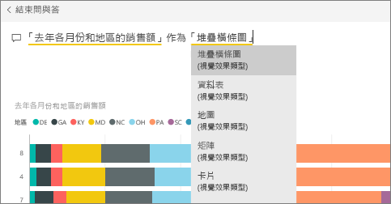
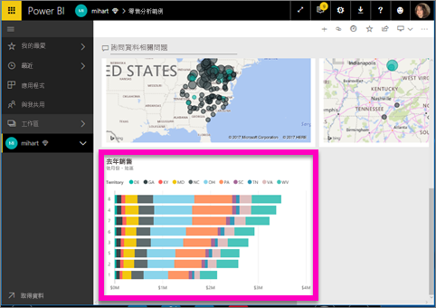

# 從問與答將磚釘選到儀表板
## 如何從問與答釘選磚
問與答是 Power BI 隨選報表工具。 需要尋找特定的深入剖析資訊嗎？ 提出與您的資料有關的問題，然後以視覺效果的形式接收回應。

在此「如何」中，我們將使用 Power BI 服務 (app.powerbi.com) 開啟儀表板、使用自然語言建立視覺效果來詢問問題，以及將該視覺效果釘選到儀表板。 在 Power BI Desktop 中無法使用儀表板。 如需使用問與答與其他 Power BI 工具和內容的資訊，請參閱 [Power BI 問與答概觀](consumer/end-user-q-and-a.md)。 

如果要跟著做，請開啟[零售分析範例儀表板](sample-retail-analysis.md)。

1. 開啟[儀表板](consumer/end-user-dashboards.md)，其中至少有一個從報表釘選的磚。 當您提問時，Power BI 會在具有釘選到該儀表板之磚的任何資料集中尋找解答。  若要深入了解，請參閱[取得資料](service-get-data.md)。
2. 在儀表板頂端的問題方塊中，開始輸入您想要知道的資料相關問題。  
   
3. 例如，當您輸入「去年各月份和地區的銷售額」...   
   

   問題方塊可提供您建議。
4. 若要將圖表加入儀表板作為磚，請選取畫布右上角的釘選圖示 。 如果儀表板已與您共用，您就無法釘選任何視覺效果。

5. 將磚釘選至現有的儀表板或新的儀表板上。

   ![[釘選到儀表板] 對話方塊](media/service-dashboard-pin-tile-from-q-and-a/power-bi-pin-to-dashboard.png)

   * 現有儀表板：從下拉式清單中選取儀表板的名稱。 您只能選擇具有目前工作區的儀表板。
   * 新的儀表板︰輸入新儀表板的名稱，它就會新增至目前工作區。

6. 選取 [釘選]  。

   靠近右上角的成功訊息讓您知道，視覺效果已當成磚加入儀表板。  

   
7. 選取 [移至儀表板]  以查看新磚。 於該處，您可以在儀表板上[重新命名、調整大小、新增超連結和重新置放磚等等](service-dashboard-edit-tile.md)。

   

## 考量與疑難排解
* 當您開始輸入問題時，問與答會立即開始從與目前儀表板相關聯的所有資料集搜尋最佳回應。  「目前儀表板」是列在上方導覽窗格中的儀表板。 例如，這個問題將會在 [零售分析範例]  儀表板中提出，而此儀表板是 **mihart** 工作區的一部分。

  
* **問與答如何知道要使用哪些資料集**？  問與答可存取至少已有一個視覺效果釘選至該儀表板的所有資料集。

* **看不到問題方塊**？ 請連絡 Power BI 系統管理員。 系統管理員能夠停用問與答。

## 後續步驟
[重新命名、調整大小、新增超連結和重新置放磚等等](service-dashboard-edit-tile.md)    
[以焦點模式顯示儀表板磚](consumer/end-user-focus.md)     
[返回 Power BI 中的問與答](consumer/end-user-q-and-a.md)  
有其他問題嗎？ [試試 Power BI 社群](https://community.powerbi.com/)
