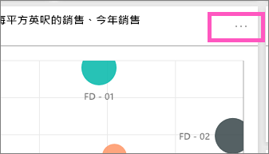
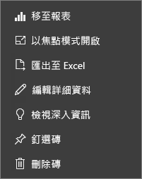

# Power BI 的儀表板圖格
儀表板和儀表板磚是 Power BI 服務的功能，而不是 Power BI Desktop 的功能。 雖然無法在 Power BI 行動裝置中建立或釘選儀表板磚，但可以進行[檢視及共用](mobile-tiles-in-the-mobile-apps.md)。 而且，在 Power BI 行動裝置中，您可以[使用 iPhone 應用程式將圖片新增至儀表板](mobile-iphone-app-get-started.md)。

## 儀表板圖格

圖格是您釘選到儀表板的資料快照。 您可以從報表、資料集、儀表板、問與答方塊、Excel 和 SQL Server Reporting Services (SSRS) 及更多的地方建立圖格。  這個螢幕擷取畫面顯示許多釘選到儀表板的不同磚。

除了釘選，您也可以使用[[新增磚]](service-dashboard-add-widget.md) 直接在儀表板上建立獨立的磚。 獨立磚包括：文字方塊、影像、視訊、串流資料和 Web 內容。

您想要了解構成 Power BI 的建置組塊嗎？  請參閱 [Power BI - 基本概念](service-basic-concepts.md)。

> [!NOTE]
> 如果用來建立圖格的原始視覺效果有了變更，也不會改變圖格。  例如，如果您已從報表釘選折線圖，然後將折線圖變更為長條圖，則儀表板磚仍會顯示折線圖。 資料會重新整理，但視覺效果類型不會。
> 
> 

## 釘選圖格，從...
有很多不同的方式，可以將磚新增 (釘選) 至儀表板。 磚的釘選來源：

* [Power BI 問與答](service-dashboard-pin-tile-from-q-and-a.md)
* [報表](service-dashboard-pin-tile-from-report.md)
* [其他儀表板](service-pin-tile-to-another-dashboard.md)
* [商務用 OneDrive 上的 Excel 活頁簿](service-dashboard-pin-tile-from-excel.md)
* [Power BI Publisher for Excel](publisher-for-excel.md)
* [深入資訊摘要](service-insights.md)
* [SSRS](https://msdn.microsoft.com/library/mt604784.aspx)

可以使用[新增磚](service-dashboard-add-widget.md)，直接在儀表板上建立影像、文字方塊、視訊、串流資料和 Web 內容的獨立磚。

  

## 與儀表板上的圖格互動
### 移動和調整圖格大小
抓取磚並[在儀表板上移動](service-dashboard-edit-tile.md)。 將滑鼠暫留並選取控點  以調整圖格大小。

### 將滑鼠暫留在圖格上以變更其外觀和行為
1. 將滑鼠暫留在圖格上以顯示省略符號。
   
    
2. 選取省略符號開啟圖格的 [動作] 功能表。
   
    
   
    從這裡您可以：
   
   * [開啟用於建立此磚的報表](service-reports.md)   
   
   * [開啟用於建立此磚的工作表](service-reports.md)   
     
     * [以焦點模式檢視](service-focus-mode.md)   
     * [匯出磚中所使用的資料](power-bi-visualization-export-data.md) 
     * [編輯標題與副標題、新增超連結、顯示上次重新整理時間](service-dashboard-edit-tile.md) 
     * [執行深入解析](service-insights.md) 
     * [將磚釘選到另一個儀表板 ](service-pin-tile-to-another-dashboard.md)
       
     * [移除磚](service-dashboard-edit-tile.md)
     
3. 若要關閉動作功能表，選取畫布中的空白區域。

### 選取 (按一下) 圖格
當您選取磚時，接下來的情況取決於該磚的建立方式，以及其是否有[自訂連結](service-dashboard-edit-tile.md)。 如果有自訂連結，則選取圖格會帶您前往該連結。 否則，選取磚會帶您前往建立此磚所使用的報表、Excel Online 活頁簿、內部部署 SSRS 報表或問與答。

> [!NOTE]
> 使用 [新增磚] 直接在儀表板上建立的影片磚為例外。 選取影片磚 (以此方式建立) 會直接在儀表板上播放視訊。   
> 
> 

## 考量與疑難排解
* 如未儲存建立視覺效果所用的報表，則選取該圖格不會執行任何動作。
* 如果圖格是在 Excel Online 活頁簿中建立的，而您連該活頁簿基本的讀取權限都沒有，選取圖格不會在 Excel Online 中開啟活頁簿。
* 至於使用 [新增磚] 直接在儀表板上建立的磚，如果您已設定自訂超連結，選取標題、子標題及/或磚即會開啟該 URL。  否則，選取針對影像、Web 程式碼或文字方塊直接在儀表板上建立的其中一個磚，預設不會執行任何動作。
* 如果您無權使用 SSRS 內的報表，則選取從 SSRS 建立的磚時將會產生頁面，指出您沒有存取權 (rsAccessDenied)。
* 如果您無權存取 SSRS 伺服器所在的網路，則選取從 SSRS 建立的磚時將會產生頁面，指出找不到伺服器 (HTTP 404)。 您的裝置需要報表伺服器的網路存取權，才能檢視報表。
* 如果用來建立圖格的原始視覺效果有了變更，也不會改變圖格。  例如，您從報表釘選折線圖之後，將折線圖變更為長條圖，儀表板圖格會繼續顯示折線圖。 資料會重新整理，但視覺效果類型不會。

## 後續步驟
[建立儀表板的卡片 (大數字圖格)](power-bi-visualization-card.md)

[Power BI 中的儀表板](service-dashboards.md)  

[資料重新整理](refresh-data.md)

[Power BI - 基本概念](service-basic-concepts.md)

[將磚匯出至 Power Point](http://blogs.msdn.com/b/powerbidev/archive/2015/09/28/integrating-power-bi-tiles-into-office-documents.aspx)

[將 Reporting Services 項目釘選至 Power BI 儀表板](https://msdn.microsoft.com/library/mt604784.aspx)

有其他問題嗎？ [試試 Power BI 社群](http://community.powerbi.com/)

