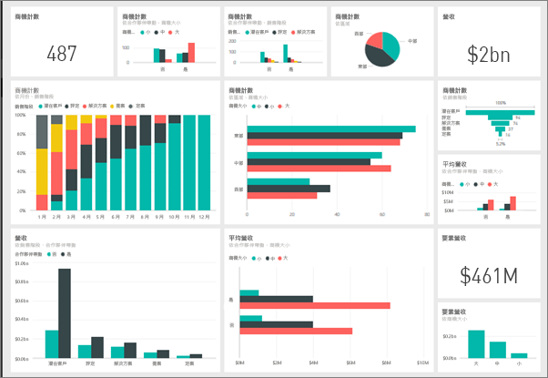
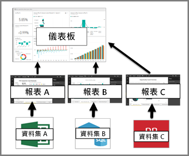

# Power BI 設計工具的儀表板簡介

Power BI 「儀表板」是透過視覺效果來說故事的單一頁面，通常稱為畫布。 因為受限於一個頁面，所以設計良好的儀表板只包含該故事的重點。 讀者可以檢視相關報表來取得詳細資料。

儀表板是 Power BI 服務的功能。 它們在 Power BI Desktop 中無法使用。 您無法在行動裝置上建立儀表板，但可以在該處[檢視和共用](mobile-apps-view-dashboard.md)儀表板。

## 儀表板的基本概念 

您在儀表板上看到的視覺效果稱為「磚」。 您會從報表將磚「釘選」到儀表板。 如果您不熟悉 Power BI，請參閱 [Power BI 基本概念](service-basic-concepts.md)來打好基礎。

> [!IMPORTANT]
> 您需要 [Power BI Pro](service-free-vs-pro.md) 授權，才能建立儀表板。

儀表板上的視覺效果來自報表，而每份報表都是以一個資料集為基礎。 您可以將儀表板想成是進入基礎報表和資料集的一種方法。 選取視覺效果會帶您前往效果所依據的報表 (和資料集)。

## 儀表板的優點
儀表板是很棒的方式，一眼就可以監視企業，以及查看所有最重要的計量。 儀表板上的視覺效果可能來自一或多個基礎資料集，以及來自一或多份基礎報表。 儀表板將內部部署和雲端的資料結合在一起，提供不受資料位置限制的合併檢視。

儀表板不只是好看的圖片。 其具有高度互動性，且磚會隨著基礎資料變更來更新。

## 儀表板與報表
[報表](service-reports.md)與儀表板看起來很相似，因為它們都是填滿視覺效果的畫布。 但兩者有一些主要差異。

| **功能** | **儀表板** | **報表** |
| --- | --- | --- |
| 頁面 |一個頁面 |一或多個頁面 |
| 資料來源 |每個儀表板一或多份報表以及一或多個資料集 |每份報表單一資料集 |
| Power BI Desktop 可用 |否 |是，「建立者」可在 Desktop 中建置及檢視報表。 |
| 訂閱 |可訂閱儀表板 |可訂閱報表頁面 |
| 篩選 |無法篩選或配量 |有多種不同方法可篩選、反白顯示及配量 |
| 精選 |可將一個儀表板設定為「精選」儀表板 |無法建立精選報表 |
| 我的最愛 | 可將儀表版設為「我的最愛」 | 可將報表設為「我的最愛」
| 設定警示 |在特定情況下可用於儀表板磚 |無法從報表使用 |
| 自然語言查詢 |可從儀表板使用 |無法從報表使用 |
| 可以看到基礎資料集的資料表和欄位 |否。 可以匯出資料，但看不到儀表板本身的資料表和欄位。 |是。 可以看到資料集資料表和欄位以及值。 |
| 自訂 |否 |在 [閱讀檢視] 中，您可以發佈、內嵌、篩選、匯出、下載為 .pbix、檢視相關內容、產生 QR 代碼、在 Excel 中分析等。  |

## 後續步驟
* 使用[範例儀表板](sample-tutorial-connect-to-the-samples.md)其中一項教學課程來熟悉儀表板。
* 了解[儀表板磚](service-dashboard-tiles.md)。
* 想要追蹤個別的儀表板磚，並在它達到某個閾值時收到電子郵件？ [建立磚警示](service-set-data-alerts.md)。
* 了解如何使用 [Power BI 問與答](power-bi-tutorial-q-and-a.md)提出與您的資料相關的問題，然後接收視覺效果的回應。
