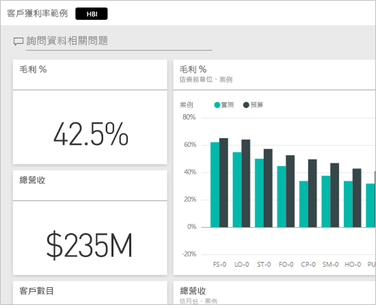
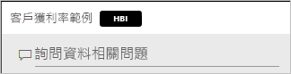
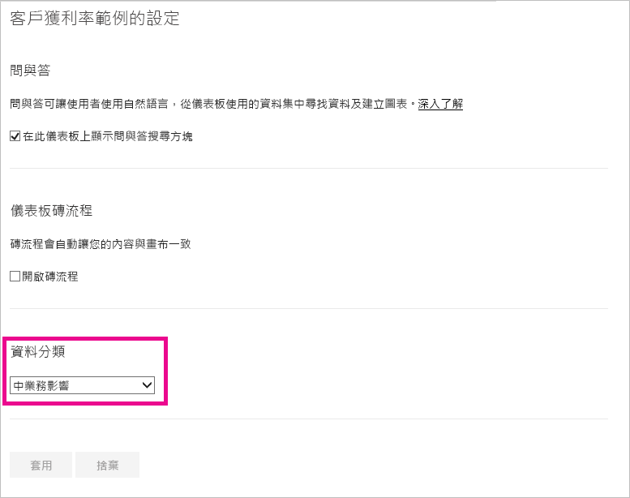
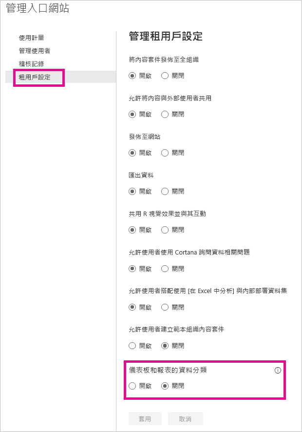
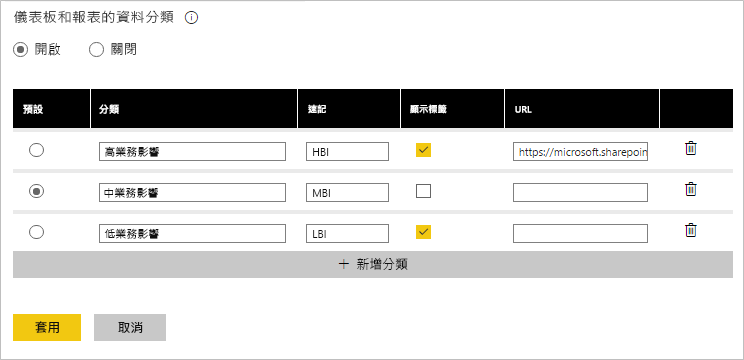

# 儀表板資料分類
每個儀表板各不相同，而且隨著您所連接的資料來源不同，您可能會發現您和與您一起共用儀表板的同事，必須依據資料敏感性的不同，而採取不同的預防措施。 有一些儀表板應禁止與公司外部的人員共用或禁止列印，有一些則可任意共用。 透過儀表板資料分類，您就能提醒共用您儀表板的使用者，注意其應遵守的安全性層級。 您可以使用您公司 IT 部門所定義的分類來標記儀表板，讓檢視內容的每個人對於該資料的敏感性都能有相同的認知。

## 資料分類標記
資料分類標記會顯示在儀表板名稱旁，讓檢視該儀表板的人都能知道該儀表板及其所含資料所應套用的安全性層級。

其也會顯示在您「我的最愛」清單中的儀表板磚旁。

當您將游標暫留在標記時，會隨即顯示該分類的完整名稱。

系統管理員也可為標記設定 URL，以提供其他資訊。

> [!NOTE]
> 有一些分類類型在儀表板上可能不會顯示為標記，視系統管理員的分類設定而定。 若您是儀表板擁有者，隨時都能從儀表板的設定下查看儀表板分類類型。
> 
> 

## 設定儀表板的分類
您的公司如有啟用資料分類，所有儀表板在一開始時，都會使用預設的分類類型，但儀表板擁有者可以依據您的儀表板安全性層級需要而變更該分類。

若要變更分類類型，請執行下列作業。

1. 選取儀表板名稱旁的**省略符號**，然後選取 [設定]，以前往儀表板設定。
   
    
2. 您可以在儀表板設定下，查看儀表板目前的分類，並使用下拉式清單變更分類類型。
   
    
3. 完成時，請選取 [套用]。

套用變更之後，所有與您共用儀表板的人員都會在下次重新載入儀表板時看到這項更新。

## 以系統管理員身分處理資料分類標記
資料分類由全域系統管理員為組織設定。 若要開啟資料分類，請執行下列作業。

1. 選取設定齒輪，然後選取 [管理入口網站]。
   
    
2. 將 [租用戶設定] 索引標籤內的 [儀表板及報表的資料分類] 切換成 [開啟]。
   
    

開啟之後，將會顯示表單，讓您為組織建立各種分類。

每個分類在儀表板上都有其**名稱**與**簡稱**。 您可以選取 [顯示標記]，指定是否要在儀表板上顯示標記的簡稱。 若決定不在儀表板上顯示分類類型，儀表板擁有者仍能透過查看儀表板設定來檢視類型。 此外還可選擇是否要新增 **URL**，將組織的分類方針與使用需求的詳細資訊加入其中。  

最後，您必須決定預設的分類類型。  

當您將您的分類類型填入表單之後，請選取 [套用] 儲存變更。

此時，所有儀表板皆會指派以預設分類，而儀表板擁有者也可於此時將分類類型更新成內容適合的分類。 您日後可以返回此處新增或移除分類類型，或是變更預設值。  

> [!NOTE]
> 當您返回此處執行變更時，請注意下列幾項重點：
> 
> * 若關閉資料分類，所有標記皆會消失。 若決定之後要再重新開啟，必須重新標記。  
> * 若移除了分類類型，所有指派給該移除分類類型的儀表板，都會再指派以預設值，直到擁有者重新加以設定才會改變。  
> * 若變更預設值，所有擁有者未指派以分類類型的儀表板，將會變更為新的預設值。
> 
> 

