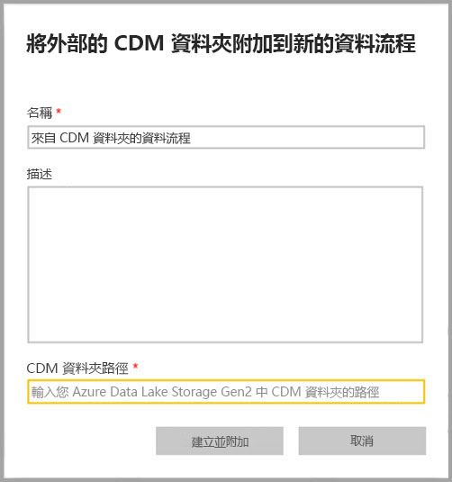
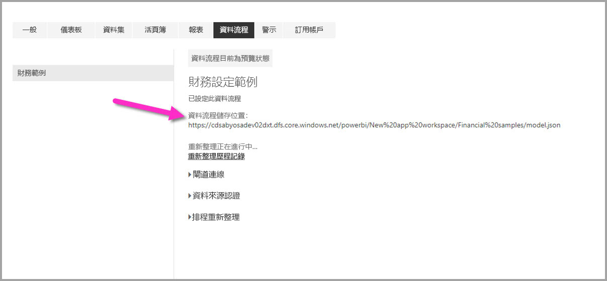

# 將 CDM 資料夾作為資料流程新增到 Power BI (預覽)

在 Power BI 中，您可以新增 Common Data Model (CDM) 資料夾，並將其儲存到您組織的 Azure Data Lake Store Gen2 中作為資料流程。 一旦您從 CDM 資料夾建立資料流程後，就可以根據您置入 CDM 資料夾中的資料，使用 **Power BI Desktop** 和 **Power BI 服務**來建立資料集、報表、儀表板和應用程式。

從 CDM 資料夾建立資料流程有幾項需求，如下列清單所述：

* 從 CDM 資料夾建立資料流程的功能，「僅」  於[新的工作區體驗](service-create-the-new-workspaces.md)中提供。 
* 若要將 CDM 資料夾新增到 Power BI，新增資料夾的使用者必須具有 [CDM 資料夾及其檔案的授權](https://go.microsoft.com/fwlink/?linkid=2029121) \(英文\)。
* 您必須具有 CDM 資料夾中所有檔案和資料夾的讀取和執行權限，才能將它們新增到 Power BI。

下列各節將說明如何從 CDM 資料夾建立資料流程。

## 從 CDM 資料夾建立資料流程

若要開始從 CDM 資料夾建立資料流程，請啟動 **Power BI 服務**，並從左側瀏覽窗格選取 [工作區]  。 您也可以建立新的工作區，在其中建立新的資料流程。

在出現的畫面中，選取 [建立並附加]  ，如下圖所示。

![[建立並附加] 新資料流程](media/service-dataflows-add-cdm-folder/dataflow-from-cdm-folder_03.jpg)

接下來出現的畫面可讓您為資料流程命名，提供資料流程的描述，以及提供您組織 Azure Data Lake Gen2 帳戶中 CDM 資料夾的路徑。 請閱讀文章中說明[如何取得 CDM 資料夾路徑](service-dataflows-configure-workspace-storage-settings.md#get-the-uri-of-stored-dataflow-files)的小節。 

在您提供資訊之後，請選取 [建立並附加]  來建立資料流程。

來自 CDM 資料夾的資料流程，在 Power BI 中顯示時會以「外部」  圖示加以標記。 在下一節中，我們會說明標準資料流程與從 CDM 資料夾建立的資料流程之間有何差異。

一旦正確設定權限，您就可如本文先前所述在 **Power BI Desktop** 中連線到資料流程。

## 考量與限制

在處理針對從 CDM 資料夾所建立之資料流程的權限時，其程序與 Power BI 中的外部資料來源類似。 權限是在資料來源進行管理，而非從 Power BI 內部。 您必須針對資料來源本身 (例如從 CDM 資料夾建立的資料流程) 妥善設定權限，才能使它能正確搭配 Power BI 運作。

下列清單有助於釐清來自 CDM 資料夾的資料流程如何搭配 Power BI 運作。

Power BI Pro、Premium 和 Embedded 工作區：
* 來自 CDM 資料夾的資料流程無法被編輯
* 從 CDM 資料夾所建立之資料流程的讀取權限，是由該 CDM 資料夾的擁有者所管理，而不是 Power BI

Power BI Desktop：
* 只有具有建立資料流程的工作區與 CDM 資料夾兩者之授權的使用者，才能從 Power BI 資料流程連接器存取其資料

另外還有一些額外個考量，如下列清單所述：

* 從 CDM 資料夾建立資料流程的功能，「僅」  於[新的工作區體驗](service-create-the-new-workspaces.md)中提供
* 連結實體不適用於從 CDM 資料夾建立的資料流程

**Power BI Desktop** 客戶無法存取儲存在 Azure Data Lake Storage Gen2 中的資料流程，除非他們是該資料流程的擁有者，或已獲得資料流程之 CDM 資料夾的明確授權。 請考慮下列情況：

1.  Anna 建立新的工作區，並加以設定以儲存來自 CDM 資料夾的資料流程。
2.  Ben 是 Anna 所建立之工作區的成員，他想要使用 Power BI Desktop 和資料流程連接器，從 Anna 建立的資料流程取得資料。
3.  Ben 會收到錯誤，因為 Ben 並未新增為該資料流程在 Data Lake 中 CDM 資料夾的授權使用者。

    

若要解決此問題，Ben 必須被授與 CDM 資料夾及其檔案的讀者權限。 若要深入了解如何授與 CDM 資料夾的存取權，請參閱[此文章](https://go.microsoft.com/fwlink/?linkid=2029121) \(英文\)。

## 後續步驟

本文已提供如何針對資料流程設定工作區儲存體的指引。 如需其他資訊，請參閱下列文章：

如需有關資料流程、CDM 和 Azure Data Lake Storage Gen2 的詳細資訊，請參閱下列文章：

* [資料流程與 Azure Data Lake 的整合 (預覽)](service-dataflows-azure-data-lake-integration.md)
* [設定工作區資料流程設定 (預覽)](service-dataflows-configure-workspace-storage-settings.md)
* [連線 Azure Data Lake Storage Gen2 以作為資料流程儲存體 (預覽)](service-dataflows-connect-azure-data-lake-storage-gen2.md)

如需有關資料流程的整體資訊，請參閱這些文章：

* [在 Power BI 中建立及使用資料流程](service-dataflows-create-use.md)
* [在 Power BI Premium 上使用計算實體](service-dataflows-computed-entities-premium.md)
* [搭配內部部署資料來源使用資料流程](service-dataflows-on-premises-gateways.md)
* [Power BI 資料流程的開發人員資源](service-dataflows-developer-resources.md)

如需 Azure 儲存體的詳細資訊，您可以閱讀這些文章：
* [Azure 儲存體安全性指南](https://docs.microsoft.com/azure/storage/common/storage-security-guide)
* [設定排定的重新整理](refresh-scheduled-refresh.md)
* [開始使用 Azure 資料服務的 GitHub 範例](https://aka.ms/cdmadstutorial) \(英文\)

如需 Common Data Service 的詳細資訊，您可以閱讀它的概觀文章：
* [Common Data Service - 概觀](https://docs.microsoft.com/powerapps/common-data-model/overview)
* [CDM 資料夾](https://go.microsoft.com/fwlink/?linkid=2045304) \(英文\)
* [CDM 模型檔案定義](https://go.microsoft.com/fwlink/?linkid=2045521) \(英文\)

此外，您隨時都可以試著[向 Power BI 社群發問](http://community.powerbi.com/) \(英文\)。

