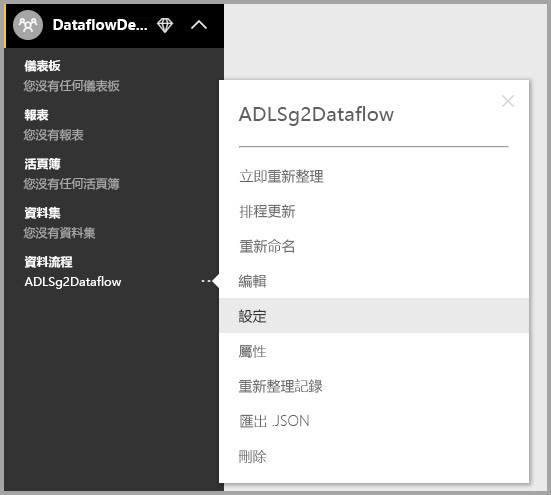

# 設定工作區資料流程設定 (預覽)

透過 Power BI 和資料流程，您可以將工作區的資料流程定義檔案和資料檔案儲存在您的 Azure Data Lake Storage Gen2 帳戶中。 工作區系統管理員可以設定 Power BI 這麼做，而本文會逐步說明完成此工作的步驟。 

在您可以設定工作區的資料流程儲存位置之前，您公司的全域系統管理員必須將您組織的儲存體帳戶連接到 Power BI，並針對該儲存體帳戶啟用儲存體指派權限。 *[連線 Azure Data Lake Storage Gen2 以作為資料流程儲存體 (預覽)](service-dataflows-connect-azure-data-lake-storage-gen2.md)* 

有兩種方式可以設定工作區資料流程儲存體設定： 

* 在工作區的建立期間
* 編輯現有的工作區

我們將會在下列小節中探討這兩種方式。 

> [!IMPORTANT]
> 工作區資料流程儲存體設定只能在工作區不包含任何資料流程的情況下變更。 此外，此功能僅可供新的工作區體驗使用。 您可以在[在 Power BI 中建立新的工作區 (預覽)](service-create-the-new-workspaces.md) 一文中深入了解新的工作區。

## 建立新的工作區，設定其資料流程儲存體

若要在 Power BI 服務中建立新的工作區，請選取 [工作區] > [建立工作區]  。

在 [建立工作區] 對話方塊中，可能會出現標題為 [預覽改善的工作區]  的黃色方塊。 在該區域中，選取 [立即試用]  。

在出現的對話方塊中，您可以給予新的工作區一個唯一的名稱。 請先不要選取 [儲存]  ，因為您還需要設定進階設定。

接下來，請展開 [建立工作區]  對話方塊的 [進階]  區域，您可在那裡開啟 [資料流程儲存體 (預覽)]  設定。)

![適用於新工作區的 [進階] 設定](media/service-dataflows-configure-workspace-storage-settings/dataflow-storage-settings_04.jpg)

選取 [儲存]  以建立新的工作區。 在此工作區中所建立的所有新資料流程，都會將其定義檔案 (其 Model.json 檔案) 和資料儲存在您組織的 Azure Data Lake Storage Gen2 帳戶中。 

## 更新現有工作區的資料流程儲存體

除了建立新的工作區之外，您可以更新現有的工作區，以將定義檔案和資料儲存在您組織的 Azure Data Lake Storage Gen2 帳戶中。 請記得資料流程儲存體設定只能在工作區尚未包含資料流程的情況下變更。

若要編輯工作區，請選取省略符號 **(…)** ，然後選取 [編輯工作區]  。 

在隨即顯示的 [編輯工作區]  視窗中，展開 [進階]  ，然後將 [資料流程儲存體 (預覽)]  設定為 [開啟]  。 

![將 [資料流程儲存體] 設定為 [開啟]](media/service-dataflows-configure-workspace-storage-settings/dataflow-storage-settings_06.jpg)

然後選取 [儲存]  ，現在在此工作區中所建立的所有新資料流程，都會將其定義檔案和資料儲存在您組織的 Azure Data Lake Storage Gen2 帳戶中。

## 取得已儲存資料流程檔案的 URI

當您在指派至您組織 Azure Data Lake 帳戶的工作區中建立資料流程之後，您便可以直接存取其定義和資料檔案。 它們的位置可在 [資料流程設定]  頁面中取得。 若要前往那裡，請遵循下列步驟：

選取在工作區中列於 [資料流程]  底下之資料流程旁邊的省略符號 **(...)** 。 在顯示的功能表中，選取 [設定]  。

在顯示的資訊中，資料流程的 CDM 資料夾位置會出現在 [資料流程儲存位置]  底下，如下圖所示。

> [!NOTE]
> Power BI 會將資料流程擁有者設定為擁有儲存資料流程檔案之 CDM 資料夾的讀者權限。 若要將資料流程儲存位置的存取權授與其他人員或服務，儲存體帳戶的擁有者必須在 Azure 中授與存取權。

## 考量與限制

在資料流程儲存體位於 Azure Data Lake Storage Gen2 中的情況下，將不支援某些資料流程功能： 

Power BI Pro、Premium 和 Embedded 工作區：
* **連結實體**功能僅支援位於相同儲存體帳戶之中的工作區
* 工作區權限不會套用到儲存在 Azure Data Lake Storage Gen2 中的資料流程；只有該工作流程的擁有者才能存取它。
* 否則，所有資料準備功能都與儲存在 Power BI 儲存體中的資料流程相同

另有一些額外考量，如下列清單所述：

* 設定資料流程儲存位置之後，便不能再變更它。
* 針對儲存在 Azure Data Lake Storage Gen2 中的資料流程，只有其擁有者才可以存取其資料。
* 儲存在您組織 Azure Data Lake Storage Gen2 中的資料流程，不支援位於 Power BI 共用容量中的內部部署資料來源。

**Power BI Desktop** 客戶無法存取儲存在 Azure Data Lake Storage Gen2 帳戶中的資料流程，除非他們是該資料流程的擁有者。 請考慮下列情況：

1.  Anna 建立新的工作區，並將其設定成在組織的 Data Lake 中儲存資料流程。
2.  Ben 是 Anna 所建立之工作區的成員，他想要使用 Power BI Desktop 和資料流程連接器，從 Anna 建立的資料流程取得資料。
3.  Ben 會收到錯誤，因為 Ben 並未新增為該資料流程在 Data Lake 中 CDM 資料夾的授權使用者。

    

## 後續步驟

本文已提供如何針對資料流程設定工作區儲存體的指引。 如需其他資訊，請參閱下列文章：

如需有關資料流程、CDM 和 Azure Data Lake Storage Gen2 的詳細資訊，請參閱下列文章：

* [資料流程與 Azure Data Lake 的整合 (預覽)](service-dataflows-azure-data-lake-integration.md)
* [新增 CDM 資料夾成為 Power BI 資料流程 (預覽)](service-dataflows-add-cdm-folder.md)
* [連接 Azure Data Lake Storage Gen2 來儲存資料流程 (預覽)](service-dataflows-connect-azure-data-lake-storage-gen2.md)

如需有關資料流程的整體資訊，請參閱這些文章：

* [建立 Power BI 中的資料流程](service-dataflows-create-use.md)
* [在 Power BI Premium 中使用計算實體 (預覽)](service-dataflows-computed-entities-premium.md)
* [搭配內部部署資料來源使用資料流程 (預覽)](service-dataflows-on-premises-gateways.md)
* [適用於 Power BI 資料流程的開發人員資源 (預覽)](service-dataflows-developer-resources.md)

如需 Azure 儲存體的詳細資訊，您可以閱讀這些文章：

* [Azure 儲存體安全性指南](https://docs.microsoft.com/azure/storage/common/storage-security-guide)
* [開始使用 Azure 資料服務的 GitHub 範例](https://aka.ms/cdmadstutorial) \(英文\)

如需 Common Data Service 的詳細資訊，您可以閱讀它的概觀文章：

* [Common Data Service - 概觀](https://docs.microsoft.com/powerapps/common-data-model/overview)
* [CDM 資料夾](https://go.microsoft.com/fwlink/?linkid=2045304) \(英文\)
* [CDM 模型檔案定義](https://go.microsoft.com/fwlink/?linkid=2045521) \(英文\)

此外，您隨時都可以試著[向 Power BI 社群發問](https://community.powerbi.com/) \(英文\)。
