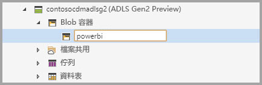
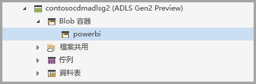
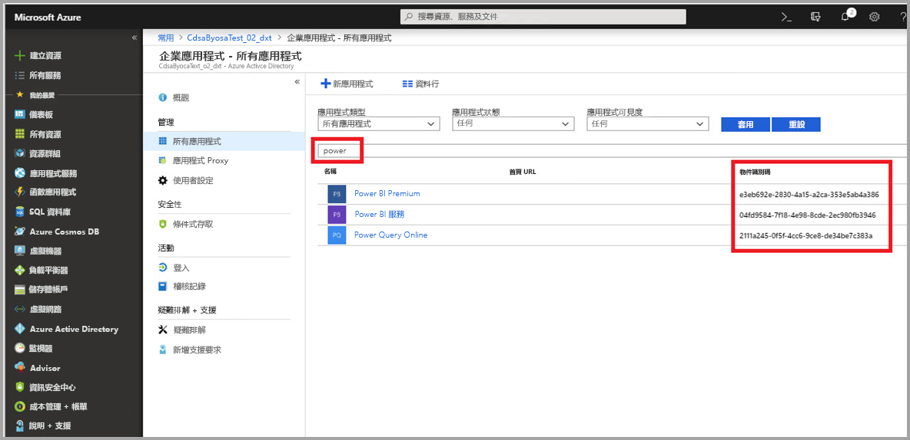
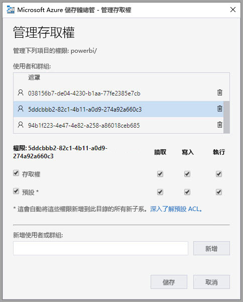
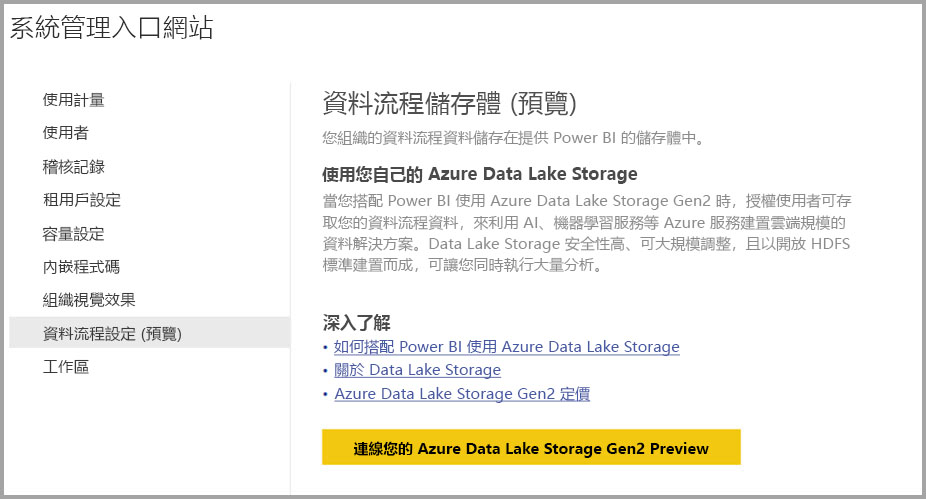
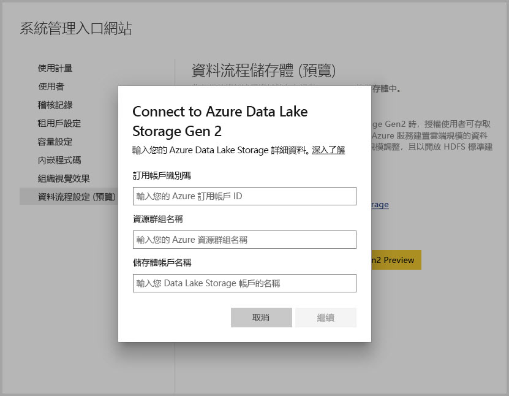

# 連線 Azure Data Lake Storage Gen2 以作為資料流程儲存體 (預覽)

您可以設定 Power BI 工作區以將資料流程儲存在您組織的 Azure Data Lake Storage Gen2 帳戶中。 本文會描述達到此目的所需的一般步驟，並會在過程中提供指引和最佳做法。 設定工作區以將資料流程定義和資料檔案儲存在 Data Lake 中能帶來一些優點，其中幾個優點如下：

* Azure Data Lake Storage Gen2 能為資料提供極具彈性的儲存體設施
* 您 IT 部門的開發人員可以利用資料流程資料和定義檔案來運用 Azure 資料和人工智慧 (AI) 服務，如[來自 Azure 資料服務的 GitHub 範例](https://aka.ms/cdmadstutorial) \(英文\) 中所示範
* 可讓您組織內的開發人員使用適用於資料流程和 Azure 的開發人員資源，將資料流程資料整合至內部應用程式和企業營運解決方案中

若要將 Azure Data Lake Storage Gen2 用於資料流程，您需要下列項目：

* **Power BI 租用戶**：您 Azure Active Directory (AAD) 租用戶中必須至少有一個帳戶已註冊 Power BI
* **全域系統管理員帳戶**：這是連線及設定 Power BI 以將資料流程定義和資料儲存在您 Azure Data Lake Storage Gen2 帳戶中所需的帳戶
* **Azure 訂用帳戶**：您必須要有 Azure 訂用帳戶，才能使用 Azure Data Lake Storage Gen2
* **資源群組**：使用您已擁有的資源群組，或建立新的資源群組
* **已啟用 Data Lake Storage Gen2 (預覽) 功能的 Azure 儲存體帳戶**：若要連線至 Azure Data Lake Storage Gen2，您必須註冊其公開預覽

> [!TIP]
> 如果您沒有 Azure 訂用帳戶，請先建立[免費帳戶](https://azure.microsoft.com/free/)，再開始進行。

## 針對 Power BI 準備您的 Azure Data Lake Storage Gen2

在您為 Power BI 設定 Azure Data Lake Storage Gen2 帳戶之前，您必須先建立並設定儲存體帳戶。 讓我們來看看 Power BI 的需求：

1. 儲存體帳戶必須建立在與您 Power BI 租用戶相同的 AAD 租用戶中。
2. 儲存體帳戶必須建立在與您 Power BI 租用戶相同的區域中。 若要判斷 Power BI 租用戶的所在位置，請參閱[我的 Power BI 租用戶位於何處](service-admin-where-is-my-tenant-located.md)。
3. 儲存體帳戶必須啟用「階層命名空間」功能。
4. 必須將儲存體帳戶的「讀者」角色授與 Power BI 服務。
5. 必須建立名為 **powerbi** 的檔案系統。
6. 必須授權讓 Power BI 服務存取您建立的 **powerbi** 檔案系統。

下列各節將詳細逐步解說設定 Azure Data Lake Storage Gen2 帳戶所需的步驟。

> [!NOTE]
> 資料流程功能目前處於預覽狀態，而且可能會在公開上市之前有所變更及更新。

### 建立儲存體帳戶

請依照[建立 Azure Data Lake Storage Gen2 儲存體帳戶](https://docs.microsoft.com/azure/storage/blobs/data-lake-storage-quickstart-create-account) \(英文\) 一文中的步驟進行操作。

1. 確定所選取的位置與您的 Power BI 租用戶相同，並將儲存體設定為 [StorageV2 (一般用途 v2)]
2. 確定啟用階層命名空間功能
3. 建議將複寫設定設為 [讀取權限異地備援儲存體 (RA-GRS)]

### 將讀者角色授與 Power BI 服務

接著，您必須將您所建立之儲存體帳戶中的讀者角色授與 Power BI 服務。 這是內建的角色，因此步驟相當簡單。 

請依照[將角色指派給安全性主體](https://docs.microsoft.com/azure/storage/common/storage-auth-aad-rbac#assign-a-role-to-a-security-principal)一文中的步驟進行。

在 [新增角色指派] 視窗中，選取 [讀者] 角色以指派給 Power BI 服務。 然後使用搜尋來尋找 **Power BI 服務**。 下圖顯示已指派給 Power BI 服務的 [讀者] 角色。

![已指派 [讀者] 角色給 Power BI 服務](media/service-dataflows-connect-azure-data-lake-storage-gen2/dataflows-connect-adlsg2_05.jpg)

### 為 Power BI 建立檔案系統

您必須先建立名為 *powerbi* 的檔案系統，才能將儲存體帳戶新增至 Power BI。 有許多方式可建立這樣的檔案系統，包括使用 Azure Databricks、HDInsight、AZCopy 或 Azure 儲存體總管。 本節示範一個使用 Azure 儲存體總管來建立檔案系統的簡單方式。

此步驟需要您安裝 Azure 儲存體總管。 若要安裝適用於 Windows、Macintosh 或 Linux 的 Azure 儲存體總管，請參閱 [Azure 儲存體總管](https://azure.microsoft.com/features/storage-explorer/)。

1. 順利安裝 Azure 儲存體總管之後，在第一次啟動時，系統會顯示 [Microsoft Azure 儲存體總管 - 連線] 視窗。 雖然儲存體總管提供數種連線至儲存體帳戶的方式，但目前針對我們所需的設定只有一種支援的方式。 

2. 在左側窗格中，找出並展開先前建立的儲存體帳戶。

3. 以滑鼠右鍵按一下 [Blob 容器]，然後從操作功能表中選取 [建立 Blob 容器]。

   ![以滑鼠右鍵按一下 [Blob 容器]](media/service-dataflows-connect-azure-data-lake-storage-gen2/dataflows-connect-adlsg2_05a.jpg)

4. [Blob 容器] 資料夾底下會出現一個文字方塊。 輸入名稱 *powerbi* 

   

5. 完成時，按 Enter 以建立 Blob 容器

   

在下一節中，您會將您所建立之檔案系統的完整存取權授與 Power BI 服務系列。 

### 將檔案系統權限授與 Power BI

若要授與檔案系統的權限，您需套用能授與 Power BI 服務存取權的「存取控制清單 (ACL)」設定。 此作法的第一步是取得您租用戶中的 Power BI 服務識別。 您可以在 Azure 入口網站的 [企業應用程式] 區段中，檢視您的 Azure Active Directory (AAD) 應用程式。

若要尋找您的租用戶應用程式，請遵循下列步驟：

1. 在 [Azure 入口網站](https://portal.azure.com/)中，從左側導覽面板中選取 [Azure Active Directory]。
2. 在 [Azure Active Directory] 刀鋒視窗中，選取 [企業應用程式]。
3. 從 [應用程式類型] 下拉式功能表中，選取 [所有應用程式]，然後選取 [套用]。 隨即會顯示您租用戶應用程式的範例，類似下圖。

    

4. 在搜尋列中，輸入 *Power*，就會顯示 Power BI 和 Power Query 應用程式的「物件識別碼」集合。

    

5. 從您的搜尋結果中選取並複製 Power BI 服務的「物件識別碼」。 請準備好在後續步驟中貼上該值。

7. 接著，使用 [Azure 儲存體總管] 來瀏覽至您在上一節中建立的 *powerbi* 檔案系統。 請遵循[使用 Azure 儲存體總管來設定檔案和目錄層級權限](https://docs.microsoft.com/azure/storage/blobs/data-lake-storage-how-to-set-permissions-storage-explorer) \(英文\) 一文之[管理存取權](https://docs.microsoft.com/azure/storage/blobs/data-lake-storage-how-to-set-permissions-storage-explorer#managing-access)一節中的指示。

8. 針對在步驟 5 中所收集兩個 Power BI 物件識別碼，個別為它們指派您 *powerbi* 檔案系統的 [讀取]、[寫入]、[執行] [存取權] 和 [預設] ACL。

   

9. 針對在步驟 5 中所收集的 Power Query 線上物件識別碼，指派您 *powerbi* 檔案系統的 [寫入]、[執行] [存取權] 和 [預設] ACL。

   ![接著指派 [寫入] 和 [執行]](media/service-dataflows-connect-azure-data-lake-storage-gen2/dataflows-connect-adlsg2_07b.jpg)

10. 此外，針對 [其他]，也指派 [執行] [存取權] 及 [預設] ACL。

    ![最後針對其他項目指派 [執行] 權限](media/service-dataflows-connect-azure-data-lake-storage-gen2/dataflows-connect-adlsg2_07c.jpg)

## 將 Azure Data Lake Storage Gen2 連線至 Power BI

在 Azure 入口網站中設定好 Azure Data Lake Storage Gen2 帳戶之後，您需在 **Power BI 管理入口網站**中將它連線至 Power BI。 您還需在 Power BI 管理入口網站的 [資料流程儲存體 (預覽)] 設定區段中管理 Power BI 資料流程。 如需有關啟動和基本使用方面的指引，請參閱[如何取得管理入口網站](service-admin-portal.md)，以了解詳細資訊。

您可以透過下列步驟連線您的 **Azure Data Lake Storage Gen2** 帳戶：

1. 瀏覽至 **Power BI 管理入口網站**的 [資料流程設定 (預覽)] 索引標籤

     

2. 選取 [連線您的 Azure Data Lake Storage Gen2 Preview] 按鈕。 下列視窗隨即出現。

     

3. 提供「儲存體帳戶」的 [訂用帳戶識別碼]。
4. 提供儲存體帳戶建立所在的 [資源群組名稱]。
5. 提供 [儲存體帳戶名稱]。
6. 選取 [連接]。

成功完成那些步驟之後，您的 Azure Data Lake Storage Gen2 帳戶便會連線到 Power BI。 

接著，您必須讓組織內的人員能夠設定其工作區，如此他們才能使用此儲存體帳戶來儲存資料流程定義和資料。 讓我們在下一節中進行該項操作。 

## 允許系統管理員指派工作區

資料流程定義和資料檔案預設會儲存在 Power BI 所提供的儲存體中。 若要存取您自己儲存體帳戶中的資料流程檔案，工作區系統管理員必須先設定工作區，以允許將資料流程指派及儲存在新的儲存體帳戶中。 您必須先在 **Power BI 管理入口網站**中將儲存體指派權限授與工作區系統管理員，該系統管理員才能設定資料流程儲存體設定。

若要授與儲存體指派權限，請前往 **Power BI 管理入口網站**中的 [資料流程設定 (預覽)] 索引標籤。 您必須將 [允許工作區系統管理員將工作區指派給此儲存體帳戶] 的選項按鈕設定為 [允許]。 啟用該滑桿之後，請選取 [套用] 按鈕以讓變更生效。 

 

這樣就大功告成了！ Power BI 工作區系統管理員現在便可將工作區指派給您所建立的檔案系統。

## 考量與限制

此功能是預覽版功能，其行為可能在接近發行時有所變更。 使用資料流程儲存體時，需牢記幾個考量與限制：

* 設定資料流程儲存位置之後，便不能再變更它。
* 針對儲存在 Azure Data Lake Storage Gen2 中的資料流程，預設只有其擁有者才可以存取其資料。 若要授權其他人員存取儲存在 Azure 中的資料流程，您必須將他們新增至資料流程的 CDM 資料夾 
* 若要建立含有連結實體的資料流程，必須確定連結的實體和資料流程都儲存在相同儲存體帳戶中
* 儲存在您組織 Data Lake 中的資料流程，不支援位於 Power BI 共用容量中的內部部署資料來源

此外還有一些已知的問題，如本節中所述。

Power BI Desktop 客戶無法存取儲存在 **Azure Data Lake Storage 帳戶** 中的資料流程，除非他們是該資料流程的擁有者，或已獲得 Lake 中 CDM 資料夾的授權。 案例如下：

1. Anna 建立了新的應用程式工作區，並加以設定以儲存組織 Data Lake 中的資料流程。 
2. Ben 是 Anna 所建立之工作區的成員，他想要利用 Power BI Desktop 和資料流程連接器，從 Anna 建立的資料流程取得資料。
3. Ben 會收到類似下圖的錯誤，因為他並未獲得授權以存取該資料流程在 Lake 中的 CDM 資料夾

常見的問題和回答如下：

**問：** 如果我先前已在某個工作區中建立資料流程，而想要變更其儲存位置，該怎麼辦？

**答：** 在資料流程建立之後，您便無法變更其儲存位置。 

**問：** 何時可以變更工作區的資料流程儲存位置？

**答：** 只有當工作區未包含任何資料流程時，才允許變更工作區的資料流程儲存位置。

## 後續步驟

本文已提供有關如何連線 Azure Data Lake Gen2 以作為資料流程儲存體的指引。 如需其他資訊，請參閱下列文章：

如需有關資料流程、CDM 和 Azure Data Lake Storage Gen2 的詳細資訊，請參閱下列文章：

* [資料流程與 Azure Data Lake 的整合 (預覽)](service-dataflows-azure-data-lake-integration.md)
* [設定工作區資料流程設定 (預覽)](service-dataflows-configure-workspace-storage-settings.md)
* [將 CDM 資料夾作為資料流程新增到 Power BI (預覽)](service-dataflows-add-cdm-folder.md)

如需有關資料流程的整體資訊，請參閱這些文章：

* [在 Power BI 中建立及使用資料流程](service-dataflows-create-use.md)
* [在 Power BI Premium 中使用計算實體 (預覽)](service-dataflows-computed-entities-premium.md)
* [搭配內部部署資料來源使用資料流程 (預覽)](service-dataflows-on-premises-gateways.md)
* [適用於 Power BI 資料流程的開發人員資源 (預覽)](service-dataflows-developer-resources.md)

如需有關 Azure 儲存體的詳細資訊，您可以閱讀這些文章：
* [Azure 儲存體安全性指南](https://docs.microsoft.com/azure/storage/common/storage-security-guide)

如需 Common Data Service 的詳細資訊，您可以閱讀它的概觀文章：
* [Common Data Service - 概觀](https://docs.microsoft.com/powerapps/common-data-model/overview)
* [CDM 資料夾](https://go.microsoft.com/fwlink/?linkid=2045304) \(英文\)
* [CDM 模型檔案定義](https://go.microsoft.com/fwlink/?linkid=2045521) \(英文\)

此外，您隨時都可以試著[向 Power BI 社群發問](http://community.powerbi.com/) \(英文\)。
