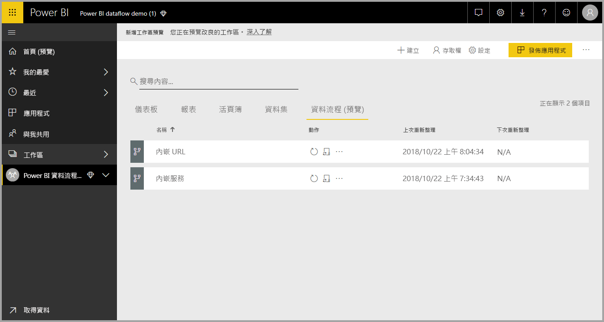
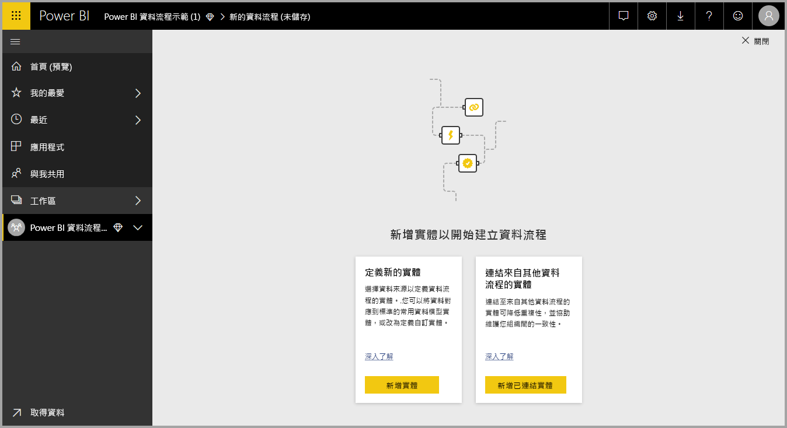
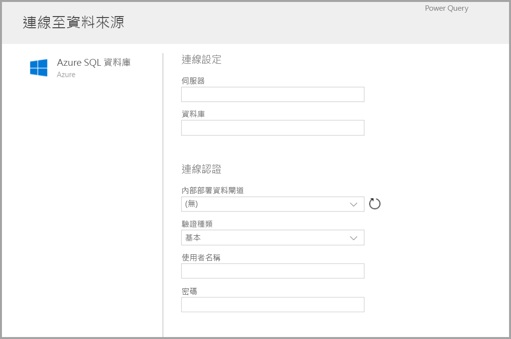
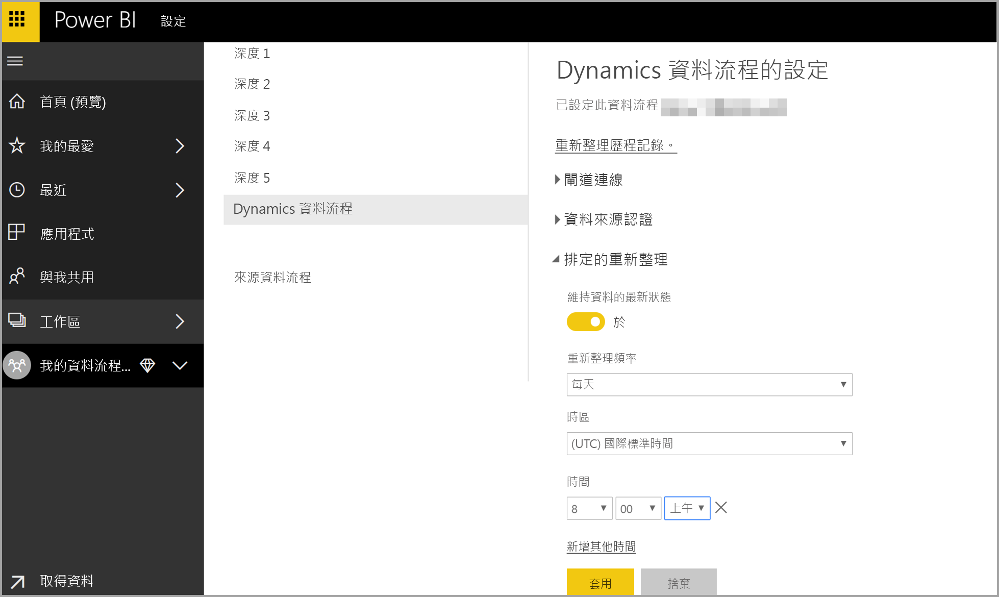
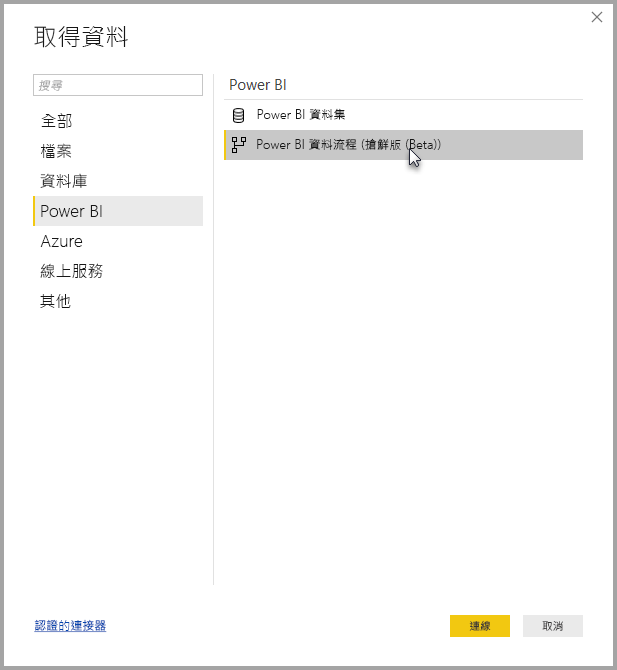

# 在 Power BI 中建立及使用資料流程

您可以運用 **Power BI** 中提供的先進資料準備功能，建立稱為資料流程的集合物件，以用來和來自各種來源的商務資料連線、清除資料、轉換資料，然後將它載入到 Power BI 儲存體。

**資料流程**是在 Power BI 服務中工作區內建立及管理的「實體」  (類似於資料表的實體) 集合。 您可以直接從建立資料流程所在的工作區，在資料流程中新增及編輯實體，以及管理資料重新整理排程。

一旦您建立資料流程之後，就可以使用 **Power BI Desktop** 和 **Power BI 服務**，來建立以您在 Power BI 資料流程中所置入資料為基礎，因此可深入探索商業活動的資料集、報表、儀表板及應用程式。

使用資料流程有三個主要步驟：

1. 使用專為方便您撰寫資料流程設計的 Microsoft 工具來撰寫資料流程
2. 針對您想要帶入資料流程中的資料排程重新整理頻率
3. 使用 Power BI Desktop 建置使用您資料流程的資料集 

我們會在以下各節中查看每個步驟，並藉機熟悉為完成每個步驟所提供的工具。 讓我們開始吧。

## 建立資料流程
若要建立資料流程，請在瀏覽器中啟動 Power BI 服務，然後從左側導覽窗格選取一個**工作區** (Power BI 服務的 *my-workspace* 中無法使用資料流程)，如下列畫面所示。 您也可以建立新的工作區，以在其中建立新的資料流程。 

一旦進入可建立資料流程的 [工作區]  區域，畫布右上角就會顯示 [+ 建立]  按鈕。 選取 [+ 建立]  按鈕，然後從下拉式清單選取 [資料流程]  。 

請務必記住，任一資料流程都只能有*一個擁有者*，也就是建立它的人員。 只有擁有者可以編輯資料流程。 對資料流程建立所在 [工作區]  擁有讀取或寫入權限的所有成員，都能從 **Power BI Desktop** 內部連線至資料流程，如此本文中稍後所述。

![使用 Power BI 服務的 [+ 建立] 按鈕建立資料流程](media/service-dataflows-create-use/dataflows-create-use_03a.png)

您可以從該處新增**實體**，我們會在下一節更詳細說明。

### 新增實體

「實體」  是一組用來儲存資料的欄位，類似於資料庫中的資料表。 您可以在下圖中看到選取的資料來源，您可以從該來源將資料內嵌至 Power BI。

選取資料來源時，系統會提示您提供連線設定，包括用來連線至資料來源的帳戶，如下圖所示。

連線之後，您可以選取要用於實體的資料。 當您選擇資料和來源時，Power BI 隨後會重新連線到資料來源，並以您在稍後的設定程序中選取的頻率，持續重新整理資料流程中的資料。

一旦選取要在實體中使用的資料，您就可以使用資料流程編輯器，將資料塑形或轉換成您的資料流程所需的使用格式。

### 使用資料流程編輯器

一旦您選取要在實體中使用哪些來源資料，就可以使用 Power Query 編輯體驗 (類似於 **Power BI Desktop**中的 **Power Query 編輯器**)，將選取的資料塑形成最適合實體使用的表單。 您可以參閱 Power BI Desktop 的 [Query 概觀文章](desktop-query-overview.md)，深入了解 Power Query (Power Query 已併入 Power BI Desktop 成為 Power Query 編輯器)。 

如果您想要查看 [查詢編輯器] 透過每個步驟所建立的程式碼，或想要建立您自己的成形程式碼，您可以使用 [進階編輯器]  。 

### 資料流程和 Common Data Model (CDM)

資料流程實體包含新的工具，可輕鬆地將您的商務資料對應至 Common Data Model (Microsoft 的標準化結構描述)，搭配 Microsoft 與第三方資料讓資料更豐富，並簡化機器學習服務存取作業。 您可以運用這些新功能，在您的商務資料中提供智慧型和可採取動作的深入解析。 完成編輯查詢步驟中的任何轉換之後，您可以從您的資料來源資料表將資料行對應至 Common Data Model 所定義的標準實體欄位。 標準實體具有 Common Data Model 所定義的已知結構描述。

請從[什麼是 Common Data Model](https://docs.microsoft.com/powerapps/common-data-model/overview) 文章取得此方法和 Common Data Model 的相關詳細資訊。

若要搭配資料流程使用 Common Data Model，請在 [編輯查詢]  對話方塊中按一下 [對應到標準]  轉換。 您可以在顯示的 [對應實體]  畫面中，選取要對應的標準實體。

當您將來源資料行對應到標準欄位時，會發生以下狀況：

1. 來源資料行會採用標準欄位名稱 (如果名稱不同，會將資料行重新命名)
2. 來源資料行會取得標準欄位資料類型

若要保留 Common Data Model 標準實體，未對應的所有標準欄位都會取得 *Null* 值。

所有未對應的來源資料行都會維持原樣，以確保對應結果是包含自訂欄位的標準實體。

在您選取完成，且已準備好儲存您的實體和其資料設定時，就可以從功能表中選取 [儲存]  。 請注意，您可以選取 [新增實體]  按鈕以建立多個實體，而且您可以編輯實體以精簡您已經建立的查詢和實體。

當您選取 [儲存]  時，系統會提示您命名資料流程並提供描述。

當您準備就緒並選取 [儲存]  按鈕時，會顯示一個視窗，告知您**資料流程**已建立完成。 

太好了 – 您現在已經準備好進行下一個步驟，也就是排程資料來源的重新整理頻率。

## 排程重新整理頻率

儲存資料流程之後，您可以為每個連線的資料來源排程重新整理頻率。

Power BI 資料流程會使用 Power BI 的資料重新整理程序，維持資料的最新狀態。 在 [工作區]  區段的 [Power BI 服務]  中，有一個可列出您資訊所在位置的區域集合 (包括資料流程)，如下圖所示。

上圖中的*動態資料流程*實體是我們在上一節中建立資料流程。 若要排程重新整理，請選取 [動作]  區段底下的 [排程重新整理]  圖示，如下圖所示。 

![[動作] 區段中的 [排程重新整理] 按鈕](media/service-dataflows-create-use/dataflows-create-use_13.png)

當您選取 [排程重新整理]  圖示時，會帶您前往 [排程重新整理]  窗格中，讓您設定資料流程重新整理頻率和時間。

如需有關排程重新整理的詳細資訊，請參閱有關[設定排定的重新整理](refresh-scheduled-refresh.md)文章，其中描述 Power BI 資料集的重新整理行為。 資料流程的重新整理設定運作方式與 Power BI 資料集相同。 

## 在 Power BI Desktop 中連線到資料流程

一旦資料流程建立完成，且已排定將填入模型之每個資料來源的重新整理頻率之後，您就可以進行第三個和最後一個步驟，也就是從 **Power BI Desktop** 內連線至您的資料流程。 

若要連線至資料流程，請在 Power BI Desktop 中選取 [取得資料] > [Power BI] > [Power BI 資料流程 (Beta)]  ，如下圖所示。

請從這裡巡覽至您儲存資料流程的 [工作區]  ，選取資料流程，然後從清單中選取您建立的實體。

您也可以使用靠近視窗頂端的 [搜尋列]  ，從許多資料流程實體中快速找出您資料流程或實體的名稱。

當您選取實體，然後選取 [載入]  按鈕時，實體會出現在 **Power BI Desktop** 的 [欄位]  窗格中，並以類似於任何其他資料集**資料表**的運作方式運作。

## 使用儲存在 Azure Data Lake Storage Gen2 中的資料流程

某些組織可能會想要使用自己的儲存體來建立及管理資料流程。 如果您能夠遵循需求並適當地管理權限，便可以將資料流程與 Azure Data Lake Storage Gen2 整合。 此方法的所有需求可以在[資料流程與 Azure Data Lake 的整合 (預覽)](service-dataflows-azure-data-lake-integration.md) 這份概觀文件的一開始找到。

## 針對資料連接進行疑難排解

連接到資料流程的資料來源時有時可能會發生問題。 此節提供發生此類問題時的疑難排解提示。 

* **Salesforce 連接器** - 搭配資料流程使用 Salesforce 的試用帳戶可能會導致連線失敗且不會提供任何資訊。 若要解決此問題，請使用生產環境的 Salesforce 帳戶或開發人員帳戶進行測試。

* **SharePoint 連接器** - 請確定您提供的 SharePoint 網站根位址沒有任何子資料夾或文件。 例如，使用如下所示的連結： https://microsoft.sharepoint.com/teams/ObjectModel/ 

* **JSON 檔案連接器** - 目前您僅能使用基本驗證連線到 JSON 檔案。  目前**不**支援透過提供 URL (例如 https://XXXXX.blob.core.windows.net/path/file.json?sv=2019-01-01&si=something&sr=c&sig=123456abcdefg.. ) 中的認證來連線到 JSON 檔案。  

* **Azure SQL 資料倉儲** - 資料流程目前不支援對 Azure SQL 資料倉儲使用 Azure Active Directory (AAD) 驗證。 對此案例使用基本驗證。

## 考量與限制

資料流程有一些已知的限制，如下列清單所述。

* 資料流程必須輸出下列其中一種類型：*日期/時間、十進位數、文字、整數、日期/時間/區域、True/False、日期、時間*
* 資料流程中目前不支援動態函式

## 後續步驟

這篇文章說明如何在 **Power BI Desktop** 中建立您自己的**資料流程**，以及建立資料集和報表以供使用。 下列文章可在您使用資料流程時，提供更詳細的資訊與案例：

* [使用資料流程的自助資料準備](service-dataflows-overview.md)
* [在 Power BI Premium 上使用計算實體](service-dataflows-computed-entities-premium.md)
* [搭配內部部署資料來源使用資料流程](service-dataflows-on-premises-gateways.md)
* [Power BI 資料流程的開發人員資源](service-dataflows-developer-resources.md)
* [資料流程與 Azure Data Lake 的整合 (預覽)](service-dataflows-azure-data-lake-integration.md)

如需 Common Data Service 的詳細資訊，您可以閱讀它的概觀文章：
* [Common Data Model - 概觀](https://docs.microsoft.com/powerapps/common-data-model/overview)
* [深入了解 Common Data Model 結構描述和 GitHub 上的實體](https://github.com/Microsoft/CDM)

相關的 Power BI Desktop 文章：

* [從 Power BI Desktop 連線到 Power BI 服務中的資料集](desktop-report-lifecycle-datasets.md)
* [Power BI Desktop 中的查詢概觀](desktop-query-overview.md)

相關的 Power BI 服務文章：
* [設定排定的重新整理](refresh-scheduled-refresh.md)
