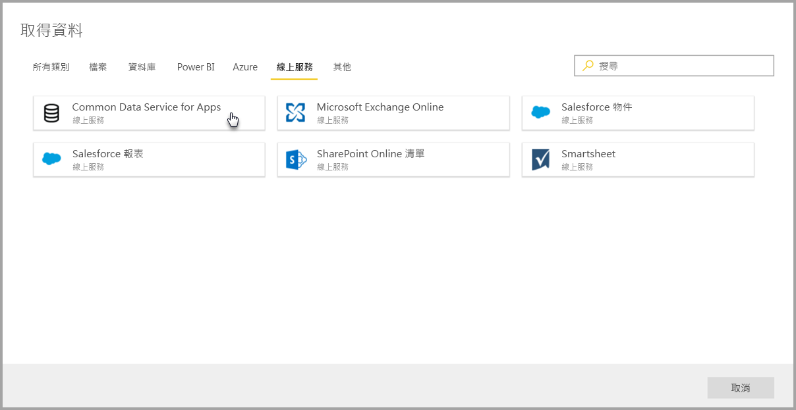
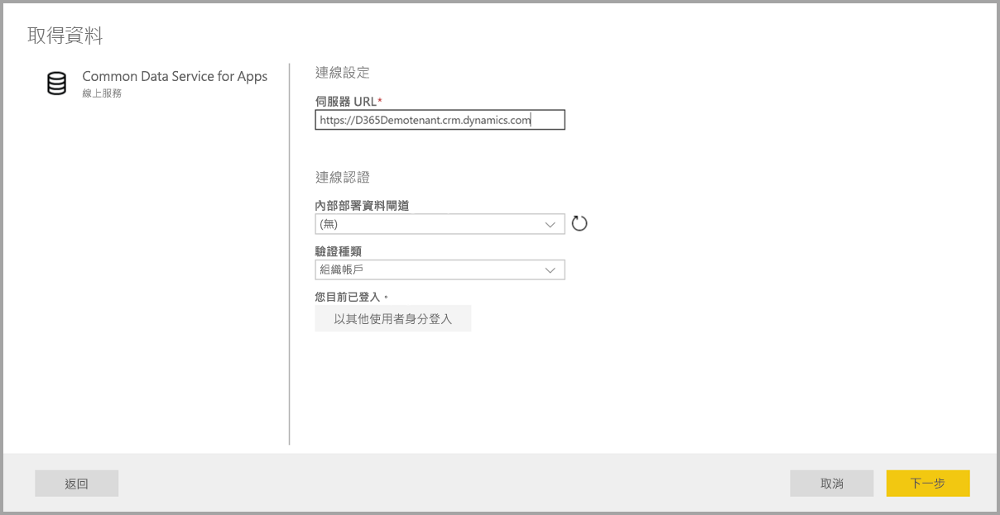

# 連線到 Power BI 資料流程的資料來源 (預覽)

使用 Power BI 資料流程，您可以連線到許多不同的資料來源，以建立新的資料流程，或將新實體新增至現有的資料流程。

本文列出許多關於建立或新增至資料流程的可用資料來源，並描述如何使用這些資料來源來建立資料流程。

如需如何建立和使用資料流程的概觀，請參閱[在 Power BI 中建立及使用資料流程 (預覽)](service-dataflows-create-use.md)。

## 從資料來源建立資料流程

若要連線到資料，請從 [Power BI 服務] 選取 [+ 建立] 功能表項目，然後從出現的功能表選取 [資料流程]。 選取時，下列影像會顯示在 Power BI 服務畫布中。 

如果您的資料流程已經存在，您可以將新實體新增至資料流程，方法是選取 [新增實體] (如下所示)，或在資料流程製作工具中選取 [取得資料]。

下圖顯示資料流程製作工具中的 [取得資料] 按鈕。 

![使用 [取得資料] 來新增實體](media/service-dataflows-data-sources/dataflows-data-sources_03.png)

## 資料流程的資料來源

您可以從資料流程製作工具選取 [取得資料] 資料流程，以檢視可用的資料來源，其接著會顯示一個對話方塊，以供選取類別目錄和每個資料來源的，如下圖所示。

資料流程的資料來源會組織成下列類別，它們會出現在 [取得資料] 對話方塊的頂端：

* 所有類別
* 檔案
* 資料庫
* Power BI
* Azure
* 線上服務
* 其他

[所有類別] 類別包含來自所有類別的所有資料來源。 

[檔案] 類別包含資料流程的下列可用資料連線：

* 存取權
* Excel
* JSON
* Text/CSV
* XML

[資料庫] 類別包含資料流程的下列可用資料連線：

* IBM DB2 資料庫
* MySQL 資料庫
* Oracle Database
* PostgreSQL 資料庫
* SQL Server 資料庫
* Sybase 資料庫
* Teradata 資料庫

[Power BI] 類別包含資料流程的下列可用資料連線：

* Power BI 資料流程

[Azure] 類別包含資料流程的下列可用資料連線：

* Azure Blob
* Azure 資料總管
* Azure SQL 資料倉儲
* Azure SQL Database
* Azure 資料表

[線上服務] 包含資料流程的下列可用資料連線：

* Common Data Service for Apps
* Microsoft Exchange Online
* Salesforce 物件
* Salesforce 報表
* SharePoint Online 清單
* Smartsheet

[其他] 類別包含資料流程的下列可用資料連線：

* Active Directory
* OData
* SharePoint 清單
* Web API
* 網頁
* 空白資料表
* 空白查詢

## 連線到資料來源

若要連線到資料來源，請選取資料來源。 我們將使用一個範例來示範此程序的運作方式，但資料流程的每個資料連線程序類似。 不同的連接器可能需要特定的認證或其他資訊，但流程類似。 在本例中，您會在下列影像看到已從 [線上服務] 資料連線類別選取 [Common Data Service for Apps]。

會顯示所選取資料連線的 [連線] 視窗。 如果需要認證，將提示您提供它們。 下圖顯示正在輸入伺服器 URL 以連線到 Common Data Service for Apps 伺服器。

一旦提供伺服器 URL 或資源連線資訊，請選取 [登入] 輸入要用於資料存取的認證，然後選取 [下一步]。

**Power Query Online** 會初始化和建立與資料來源的連線，然後在 [導覽] 視窗中提供該資料來源中的可用資料表，如下圖所示。

![[導覽] 視窗顯示資料來源中的資料表](media/service-dataflows-data-sources/dataflows-data-sources_07.png)

您可以在左窗格中每個要載入的資料表和資料旁選取其核取方塊。 若要載入資料，請從 [導覽] 窗格底端選取 [確定]。 Power Query Online 對話方塊隨即出現，您可以在此編輯查詢，並執行想要對所選取資料執行的任何其他轉換。

就是這麼簡單。 其他資料來源有類似的流程，並使用 Power Query Online 編輯並轉換您帶入資料流程中的資料。

## 連線到其他資料來源

在 Power BI 資料流程使用者介面中，有其他的資料連接器未顯示出來，但是藉由一些額外的步驟便可支援它們。 

您可以採取下列步驟來建立與使用者介面中未顯示連接器的連線：

1. 開啟 [Power BI Desktop]，然後選取 [取得資料]。
2. 在 Power BI Desktop 中開啟 [Power Query 編輯器]，然後以滑鼠右鍵按一下相關查詢，並開啟 [進階編輯器]，如下圖所示。 從該處，您可以複製 [進階編輯器] 中出現的 M 指令碼。

    ![在 Power BI Desktop 中從 [進階編輯器] 複製 M 指令碼](media/service-dataflows-data-sources/dataflows-data-sources_09.png) 

3. 開啟 Power BI 資料流程，然後針對空白查詢選取 [取得資料]，如下圖所示。

     

4. 將所複製查詢貼到資料流程的空白查詢。

     

然後將您的指令碼連線至您指定的資料來源。 

下列清單會顯示您目前可以藉由複製 M 查詢並貼入空白查詢中的連接器：

* Amazon Redshift
* SAP Business Warehouse 
* SAP HANA
* Analysis Services
* Azure Analysis Services
* Google Analytics
* Adobe Analytics
* ODBC
* OLE DB
* 資料夾
* SharePoint Online 資料夾
* SharePoint 資料夾
* Hadoop HDFS
* Azure HDInsight (HDFS)
* Hadoop 檔案 HDFS
* Informix (Beta)
* Vertica

這就是連線到 Power BI 資料流程中資料來源的全部資訊！

## 後續步驟

本文說明您可以連線到資料流程的資料來源。 下列文章將更詳細討論資料流程的常見使用案例。 

* [Power BI 中的自助資料準備 (預覽)](service-dataflows-overview.md)
* [在 Power BI 中建立及使用資料流程](service-dataflows-create-use.md)
* [在 Power BI Premium 中使用計算實體 (預覽)](service-dataflows-computed-entities-premium.md)
* [搭配內部部署資料來源使用資料流程 (預覽)](service-dataflows-on-premises-gateways.md)
* [適用於 Power BI 資料流程的開發人員資源 (預覽)](service-dataflows-developer-resources.md)
* [資料流程與 Azure Data Lake 的整合 (預覽)](service-dataflows-azure-data-lake-integration.md)

如需 Power Query 和排程重新整理的詳細資訊，您可以閱讀下列文章：
* [Power BI Desktop 中的查詢概觀](desktop-query-overview.md)
* [設定排定的重新整理](refresh-scheduled-refresh.md)

如需 Common Data Service 的詳細資訊，您可以閱讀它的概觀文章：
* [Common Data Service - 概觀](https://docs.microsoft.com/powerapps/common-data-model/overview)

