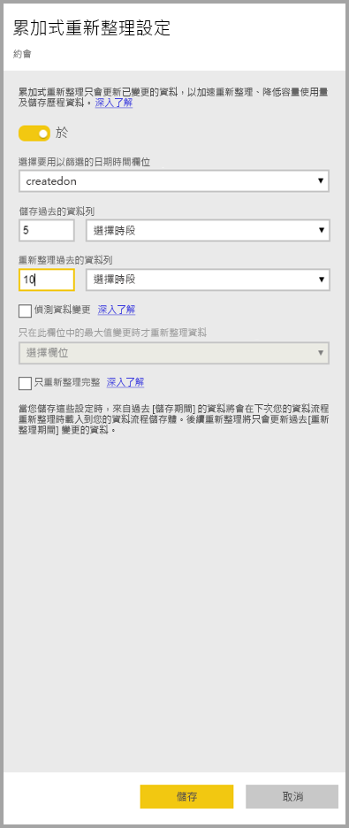
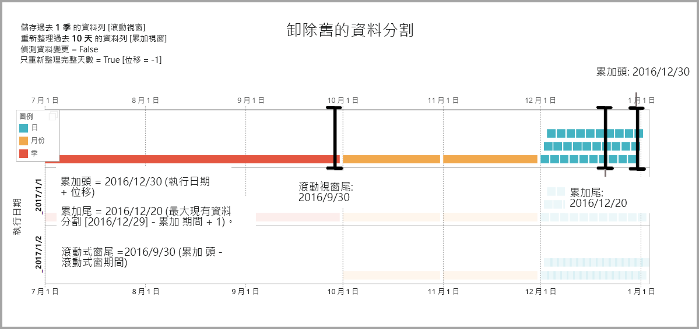

# 搭配 Power BI 資料流程使用累加式重新整理

您可以使用資料流程將大量資料匯入 Power BI，以建立吸引人的報表和分析。 但在某些情況下，在每次重新整理來源資料時更新整個來源複本是不切實際的。 理想的替代方法是**累加式重新整理**，它可以為資料流程提供以下優點：

* **重新整理會變快** - 只需要重新整理變更的資料。 例如，只重新整理 10 年中最後 5 天的資料流程。
* **重新整理更可靠** - 例如，不需要維護長時間執行的連線，即可變更來源系統。
* **減少資源耗用量** - 要重新整理的資料較少可減少記憶體和其他資源的整體耗用。

使用 Power BI 資料流程的累加式重新整理，需要執行 [Premium 容量](service-premium-what-is.md) 中資料流程所在的工作區，且資料流程中內嵌的資料來源必須有累加式重新整理可篩選的 *datetime* 欄位。 

## 設定資料流程的累加式重新整理

資料流程可以包含許多實體。 累加式重新整理是在實體層級設定的，允許一個資料流程同時保存完整重新整理的實體和以累加方式重新整理的實體。

若要設定累加式重新整理實體，請像設定任何其他實體一樣，從設定實體開始。 若要深入了解設定的資料流程，請參閱[在 Power BI 中的自助資料準備](service-dataflows-overview.md)。

建立並儲存資料流程之後，請在實體檢視中選取 [累加式重新整理]  圖示，如下圖所示：

當您按一下圖示時，會顯示 [累加式重新整理設定]  視窗。 當您將累加式重新整理切換至 [開啟]  位置時，就可以設定累加式重新整理。

以下清單說明 [累加式重新整理設定]  視窗中的設定。 

1. **累加式重新整理開啟/關閉切換** – 此滑桿可切換以開啟/關閉實體的累加式重新整理原則
2. **篩選欄位下拉式清單** – 可選取應在哪個實體上篩選累加項目的查詢欄位。 此欄位僅包含 *datetime* 欄位。 如果實體未包含 *datetime* 欄位，就無法使用累加式重新整理。
3. **儲存過去的資料列** – 以下範例有助於說明後續幾個設定。

    對於此範例，我們會定義重新整理原則，以儲存共 5 年的資料，並以累加方式重新整理 10 天的資料。 如果每天重新整理實體，則會針對每個重新整理作業執行下列項目：

    * 新增一天的資料。
    * 重新整理 10 天到目前日期為止。
    * 移除目前日期之前超過 5 年的日曆年度。 例如，如果目前日期是 2019 年 1 月 1 日，則會移除 2013 年。

    第一次資料流程重新整理可能需要一段時間以匯入五年來的所有資料，但後續的重新整理應該只需要初始重新整理時間中的一小段時間即可完成。

4. **偵測資料變更** - 10 天的累加式重新整理比完整重新整理 5 年資料更有效率，但我們甚至可以進一步提高效率。 如果您選取 [偵測資料變更]  核取方塊，就可以選取一個日期/時間資料行，以識別並僅重新整理資料已變更的日期。 這假設這類資料行存在於來源系統中，這通常用於稽核用途。 會評估此資料行在累加式範圍之每個週期的最大值。 如果該資料自上次重新整理後尚未進行變更，則不需要重新整理週期。 在範例中，這可能會進一步將累加式重新整理天數從 10 天減少為可能為 2 天。

> [!TIP]
> 目前設計需要持續保存要偵測資料變更的資料行，並將它快取到記憶體中。 建議您考慮使用下列其中一種技術，減少基數和記憶體耗用量：
>
>    * 僅持續保存此資料行在重新整理期間的最大值，可能是使用 Power Query 函式。
>    * 將有效位數減少到重新整理頻率需求可接受的層級。

5. **只重新整理完整週期** - 假設您的重新整理排定在每天凌晨 4:00 執行。 如果資料在該天一開始的這 4 小時期間出現在來源系統中，您可能不想要特別處理它們。 對於某些商務計量 (例如石油與天然氣產業每天的桶數) 來說，只處理部分天次的計量是不切實際且沒有意義的。

    只適合重新整理完整週期的另一個範例是重新整理財務系統資料。 假設在財務系統中，會在該月的第 12 個日曆日期核准上個月的資料。 您可以將累加式範圍設定為 1 個月，並排定在該月的第 12 天執行重新整理。 核取此選項之後，它就會於 2 月 12 日重新整理 1 月資料 (最近的完整月份期間)。

> [!NOTE]
> 資料流程累加式重新整理可依據下列邏輯決定日期：如果重新整理已經排定，資料流程的累加式重新整理會使用重新整理原則中定義的時區。 有沒有重新整理排程存在，累加式重新整理會使用電腦執行重新整理的時間。

## 累加式重新整理查詢

設定累加式重新整理之後，資料流程會自動修改您的查詢以包含日期篩選。 您可以使用 [進階 Power Query 編輯器]  編輯自動產生的查詢，以微調或自訂重新整理。 在下一節中閱讀更多有關累加式重新整理和其運作方式的資訊。

## 累加式重新整理和連結與計算實體

對於*連結*實體，累加式重新整理會更新來源實體。 由於連結實體只是指向原始實體，因此累加式重新整理不會影響連結實體。 當來源實體依據定義的重新整理原則重新整理時，任何連結實體都應該假設來源中的資料已經過重新整理。

*計算*實體會以對資料存放區 (可能是另一個資料流程) 執行的查詢為依據。 因此，計算實體的行為會和連結實體相同。

由於計算實體和連結實體具有類似的行為，因此兩者的需求和設定步驟也一樣。 其中一個差異是計算實體在特定設定中，會因為已建置資料分割，而無法以最佳化方式執行累加式重新整理式。 

## 在累加式和完整重新整理之間變更

資料流程支援在累加式和完整重新整理之間變更重新整理原則。 向任一方向變更 (從完整變更為累加式，或從累加式變更為完整重新整理) 時，變更會影響下次重新整理之後的資料流程。

將資料流程從完整重新整理移動至累加式重新整理時，新的重新整理邏輯就會依照累加式重新整理設定中的定義，更新黏附至重新整理視窗的資料流程並進行增量。

將資料流程從累加式重新整理移動至完整重新整理時，會依照完整重新整理中所定義的原則，覆寫以累加式重新整理方式累積的所有資料。 您必須核准這個動作。

## 資料流程累加式重新整理與資料集

資料流程累加式重新整理和資料集累加式重新整理是為協同合作而設計的。 它可以接受且支援在資料流程中，以累加方式重新整理實體、完整載入到資料集，或將在資料流程中完整載入的實體以累加方式載入到資料集。 

兩種方式都以您在重新整理設定中指定的定義為依據。
您可以在 [Power BI Premium 中的累加式重新整理](service-premium-incremental-refresh.md)中深入了解累加式重新整理。

## 累加式重新整理的時區支援

資料流程累加式重新整理取決於它的執行時間。 查詢的篩選則是取決於它的執行日期。

為符合這些相依性並確保資料一致性，資料流程累加式重新整理會針對*立即重新整理*案例實作以下啟發學習法：

* 在系統中已定義排程的重新整理情況下 – 累加式重新整理會使用排程重新整理的時區設定。 這可確保重新整理資料流程的人員無論位於哪個時區，一律會與系統定義的時區一致。

* 如果未定義任何排程重新整理，資料流程會使用執行重新整理的使用者電腦的時區。

累加式重新整理也可以使用 API 叫用。 在此情況下，API 呼叫可能會保留在重新整理中使用的時區設定。 對於測試和驗證用途，使用 API 可能會很有幫助。

## 累加式重新整理實作詳細資料

資料流程會針對累加式重新整理使用資料分割。 在 Power BI Premium 的 XMLA 端點可以使用之後，就會看見資料分割。 資料流程中的累加式重新整理會保留符合重新整理原則需求的最少資料分割數目。 系統會卸除超出範圍的舊資料分割，以維護運行視窗。 系統會伺機合併資料分割，以減少所需的資料分割總數。 這可改善壓縮，而且在某些情況下可以提升查詢效能。

此節中的範例共用以下重新整理原則：

* 儲存過去 1 季的資料列
* 重新整理過去 10 天的資料列
* 偵測資料變更 = False
* 只重新整理完整天數 = True

### 合併資料分割

在此範例中，一天的資料分割會在它們移動至累加式範圍之外時，自動合併至月份層級。 累加式的範圍內的資料分割需要每日維護，以允許只重新整理那些天次。
*執行日期 2016 年 12 月 11 日* 的重新整理作業會合併 11 月的天次，因為它們落在累加式範圍之外。

### 卸除舊的資料分割

系統會卸除落在總範圍之外的舊資料分割。 *執行日期 2017 年 1 月 2 日* 的重新整理作業會卸除 2016 年第 3 季的資料分割，因為它落在總範圍之外。

### 從長時間的失敗中復原

此範例模擬系統如何從長時間的失敗中穩定地復原。 假設重新整理因為資料來源認證過期而未順利執行，而且問題在發生 13 天後才解決。 累加式範圍只有 10 天。

下一次成功的重新整理作業 (*執行日期 2017 年 1 月 15 日*) 需要回填遺漏的 13 天並重新整理它們。 它也需要重新整理之前 9 天，因為它們為依正常的排程重新整理。 也就是說，累加式範圍從 10 天增加至 22 天。

下一次重新整理作業 (*執行日期 2017 年 1 月 16 日*) 可藉機合併 12 月的天次和 2016 年第 4 季的月份。

## 後續步驟

此文章描述資料流程的累加式重新整理。 以下是一些可能很實用的其他文章。

* [使用資料流程的自助資料準備](service-dataflows-overview.md)
* [在 Power BI 中建立及使用資料流程](service-dataflows-create-use.md)
* [使用內部部署資料來源的資料流程](service-dataflows-on-premises-gateways.md)
* [Power BI 資料流程的開發人員資源](service-dataflows-developer-resources.md)

如需 Power Query 和排程重新整理的詳細資訊，您可以閱讀下列文章：
* [Power BI Desktop 中的查詢概觀](desktop-query-overview.md)
* [設定排定的重新整理](refresh-scheduled-refresh.md)

如需 Common Data Service 的詳細資訊，您可以閱讀它的概觀文章：
* [Common Data Service - 概觀](https://docs.microsoft.com/powerapps/common-data-model/overview)

