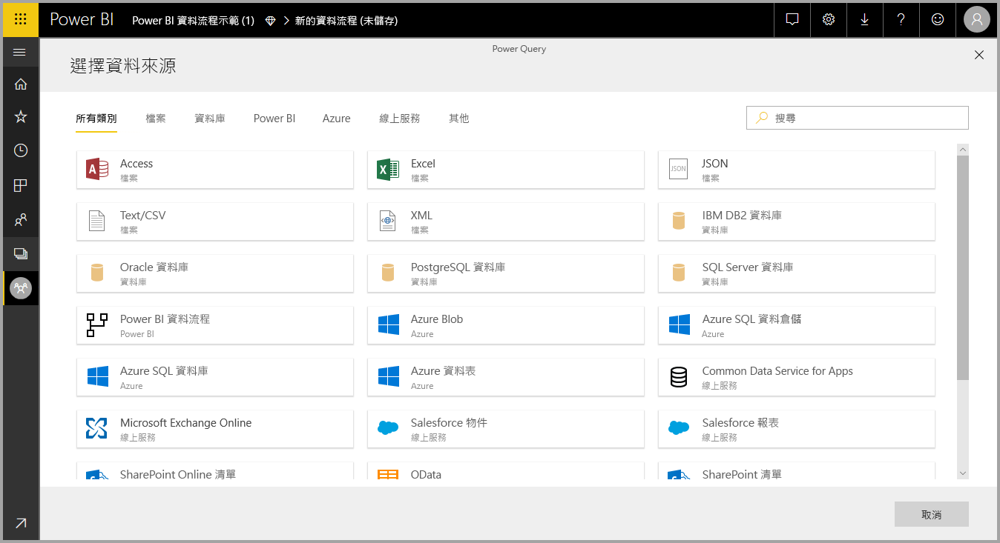

# 搭配內部部署資料來源使用資料流程

利用**資料流程**，您就能從各種來源建立資料集合、清除資料、轉換它，然後將它載入至 Power BI 儲存體。 建立資料流程時，您可能想要使用內部部署資料來源。 此文章將釐清與建立資料流程相關聯的需求，以及應該如何設定您的**企業閘道**來啟用那些連線。

## 設定企業閘道以與資料流程搭配使用

若要在資料流程中使用內部部署資料來源，所有建立該資料流程的使用者都必須安裝並設定**企業閘道**。 建立資料流程的使用者也必須是企業閘道的管理員，才能針對資料流程使用該閘道。

> [!NOTE]
> 資料流程只能使用企業閘道來支援。

## 在資料流程中使用內部部署資料來源

建立資料流程時，從資料來源清單中選取內部部署資料來源，如下圖所示。

一旦選擇之後，系統就會提示您提供企業閘道的連線詳細資料，以用來存取內部部署資料。 您必須選取閘道本身，並提供所選取閘道的認證。 只有該使用者為管理員的閘道才會出現在下拉式清單中。

## 監視閘道

您可以利用監視適用於資料集之閘道的相同方式來監視企業閘道。

在 Power BI 的資料流程設定畫面中，您可以監視資料流程的閘道狀態，並將閘道指派至資料流程，如下圖所示。

## 變更閘道

您有兩種方式可變更用於所指定之資料流程的企業閘道：

1. **從製作工具**：您可以使用資料流程製作工具，來變更已指派給您所有查詢的閘道。

    > [!NOTE]
    > 資料流程將使用新的閘道，嘗試尋找或建立所需的資料來源。 如果它無法這麼做，您將無法變更閘道，直到所有來自所選取閘道的必要資料流程都可供使用為止。

2. **從設定畫面**：您可以針對 Power BI 服務中的資料流程，使用設定畫面來變更指派的閘道。

若要深入了解企業閘道，請參閱[內部部署資料閘道](service-gateway-onprem.md)。

## 考量與限制

有一些使用企業閘道和資料流程的已知限制：

* 每個資料流程可能只使用一個閘道。 在此情況下，您應該使用同一個閘道來設定所有查詢。
* 變更閘道會影響整個資料流程。
* 如果需要數個閘道，最佳做法是建置數個資料流程 (每個閘道各一個)，並使用計算或實體參考功能來整合資料。
* 資料流程只能使用企業閘道來支援。 您將無法在下拉式清單和設定畫面中選取個人閘道。

## 後續步驟

此文章提供了如何針對資料流程使用內部部署資料來源，以及如何使用和設定閘道來存取這類資料的相關資訊。 下列文章可能也很實用

* [使用資料流程的自助資料準備](service-dataflows-overview.md)
* [在 Power BI 中建立及使用資料流程](service-dataflows-create-use.md)
* [在 Power BI Premium 上使用計算實體](service-dataflows-computed-entities-premium.md)
* [Power BI 資料流程的開發人員資源](service-dataflows-developer-resources.md)

如需 Power Query 和排程重新整理的詳細資訊，您可以閱讀下列文章：
* [Power BI Desktop 中的查詢概觀](desktop-query-overview.md)
* [設定排定的重新整理](refresh-scheduled-refresh.md)

如需 Common Data Service 的詳細資訊，您可以閱讀它的概觀文章：
* [Common Data Service - 概觀](https://docs.microsoft.com/powerapps/common-data-model/overview)

