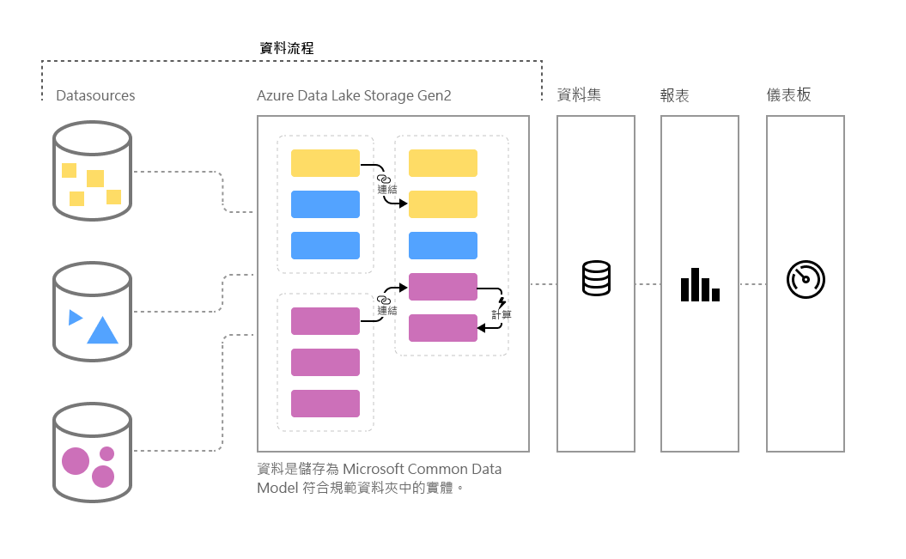

# Power BI 中的自助資料準備

隨著資料量持續成長，將該資料整頓為語式正確且可操作之資訊的挑戰也會隨之增加。 我們想要備妥資料以供分析，以填入視覺效果、報表和儀表板，好讓我們可快速地將資料量轉換為可操作的深入解析。 若要針對 Power BI 中的巨量資料使用**自助資料準備**，只需按幾下，就能從資料移至 Power BI 深入解析。

Power BI 導入了**資料流程**，可協助組織整合來自不同來源的資料，並為模型化做好準備。 分析師可以使用熟悉的自助工具，輕鬆地建立資料流程。 資料流程可藉由定義資料來源連線、ETL 邏輯、重新整理排程，以及更多項目，以用來擷取、轉換、整合及擴充巨量資料。 此外，屬於資料流程一部分的新模型導向計算引擎可讓資料準備程序更容易管理和更具決定性，且對資料分析師和報表建立者而言不再那麼麻煩。 類似於試算表針對所有受影響公式處理重新計算的方式，資料流程會代表您管理實體或資料元素的變更，甚至可針對基本資料重新整理，減緩過去繁瑣又費時的邏輯檢查。 使用資料流程，分析師和報表建立者現在只需按幾下，就能處理曾經需要資料科學家監看的工作 (以及要完成的時數或天數)。 

資料會在 Azure Data Lake Storage Gen2 中以 [**Common Data Model**](https://docs.microsoft.com/powerapps/common-data-model/overview) \(英文\) 的形式儲存為實體。 資料流程會使用 Power BI 服務以在工作區中進行建立及管理。  
 
**資料流程**是設計來使用 **Common Data Service**，後者是 Microsoft 所發佈之標準化、模組化、可擴充的資料結構描述集合，其設計目的是為了讓您更輕鬆地建置、使用和分析資料。 使用這個模型，您就能以近乎零阻力的方式，從資料來源移至 Power BI 儀表板。

您可以使用資料流程，從一組大量、不斷成長且受支援的內部部署和雲端型資料來源擷取資料，這些資料來源包括 Dynamics 365、Salesforce、Azure SQL Database、Excel、SharePoint 及更多資料來源。

您接著可將資料對應至 Common Data Service 中的標準實體、修改和擴充現有實體，以及建立自訂實體。 進階使用者可以使用自助、少量程式碼/無程式碼、內建的 Power Query 撰寫體驗來建立完全自訂的資料流程，其類似於數以百萬計之 Power BI Desktop 和 Excel 使用者已經熟悉的Power Query 體驗。  

一旦您建立資料流程之後，就可以使用 Power BI Desktop 和 Power BI 服務，來建立可利用 Common Data Service 的力量深入探索商業活動的資料集、報表、儀表板及應用程式。 

直接從資料流程建立所在的工作區管理資料流程重新整理排程，就像您的資料集一樣。 

## 資料流程的運作方式

以下是一些資料流程如何為您工作的範例：

* 組織可將其資料對應至 Common Data Service 中的標準實體，或建立他們自己的自訂實體。 這些實體接著可用來作為建置組塊以建立預設會運作的報表、儀表板和應用程式，並將它們散發給組織內的使用者。 

* 使用 Microsoft 資料連接器的廣泛集合，組織可以使用 Power Query 對應來自其原始來源的資料，並將它帶入 Power BI，藉以將自己的資料來源連線至資料流程。 一旦資料流程匯入該資料 (並以指定的頻率重新整理) 之後，可能就會在 Power BI Desktop 應用程式中使用那些資料流程實體來建立引人注目的報表和儀表板。 

## 如何使用資料流程

上一節說明了少數幾個可使用資料流程，在 Power BI 中快速建立功能強大之分析的方式。 在此節中，您將了解在組織中使用資料流程建立深入解析的速度有多快、快速檢視 BI 專業人員如何建立自己的資料流程，以及自訂其組織的深入解析。

> [!NOTE]
> 您必須有付費 Power BI 帳戶才能使用資料流程，例如 Power BI Pro 或 Power PI Premium 帳戶，但您不需要為使用資料流程額外付費。 

### 基於您的商務需求擴充 Common Data Service
對於想要擴充 Common Data Service 的組織而言，資料流程讓商業智慧專業人員能夠自訂標準實體，或建立新的實體。 這個用來自訂資料模型的自助方法接著可與資料流程搭配使用，以建置為組織量身訂做的應用程式和 Power BI 儀表板。

### 以程式設計方式定義資料流程
您可能也想要開發自己的程式設計解決方案來建立資料流程。 透過公用 API 和以程式設計方式建立自訂資料流程定義檔案 (model.json) 的功能，您就能建立自訂解決方案，以符合貴組織獨特的資料和分析需要。 

公用 API 讓開發人員可以使用簡單又輕鬆的方式來與 Power BI 和資料流程互動。

### 使用 Azure 擴充您的功能
Azure Data Lake Storage Gen2 隨附於每個付費的 Power BI 訂用帳戶 (每位使用者 10 GB，每個 P1 節點 100 TB)。 因此，您可以輕鬆地在 Azure Data Lake 上開始使用自助資料準備。 

Power BI 可設定為將資料流程的資料儲存於貴組織的 Azure Data Lake Storage Gen2 帳戶。 將 Power BI 連線到您的 Azure 訂用帳戶時，資料開發人員和資料科學家就能利用功能強大的 Azure 產品，例如 Azure Machine Learning、Azure Databricks、Azure Data Factory 和更多產品。

Power BI 也可以連線到含有 Common Data Service 格式且已結構描述化之資料的資料夾，此資料夾會用來儲存您組織中的 Azure Data Lake Storage 帳戶。 這些資料夾可透過 Azure 資料服務之類的服務來建立。 藉由連線到這些資料夾，分析師就可以在 Power BI 中順暢地使用此資料。 

如需 Azure Data Lake Storage Gen2 與資料流程之整合的詳細資訊，包括如何建立位於您組織 Azure Data Lake 內部的資料流程，請參閱[資料流程與 Azure Data Late 的整合 (預覽)](service-dataflows-azure-data-lake-integration.md)。

## Power BI Premium 上的資料流程功能

對於要在 Power BI Premium 的訂用帳戶上操作的資料流程功能和工作負載，必須針對該 Premium 容量開啟資料流程工作負載。 下表將說明在使用 Power BI Pro 帳戶時的資料流程功能及其容量，以及如何與使用 Power BI Premium 進行比較。

|資料流程功能 | Power BI Pro |   Power BI Premium |
|---------|---------|---------|
|排程重新整理| 每天 8 次|  48|
|儲存體總計| 10 GB/使用者  |100 TB/節點|
|使用 Power Query 線上撰寫的資料流程|    +   |+|
|Power BI 中的資料流程管理|   +|  +|
|Power BI Desktop 中的資料流程資料連接器|  +|  +|
|與 Azure 整合|    +|  +|
|計算實體 (透過 M 的儲存體內部轉換) | |   +|
|新的連接器|    +|  +|
|資料流程累加式重新整理|  |   +|
|正在 Power BI Premium 容量上執行 / 平行執行轉換|   |   +|
|資料流程連結實體| |        +|
|已標準化的結構描述 / 適用於 Common Data Service 的內建支援|  +|  +|

如需在 Premium 容量上啟用資料流程工作負載的詳細資訊，請參閱 [Configure workloads in a Premium capacity](service-admin-premium-workloads.md) (在 Premium 容量中設定工作負載) 一文。 資料流程工作負載目前無法在多地理位置容量中取得。

## 適用於 Power BI 中巨量資料的自助資料準備摘要
如此文章先前所述，在多個案例和範例中，**資料流程**可讓您從商務資料取得更好的控制且更快速進行深入解析。 使用 Common Data Service 所定義的標準資料模型 (結構描述)，資料流程可以匯入您的重要商務資料，且備妥資料以進行模型化，並在一段非常短的期間內建立 BI 深入解析...原本要花上數個月或更久的時間才能建立。 

藉由以 **Common Data Service** 的標準化格式來儲存商務資料，您的 BI 專業人員 (或開發人員) 就能建立應用程式，以產生快速、輕鬆且自動化的視覺效果和報表。 其中包括但不限於：

* 將資料對應至 Common Data Service 中的標準實體以整合資料，並運用已知的結構描述來衍生立即可用的深入解析
* 建立您自己的自訂實體來整合貴組織的資料 
* 使用並重新整理**外部資料**作為資料流程的一部分，並匯入該資料來衍生深入解析
* 開始使用適用於開發人員的資料流程

## 後續步驟

此文章提供適用於 Power BI 中巨量資料的自助資料準備概觀，以及您可使用它的許多方式。 下列文章將更詳細討論資料流程的常見使用案例。 

* [在 Power BI 中建立及使用資料流程](service-dataflows-create-use.md)
* [在 Power BI Premium 上使用計算實體](service-dataflows-computed-entities-premium.md)
* [搭配內部部署資料來源使用資料流程](service-dataflows-on-premises-gateways.md)
* [Power BI 資料流程的開發人員資源](service-dataflows-developer-resources.md)
* [資料流程與 Azure Data Lake 整合](service-dataflows-azure-data-lake-integration.md)

如需 Power Query 和排程重新整理的詳細資訊，您可以閱讀下列文章：
* [Power BI Desktop 中的查詢概觀](desktop-query-overview.md)
* [設定排定的重新整理](refresh-scheduled-refresh.md)

如需 Common Data Service 的詳細資訊，您可以閱讀它的概觀文章：
* [Common Data Service - 概觀](https://docs.microsoft.com/powerapps/common-data-model/overview)

