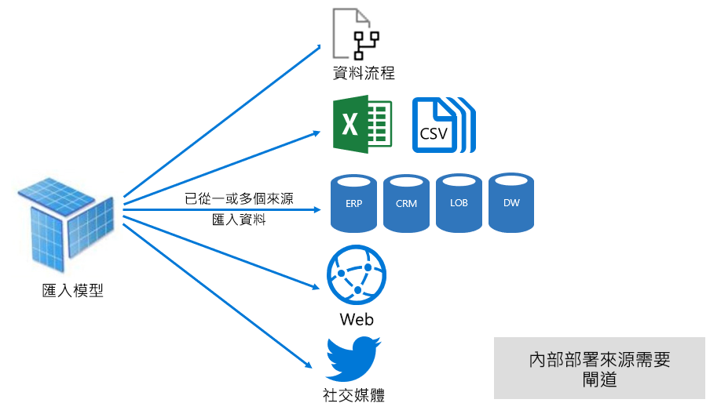

# Power BI 服務中的資料集模式

此文章提供 Power BI 資料集模式的技術說明。 它適用於代表針對外部裝載 Analysis Services 模型之即時連線的資料集，以及在 Power BI Desktop 中開發的模型。 此文章強調每個模式的原理，以及對 Power BI 容量資源可能會造成的影響。

這三個資料集模式為：

- [匯入](#import-mode)
- [DirectQuery](#directquery-mode)
- [複合](#composite-mode)

## 匯入模式

「匯入」  模式是最常用來開發模型的模式。 此模式能透過記憶體內查詢來提供極快速的效能。 它也能為製造模型者提供設計上的彈性，並支援特定的 Power BI 服務功能 (問與答、快速見解等)。 基於這些優勢，它是建立新 Power BI Desktop 解決方案的預設模式。

請務必了解匯入的資料一律會儲存在磁碟上。 當查詢或重新整理這些資料時，系統必須將資料完全載入 Power BI 容量的記憶體中。 當資料處於記憶體內之後，匯入模型便可以達成非常快的查詢結果。 您也應該了解並不存在將匯入模型部分載入記憶體中的概念。

重新整理時，資料會壓縮並最佳化，然後由 VertiPaq 儲存引擎儲存到磁碟。 從磁碟載入到記憶體內時，有可能會發生 10 倍的壓縮。 因此，可以預期將 10 GB 的來源資料壓縮成大約 1 GB 的大小。 磁碟上的儲存體大小可以透過壓縮的大小縮減 20%。 (大小的差異可以透過比較 Power BI Desktop 檔案大小及工作管理員記憶體使用量來判斷。)

可以透過三種方式來達成設計彈性。 資料模型建立者可以：

- 透過從資料流程及外部資料來源快取資料來整合資料 (無論資料來源類型或格式為何)
- 在建立資料準備查詢時，運用整組 [Power Query 公式語言](/powerquery-m/) (非正式名稱為 M) 函式
- 在搭配商務邏輯強化模型時，運用整組[資料分析運算式 (DAX)](/dax/) 函式。 支援計算結果欄、計算資料表及量值。

如下列影像所示，匯入模型可以整合來自任何數目之支援資料來源類型的資料。

不過，雖然匯入模型有許多令人注目的相關優勢，它也有一些缺點：

- 整個模型必須先載入記憶體內，Power BI 才能查詢該模型；這可能會對可用的容量資源造成壓力，特別是在匯入模型的數目及大小持續增加時
- 模型資料的狀態取決於最後一次的重新整理，因此匯入模型需要進行重新整理 (通常是以排程的方式進行)
- 完整重新整理將會移除所有資料表中的所有資料，並從資料來源重新載入它。 此作業的成本可能會很昂貴 (在用於 Power BI 服務及資料來源的時間及資源方面)。

    > [!NOTE]
    > Power BI 可以透過累加式重新整理來避免截斷或重新載入整個資料表。 不過，只有在資料集裝載於 Premium 容量上的工作區中時才會支援此功能。 如需詳細資訊，請參閱 [Power BI Premium 中的累加式重新整理](service-premium-incremental-refresh.md)一文。

從 Power BI 服務資源的觀點來看，匯入模型需要：

- 足夠的記憶體，以在查詢或重新整理模型時載入它
- 處理資源及額外記憶體資源，以重新整理資料

## DirectQuery 模式

_DirectQuery_ 模式是匯入模式的替代方案。 在 DirectQuery 模式中開發的模型不會匯入資料。 相反地，它們只會包含定義模型結構的中繼資料。 查詢模型時，系統會使用原生查詢來從基礎資料來源擷取資料。

會考慮開發 DirectQuery 模型，有兩個主要原因：

- 當資料量過大 (即使已套用[資料縮減方法](guidance/import-modeling-data-reduction.md))，而無法載入模型或實際地進行重新整理
- 當報表和儀表板需要傳遞「接近即時」的資料，且已超越排程重新整理的限制所能達成的程度。 (排程的重新整理限制針對共用容量為每天八次，針對 Premium 容量為每天 48 次。)

有幾個與 DirectQuery 模型相關聯的優勢：

- 不適用匯入模型大小限制
- 模型不需要重新整理
- 報表使用者與報表篩選器及交叉分析篩選器互動時，將能看見最新的資料。 此外，報表使用者可以重新整理整份報表來取得最新資料。
- 可以使用[自動重新整理頁面](desktop-automatic-page-refresh.md)功能來開發即時報表
- 儀表板磚在搭配 DirectQuery 模型時，能以最短 15 分鐘的間隔自動更新

不過，DirectQuery 模型有許多相關聯的缺點和限制：

- 該模型必須以支援的單一資料來源為基礎。 這就是為何任何資料整合都必須預先在資料來源中達成。 支援的資料來源為關聯式和分析系統，並支援許多熱門的資料存放區。

    > [!TIP]
    > 支援許多 Microsoft 資料來源。 Microsoft 資料來源包含 SQL Server、Azure Data Bricks、Azure HDInsight Spark (Beta)、Azure SQL Database，以及 Azure SQL 資料倉儲。 如需詳細資訊，請參閱 [Power BI 中 DirectQuery 支援的資料來源](desktop-directquery-data-sources.md)一文。

- 效能可能會很慢，並可能會對 Power BI 服務造成負面影響。 此問題可能會因為某些查詢使 Power BI 服務需要大量 CPU 而產生。 它也可能會因為資料來源未針對 Power BI 傳送的查詢進行最佳化而產生。
- Power Query 查詢必須可進行摺疊。 此需求表示 Power Query 邏輯不能過為複雜。 此外，該邏輯只能使用可以轉換成資料來源所能理解之原生查詢的 M 運算式和函式。
- DAX 公式只能使用可以轉換成資料來源所能理解之原生查詢的函式。 此外，並不支援計算資料表或 DAX 時間智慧函式。
- 需要擷取超過一百萬個資料列的模型查詢將會失敗
- 具有多個視覺效果的報表和儀表板可能會顯示不一致的結果，特別是在資料來源為揮發性的情況下
- 不支援問與答及快速見解功能

從 Power BI 服務資源的觀點來看，DirectQuery 模型需要：

- 最少的記憶體，以在查詢模型時載入它 (僅需載入中繼資料)
- 有時 Power BI 服務必須使用大量處理器資源，來產生及處理傳送到資料來源的查詢。 發生這種情況時，它可能會影響到輸送量，特別是在多個使用者同時查詢模型的情況下。

如需詳細資訊，請參閱[在 Power BI Desktop 中使用 DirectQuery](desktop-use-directquery.md)。

## 複合模式

「複合」  模式能夠混合匯入和 DirectQuery 模式，或是整合多個 DirectQuery 資料來源。 在複合模式中開發的模型支援針對每個模型資料表設定儲存體模式。 此模式也支援計算資料表 (以 DAX 定義)。

資料表儲存模式可以設定為 [匯入]、[DirectQuery] 或 [雙重]。 設定為雙重儲存模式的資料表將同時是「匯入」和「DirectQuery」，且此設定可讓 Power BI 服務針對每個查詢判斷出應使用哪個模式才會最有效率。

複合模型的目的是要同時提供匯入和 DirectQuery 模式的優勢。 在適當設定的情況下，他們可以結合記憶體內模型的高查詢效能，以及從資料來源擷取接近即時資料的能力。

開發複合模型的製造模型者很可能會以匯入或雙重儲存模式來設定維度類型的資料表，並以 DirectQuery 模式來設定事實類型的資料表。 如需模型資料表角色的詳細資訊，請參閱[了解星型結構描述及其對 Power BI 的重要性](guidance/star-schema.md)。

例如，假設有某個模型具有處於雙重模式下的**產品**維度類型資料表，以及處於 DirectQuery 模式下的**銷售**事實類型資料表。 可以從記憶體內有效且迅速地查詢**產品**資料表，並呈現報表交叉分析篩選器。 同時也可以搭配相關聯的**產品**資料表，在 DirectQuery 模式中查詢**銷售**資料表。 後者查詢可以產生單一有效的原生 SQL 查詢，它能聯結**產品**和**銷售**資料表，並依交叉分析篩選器的值進行篩選。

一般而言，對複合模型來說，與匯入和 DirectQuery 相關聯的優勢和缺點會取決於每個資料表的設定方式。

如需詳細資訊，請參閱[在 Power BI Desktop 中使用複合模型](desktop-composite-models.md)。

## 後續步驟

- [Power BI 服務中的資料集](service-dataset-modes-understand.md)
- [Power BI Desktop 中的儲存模式](desktop-storage-mode.md)
- [使用 Power BI 中的 DirectQuery](desktop-directquery-about.md)
- [在 Power BI Desktop 中使用複合模型](desktop-composite-models.md)
- 有其他問題嗎？ [嘗試在 Power BI 社群提問](https://community.powerbi.com/)
