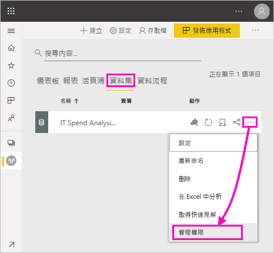
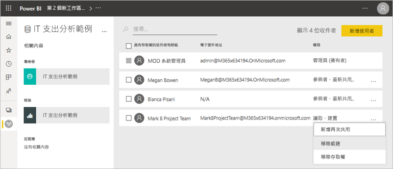
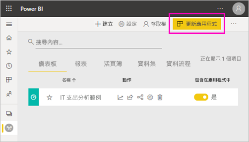

# 共用資料集的建置權限 (預覽)

身為 Power BI Desktop 中的「資料模型」  建立者，您可以共用這些模型，作為 Power BI 服務中的「資料集」  。 接著，報表建立者可以輕鬆探索並重複使用您共用的資料集。 了解如何使用建置權限控制誰可以存取資料。

建置權限只與資料集相關。 當您為使用者賦予建置權限時，他們可以在資料集上建置新內容，例如問與答中的報表、儀表板、釘選磚，以及見解探索。 也可以在 Power BI 外部的資料集建置新內容，例如透過使用 Excel 分析的 Excel 工作表、XMLA 和匯出基礎資料。

## 賦予建置權限的方式

您能以幾種不同方式賦予資料集的建置權限：

- 若您是工作區中至少擁有「參與者」角色的成員，您便會自動擁有該工作區中資料集的「建置」權限，以及複製報表的權限。
 
- 資料集所在的工作區成員，可以將權限指派給權限中心內的特定使用者或安全性群組。 若您是工作區的成員，請選取資料集旁的 [更多選項]  (...) > [管理權限]  。

    

    這會開啟該資料集的權限中心，您可以在此設定並變更權限。

    

- 資料集所在工作區的系統管理員或成員，可以在發佈應用程式期間決定具有應用程式權限之使用者也可以獲得基礎資料集的建置權限。 請參閱[共用資料集](service-datasets-share.md)以取得詳細資訊。

- 假設您擁有在資料集上再次共用與建置的權限。 當您共用根據該資料集所建置的報表或儀表板時，您可以指定收件者也可獲得基礎資料集的建置權限。

    

您可以移除人員對資料集的「建置」權限。 如果您這麼做，他們仍可以查看建置於共用資料集的報表，但無法再加以編輯。 請參閱下一節以取得詳細資訊。

## 移除資料集的建置權限

有時候，您可能需要移除某些使用者對共用資料集的建置權限。 

1. 在工作區中，移至 [資料集]  清單頁面。 
1. 選取資料集旁的 [更多選項]  (...) > [管理權限]  。

    

1. 選取名稱旁的 [更多選項]  (...) > [移除組建]  。

    

    他們仍可以查看建置於共用資料集的報表，但無法再加以編輯。

### 移除應用程式中資料集的建置權限

假設您已將應用程式從工作區發行到使用者群組。 之後，您決定移除某些人對應用程式的存取權。 移除其對應用程式的存取權不會自動移除其建置與重新共用權限。 那是額外的步驟。 

1. 在工作區清單頁面中，選取 [更新應用程式]  。 

    

1. 在 [權限]  索引標籤上，選取 [X]  以刪除使用者或群組。 

    ![選取 [X]](media/service-datasets-build-permissions/power-bi-app-delete-user.png)
1. 選取 [更新應用程式]  。

    您可以看到一個說明您必須移至 [管理權限]  以針對具有現有存取權的使用者移除建置權限的訊息。 

    

1. 選取 [更新]  。

1. 在工作區中，移至 [資料集]  清單頁面。 
1. 選取資料集旁的 [更多選項]  (...) > [管理權限]  。

    

1. 選取其名稱旁的 [更多選項]  (...) > [移除組建]  。

    

    他們仍可以查看建置於共用資料集的報表，但無法再加以編輯。

## 更細微的權限

Power BI 於 2019 年 6 月推出建置權限，作為現有權限、讀取和再次共用的補充。 所有已在該時間透過應用程式權限、共用或工作區存取權取得資料集讀取權限的使用者，也可獲得這些相同資料集的建置權限。 他們會自動獲得建置權限，因為讀取權限已授與他們在資料集上建置新內容的權限 (藉由使用 Excel 分析或匯出)。

藉由這種更細微的建置權限，您可以選擇誰只能檢視現有報表或儀表板中的內容、誰可以建立連線至基礎資料集的內容。

如果資料集工作區外的報表正在使用資料集，您無法刪除該資料集。 反之，您會看到一則錯誤訊息。

您可以移除建置權限。 如果您這麼做，您已撤銷其權限的使用者仍然可以查看報表，但無法再編輯報表或匯出基礎資料。 只具有讀取權限的使用者仍然可以匯出摘要資料。 

## 後續步驟

- [跨工作區使用資料集 (預覽)](service-datasets-across-workspaces.md)
- 有問題嗎？ [嘗試在 Power BI 社群提問](https://community.powerbi.com/)
