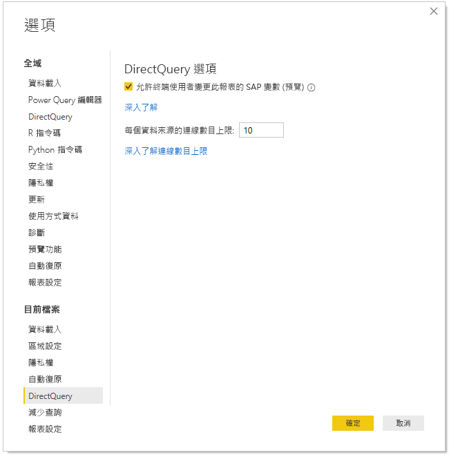

# 在 Power BI 服務中編輯 SAP 變數 (預覽)

搭配 DirectQuery 使用 SAP Business Warehouse 或 SAP HANA 時，報表作者現在可以允許終端使用者在 **Power BI 服務**中編輯 Premium 工作區的 SAP 變數。

![[編輯變數] 對話方塊](media/service-edit-sap-variables/sap-edit-variables-dialog.png)

本文件描述在 Power BI 中編輯變數的需求、如何啟用此預覽功能，以及在 Power BI 服務中編輯變數的位置。

## SAP 編輯變數的需求

使用 SAP 編輯變數功能有幾項需求。 下列清單描述這些需求。

**需要新的篩選體驗** - 您必須為報表啟用[新的篩選體驗](power-bi-report-filter.md)。 以下示範如何在 Power BI Desktop 中為報表啟用新的篩選體驗：
- 在 Power BI Desktop 中，選取 [檔案]   > [選項及設定]   > [選項] 
- 在左側導覽列中，選取 [目前檔案]  下的 [報表設定]  。
- 在 [篩選體驗]  下，選取 [啟用更新的篩選窗格]  。

**需要 DirectQuery 連接** - 您必須使用 DirectQuery 連接到 SAP 資料來源。 不支援匯入連接。

**需要 Power BI Premium 訂用帳戶** - SAP 編輯變數功能目前僅適用於 Power BI Premium 訂用帳戶。

**需要 SSO 設定** - 為了讓此功能正常運作，必須設定單一登入 (SSO)。 如需詳細資訊，請參閱[單一登入 (SSO) 概觀](service-gateway-sso-overview.md)。

**需要新的閘道位元** - 下載最新閘道並更新現有的閘道。 如需詳細資訊，請參閱[服務閘道](service-gateway-onprem.md)。

**SAP HANA 僅適用於多維度** - 針對 SAP HANA，SAP 編輯變數功能僅適用於多維度模型，不適用於關聯式來源。

**不支援主權雲端** - Power Query Online 目前不適用於主權雲端；因此，此功能亦不支援主權雲端。

## 如何啟用功能

若要啟用 [SAP 編輯變數]  功能，請在 Power BI Desktop 中連接到 SAP HANA 或 SAP BW 資料來源。 然後移至 [檔案] > [選項及設定] > [選項]  ，並接著在左窗格的 [目前檔案] 區段中，選取 [DirectQuery]  。 當您選取該選項時，您會在右窗格中看到 [DirectQuery 選項]，以及可讓您 [允許終端使用者變更此報表的 SAP 變數 (預覽)]  的核取方塊，如下圖所示。

## 在 Power BI Desktop 中使用 SAP 編輯變數

在 Power BI Desktop 中使用 SAP 編輯變數時，您可以從功能區的 [編輯查詢]  功能表選取 [編輯變數] 連結來編輯變數。 此時會出現下列對話方塊。 此功能已在 Power BI Desktop 中提供一段時間。 報表建立者可以使用下列對話方塊來選取報表的變數。

## 在服務中使用 SAP 編輯變數

將報表發佈至 Power BI 服務之後，使用者就可以在新的 [篩選] 窗格中看到 [編輯變數]  連結。 如果您是第一次發佈報表，可能需要最多 5 分鐘的時間，[編輯變數] 連結才會出現。 如果連結未出現，您將需要手動重新整理資料集。
您可以透過下列方式來達成：

1. 在 Power BI 服務中，選取工作區內容清單中的 [資料集]  索引標籤。

2. 尋找您需要重新整理的資料集，然後選取**重新整理**圖示。

    

3. 選取 [編輯變數] 連結會顯示 [編輯變數]  對話方塊，使用者可以在其中覆寫變數。 選取 [重設]  按鈕會將變數重設為開啟此對話方塊時所顯示的原始值。

    ![[編輯變數] 對話方塊](media/service-edit-sap-variables/sap-edit-variables-dialog.png)

4. [編輯變數]  對話方塊中任何變更只會保留給此使用者 (類似於 Power BI 中其他持續性行為)。 選取 [重設為預設值]  (如下圖所示) 會將報表重設為報表建立者的原始狀態，包括變數。

    

在使用 SAP HANA 或 SAP BW 並啟用 [編輯變數]  功能的 Power BI 服務中處理發佈報表時，報表擁有者可以變更這些預設值。 報表的擁有者可以在編輯模式中變更變數，然後儲存報表，讓這些設定成為該報表的「新預設設定」  。 在報表擁有者進行這類變更之後，任何其他存取此報表的使用者將會看到這些新預設設定。

## 問題與考量

應用程式目前不支援 SAP 編輯變數功能。

## 後續步驟

如需 SAP HANA、SAP BW 或 DirectQuery 的詳細資訊，請參閱下列文章：

- [在 Power BI Desktop 中使用 SAP HANA](desktop-sap-hana.md)
- [DirectQuery 和 SAP Business Warehouse (BW)](desktop-directquery-sap-bw.md)
- [DirectQuery 和 SAP HANA](desktop-directquery-sap-hana.md)
- [使用 Power BI 中的 DirectQuery](desktop-directquery-about.md)