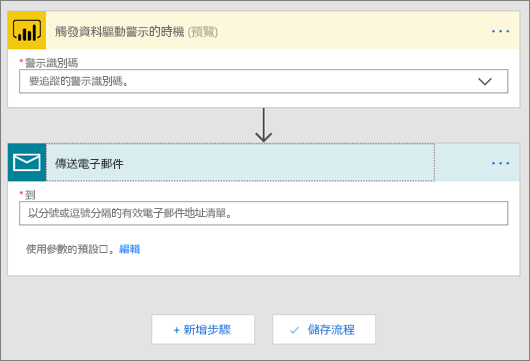
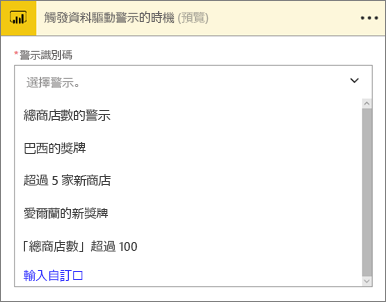
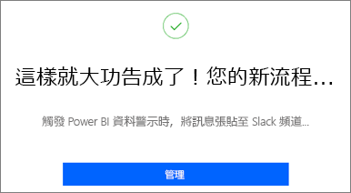
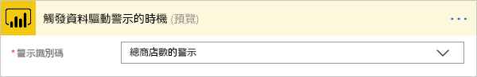
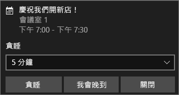

# Microsoft Flow 及 Power BI

[Microsoft Flow](https://flow.microsoft.com/en-us/documentation/getting-started) 是一款 SaaS 供應項目，在企業用戶所仰賴的越來越多種應用程式和 SaaS 服務之間，將工作流程自動化。 您可以使用 Flow 整合最愛的應用程式和服務 (包括 Power BI) 來將工作自動化，以取得通知、同步檔案、收集資料等。 工作流程自動化讓重複性的工作變得輕鬆。

[立即開始使用 Flow。](https://flow.microsoft.com/documentation/getting-started)

觀看 Sirui 建立流程，在 Power BI 警示觸發時，將詳細的電子郵件傳送給同事。 然後遵循影片下方的逐步指示親自試試看。

<iframe width="560" height="315" src="https://www.youtube.com/embed/YhmNstC39Mw" frameborder="0" allowfullscreen></iframe>

## 建立由 Power BI 資料警示觸發的流程

### 先決條件
本教學課程將示範如何建立兩個不同流程；一個從範本建立，一個從頭建立。 如果要跟著做，請[在 Power BI 中建立資料警示](service-set-data-alerts.md)，建立免費的 Slack 帳戶，並[註冊 Microsoft Flow](https://flow.microsoft.com/en-us/#home-signup) (免費！)。

## 建立使用 Power BI 的流程 - 從範本
在這項工作中，我們將使用範本來建立由 Power BI 資料警示 (通知) 觸發的簡單流程。

1. 登入 Microsoft Flow (flow.microsoft.com)。
2. 選取 [我的流程]。
   
   
3. 選取 [從範本建立]。
   
    ![[我的流程] 功能表列](media/service-flow-integration/power-bi-template.png)
4. 使用 [搜尋] 方塊尋找 Power BI 範本，然後選取 [觸發 Power BI 資料警示時，將電子郵件傳送至任何受眾] > [繼續]。
   
    

### 建置流程
此範本有一個觸發程序 (愛爾蘭獲得新奧運獎牌的 Power BI 資料警示) 和一個動作 (傳送電子郵件)。 在您選取欄位時，Flow 會顯示可以包含的動態內容。  在此範例中，訊息本文包含了磚的值和磚 URL。

1. 從觸發程序下拉式清單中，選取一項 Power BI 資料警示。 選取 [New medal for Ireland] \(愛爾蘭的新獎牌)。 若要了解如何建立警示，請參閱 [Power BI 中的資料警示](service-set-data-alerts.md)。
   
   
2. 輸入一或多個有效電子郵件地址，然後選取 [編輯]\(如下所示) 或 [新增動態內容]。 
   
   ![[傳送電子郵件] 畫面](media/service-flow-integration/power-bi-flow-email.png)

3. 流程會建立標題及訊息，您可以保留或修改它們。 您在建立 Power BI 警示時所設定的所有值都可供您使用，您只需將游標置於灰色的醒目提示區域並選取即可。 

   ![[傳送電子郵件] 畫面](media/service-flow-integration/power-bi-flow-email-default.png)

1.  例如，如果您在 Power BI 中建立了一個警示標題「我們已贏得另一面獎牌」，您可以選取 [警示標題] 來將該文字新增到您的電子郵件 [主旨] 欄位。

    

    接著，您可以接受預設電子郵件本文，或是自行建立內容。 上述範例會對訊息做出一些修改。

1. 當您完成時，請選取 [建立流程] 或 [儲存流程]。  流程隨即建立並進行評估。  Flow 可讓您知道當中是否有錯誤。
2. 如果發現錯誤，請選取 [編輯流程] 加以修正，否則選取 [完成] 即可執行新流程。
   
   
5. 當觸發資料警示時，系統會將電子郵件傳送到您指定的地址。  
   
   

## 建立使用 Power BI 的流程 - 從頭 (空白)
在這項工作中，我們將從頭建立由 Power BI 資料警示 (通知) 觸發的簡單流程。

1. 登入 Microsoft Flow。
2. 選取 [我的流程] > [從空白建立]。
   
   
3. 使用 [搜尋] 方塊尋找 Power BI 觸發程序，然後選取[Power BI - 觸發資料驅動警示時]。

### 建立流程
1. 從下拉式清單中，選取您的警示名稱。  若要了解如何建立警示，請參閱 [Power BI 中的資料警示](service-set-data-alerts.md)。
   
    
2. 選取 [新步驟] > [新增動作]。
   
   
3. 搜尋 **Outlook**，然後選取 [建立事件]。
   
   
4. 填入事件欄位。 在您選取欄位時，Flow 會顯示可以包含的動態內容。
   
   
5. 完成時請選取 [建立流程]。  Flow 會儲存並評估流程。 如果沒有錯誤，請選取 [完成] 執行此流程。  新流程會新增到 [我的流程] 頁面中。
   
   
6. 當 Power BI 資料警示觸發流程時，您會收到類似這樣的 Outlook 事件通知。
   
    

## 後續步驟
* [開始使用 Microsoft Flow](https://flow.microsoft.com/en-us/documentation/getting-started/)
* [在Power BI 服務中設定資料警示](service-set-data-alerts.md)
* [在 iPhone 上設定資料警示](mobile-set-data-alerts-in-the-mobile-apps.md)
* [在 Power BI for Windows 10 行動裝置 App 中設定資料警示](mobile-set-data-alerts-in-the-mobile-apps.md)
* 有其他問題嗎？ [試試 Power BI 社群](http://community.powerbi.com/)

