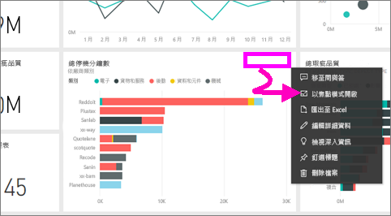
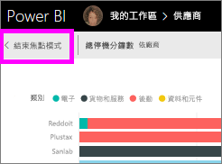
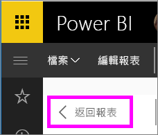

# 以焦點模式顯示儀表板磚或報表視覺效果

<iframe width="560" height="315" src="https://www.youtube.com/embed/dtdLul6otYE" frameborder="0" allowfullscreen></iframe>

## 什麼是焦點模式？

「焦點」模式可讓您展開 (彈出) 內容，以查看詳細資料。  使用焦點模式時，您可以檢視及修改建立此視覺效果時所套用的篩選。  在 Power BI 服務中，您可以在儀表板磚或報表視覺效果上使用焦點模式，而在 Power BI Desktop 中，您可以在[報表視覺效果](desktop-report-view.md)上使用焦點模式。

> [!NOTE]
> 焦點模式與[全螢幕模式](service-fullscreen-mode.md)不同。
> 

## 儀表板磚的焦點模式

1. 將滑鼠指標停留在磚視覺效果上方，並選取省略符號 (...)，然後選擇 [Open in focus mode (以焦點模式開啟)]。 

    .

2. 這會開啟磚，並填滿整個報表畫布。 

   

3. 展開 [篩選] 窗格，以查看套用到這個視覺效果的所有篩選。
   
   ![具有 [篩選] 窗格的焦點模式](media/service-focus-mode/power-bi-focus-filters.png)

4. 修改篩選以進一步探索，如果發現有趣的視覺效果，可將該視覺效果釘選到儀表板。

5. 離開焦點模式，然後選取 [< 結束焦點模式] (位於視覺效果的左上角) 返回儀表板。
   
        

## 報表視覺效果的焦點模式

1. 將滑鼠指標停留在報表視覺效果上方，並選取**焦點模式**圖示 。  
   
   
2. 此視覺效果會開啟並填滿整個畫布。 

   
3. 展開 [篩選] 窗格，以查看套用到這個視覺效果的所有篩選。
   
   ![具有 [篩選] 畫面的焦點模式](media/service-focus-mode/power-bi-display-focus-filters.png)
4. 修改篩選以進一步探索，如果發現有趣的視覺效果，可將該視覺效果釘選到儀表板。   
5. 離開焦點模式，然後選取 [< 返回報表] (位於視覺效果的左上角) 返回報表。 
   
      

## 從焦點模式移至全螢幕模式
進入焦點模式之後，即可[以全螢幕 (電視模式) 檢視](service-fullscreen-mode.md)磚或視覺效果。全螢幕模式隨即顯示，而不受功能表和導覽按鈕的干擾。

## 考量與疑難排解
* 使用焦點模式時若報表中有視覺效果，您可檢視及修改所有篩選：視覺效果層級、頁面層級、鑽研和報表層級。    
* 使用焦點模式時若儀表板上有視覺效果，則只能檢視及修改視覺效果層級的篩選。

有其他問題嗎？ [試試 Power BI 社群](http://community.powerbi.com/)

