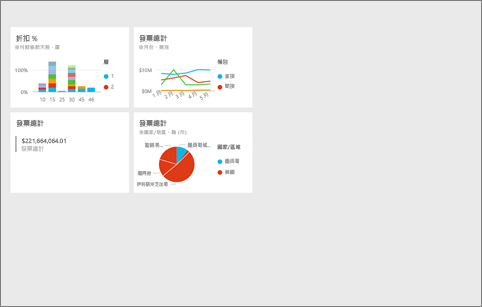
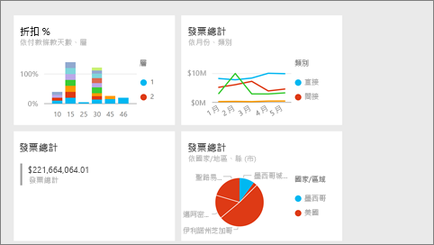
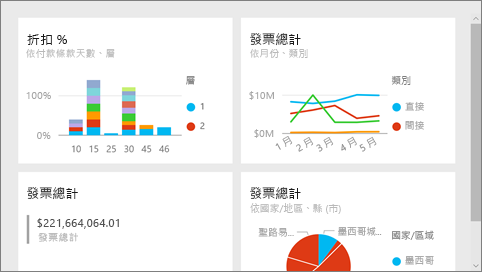

# Power BI 服務的全螢幕模式
## 什麼是全螢幕模式？

顯示您的 Power BI 內容 (儀表板、報表頁面、磚和視覺效果) 而不受功能表和導覽按鈕的干擾。  您可隨時取得內容的完整檢視，而不含其他無關項目。 這有時稱為電視模式。 全螢幕模式中可用的功能會因內容而異。 

如果您使用 Power BI 行動版，[Windows 10 行動裝置應用程式可使用全螢幕](mobile-windows-10-app-presentation-mode.md)。 Power BI Desktop 沒有適用於報表或視覺效果的全螢幕模式，但對於[關聯性檢視](desktop-report-view.md)和[報表視覺效果的焦點模式](service-focus-mode.md)具有符合一頁大小。

 

全螢幕模式的部分用法如下：

* 在會議或研討會中呈現您的儀表板、磚、視覺效果或報表
* 在辦公室的專用大螢幕或投影機上顯示
* 在小螢幕上檢視
* 以鎖定模式檢閱 -- 您可以透過觸控螢幕或用滑鼠點選磚，而不需要開啟基礎報表或儀表板

> **注意**：全螢幕模式與[焦點 (顯出) 模式](service-focus-mode.md)不同。
> 
> 

觀看 Amanda 以全螢幕模式開啟及巡覽其儀表板，然後套用一些 URL 參數以控制預設顯示。 然後遵循影片下方的逐步指示親自試試看。

<iframe width="560" height="315" src="https://www.youtube.com/embed/c31gZkyvC54" frameborder="0" allowfullscreen></iframe>

## 全螢幕模式的儀表板和報表頁面
1. 從儀表板或報表上方的 Power BI 功能表列，選取**全螢幕**圖示 。 儀表板畫布或報表頁面隨即填滿整個畫面。 下方為儀表板範例。
   
      
2. 全螢幕模式中有數個功能表選項。  若要顯示功能表，只要移動滑鼠或游標即可。 
   
     儀表板的功能表    
         
   
     報表頁面的功能表    
        
   
        
    使用 [上一頁] 按鈕可導覽至瀏覽器中的上一頁。 如果上一頁是 Power BI 頁面，則也會以全螢幕模式顯示。  全螢幕模式會持續到您關閉全螢幕為止。
   
        
    使用此按鈕可列印全螢幕模式的儀表板或報表頁面。 
   
        
    使用 [全螢幕] 按鈕可用最大的大小顯示儀表板，而無須使用捲軸。     
   
    
   
           
    有時候您會不在意捲軸，但希望儀表板能填滿整個可用空間的寬度。 選取 [符合寬度] 按鈕。    
   
    
   
           
    在全螢幕報表中，可使用這些箭頭在報表的頁面間移動。    
3. 若要結束全螢幕模式，請選取**結束全螢幕**圖示。
   
      

## 全螢幕模式的視覺效果和儀表板磚
1. 若要以全螢幕模式顯示儀表板磚和報表視覺效果，必須先使用已是[焦點模式](service-focus-mode.md)的磚或視覺效果。 
   
    
2. 然後，選取該磚或   圖示。 磚或視覺效果就會顯示為沒有功能表或導覽列的全螢幕。
   
    

## 後續步驟
[Power BI 中的儀表板](service-dashboards.md)  
[焦點模式](service-focus-mode.md)    

有其他問題嗎？ [試試 Power BI 社群](http://community.powerbi.com/)

