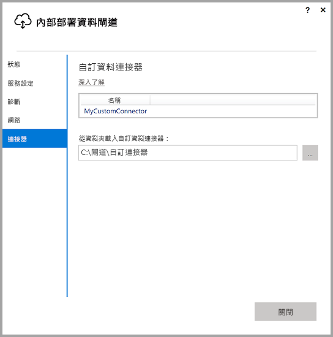
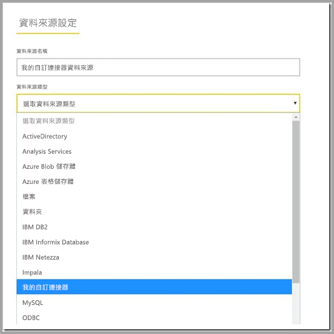

# 透過內部部署資料閘道使用自訂資料連接器

適用於 Power BI 的資料連接器可讓您連接並存取應用程式、服務或資料來源中的資料。 您可以在 Power BI Desktop 中開發並使用自訂資料連接器。

若要深入了解如何為 Power BI 開發自訂資料連接器，請參閱[這裡](http://aka.ms/dataconnectors)的文件。

當您在 Power BI Desktop 中建立使用自訂資料連接器的報表時，您可以使用內部部署資料閘道從 Power BI 服務重新整理這些報表。

## 以下是有關如何啟用及使用這項功能的指南

當您安裝 2018 年 7 月版或更新版本的內部部署資料閘道時，您可能會在設定程式中看到 [連接器] 索引標籤，以及可供您選擇要從中載入自訂連接器之資料夾的選項。 請務必選取執行閘道服務的使用者可存取的資料夾 (預設為 “NT SERVICE\PBIEgwService”)。 閘道會自動載入位於該資料夾中的自訂連接器檔案，而且您應該會在資料連接器清單中看到這些檔案。

如果您使用個人版的內部部署資料閘道，您此時應該能夠將 Power BI 報表上傳至 Power BI 服務，並使用閘道將它重新整理。

若是企業版的閘道，您仍需為自訂連接器建立資料來源。 在 Power BI 服務的閘道設定頁面中，當您選取閘道叢集以允許透過此叢集使用自訂連接器時，您應該會看到新的選項。 確定叢集中的所有閘道都有 2018 年 7 月更新版或更新版本，才能使用此選項。 現在，選取該選項以允許透過此叢集使用自訂連接器。

啟用此選項時，您的自訂連接器現在會顯示為可在此閘道叢集下建立的可用資料來源。 在您使用新的自訂連接器建立資料來源之後，您現在可以在 Power BI 服務中使用該自訂連接器來重新整理 Power BI 報表。

## 考量與限制

* 請確定您所建立的資料夾可供背景閘道服務存取。 一般而言，無法存取您使用者的 Windows 資料夾或系統資料夾下的資料夾。 如果無法存取資料夾，閘道設定程式會顯示一則訊息 (這不適用於個人版的閘道)
* 若要讓自訂連接器可以透過內部部署資料閘道運作，這些連接器需要實作自訂連接器程式碼中的 “TestConnection” 區段。 當透過 Power BI Desktop 使用自訂連接器時，則不需要此區段。 基於此原因，您可以有一個可透過 Desktop 運作但無法透過閘道運作的連接器。 請參閱[此文件](https://github.com/Microsoft/DataConnectors/blob/master/docs/m-extensions.md#implementing-testconnection-for-gateway-support)以了解如何實作 TestConnection 區段。
* 不支援使用 OAuth 驗證的自訂連接器。
* 不支援使用 Direct Query 的自訂連接器。

## 後續步驟

* [管理您的資料來源─Analysis Services](service-gateway-enterprise-manage-ssas.md)  
* [管理您的資料來源 - SAP HANA](service-gateway-enterprise-manage-sap.md)  
* [管理您的資料來源 - SQL Server](service-gateway-enterprise-manage-sql.md)  
* [管理您的資料來源 - Oracle](service-gateway-onprem-manage-oracle.md)  
* [管理您的資料來源 - 匯入/已排程的重新整理](service-gateway-enterprise-manage-scheduled-refresh.md)  
* [內部部署資料閘道 - 深入資訊](service-gateway-onprem-indepth.md)  
* [內部部署資料閘道 (個人模式)](service-gateway-personal-mode.md)
* [設定內部部署資料閘道的 Proxy 設定](service-gateway-proxy.md)  
* [使用 Kerberos 以從 Power BI 單一登入 (SSO) 到內部部署資料來源](service-gateway-kerberos-for-sso-pbi-to-on-premises-data.md)  

有其他問題嗎？ [試試 Power BI 社群](http://community.powerbi.com/)
