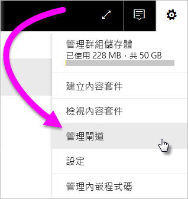
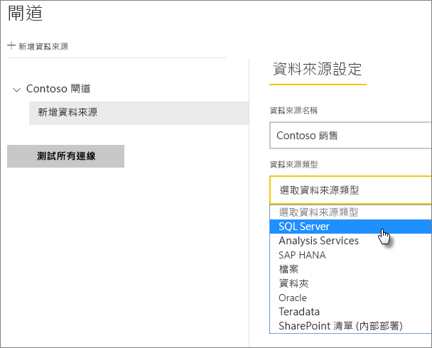
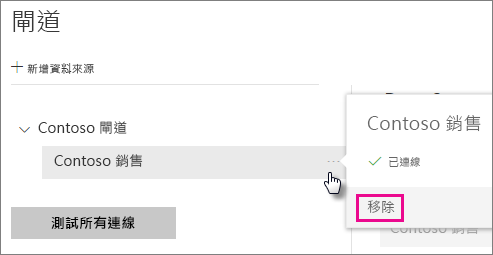

# 管理資料來源

[!INCLUDE [gateway-rewrite](includes/gateway-rewrite.md)]

Power BI 支援許多的內部部署資料來源，而且各有自己的需求。 閘道可以用於單一資料來源或多個資料來源。 在本範例中，我們將示範如何將 SQL Server 新增為資料來源，但其他資料來源的步驟類似。

>[!NOTE]
>您也可以使用 API 來執行大部分的資料來源管理作業。 如需詳細資訊，請參閱 [Rest API (閘道)](/rest/api/power-bi/gateways)。

## 加入資料來源

>[!NOTE]
>您無法新增未有電子郵件的群組。

1. 在 Power BI 服務的右上角，選取齒輪圖示  > [管理閘道]  。

    

2. 選取閘道 > [加入資料來源]  ，或移至閘道 > [加入資料來源]  。

    

3. 選取 [資料來源類型]  。

    

4. 輸入資料來源的資訊。 在本範例中，輸入的資訊有**伺服器**、**資料庫**和其他資訊。  

    

5. 針對 SQL Server，您應選擇 **Windows** 或**基本** (SQL 驗證) 的**驗證方法**。 如果您選擇**基本**，請輸入資料來源的認證。

6. 在 [進階設定]  下方，選擇性地為您的資料來源設定[隱私權等級](https://support.office.com/article/Privacy-levels-Power-Query-CC3EDE4D-359E-4B28-BC72-9BEE7900B540) (不適用於 [DirectQuery](desktop-directquery-about.md))。

    

7. 選取 [加入]  。 如果程序成功，您會看到 [連線成功]  。

    

您現在可以使用此資料來源，在 Power BI 儀表板和報表中包含 SQL Server 的資料。

## 移除資料來源

如果您不再使用資料來源，則可以移除它。 請注意，移除資料來源的同時也會中斷依賴該資料來源的所有儀表板和報表。

若要移除資料來源，請移至 [資料來源]，然後選取 [移除]  。

## 將資料來源用於排程的重新整理或 DirectQuery

在您建立資料來源後，便可以搭配 DirectQuery 連線或排程重新整理來使用它。

> [!NOTE]
>伺服器和資料庫名稱必須符合內部部署資料閘道內的 Power BI Desktop 和資料來源。

您資料集和閘道內的資料來源連結，是以伺服器名稱和資料庫名稱為依據。 這些名稱必須相符。 例如，若您在 Power BI Desktop 中提供 IP 位址作為伺服器名稱，則必須使用該 IP 位址作為閘道設定的資料來源。 若您在 Power BI Desktop 中使用 *SERVER\INSTANCE*，則必須使用相同項目作為閘道設定的資料來源。

若您已列入閘道內所設定資料來源的 [使用者]  索引標籤，且伺服器和資料庫名稱相符，即會顯示可搭配使用排程重新整理的閘道選項。

> [!WARNING]
> 如果您的資料集包含多個資料來源，則每個資料來源都必須新增至閘道中。 如果有一或多個資料來源未新增至閘道，就看不到閘道可供排程的重新整理使用。

### 限制

OAuth 驗證配置僅支援使用內部部署資料閘道的自訂連接器。 您無法新增其他必須使用 OAuth 的資料來源。 如果資料集中的資料來源必須使用 OAuth ，但該資料來源不是自訂連接器，您就無法使用閘道進行排程的重新整理。

## 管理使用者

將資料來源新增至閘道後，您可以將特定資料來源 (非整個閘道) 存取權授與使用者和具電子郵件功能的安全性群組。 資料來源使用者清單能夠控制可以發行報表的人員，且這些報表可以包含來自資料來源的資料。 報表擁有者可以建立儀表板、內容套件和應用程式，然後與其他使用者共用。

您也可以授與使用者和安全性群組對閘道的管理存取權。

### 將使用者加入至資料來源

1. 在 Power BI 服務的右上角，選取齒輪圖示  > [管理閘道]  。

2. 選取您想加入使用者的資料來源。

3. 選取 [使用者]  ，然後輸入組織中您想要授與所選取資料來源存取權的使用者。 例如，在下列畫面中，您要新增 Maggie 和 Adam。

    ![[使用者] 索引標籤](media/service-gateway-data-sources/users-tab.png)

4. 選取 [新增]  ，新增的成員會顯示在方塊中。

    

就是這麼簡單。 請注意，您必須將使用者新增至您要授與存取權的每個資料來源。 每個資料來源都有不同的使用者清單，而且您必須分別將使用者新增至每個資料來源。

### 從資料來源中移除使用者

您可以在 [使用者]  索引標籤上，為資料來源移除使用這個資料來源的使用者或安全性群組。

## 在雲端中儲存加密的認證

當您在閘道中加入資料來源時，您必須提供該資料來源的認證。 資料來源的所有查詢都會使用這些認證來執行。 系統會使用對稱式加密安全地加密這些認證，因此在儲存到雲端之前，都無法在雲端中解密。 系統會將認證傳送至執行閘道的內部部署電腦，並在存取資料來源時解密。

## 可用的資料來源類型清單

內部部署資料閘道支援下列 Power BI 資料來源。 除了內部部署資料來源以外，防火牆、VPN 或虛擬網路後方的來源可能也需要資料閘道。

| **資料來源** | **即時/DirectQuery** | **使用者設定的手動或排程重新整理** |
| --- | --- | --- |
| ActiveDirectory |否 |是 |
| Amazon Redshift |是 |是 |
| Analysis Services |是 |是 |
| AtScale Cube |是 |是 |
| Azure Blob 儲存體 |否 |是 |
| Azure DevOps Server |否 |是 |
| Azure 表格儲存體 |否 |是 |
| BI 連接器 |是 |是 |
| Denodo |是 |是 |
| Dremio |是 |是 |
| EmigoDataSourceConnector |否 |是 |
| Essbase |是 |是 |
| Exasol |是 |是 |
| 檔案 |否 |是 |
| 資料夾 |否 |是 |
| Paxata |否 |是 |
| IBM DB2 |是 |是 |
| IBM Informix 資料庫 |否 |是 |
| IBM Netezza |是 |是 |
| Impala |是 |是 |
| Jethro ODBC |是 |是 |
| Kyligence Enterprise |是 |是 |
| MarkLogic ODBC |是 |是 |
| Microsoft Graph 安全性 |否 |是 |
| MySQL |否 |是 |
| ODBC |否 |是 |
| OData |否 |是 |
| OleDb |否 |是 |
| Oracle |是 |是 |
| PostgreSQL |否 |是 |
| QubolePresto |是 |是 |
| Quick Base Connector |否 |是 |
| SAP Business Warehouse 訊息伺服器 |是 |是 |
| SAP Business Warehouse 伺服器 |是 |是 |
| SAP HANA |是 |是 |
| SQL Server |是 |是 |
| SharePoint |否 |是 |
| Snowflake |是 |是 |
| Spark |是 |是 |
| SurveyMonkey |否 |是 |
| Sybase |否 |是 |
| TeamDesk.Database |否 |是 |
| Teradata |是 |是 |
| Vertica |是 |是 |
| Web |否 |是 |
| Workforce Dimensions |否 |是 |

## 後續步驟

* [管理您的資料來源─Analysis Services](service-gateway-enterprise-manage-ssas.md)
* [管理您的資料來源 - SAP HANA](service-gateway-enterprise-manage-sap.md)
* [管理您的資料來源 - SQL Server](service-gateway-enterprise-manage-sql.md)
* [管理您的資料來源 - Oracle](service-gateway-onprem-manage-oracle.md)
* [管理您的資料來源 - 匯入/排程重新整理](service-gateway-enterprise-manage-scheduled-refresh.md)
* [部署資料閘道的指引](service-gateway-deployment-guidance.md)

有其他問題嗎？ [試試 Power BI 社群](http://community.powerbi.com/)
