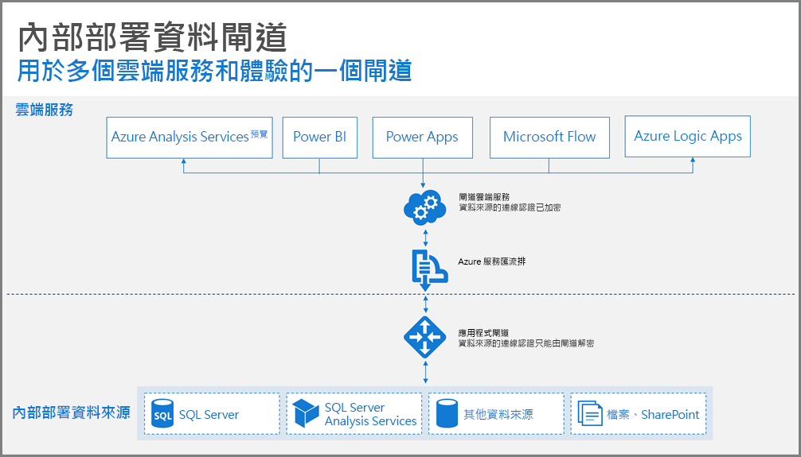
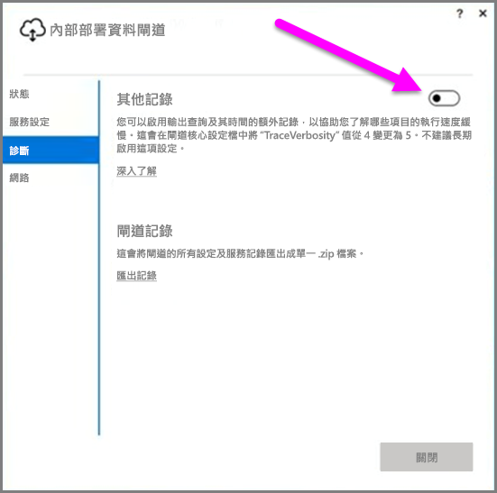
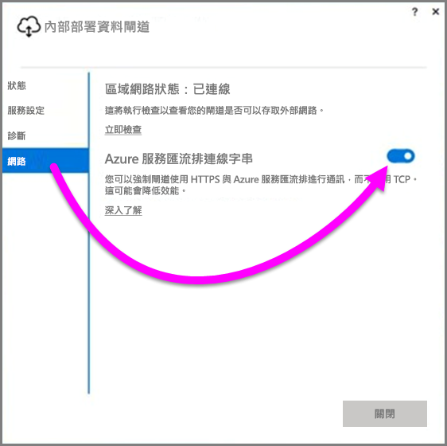
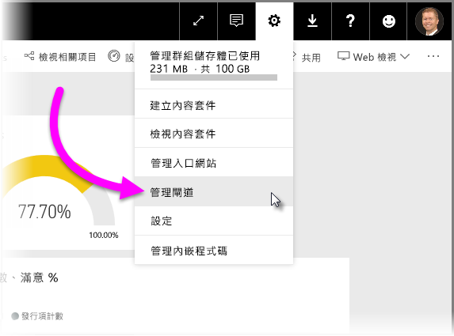

# 部署 Power BI 之資料閘道的指引
本文提供在網路環境中部署資料閘道的指引和考量。 **閘道**是一種軟體，可針對雲端服務中的後續使用 (例如 Power BI)，方便存取私用內部部署網路上的資料。 本文會引導您完成部署，並提供**內部部署資料閘道**安裝的指引。

如需**內部部署資料閘道**的詳細資訊 (包括其安裝連結)，請查看[部落格文章](https://powerbi.microsoft.com/blog/power-bi-gateways-march-update/)。

## 內部部署資料閘道的安裝考量
太過深入安裝和部署詳細資料之前，有幾個考量必須謹記在心。 下列各節描述要謹記在心的重要事項。

### 使用者數目
使用利用閘道之報表的使用者數目是決定在何處安裝閘道的重要度量。 以下是要考慮的一些問題：

* 使用者會在每天的不同時間使用這些報表嗎？
* 他們正在使用的連接類型 (DirectQuery 或 Import) 為何？
* 所有使用者都使用相同的報表嗎？

如果使用者都會在每天的相同時間存取指定的報表，則您會想要確定在可處理所有這些要求的電腦上安裝閘道 (請參閱下列各節，以取得可協助您判斷這個情況的效能計數器和最低需求)。

**Power BI** 中有一個「報表」只允許「一個」閘道的條件約束；因此，即使報表是根據多個資料來源，所有這類資料來源還是必須經過單一閘道。 不過，如果儀表板根據「多個」報表，您可以針對每個參與的報表使用專用閘道，因而將閘道負載分散到多個參與該單一儀表板的報表。

### 連線類型
**Power BI** 提供兩種類型的連接：**DirectQuery** 和 **Import**。 並非所有資料來源都支援兩種連接類型，而且有許多原因可能會導致選擇其中一個，例如安全性需求、效能、資料限制和資料模型大小。 您可以深入了解[內部部署資料閘道](service-gateway-onprem.md)一文的＜可用資料來源類型清單＞一節中的連線類型和支援的資料來源。

根據使用的連接類型，閘道使用量可能會不同。 例如，可能的話，您應該嘗試分隔 **DirectQuery** 資料來源與 [排程重新整理] 資料來源 (假設它們位於不同的報表中，而且可以予以分隔)。 在早上排程重新整理用於公司主要儀表板的大規模資料模型的同時，這樣做可避免閘道將數千個 DirectQuery 要求排入佇列中。 以下是每個所需要考量的事項：

* **排程重新整理**：根據查詢大小以及每天發生的重新整理次數，您可以選擇保持建議的最低硬體需求，或升級為更高效能的電腦。 如果未摺疊指定的查詢，就會在閘道電腦上進行轉換；因此，閘道電腦受惠於具有更多可用的 RAM。
* **DirectQuery**：每次任何使用者開啟報表或查看資料時，都會傳送查詢。 因此，如果您預期有 1,000 位以上的使用者同時存取資料，則您會想要確定電腦具有穩固且支援硬體的元件。 更多的 CPU 核心將會導致 **DirectQuery** 連接具有更佳的輸送量。

安裝**內部部署資料閘道**的電腦需求如下：

**最低：**

* .NET 4.5 Framework
* 64 位元版本的 Windows 7/Windows Server 2008 R2 (或更新版本)

**建議︰**

* 8 核心 CPU
* 8 GB 的記憶體
* 64 位元版本的 Windows 2012 R2 (或更新版本)

### 位置
閘道安裝位置可能會對查詢效能造成重大影響，因此請嘗試確定您的閘道、資料來源位置和 Power BI 租用戶盡可能彼此接近，將網路延遲降至最低。 若要判斷 Power BI 租用戶位置，請在 Power BI 服務中選取右上角的 **?** 圖示，然後選取 [關於 Power BI]。

### 監視閘道
您可以使用幾個工具來監視已安裝閘道的使用和效能。

#### 效能計數器
有許多效能計數器可以用來評估和評量閘道上發生的活動。 計數器可協助您了解您是否有特定類型的大量活動，這可能會提示您部署新的閘道。

> [!NOTE]
> 這些計數器不會擷取特定工作持續時間。
> 
> 

除了電腦的計數器之外，「閘道計數器」還會提供電腦處理多少負載，而且可以指出延伸還是超過伺服器資源能力。

這些計數器可以從 [Windows 效能監視器] 進行存取，而且可以供任何用於此用途的報告工具使用。 如需如何搭配使用閘道效能監視器與 Power BI 的詳細逐步解說，請查看下列社群建立部落格文章。

* [監視內部部署資料閘道](https://insightsquest.com/2016/08/08/monitor-on-premises-data-gateways/)

#### 記錄
設定和服務記錄會提供有關閘道發生情況的另一個維度。 因為並非所有錯誤訊息都會顯示在 Power BI 服務上，所以當您的連接未如預期運作時，請一律檢查閘道記錄。

檢視本機電腦上所有記錄檔的簡單方法，是在初始安裝完成之後，於重新開啟閘道時使用**內部部署資料閘道**上的 [匯出記錄] 按鈕，然後選取 [診斷] > [匯出記錄]。

#### 其他記錄
閘道預設會執行基本記錄。 如果您要調查閘道問題，並且需要查詢連接詳細資料的詳細資訊，則可以暫時啟用「詳細資訊記錄」收集其他記錄資訊。 若要這樣做，請在已安裝的閘道中選取 [診斷] > [其他記錄]。

根據閘道使用量，啟用此設定可能會大幅增加記錄大小。 建議您在完成記錄檢閱之後，停用 [其他記錄]。 不建議在正常閘道使用量期間啟用這項設定。

#### 網路設定
閘道會建立 **Azure 服務匯流排**的輸出連接。 閘道會在下列輸出連接埠上進行通訊：

* TCP 443 (預設)
* 5671
* 5672
* 9350 到 9354

閘道「不」需要輸入連接埠。 所有必要連接埠都會列在上面的清單中。

建議您將您資料區域的 IP 位址加入防火牆的允許清單中。 您可以下載 [Microsoft Azure Datacenter IP 清單](https://www.microsoft.com/download/details.aspx?id=41653)中的 IP 位址清單。 此清單會每週更新。 閘道會使用指定的 IP 位址及完整網域名稱 (FQDN) 來與 **Azure 服務匯流排**通訊。 如果您強制閘道使用 HTTPS 進行通訊，閘道會嚴格只使用 FQDN，使用 IP 位址則不會發生通訊。

#### 強制與 Azure 服務匯流排進行 HTTPS 通訊
您可以強制閘道使用 HTTPS 與 **Azure 服務匯流排**進行通訊，而不使用直接 TCP。 這樣做將會稍微降低效能。 您也可以使用閘道使用者介面，強制閘道使用 HTTPS 與 **Azure 服務匯流排**進行通訊 (從閘道的 2017 年 3 月版開始)。

若要這樣做，請在閘道中選取 [網路]，然後將 [Azure 服務匯流排連線模式] 設為 [開啟]。

### 其他指引
本節提供部署和管理閘道的其他指引。

* 請避免單一失敗點。 可能的話，請將您的內部部署資料來源分散到數個閘道。在此情況下，如果有一部電腦無法使用，您仍然可以重新整理資料各部分，並不會完全遺失該功能。
* 閘道不能安裝在網域控制站上，因此不會規劃或嘗試這麼做。
* 不要在可能關機、進入睡眠模式或未連線到網際網路的電腦 (例如膝上型電腦) 上安裝閘道，因為閘道無法在所有這些情況下執行。
* 避免在無線網路上安裝閘道，因為透過無線網路可能會降低效能。

#### 閘道復原
您可以使用**修復金鑰**來復原現有閘道，或將它移至新的電腦。 修復金鑰是提供給安裝閘道的使用者使用，稍後「無法」進行變更。 修復金鑰同時用於資料加密和閘道復原。

若要復原閘道，請確定您是閘道管理員、確定您知道閘道名稱、確定您有正確的修復金鑰，以及您有新的電腦可提供類似的效能特性。

在您登入之後，請選取 [Migrate an existing gateway]\(移轉現有閘道) 選項。 接下來，您需要選擇想要復原或移轉的閘道，最後提供修復金鑰，並點擊 [設定]。 完成該步驟之後，新的閘道將會取代舊的閘道，而且新的閘道將會繼承其名稱以及所有先前設定的資料來源。 所有資料來源現在都會經過新的電腦，而不需要重新發佈任何項目。 尚未支援自動容錯移轉，但它是閘道小組主動考量的功能。

#### 管理員
您可以在 **Power BI 服務**中找到閘道管理員清單。 登入 **Power BI** 服務時，請選取 [設定]&nbsp;(齒輪圖示) > [管理閘道] > [閘道 UI]。  

從該處，您可以選取閘道，並查看閘道管理員清單。 列出的管理員可以存取、復原和刪除閘道。 它們也可以新增和刪除閘道中的資料來源。 若要確保組織中的所有管理員都可以存取其群組中的所有閘道，則建議進行下列動作：

* 建立 **AAD** 安全群組並在其中新增其他使用者，然後將此安全性群組新增至個別閘道管理員清單。 這確保有多個人可以在閘道故障時或您需要復原或移轉閘道時存取閘道。 這也可讓其他管理員檢視其群組中所使用的閘道以及每個閘道上的資料來源。

## 後續步驟
[設定 Proxy 設定](service-gateway-proxy.md)  
[為內部部署資料閘道進行疑難排解](service-gateway-onprem-tshoot.md)  
[內部部署資料閘道常見問題集](service-gateway-onprem-faq.md)  

有其他問題嗎？ [試試 Power BI 社群](http://community.powerbi.com/)

