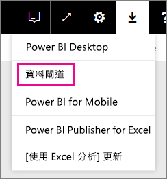

# 管理您的 SAP HANA 資料來源
安裝內部部署資料閘道之後，您必須新增可搭配閘道使用的資料來源。 本文將探討如何使用閘道和資料來源。 您可以針對已排程的重新整理或 DirectQuery，使用 SAP HANA 資料來源。

## 下載並安裝閘道
您可以從 Power BI 服務下載閘道。 選取 [下載] > [資料閘道]，或移至 [gateway download page (閘道下載頁面)](https://go.microsoft.com/fwlink/?LinkId=698861)。

## 加入閘道
若要新增閘道，請直接將閘道[下載](https://go.microsoft.com/fwlink/?LinkId=698861)並安裝到您環境中的伺服器上。 安裝閘道之後，它會顯示在 [管理閘道] 底下的閘道清單中。

> [!NOTE]
> 您必須是至少一個閘道的管理員，才會顯示 [管理閘道]。 當以管理員身分加入閘道時，或者當您安裝並設定閘道時，就會發生這種情況。
> 
> 

## 移除閘道器
移除閘道器的同時也會刪除該閘道器下的所有資料來源。  這也會中斷依賴這些資料來源的任何儀表板和報表。

1. 選取右上角的齒輪圖示 > [管理閘道] 。
2. [閘道] > [移除]
   
   

## 加入資料來源
您可以選取閘道並按一下 [加入資料來源]，或移至 [閘道] > [加入資料來源] ，以加入資料來源。

您可以接著從清單中選取 [資料來源類型]  。

您接著需要填入資料來源的資訊，包括 **伺服器**、 **使用者名稱** 和 **密碼**。

> [!NOTE]
> 資料來源的所有查詢都會使用這些認證來執行。 如需詳細資訊，請參閱主要的內部部署資料閘道文章，以深入了解[認證](service-gateway-onprem.md#credentials)的儲存方式。
> 
> 

您可以在填入所有內容之後，按一下 [加入]  。  您現在可以使用此資料來源，針對內部部署的 SAP HANA 伺服器，用於已排程的重新整理或 DirectQuery。 如果成功，您會看到 [連接成功]  。

### 進階設定
您可以設定資料來源的隱私權等級， 如此可控制如何混搭資料。 這只能用於已排程的重新整理。 不適用於 DirectQuery。 [深入了解](https://support.office.com/article/Privacy-levels-Power-Query-CC3EDE4D-359E-4B28-BC72-9BEE7900B540)

## 移除資料來源
移除資料來源的同時也會中斷依賴指定資料來源的所有儀表板或報表。  

若要移除資料來源，請前往 [資料來源] > [移除]。

## 管理管理員
在閘道的 [管理員] 索引標籤上，您可以新增並移除可管理閘道的使用者 (或安全性群組)。

## 管理使用者
您可以在 [使用者] 索引標籤上，針對資料來源加入並移除可以使用這個資料來源的使用者或安全性群組。

> [!NOTE]
> 使用者清單僅控制獲准發行報表的人員。 報表擁有者可以建立儀表板或內容套件，並與其他使用者共用。
> 
> 

## 使用資料來源
建立資料來源之後，您將可使用其中一個 DirectQuery 連接或透過已排程的重新整理，以取得資料來源。

> [!NOTE]
> 伺服器和資料庫名稱必須符合內部部署資料閘道內的 Power BI Desktop 和資料來源！
> 
> 

您的資料集和閘道內的資料來源是根據您的伺服器名稱和資料庫名稱以建立連結。 這些項目必須相符。 例如，若您的伺服器名稱是 IP 位址，在 Power BI Desktop 內，您將必須使用該 IP 位址以取得閘道設定內的資料來源。 若您使用 *SERVER\INSTANCE*，在 Power BI Desktop 中，您將必須使用相同的伺服器名稱以取得閘道內設定的資料來源。

這適用於 DirectQuery 和已排程的重新整理。

### 使用 DirectQuery 連接來使用資料來源
您必須確定伺服器和資料庫名稱與 Power BI Desktop 及閘道已設定的資料來源相符。 您也必須確定資料來源的 **使用者** 索引標籤已列出您的使用者，以便發行 DirectQuery 資料集。 當您第一次匯入資料時，Power BI Desktop 內會出現 DirectQuery 的選取項目。 [深入了解](desktop-use-directquery.md)

發行之後，您的報表會從 Power BI Desktop 或**取得資料**開始工作。 建立閘道內的資料來源之後，可能需要幾分鐘的時間才能使用連線。

### 使用已排程的重新整理使用資料來源
若閘道內設定資料來源的 [使用者] 索引標籤中列出您的使用者，而伺服器和資料庫名稱也相符，您就可以將閘道作為進行已排程重新整理的一個選項。

## 後續步驟
[內部部署資料閘道](service-gateway-onprem.md)  
[內部部署資料閘道 - 深入資訊](service-gateway-onprem-indepth.md)  
[為內部部署資料閘道進行疑難排解](service-gateway-onprem-tshoot.md)  
有其他問題嗎？ [試試 Power BI 社群](http://community.powerbi.com/)

