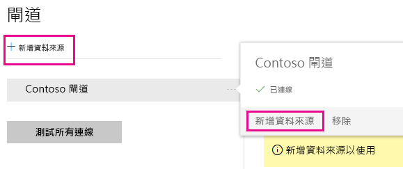
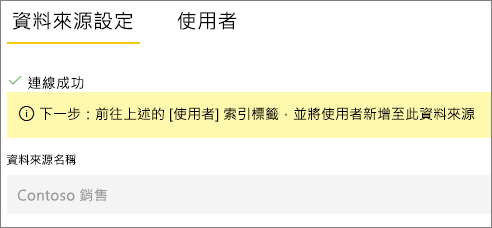
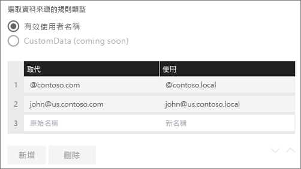
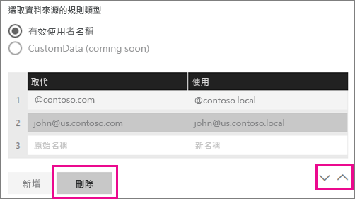
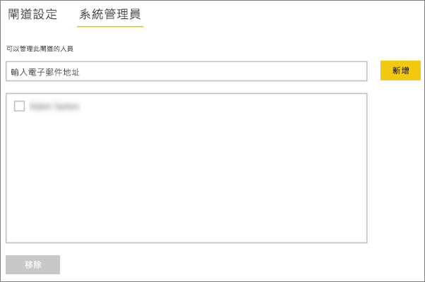
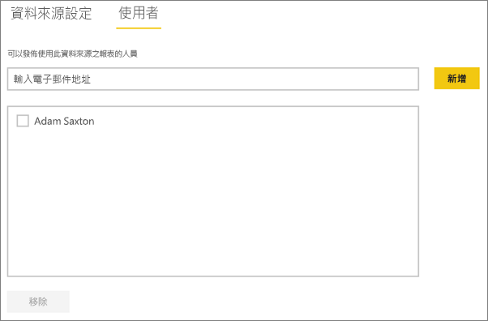

# <a name="manage-your-data-source---analysis-services"></a>管理您的資料來源─Analysis Services
安裝內部部署資料閘道之後，您必須新增可搭配閘道使用的資料來源。 本文將探討如何使用閘道和資料來源。 您可以針對已排程的重新整理或即時連線，使用 Analysis Services 資料來源。

<iframe width="560" height="315" src="https://www.youtube.com/embed/ownIGbcRAAU" frameborder="0" allowfullscreen></iframe>

## <a name="download-and-install-the-gateway"></a>下載並安裝閘道
您可以從 Power BI 服務下載閘道。 選取 [下載] > [資料閘道]，或移至 [&#91;gateway download page&#93; &#40;閘道下載頁面&#41;](https://go.microsoft.com/fwlink/?LinkId=698861)。


## <a name="limitations-of-analysis-services-live-connections"></a>Analysis Services 即時連線的限制
您可以使用即時連線針對表格式或多維度執行個體。

| **伺服器版本** | **必要的 SKU** |
| --- | --- |
| 2012 SP1 CU4 或更新版本 |商業智慧和企業版 SKU |
| 2014 |商業智慧和企業版 SKU |
| 2016 |標準 SKU 或更高版本 |

* 不支援資料格層級格式化與轉譯功能。
* 動作和命名集不會公開至 Power BI，但您仍然可以連接至同樣包含動作或命名集的多維度 Cube，然後建立視覺效果和報表。

## <a name="add-a-gateway"></a>加入閘道
若要新增閘道，只要[下載](https://go.microsoft.com/fwlink/?LinkId=698861)閘道並在您環境中的伺服器即可。 安裝閘道之後，它會顯示在 [管理閘道] 底下的閘道清單中。

> [!NOTE]
> 您必須是至少一個閘道的管理員，才會顯示 [管理閘道]。 當以管理員身分加入閘道時，或者當您安裝並設定閘道時，就會發生這種情況。
> 
> 

## <a name="remove-a-gateway"></a>移除閘道器
移除閘道器的同時也會刪除該閘道器下的所有資料來源。  這也會中斷依賴這些資料來源的任何儀表板和報表。

1. 選取右上角的齒輪圖示 > [管理閘道] 。
2. [閘道] > [移除]

   

## <a name="add-a-data-source"></a>加入資料來源
您可以選取閘道並按一下 [加入資料來源]，或移至 [閘道] > [加入資料來源] ，以加入資料來源。



您可以接著從清單中選取 [資料來源類型]  。 如果您連接到多維度或表格式伺服器，請選取 [Analysis Services]。


您接著需要填入資料來源的資訊，包括 **伺服器** 和 **資料庫**。  

閘道器將使用您輸入的 **使用者名稱** 和 **密碼** 連接到 Analysis Services 執行個體。

> [!NOTE]
> 您輸入的 Windows 帳戶，必須擁有您所連接執行個體的伺服器系統管理員權限。 如果此帳號的密碼設有期限，在密碼未針對資料來源更新的情況下，使用者就會收到連接錯誤。 如需詳細資訊，請參閱主要的內部部署資料閘道文章，以深入了解[認證](service-gateway-onprem.md#credentials)的儲存方式。
> 
> 


您可以在填入所有內容之後，按一下 [加入]  。  您現在可以使用此資料來源，針對內部部署的 Analysis Services 執行個體，用於已排程的重新整理或即時連線。  如果成功，您會看到「連接成功」  。



### <a name="advanced-settings"></a>進階設定
您可以設定資料來源的隱私權等級， 如此可控制如何混搭資料。 這只能用於已排程的重新整理。 不適用於即時連線。 [深入了解](https://support.office.com/article/Privacy-levels-Power-Query-CC3EDE4D-359E-4B28-BC72-9BEE7900B540)


## <a name="usernames-with-analysis-services"></a>Analysis Services 與使用者名稱
每次使用者和連接至 Analysis Services 的報表互動時，會將有效使用者名稱傳遞至閘道器，然後傳到內部部署 Analysis Services 伺服器。 您用以登入 Power BI 的電子郵件地址即為當作有效使用者傳遞給 Analysis Services 的內容。 傳遞此內容時是使用連接屬性 [EffectiveUserName](https://msdn.microsoft.com/library/dn140245.aspx#bkmk_auth)。 此電子郵件地址應符合本機 Active Directory 網域內定義的 UPN。 UPN 是 Active Directory 帳戶的屬性。 接著，該 Windows 帳戶就必須出現於 Analysis Services 角色中。 如果找不到任何相符項目，Active Directory 的登入即失敗。 [深入了解](https://msdn.microsoft.com/library/ms677605.aspx)

您也可以將您的 Power BI 登入名稱與本機目錄 UPN 對應。 [深入了解](service-gateway-enterprise-manage-ssas.md#map-user-names)

<iframe width="560" height="315" src="https://www.youtube.com/embed/Qb5EEjkHoLg" frameborder="0" allowfullscreen></iframe>

### <a name="how-do-i-tell-what-my-upn-is"></a>如何判斷我的 UPN 為何？
您可能不知道您的 UPN 為何，且您可能不是網域系統管理員。 您可以從工作站使用下列命令來查明您帳戶的 UPN。

    whoami /upn

結果看起來類似電子郵件地址，但這是您網域帳戶上的 UPN。 如果您使用 Analysis Services 資料來源進行即時連線，而且如果這不符合您登入 Power BI 的電子郵件地址，您可能想要看看如何[對應使用者名稱](#map-user-names)。

## <a name="map-user-names"></a>對應使用者名稱
<iframe width="560" height="315" src="https://www.youtube.com/embed/eATPS-c7YRU" frameborder="0" allowfullscreen></iframe>

您可以使用兩種不同的方式對應 Analysis Services 的使用者名稱：

1. 手動使用者重新對應 
2. 可將 AAD UPN 重新對應至 Active Directory 使用者的內部部署 Active Directory 屬性查閱 (AD 查閱對應)

雖然可以使用第二種方法執行手動對應，但是這麼做十分耗時且很難維護；在模式比對不足時特別困難，例如，AAD 與內部部署 AD 之間的網域名稱不同時，或 AAD 與 AD 之間的使用者帳戶名稱不同時。 因此，不建議使用第二種方法進行手動對應。

我們將在下列兩節依序描述這兩種方法。

### <a name="manual-user-name-re-mapping"></a>手動使用者名稱重新對應
針對 Analysis Services 資料來源，您可以設定自訂使用者主題名稱 (UPN) 規則。 如果您的 Power BI 服務登入名稱不符合您的本機目錄 UPN，可以使用這個方式解決。 例如，若您使用 john@contoso.com 登入 Power BI，但您的本機目錄 UPN 為 john@contoso.local，您可以設定對應規則以將 john@contoso.local 傳遞到 Analysis Services。

若要前往 UPN 對應畫面，請執行步驟。

1. 移至**齒輪圖示**，然後選取 [管理閘道]。
2. 請展開包含 Analysis Services 資料來源的閘道。 或者，若您尚未建立 Analysis Services 資料來源，可以暫時先這麼做。
3. 請選取資料來源，然後選取 [使用者] 索引標籤。
4. 請選取 [對應使用者名稱]。

    

然後，您會看到加入規則及測試指定使用者的選項。

> [!NOTE]
> 您可能會不小心變更無意更動的使用者。 例如，如果您的**取代 (原始值)** 是 @contoso.com，而您的**使用 (新名稱)** 是 @contoso.local，之後 @contoso.local 將會取代所有登入包含 @contoso.com 的使用者。 此外，如果您的**代替 (原始名稱)** 為 dave@contoso.com，而您的**使用 (新名稱)** 為 dave@contoso.local，具有 v-dave@contoso.com登入的使用者會作為 v-dave@contoso.local 傳送。

### <a name="ad-lookup-mapping"></a>AD 查閱對應
若要執行內部部署 AD 屬性查閱以將 AAD UPN 重新對應至 Active Directory 使用者，請遵循本節中的步驟。 若要開始，請檢閱這項作業的運作方式。

在 [Power BI 服務] 中，發生下列情況：

- 針對 Power BI AAD 使用者對內部部署 SSAS 伺服器的每個查詢，會一起傳遞 UPN 字串，例如：firstName.lastName@contoso.com

> [!NOTE]
> 將使用者名稱字串傳送至內部部署資料閘道「之前」，仍然會套用 Power BI 資料來源設定中所定義的任何手動 UPN 使用者對應。
> 
> 

在具有可設定自訂使用者對應的內部部署資料閘道上，執行下列動作：

1. 尋找要搜尋的 Active Directory (自動或可設定)
2. 透過 **Power BI 服務**根據連入的 UPN 字串 (“firstName.lastName@contoso.com”) 來查閱 AD 人員屬性 (例如 Email)。
3. 如果 AD 查閱失敗，則會嘗試使用一起傳遞的 UPN 作為 SSAS 的 EffectiveUser。
4. 如果 AD 查閱成功，則會擷取該 AD 人員的 *UserPrincipalName*。 
5. 它會將 *UserPrincipalName* 電子郵件傳遞為 SSAS 的 EffectiveUser，例如：Alias@corp.on-prem.contoso

如何設定您的閘道執行 AD 查閱：

1. 下載並安裝最新閘道

2. 在閘道中，您需要使用網域帳戶 (而非本機服務帳戶；否則 AD 查閱將無法在執行階段正常運作) 來變更要執行的**內部部署資料閘道服務**。 您必須重新啟動閘道服務，變更才會生效。  前往您電腦上的閘道應用程式 (搜尋 “on-premises data gateway” 或「內部部署資料閘道」)。 若要這樣做，請移至 [服務設定] > [變更服務帳戶]。 除非您想要改為建立新的閘道，否則請確定您有此閘道的修復金鑰，因為您必須在相同的電腦上才能進行還原。 

3. 以系統管理員身分巡覽至閘道的安裝資料夾 *C:\Program Files\On-premises data gateway*，確認您具有寫入權限，並編輯下列檔案： Microsoft.PowerBI.DataMovement.Pipeline.GatewayCore.dll.config 

4. 根據「您」 AD 使用者的 Active Directory 屬性設定，編輯下列兩個設定值。 下面所示的設定值只是範例，而您必須根據 Active Directory 設定來指定它們。 這些設定會區分大小寫，因此請確定它們符合 Active Directory 中的值。

    

    如果沒有為 ADServerPath 設定提供任何值，則閘道會使用預設的通用類別目錄。 您也可以為 ADServerPath 指定多個值。 每個值都必須以分號分隔，如下列範例所示。

    ```xml
    <setting name="ADServerPath" serializeAs="String">
        <value> >GC://serverpath1; GC://serverpath2;GC://serverpath3</value>
    </setting>
    ```
    閘道會從左到右剖析 ADServerPath 的值，直到找到相符項目為止。 如果找不到相符項目，則會使用原始的 UPN。 請確定執行閘道服務 (PBIEgwService) 的帳戶對您在 ADServerPath 中指定的所有 AD 伺服器具有查詢權限。

    閘道支援兩種類型的 ADServerPath，如下列範例所示。

    **WinNT**

    ```xml
    <value="WinNT://usa.domain.corp.contoso.com,computer"/>
    ```

    **GC**

    ```xml
    <value> GC://USA.domain.com </value>
    ```

5. 重新啟動**內部部署資料閘道**服務，以讓設定變更生效。

### <a name="working-with-mapping-rules"></a>使用對應規則
若要建立對應規則，請輸入一個**原始名稱**和 **新名稱**，然後選取 [新增]。

| 欄位 | 描述 |
| --- | --- |
| 取代 (原始名稱) |您登入 Power BI 的電子郵件地址。 |
| 使用 (新名稱) |您要用來取代的值。 取代結果將會傳送至 *EffectiveUserName* 屬性，以進行 Analysis Services 連接。 |



當您在清單中選取項目時，您可以選擇使用 **V 形箭號圖示**或**刪除**項目，以進行重新排序。



### <a name="using-wildcard-"></a>使用萬用字元 (\*)
[Replace (Original name)] \(取代 (原始名稱)) 字串可以使用萬用字元。 它只能用於本身，不能搭配任何其他字串部分。 這可讓您接受所有使用者，將單一值傳遞給資料來源。 當您希望組織中的所有使用者在本機環境中使用同一使用者時，這非常有用。

### <a name="test-a-mapping-rule"></a>測試對應規則
您可以輸入**原始名稱** 值，然後選取**測試規則**，以驗證即將取代原始名稱的內容。


> [!NOTE]
> 服務需要幾分鐘才能開始使用已儲存的規則。 規則在瀏覽器中會立即生效。
> 
> 

### <a name="limitations-for-mapping-rules"></a>對應規則的限制
* 對應是針對是正在設定的特定資料來源所設計的功能。 它不是全域設定。 如果您有多個 Analysis Services 資料來源，您將必須對應每個資料來源的使用者。

## <a name="remove-a-data-source"></a>移除資料來源
移除資料來源的同時也會中斷依賴指定資料來源的所有儀表板或報表。  

若要移除資料來源，請前往 [資料來源] > [移除]。


## <a name="manage-administrators"></a>管理管理員
在閘道的 [管理員] 索引標籤上，您可以新增並移除可管理閘道的使用者 (或安全性群組)。



## <a name="manage-users"></a>管理使用者
您可以在 [使用者] 索引標籤上，為資料來源新增及移除可以使用這個資料來源的使用者或安全性群組。

> [!NOTE]
> 使用者清單僅控制獲准發行報表的人員。 報表擁有者可以建立儀表板或內容套件，並與其他使用者共用。
> 
> 



## <a name="using-the-data-source"></a>使用資料來源
建立資料來源之後，您將可使用其中一個即時連線或透過已排程的重新整理，以取得資料來源。

> [!NOTE]
> 伺服器和資料庫名稱必須符合內部部署資料閘道內的 Power BI Desktop 和資料來源！
> 
> 

您的資料集和閘道內的資料來源是根據您的伺服器名稱和資料庫名稱以建立連結。 這些項目必須相符。 例如，若您的伺服器名稱是 IP 位址，在 Power BI Desktop 內，您將必須使用該 IP 位址以取得閘道設定內的資料來源。 若您使用 SERVER\INSTANCE，在 Power BI Desktop 中，您將必須使用相同的伺服器名稱以取得閘道內設定的資料來源。

這適用於即時連線和已排程的重新整理。

### <a name="using-the-data-source-with-live-connections"></a>使用即時連線來使用資料來源
您必須確定伺服器和資料庫名稱與 Power BI Desktop 及閘道已設定的資料來源相符。 您也必須確定資料來源的 [使用者] 索引標籤已列出您的使用者，以便發行即時連線資料集。 當您第一次匯入資料時，Power BI Desktop 內會出現即時連線的選取項目。

發行之後，您的報表會從 Power BI Desktop 或**取得資料**開始工作。 建立閘道內的資料來源之後，可能需要幾分鐘的時間才能使用連線。

### <a name="using-the-data-source-with-scheduled-refresh"></a>使用已排程的重新整理使用資料來源
若閘道內設定資料來源的 [使用者] 索引標籤中列出您的使用者，而伺服器和資料庫名稱也相符，您就可以將閘道作為進行已排程重新整理的一個選項。


## <a name="next-steps"></a>後續步驟
[內部部署資料閘道](service-gateway-onprem.md)  
[內部部署資料閘道 - 深入資訊](service-gateway-onprem-indepth.md)  
[為內部部署資料閘道進行疑難排解](service-gateway-onprem-tshoot.md)  
有其他問題嗎？ [試試 Power BI 社群](http://community.powerbi.com/)

