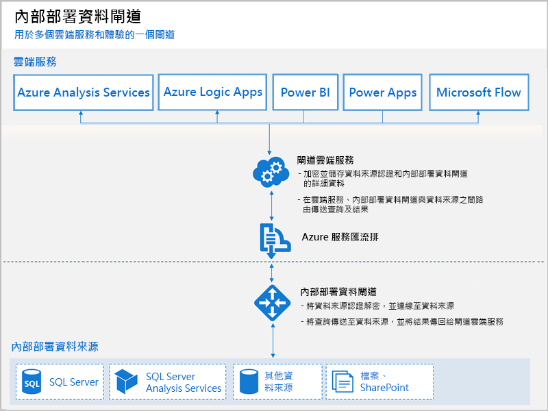

# 什麼是內部部署的資料閘道？

Power BI 閘道是您在內部部署網路中安裝的軟體，它有助於存取該網路中的資料。 它就像接聽連線要求的閘道管理員，並且只有在使用者的要求符合特定準則時才會授與它們。 這可讓組織將資料庫及其他資料來源保留在其內部部署網路中，但可以在 Power BI 報表和儀表板中安全地使用內部部署資料。

閘道可以用於單一資料來源或多個資料來源。 下圖顯示基本的檢視，其中閘道針對三個內部部署電腦處理來自雲端的要求。 我們將在稍後文章中對此詳細討論。

## 閘道類型

Power BI 分別針對不同的案例提供兩個閘道：

* **內部部署資料閘道 (個人模式)** - 可讓一位使用者連線至來源，但不能與其他人共用。 只能與 Power BI 搭配使用。 如果您是唯一建立報表的人員，且不需要與其他人共用資料來源，則非常適用此閘道。

* **內部部署資料閘道** – 允許多個使用者連線到多個內部部署資料來源。 Power BI、PowerApps、Flow、Azure Analysis Services 和 Azure Logic Apps 都可以使用它們，只需單一閘道安裝即可。 此閘道非常適合用於多人存取多個資料來源的更複雜案例。 

## 使用閘道

使用閘道有四個主要步驟：

1. 使用適當的模式在本機電腦上**安裝閘道**
2. **將使用者新增至閘道**，以便他們可以存取內部部署資料來源
3. **連線到資料來源**，以便它們可以用於報表和儀表板
4. **重新整理內部部署資料**，讓 Power BI 報表保持最新狀態

您可以安裝獨立閘道或將閘道新增到「叢集」(建議針對高可用性使用)。

## 閘道的運作方式

您安裝的閘道會作為 Windows 服務 (**內部部署資料閘道**) 執行。 此本機服務透過 Azure 服務匯流排向閘道器雲端服務註冊。 下圖顯示內部部署資料與使用閘道的雲端服務之間的流程。

查詢和資料流程：

1. 查詢是由雲端服務使用內部部署資料來源的加密認證建立。 它會傳送到佇列，以便閘道處理。
2. 閘道的雲端服務會分析該查詢，並將要求推送至 Azure 服務匯流排。 因為 Power BI 會為您管理服務匯流排，所以不需要任何額外成本或設定步驟。
3. 內部部署資料閘道會輪詢 Azure 服務匯流排，得知是否有擱置的要求。
4. 閘道收到查詢，將認證解密，並使用該認證連線到資料來源。
5. 閘道將查詢傳送到資料來源以用於執行。
6. 結果會從資料來源傳回閘道，然後傳送到雲端服務和您的伺服器。

## 後續步驟
[安裝內部部署資料閘道](service-gateway-install.md)

有其他問題嗎？ [試試 Power BI 社群](http://community.powerbi.com/)

