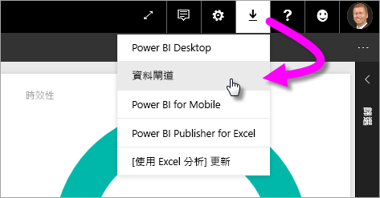
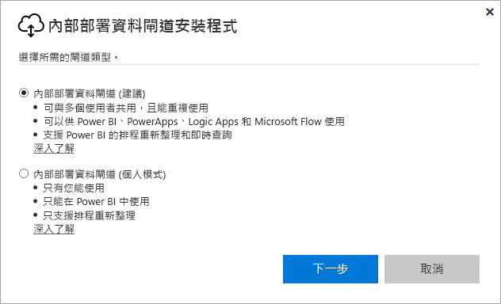
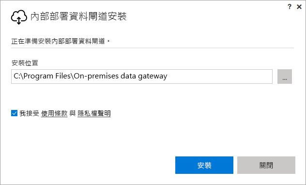
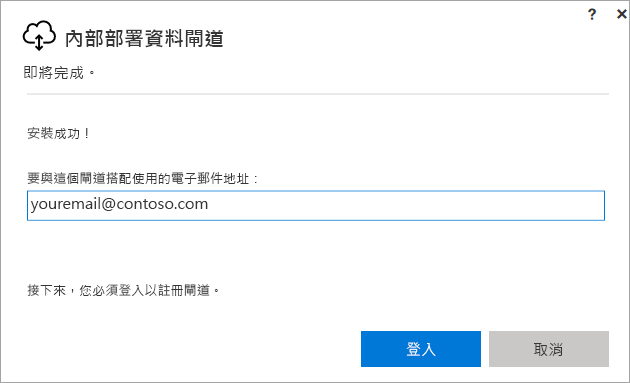
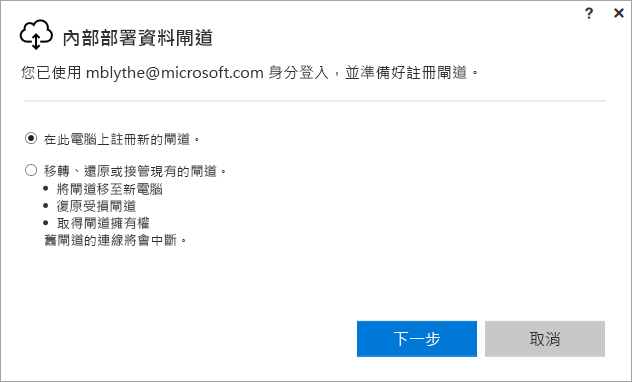
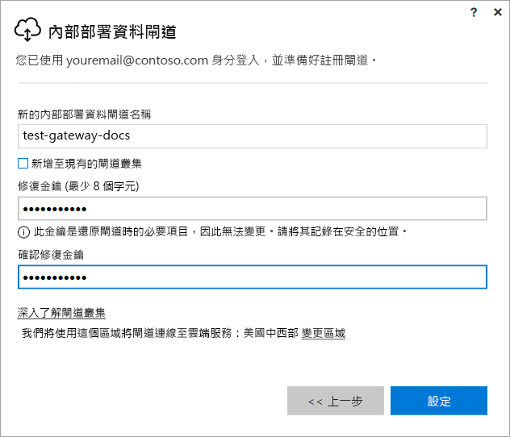
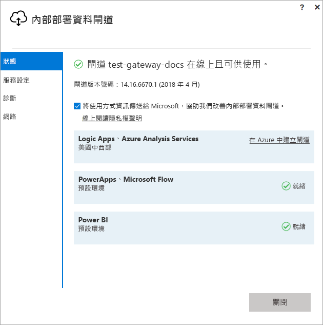
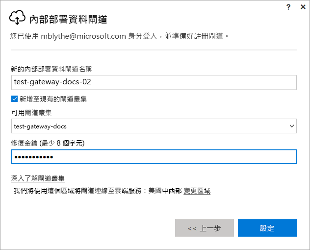

# 安裝適用於 Power BI 的閘道

Power BI 閘道是您在內部部署網路中安裝的軟體，它有助於存取該網路中的資料。 如[概觀](service-gateway-getting-started.md)中所述，您可以在個人模式或標準模式 (建議選項) 下安裝閘道。 在標準模式下，您可以安裝獨立閘道或將閘道新增到「叢集」(建議針對高可用性使用)。 在本文中，我們會為您示範如何安裝標準閘道，然後新增另一個閘道以建立叢集。

如果您尚未註冊 Power BI，請先進行[免費註冊](https://app.powerbi.com/signupredirect?pbi_source=web)再開始。

## 下載並安裝閘道器

閘道會在安裝它的電腦上執行，因此請確定您安裝在永遠開啟的電腦上。 為了取得較佳的效能和可靠性，我們建議電腦使用有線網路，而不是無線網路。

1. 在右上角的 Power BI 服務中，選取**下載圖示**  > [資料閘道]。

    

2. 在下載頁面上，選取 [下載閘道] 按鈕。

3. 選取 [下一步] 。     

    

4. 選取 [內部部署資料閘道 (建議)] > [下一步]。

    

5. 保留預設安裝路徑，並接受條款 > [安裝]。

    

6. 輸入您用來登入 Power BI 的帳戶 > [登入]。

    

    閘道與您的 Power BI 帳戶相關聯，並且您可以從 Power BI 服務中管理閘道。 您目前已登入您的帳戶。

7. 選取 [在此電腦上註冊新的閘道] > [下一步]。

    

8. 輸入閘道的名稱 (在租用戶中必須是唯一的) 及修復金鑰。 如果您想要復原或移動您的閘道，則需要此金鑰。 選取 [設定]。

    

    請注意 [新增到現有的閘道叢集] 選項。 我們將在本文的下一節中使用此選項。

9. 檢閱最後一個視窗中的資訊。 請注意，該閘道可用於 Power BI，以及 PowerApps 和流程，因為我針對這三種使用同一個帳戶。 選取 [關閉]。

    

成功安裝閘道之後，接著就可以新增另一個閘道來建立叢集。

## 新增另一個閘道來建立叢集

叢集可讓閘道系統管理員避免內部部署資料存取發生單點失敗。 如果主要閘道無法使用，資料要求會路由傳送至您所加入的第二個閘道，依此類推。 您僅可在電腦上安裝一個標準閘道，因此必須在不同的電腦上安裝叢集的第二個閘道。 這很合理，因為您需要叢集中的備援性。

高可用性閘道叢集需要 2017 年 11 月更新的內部部署資料閘道或更新版本。

1. 將閘道下載到不同的電腦，並安裝它。

2. 登入您的 Power BI 帳戶之後，註冊閘道。 選取 [新增到現有的叢集]。 在 [可用的閘道叢集] 下，選取您所安裝的第一個閘道 (「主要閘道」)，並輸入該閘道的修復金鑰。 選取 [設定]。

    

## 後續步驟

[管理 Power BI 閘道](service-gateway-manage.md)

有其他問題嗎？ [試試 Power BI 社群](http://community.powerbi.com/)