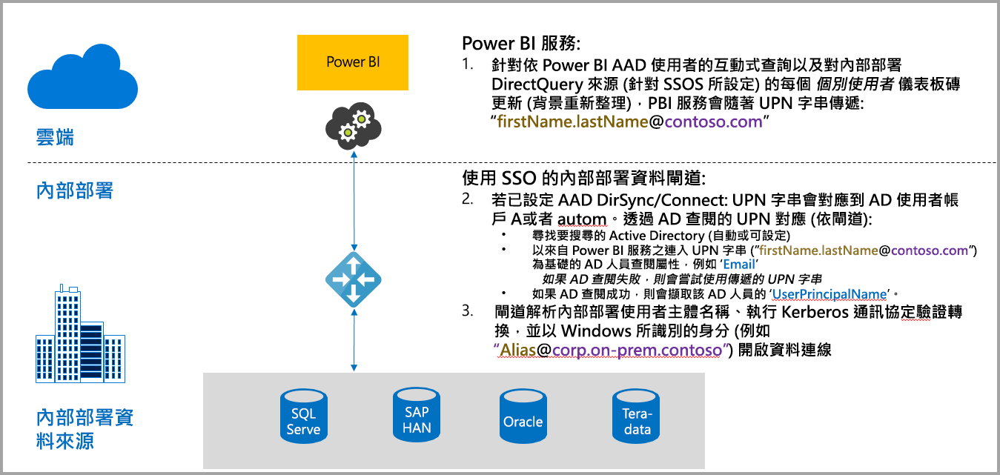
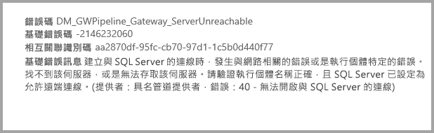
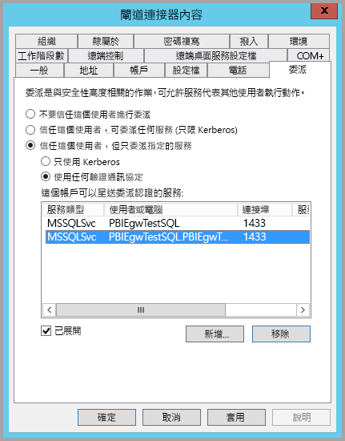
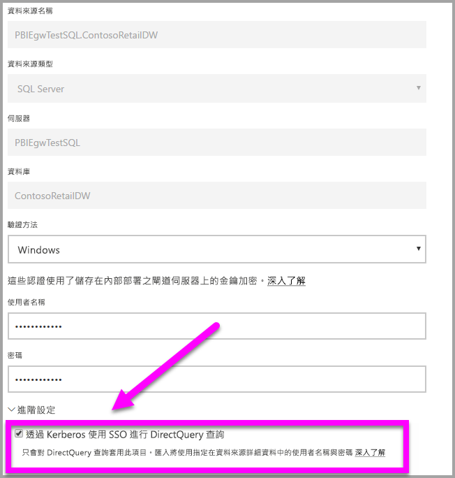
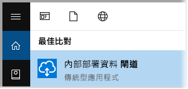
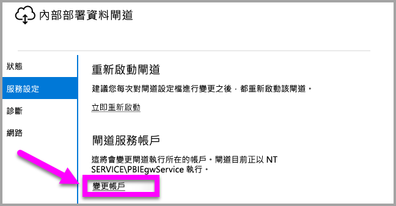

# 使用 Kerberos 以從 Power BI 單一登入 (SSO) 到內部部署資料來源
您可以藉由使用 Kerberos 來設定內部部署資料閘道，以取得順暢的單一登入連線，讓 Power BI 報表和儀表板能夠從內部部署資料進行更新。 內部部署資料閘道可以使用 DirectQuery 加速單一登入 (SSO)，DirectQuery 是用來連線至內部部署資料來源。

目前支援下列資料來源：SQL Server、SAP HANA 和 Teradata，全部都是以 [Kerberos 限制委派](https://technet.microsoft.com/library/jj553400.aspx)為基礎。

* SQL Server
* SAP HANA
* SAP BW
* Teradata

當使用者與 Power BI 服務中的 DirectQuery 報表互動時，每個交叉篩選、配量、排序和報表編輯作業可能會導致針對基礎內部部署資料來源即時執行查詢。  當單一登入針對資料來源設定時，查詢會在使用者用來與 Power BI 互動的身分識別下執行 (也就是，透過 Web 體驗或 Power BI 行動應用程式)。 因此，每個使用者會準確看到他們在基礎資料來源中擁有權限的資料 – 設定單一登入之後，不同使用者之間沒有共用的資料快取。

## 使用 SSO 執行查詢 - 發生的步驟
使用 SSO 執行的查詢包含三個步驟，如下圖所示。

> [!NOTE]
> Oracle 尚未啟用 SSO，但已在開發且很快就會推出。
> 
> 

以下是關於這些步驟的其他詳細資料：

1. 針對每個查詢，將查詢要求傳送至已設定的閘道時，**Power BI 服務**包含*使用者主體名稱*(UPN)。
2. 閘道必須將 Azure Active Directory UPN 對應至本機 Active Directory 身分識別。
   
   a.  如果已設定 AAD DirSync (也稱為「AAD Connect」)，則閘道中的對應功能會自動運作。
   
   b.  否則，閘道可以對本機 Active Directory 網域執行查閱，以查閱 Azure AD UPN 並將其對應至本機使用者。
3. 閘道服務處理程序會模擬對應的本機使用者，開啟與基礎資料庫的連線，並且傳送查詢。 閘道不需要安裝在與資料庫相同的電腦上。
   
   - 只有當閘道服務帳戶是網域帳戶 (或服務 SID)，且已為資料庫設定 Kerberos 限制委派以接受來自閘道服務帳戶的 Kerberos 票證時，使用者模擬和資料庫連接才會成功。  
   
   > [!NOTE]
   > 至於服務 SID，如果 AAD DirSync/Connect 已設定且使用者帳戶已同步處理，閘道服務不需要在執行階段執行本機 AD 查閱，而且您可以針對閘道服務使用本機服務 SID (不需要網域帳戶)。  本文件概述的 Kerberos 限制委派設定步驟都是相同的 (只是是根據服務 SID 來套用，而不是根據網域帳戶)。
   > 
   > 

> [!NOTE]
> 啟用 SAP HANA 的 SSO：
>
> - 請確定 SAP HANA 伺服器執行的是所需最低版本，這取決於 SAP Hana 伺服器的平台層級：
>     - [HANA 2 SPS 01 Rev 012.03](https://launchpad.support.sap.com/#/notes/2557386)
>     - [HANA 2 SPS 02 Rev 22](https://launchpad.support.sap.com/#/notes/2547324)
>     - [HANA 1 SP 12 Rev 122.13](https://launchpad.support.sap.com/#/notes/2528439)
>
> - 在閘道電腦上安裝最新的 SAP HANA ODBC 驅動程式。  最低版本為 2017 年 8 月的 HANA ODBC 2.00.020.00 版。
>
> 如需使用 Kerberos 設定 SAP HANA 單一登入的詳細資訊，請參閱 SAP HANA 安全性指南中的[使用 Kerberos 的單一登入](https://help.sap.com/viewer/b3ee5778bc2e4a089d3299b82ec762a7/2.0.03/en-US/1885fad82df943c2a1974f5da0eed66d.html) \(英文\) 主題和該頁面的連結，尤其是 SAP Note 1837331 – HOWTO HANA DBSSO Kerberos/Active Directory]。 
>
>

## Kerberos 設定不完整的錯誤
如果基礎資料庫伺服器和閘道未針對 **Kerberos 限制委派**正確設定，您可能會收到下列錯誤訊息：

與錯誤訊息相關聯的技術詳細資料可能如下所示：

結果就是因為 Kerberos 設定不完整，所以閘道無法正確模擬來源使用者，而且資料庫連線嘗試失敗。

## 準備 Kerberos 限制委派
必須設定數個項目，Kerberos 限制委派才能正常運作，包括服務帳戶的「服務主體名稱」(SPN) 和委派設定。

### 必要條件 1：安裝及設定內部部署資料閘道
這個內部部署資料閘道支援就地升級，以及承接現有閘道的設定。

### 必要條件 2：以網域帳戶身分執行閘道 Windows 服務
在標準安裝中，閘道是以電腦本機服務帳戶執行 (具體而言是 NT Service\PBIEgwService)，例如下圖顯示的內容：

若要啟用 **Kerberos 限制委派**，閘道必須以網域帳戶執行，除非 AAD 已與本機 Active Directory 進行同步處理 (使用 AAD DirSync/Connect)。 若要讓這項帳戶變更正確運作，您有兩個選項：

* 如果以舊版內部部署資料閘道開始，請完全依照下列文章中所述的所有五個步驟順序 (包括執行步驟 3 中的閘道設定程式)：
  
  * [將閘道服務帳戶變更為網域使用者](https://powerbi.microsoft.com/documentation/powerbi-gateway-proxy/#changing-the-gateway-service-account-to-a-domain-user)
  * 如果您已經安裝內部部署資料閘道的預覽版本，有一個直接從閘道設定程式切換到服務帳戶的新 UI 引導式方法。 請參閱本文結尾附近的**將閘道切換到網域帳戶**一節。

> [!NOTE]
> 如果 AAD DirSync/Connect 已設定且使用者帳戶已同步處理，閘道服務不需要在執行階段執行本機 AD 查閱，而且您可以針對閘道服務使用本機服務 SID (不需要網域帳戶)。 這篇文章中概述的 Kerberos 限制委派設定步驟與該設定都相同 (只要根據服務 SID 套用，而不是網域帳戶)。
> 
> 

### 必要條件 3：具備網域系統管理員權限以設定 SPN (SetSPN) 與 Kerberos 限制委派設定
雖然技術上而言網域系統管理員可以暫時或永久允許其他人有權設定 SPN 和 Kerberos 委派，而不需要網域系統管理員權限，但這不是建議的方法。 在下一節中，會詳細說明**必要條件 3** 所需的設定步驟。

## 針對閘道和資料來源設定 Kerberos 限制委派
若要正確地設定系統，我們需要設定或驗證下列兩個項目：

1. 如有需要，請設定閘道服務網域帳戶的 SPN (若尚未建立)。
2. 在閘道服務網域帳戶上設定委派設定。

請注意，您必須是網域系統管理員才能執行這兩個設定步驟。

下列各節會輪番說明這些步驟。

### 設定閘道服務帳戶的 SPN
首先，判斷 SPN 是否已經為當作閘道服務帳戶使用的網域帳戶建立，但是遵循這些步驟：

1. 以網域系統管理員身分啟動 **Active Directory 使用者和電腦**
2. 以滑鼠右鍵按一下網域，選取 [尋找]，然後鍵入閘道服務帳戶的帳戶名稱
3. 在搜尋結果中，以滑鼠右鍵按一下閘道服務帳戶，然後選取 [屬性]。
   
   * 如果 [委派] 索引標籤在 [屬性] 對話方塊中顯示，則 SPN 已建立，您可以往前跳至有關設定委派設定的下個小節。

如果 [屬性] 對話方塊上沒有 [委派] 索引標籤，您可以在該帳戶上手動建立 SPN ，這樣會新增 [委派] 索引標籤 (這是設定委派設定最簡單的方式)。 建立 SPN 可以藉由使用隨附於 Windows 的 [setspn 工具](https://technet.microsoft.com/library/cc731241.aspx)來完成 (您需要網域系統管理員權限才能建立 SPN)。

例如，假設閘道服務帳戶是 “PBIEgwTest\GatewaySvc”，執行閘道服務的電腦名稱是 **Machine1**。 若要為這個範例中電腦的閘道服務帳戶設定 SPN，您可以執行下列命令：

完成該步驟之後，我們可以繼續設定委派設定。

### 在閘道服務帳戶上進行委派設定
第二個設定需求是閘道服務帳戶上的委派設定。 您可以使用多個工具來執行這些步驟。 在本文中，我們將使用 **Active Directory 使用者和電腦**，這是 Microsoft Management Console (MMC) 嵌入式管理單元，可用來管理及發佈目錄中的資訊，預設可用於網域控制站。 您也可以透過其他電腦上的 **Windows 功能**設定來啟用它。

我們必須使用通訊協定傳輸來設定 **Kerberos 限制委派**。 使用限制委派，您必須明確了解您想要委派到哪個服務。例如，只有您的 SQL Server 或 SAP Hana 伺服器接受來自閘道服務帳戶的委派呼叫。

本節假設您已經為基礎資料來源 (例如，SQL Server、SAP HANA、Teradata 等等) 設定 SPN。 若要了解如何設定這些資料來源伺服器 SPN，請參閱個別資料庫伺服器的技術文件。 您也可以查看部落格文章，描述[*您的應用程式需要何種 SPN？*](https://blogs.msdn.microsoft.com/psssql/2010/06/23/my-kerberos-checklist/)

在下列步驟中，我們假設內部部署環境具有兩部電腦：閘道電腦和資料庫伺服器 (SQL Server Database)，為了此範例，我們也假設下列設定和名稱：

* 閘道電腦名稱：**PBIEgwTestGW**
* 閘道服務帳戶：**PBIEgwTest\GatewaySvc** (帳戶顯示名稱：閘道連接器)
* SQL Server 資料來源電腦名稱：**PBIEgwTestSQL**
* SQL Server 資料來源服務帳戶：**PBIEgwTest\SQLService**

提供這些範例名稱和設定，設定步驟如下所示：

1. 使用網域系統管理員權限，啟動 **Active Directory 使用者和電腦**。
2. 以滑鼠右鍵按一下閘道服務帳戶 (**PBIEgwTest\GatewaySvc**)，然後選取 [屬性]。
3. 選取 [委派] 索引標籤。
4. 選取 [信任這台電腦，但只委派指定的服務]。
5. 選取 [使用任何驗證通訊協定]。
6. 在 [這個帳戶可以呈送委派認證的服務:] 下，選取 [新增]。
7. 在新的對話方塊中，選取 [使用者或電腦]。
8. 輸入 SQL Server Database 服務的服務帳戶 (**PBIEgwTest\SQLService**)，然後選取 [確定]。
9. 選取您為資料庫伺服器建立的 SPN。 在我們的範例中，SPN 將會以 **MSSQLSvc** 開頭。 如果您為資料庫服務新增了 FQDN 與 NetBIOS SPN，請同時選取兩者。 您可能只會看到一個。
10. 選取 [確定] 。 您現在應該會在清單中看到 SPN。
11. 或者，您可以選取 [展開] 來顯示清單中的 FQDN 和 NetBIOS SPN。
12. 如果選取 [展開]，對話方塊如下所示。
    
    
13. 選取 [確定] 。
    
    最後，在執行閘道服務的電腦上 (在我們的範例中是 **PBIEgwTestGW**)，閘道服務帳戶必須被授與本機原則「在驗證後模擬用戶端」。 您可以使用群組原則編輯器 (**gpedit**) 來執行/驗證。
14. 在閘道電腦上執行：gpedit.msc
15. 瀏覽至 [本機電腦原則 > 電腦設定 > Windows 設定 > 安全性設定 > 本機原則 > 使用者權限指派]，如下列映像所示。
    
    
16. 從 [使用者權限指派] 底下的原則清單中，選取 [在驗證後模擬用戶端]。
    
    
    
    以滑鼠右鍵按一下並開啟 [在驗證後模擬用戶端] 的 [屬性]，然後檢查帳戶的清單。 它必須包含閘道服務帳戶 (**PBIEgwTest\GatewaySvc**)。
17. 從 [使用者權限指派] 底下的原則清單中，選取 [當成作業系統的一部分 (SeTcbPrivilege)]。 請確定閘道服務帳戶也包含在帳戶清單中。
18. 重新啟動**內部部署資料閘道**服務處理程序。

## 執行 Power BI 報表
完成本文稍早所述的所有設定步驟之後，您可以在 Power BI 中使用 [管理閘道] 分頁來設定資料來源，並在其 [進階設定] 底下啟用 SSO，然後將報表和資料集繫結發佈到該資料來源。

此設定在大部分情況下都能運作。 不過，使用 Kerberos 會有不同的設定，根據您的環境而異。 如果仍然無法載入報表，您必須連絡網域系統管理員，以便進一步調查。

## 將閘道切換到網域帳戶
稍早在本文中，我們討論了使用**內部部署資料閘道**使用者介面，從本機服務帳戶切換閘道，以便以網域帳戶執行。 以下是完成此作業所需的步驟。

1. 啟動**內部部署資料閘道**設定工具。
   
   
2. 在主要分頁上選取 [登入] 按鈕，並使用您的 Power BI 帳戶登入。
3. 登入完成之後，選取 [服務設定] 索引標籤。
4. 按一下 [變更帳戶] 以啟動引導式逐步解說，如下圖所示。
   
   

## 後續步驟
如需**內部部署資料閘道**和 **DirectQuery** 的詳細資訊，請參閱下列資源：

* [內部部署資料閘道](service-gateway-onprem.md)
* [Power BI 中的 DirectQuery](desktop-directquery-about.md)
* [DirectQuery 支援的資料來源](desktop-directquery-data-sources.md)
* [DirectQuery 和 SAP BW](desktop-directquery-sap-bw.md)
* [DirectQuery 和 SAP HANA](desktop-directquery-sap-hana.md)

