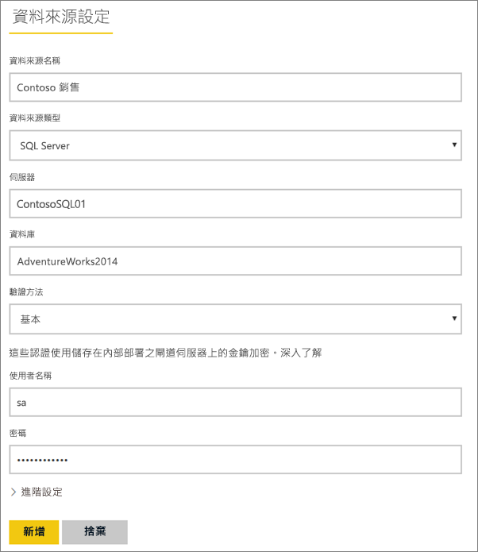
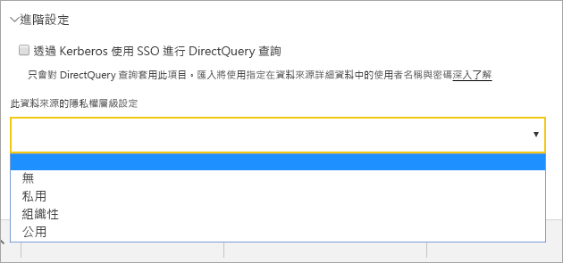
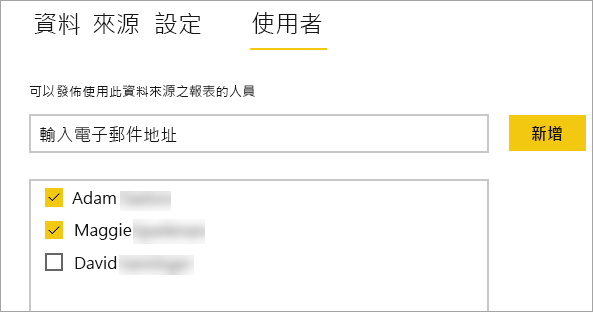
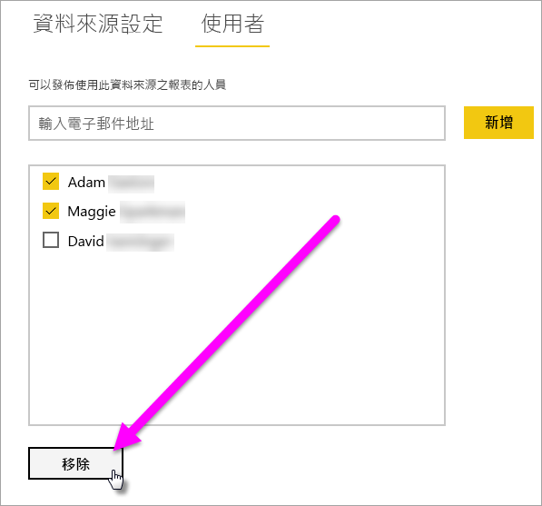
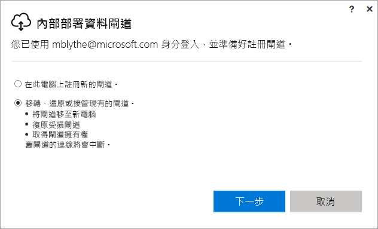
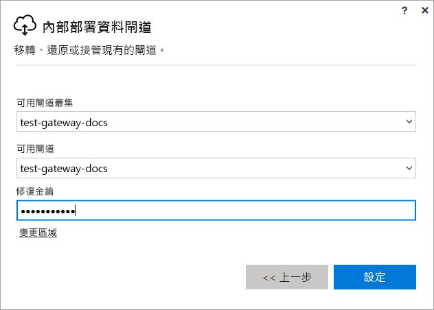

# 管理 Power BI 內部部署閘道

[安裝 Power BI 資料閘道](service-gateway-install.md)之後，您便可以根據自己的需求來進行管理。 在本主題中，您將學會如何新增及移除資料來源和使用者、重新啟動閘道，以及移轉、還原、接管及移除閘道。 

若要管理閘道，可以透過本機電腦上閘道應用程式中 Power BI 服務的 [管理閘道] 區域，或是使用 PowerShell 指令碼。 本文著重在 Power BI 服務。 

如果您剛剛安裝了一個閘道，建議您下一步[加入資料來源](#add-a-data-source)，然後[新增使用者](#add-users-to-a-data-source)，讓他們可以存取資料來源。

## 管理資料來源

Power BI 支援許多的內部部署資料來源，而且各有自己的需求。 閘道可以用於單一資料來源或多個資料來源。 在本範例中，我們將示範如何將 SQL Server 新增為資料來源，但其他資料來源的步驟類似。

### 加入資料來源

1. 在 Power BI 服務的右上角，選取齒輪圖示  > [管理閘道]。

    

2. 選取閘道 > [加入資料來源]，或移至閘道 > [加入資料來源]。

    

3. 選取 [資料來源類型]。

    

4. 輸入資料來源的資訊。 在本範例中，輸入的資訊有**伺服器**、**資料庫**和其他資訊。  

    

5. 針對 SQL Server，您應選擇 **Windows** 或**基本** (SQL 驗證) 的**驗證方法**。  如果您選擇**基本**，請輸入資料來源的認證。

6. 在 [進階設定] 下，選擇性地為您的資料來源 (不適用於 [DirectQuery](desktop-directquery-about.md)) 設定[隱私權等級](https://support.office.com/article/Privacy-levels-Power-Query-CC3EDE4D-359E-4B28-BC72-9BEE7900B540)。

    

7. 選取 [加入] 。 如果程序成功，您會看到 [連線成功]。

    

您現在可以使用此資料來源，在 Power BI 儀表板和報表中包含 SQL Server 的資料。

### 移除資料來源

如果您不再使用資料來源，則可以移除它。 請注意，移除資料來源的同時也會中斷依賴該資料來源的所有儀表板和報表。

若要移除資料來源，請移至 [資料來源]，然後選取 [移除]。

## 管理使用者和系統管理員

將資料來源加入閘道之後，您可以授與使用者和安全性群組對特定資料來源的存取權 (而不是整個閘道)。 資料來源使用者清單能夠控制可以發行報表的人員，且這些報表可以包含來自資料來源的資料。 報表擁有者可以建立儀表板、內容套件和應用程式，然後與其他使用者共用。

您也可以授與使用者和安全性群組對閘道的管理存取權。

### 將使用者加入至資料來源

1. 在 Power BI 服務的右上角，選取齒輪圖示  > [管理閘道]。

2. 選取您想加入使用者的資料來源。

3. 選取 [使用者]，然後輸入組織中您想要授與所選取資料來源存取權的使用者。 在下列畫面中，您可以看到我新增了 Maggie 和 Adam。

    ![[使用者] 索引標籤](media/service-gateway-manage/users-tab.png)

4. 選取 [新增]，新增的成員會顯示在方塊中。

    

就是這麼簡單。 請記住，您必須將使用者新增至您要授與存取權的每個資料來源。 每個資料來源都有不同的使用者清單，而且您必須分別將使用者新增至每個資料來源。

### 從資料來源中移除使用者

您可以在 [使用者] 索引標籤上，為資料來源移除使用這個資料來源的使用者或安全性群組。

### 新增和移除管理員

在閘道的 [管理員] 索引標籤上，新增和移除可管理閘道的使用者 (或安全性群組)。

![[管理員] 索引標籤](media/service-gateway-manage/administrators-tab.png)

## 管理閘道叢集

一旦您建立的叢集包含兩個或多個閘道，所有的閘道管理作業 (例如新增資料來源或授與系統管理員閘道權限) 都適用於屬於叢集的所有閘道。 

當系統管理員使用 [Power BI 服務] 齒輪圖示下找到的 [管理閘道] 功能表項目時，會看到已註冊叢集或個別閘道的清單，但看不到叢集成員的個別閘道執行個體。

所有新的 [已排程重新整理] 要求和 DirectQuery 作業會自動路由到指定閘道叢集的主要執行個體。 如果主要閘道執行個體不在線上，就會將要求路由至叢集中的另一個閘道執行個體。

## 共用閘道

您無法共用閘道本身，但是可以為閘道新增系統管理員，以及新增使用者至閘道的資料來源。 

當您安裝閘道之後，預設即成為該閘道的系統管理員。 如先前所示，您可以新增其他人成為系統管理員。 這些系統管理員可以新增資料來源、設定及移除閘道。

您也可以指派使用者至每個閘道之下您所建立的資料來源。 使用者之後便能使用這些資料來源來重新整理 Power BI 報表。 但是，使用者無法變更任何資料來源或閘道設定。

## 移轉、還原或取代閘道

在要移轉、還原或取代閘道的電腦上執行閘道安裝程式。

1. 下載閘道並進行安裝。

2. 登入您的 Power BI 帳戶之後，註冊閘道。 選取 [移轉、還原或取代現有的閘道] > [下一步]。

    

3. 從可用的叢集和閘道中選取，然後輸入所選取閘道的修復金鑰。 選取 [設定]。

    

## 重新啟動閘道

閘道會作為 Windows 服務來執行。 和任何 Windows 服務一樣，有多種方式可以啟動和停止它。 以下示範如何從命令提示字元執行這項操作。

1. 在執行閘道的電腦上，以系統管理員權限啟動命令提示字元

2. 輸入 `net stop PBIEgwService` 停止此服務。

3. 輸入 `net start PBIEgwService` 重新啟動此服務。

## 移除閘道器

如果您不再使用閘道，則可以移除它。 但是請注意，移除閘道會刪除其下的所有資料來源。 這也會依次中斷依賴這些資料來源的任何儀表板和報表。

1. 在 Power BI 服務的右上角，選取齒輪圖示  > [管理閘道]。

2. 選取閘道 > [移除]
   
   

## 後續步驟

[部署資料閘道的指引](service-gateway-deployment-guidance.md)

有其他問題嗎？ [試試 Power BI 社群](http://community.powerbi.com/)
