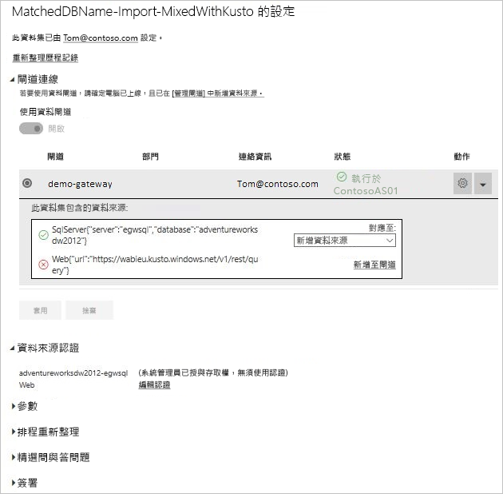

# 合併或附加內部部署與雲端資料來源

[!INCLUDE [gateway-rewrite](includes/gateway-rewrite.md)]

您可以使用內部部署資料閘道，在相同查詢中合併或附加內部部署和雲端資料來源。 當您想要合併多個來源的資料，但不想使用個別的查詢時，即適用此解決方案。

>[!NOTE]
>本文僅適用於已將雲端和內部部署資料來源合併或附加至單一查詢的資料集。 如果是包含個別查詢 (一個連接到內部部署，另一個連接到雲端資料來源) 的資料集，閘道不會針對雲端資料來源執行查詢。

## 先決條件

- [安裝在本機電腦上的閘道](/data-integration/gateway/service-gateway-install)。
- 具有結合內部部署和雲端資料來源之查詢的 Power BI Desktop 檔案。

>[!NOTE]
>若要存取任何雲端資料來源，您必須確定閘道可以存取這些資料來源。

1. 在 Power BI 服務的右上角，選取齒輪圖示  > [管理閘道]  。

    

2. 選取您想要設定的閘道。

3. 在 [閘道叢集設定]  下，選取 [允許使用者的雲端資料來源，以透過此閘道叢集重新整理]   > [套用]  。

    

4. 在此閘道叢集下，新增在查詢中使用的任何[內部部署資料來源](service-gateway-enterprise-manage-scheduled-refresh.md#add-a-data-source)。 您不需要在這裡新增雲端資料來源。

5. 將具有結合內部部署和雲端資料來源之查詢的 Power BI Desktop 檔案上傳至 Power BI 服務。

6. 在新資料集的 [資料集設定]  頁面：

   - 對於內部部署來源，選取與此資料來源建立關聯的閘道。
   - 在 [資料來源認證]  下，視需要編輯雲端資料來源認證。

    請確認已妥善設定雲端和內部部署資料來源的隱私權等級，以確保安全地處理聯結。

     

7. 設定雲端認證之後，您現在可以使用 [立即重新整理]  選項來重新整理資料集。 或者，您可以將它排程為定期重新整理。

## 後續步驟

若要深入了解閘道的資料重新整理，請參閱[使用資料來源進行已排程的重新整理](service-gateway-enterprise-manage-scheduled-refresh.md#using-the-data-source-for-scheduled-refresh)。
