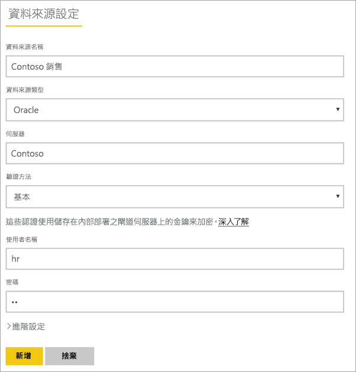
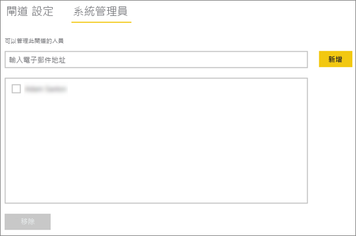
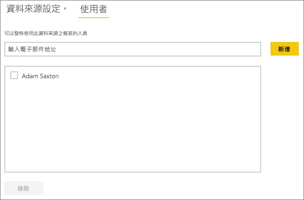

# <a name="manage-your-data-source---oracle"></a>管理您的資料來源 - Oracle
安裝內部部署資料閘道之後，您必須新增可搭配閘道使用的資料來源。 本文將探討如何使用閘道和資料來源。 您可以針對已排程的重新整理或 DirectQuery，使用 Oracle 資料來源。

## <a name="download-and-install-the-gateway"></a>下載並安裝閘道
您可以從 Power BI 服務下載閘道。 選取 [下載] > [資料閘道]，或移至 [gateway download page (閘道下載頁面)](https://go.microsoft.com/fwlink/?LinkId=698861)。


> [!WARNING]
> 必須先安裝及設定 .Net 的 Oracle 資料提供者 (ODP.NET)，才能使閘道連接至您的 Oracle 伺服器。 這是 Oracle 資料存取元件 (ODAC) 的部分。 如需如何下載 Oracle 提供者的詳細資訊，請參閱下方的[安裝 Oracle 用戶端](#installing-the-oracle-client)。
> 
> 

## <a name="installing-the-oracle-client"></a>安裝 Oracle 用戶端
針對 **32 位元**版本的 Power BI Desktop，使用下列連結，下載並安裝 **32 位元**的 Oracle 用戶端︰

* [32 位元的 Oracle Access Components (ODAC) 與 Oracle Developer Tools for Visual Studio (12.1.0.2.4)](http://www.oracle.com/technetwork/topics/dotnet/utilsoft-086879.html)

若是 **64 位元**版本的 Power BI Desktop 或是內部部署資料閘道，使用下列連結下載並安裝 **64 位元**的 Oracle 用戶端：

* [適用於 Windows x64 的 64 位元 ODAC 12.2c Release 1 (12.2.0.1.0)](http://www.oracle.com/technetwork/database/windows/downloads/index-090165.html)

安裝後，您必須使用您資料庫的適當資訊設定 tnsnames.ora 檔案。 Power BI Desktop 和閘道將會移開 tnsnames.ora 檔案中定義的 net_service_name。 若未設定，您將無法連接。 tnsnames.ora 的預設路徑如下：`[Oracle Home Directory]\Network\Admin\tnsnames.ora`。 如需如何設定 tnsnames.ora 檔案的詳細資訊，請參閱 [Oracle:本機命名參數 (tnsnames.ora)](https://docs.oracle.com/cd/B28359_01/network.111/b28317/tnsnames.htm) \(英文\)。

### <a name="example-tnsnamesora-file-entry"></a>範例 tnsnames.ora 檔案項目
tnsname.ora 中的項目基本格式如下所示。

```
net_service_name=
 (DESCRIPTION=
   (ADDRESS=(protocol_address_information))
   (CONNECT_DATA=
     (SERVICE_NAME=service_name)))
```

以下是填入的伺服器及連接埠資訊範例。

```
CONTOSO =
  (DESCRIPTION =
    (ADDRESS = (PROTOCOL = TCP)(HOST = oracleserver.contoso.com)(PORT = 1521))
    (CONNECT_DATA =
      (SERVER = DEDICATED)
      (SERVICE_NAME = CONTOSO)
    )
  )
```

## <a name="add-a-gateway"></a>加入閘道
若要新增閘道，只要[下載](https://go.microsoft.com/fwlink/?LinkId=698861)閘道並在您環境中的伺服器即可。 安裝閘道之後，它會顯示在 [管理閘道] 底下的閘道清單中。

> [!NOTE]
> 您必須是至少一個閘道的管理員，才會顯示 [管理閘道]。 當以管理員身分加入閘道時，或者當您安裝並設定閘道時，就會發生這種情況。
> 
> 

## <a name="remove-a-gateway"></a>移除閘道器
移除閘道器的同時也會刪除該閘道器下的所有資料來源。  這也會中斷依賴這些資料來源的任何儀表板和報表。

1. 選取右上角的齒輪圖示 > [管理閘道] 。
2. [閘道] > [移除]
   
   

## <a name="add-a-data-source"></a>加入資料來源
您可以選取閘道並按一下 [加入資料來源]，或移至 [閘道] > [加入資料來源] ，以加入資料來源。


您可以接著從清單中選取 [資料來源類型]  。


您接著需要填入資料來源的資訊，包括 **伺服器** 和 **資料庫**。  

您也需要選擇 [驗證方法] 。  此方法可以是 [Windows]  或 [基本] 。  若您要使用在 Oracle 而非 Windows 驗證中所建立的帳戶，則需要選擇 [基本]。 然後輸入要用於這個資料來源的認證。

> [!NOTE]
> 資料來源的所有查詢都會使用這些認證來執行。 如需詳細資訊，請參閱主要的內部部署資料閘道文章，以深入了解[認證](service-gateway-onprem.md#credentials)的儲存方式。
> 
> 



您可以在填入所有內容之後，按一下 [加入]  。  您現在可以使用此資料來源，針對內部部署的 Oracle 伺服器，用於已排程的重新整理或 DirectQuery。 如果成功，您會看到 [連接成功]  。


### <a name="advanced-settings"></a>進階設定
您可以設定資料來源的隱私權等級， 如此可控制如何混搭資料。 這只能用於已排程的重新整理。 不適用於 DirectQuery。 [深入了解](https://support.office.com/article/Privacy-levels-Power-Query-CC3EDE4D-359E-4B28-BC72-9BEE7900B540)


## <a name="remove-a-data-source"></a>移除資料來源
移除資料來源的同時也會中斷依賴指定資料來源的所有儀表板或報表。  

若要移除資料來源，請前往 [資料來源] > [移除]。


## <a name="manage-administrators"></a>管理管理員
在閘道的 [管理員] 索引標籤上，您可以新增並移除可管理閘道的使用者 (或安全性群組)。



## <a name="manage-users"></a>管理使用者
您可以在 [使用者] 索引標籤上，針對資料來源加入並移除可以使用這個資料來源的使用者或安全性群組。

> [!NOTE]
> 使用者清單僅控制獲准發行報表的人員。 報表擁有者可以建立儀表板或內容套件，並與其他使用者共用。 使用報表或儀表板的使用者不需要出現在使用者清單中。
> 
> 



## <a name="using-the-data-source"></a>使用資料來源
建立資料來源之後，您將可使用其中一個 DirectQuery 連接或透過已排程的重新整理，以取得資料來源。

> [!WARNING]
> 伺服器和資料庫名稱必須符合內部部署資料閘道內的 Power BI Desktop 和資料來源！
> 
> 

您的資料集和閘道內的資料來源是根據您的伺服器名稱和資料庫名稱以建立連結。 這些項目必須相符！ 例如，若您的伺服器名稱是 IP 位址，在 Power BI Desktop 內，您將必須使用該 IP 位址以取得閘道設定內的資料來源。 此名稱也必須符合 tnsnames.ora 檔案中定義的別名。 如需 tnsnames.ora 檔案的詳細資訊，請參閱[安裝 Oracle 用戶端](#installing-the-oracle-client)。

這適用於 DirectQuery 和已排程的重新整理。

### <a name="using-the-data-source-with-directquery-connections"></a>使用 DirectQuery 連接來使用資料來源
您必須確定伺服器和資料庫名稱與 Power BI Desktop 及閘道已設定的資料來源相符。 您也必須確定資料來源的 **使用者** 索引標籤已列出您的使用者，以便發行 DirectQuery 資料集。 當您第一次匯入資料時，Power BI Desktop 內會出現 DirectQuery 的選取項目。 [深入了解](desktop-use-directquery.md)

發行之後，您的報表會從 Power BI Desktop 或**取得資料**開始工作。 建立閘道內的資料來源之後，可能需要幾分鐘的時間才能使用連線。

### <a name="using-the-data-source-with-scheduled-refresh"></a>使用已排程的重新整理使用資料來源
若閘道內設定資料來源的 [使用者] 索引標籤中列出您的使用者，而伺服器和資料庫名稱也相符，您就可以將閘道作為進行已排程重新整理的一個選項。


## <a name="troubleshooting"></a>疑難排解
當命名語法不正確或未正確設定時，可能會遇到來自 Oracle 的多種錯誤。

* ORA-12154:TNS: 無法解析指定的連接識別碼  
* ORA-12514:TNS 接聽程式目前不了解連接描述元中要求的服務  
* ORA-12541:TNS: 沒有任何接聽程式  
* ORA-12170:TNS: 發生連接逾時  
* ORA-12504:TNS 接聽程式在 CONNECT_DATA 中未得到 SERVICE_NAME  

若未安裝或未正確設定 Oracle 用戶端，可能會發生這些錯誤。 若已安裝，建議您驗證 tnsnames.ora 檔案已正確設定，並使用適當的 net_service_name。 您也必須確定使用 Power BI Desktop 的電腦與執行閘道的電腦所使用的 net_service_name 相同。 如需詳細資訊，請參閱[安裝 Oracle 用戶端](#installing-the-oracle-client)。

> [!NOTE]
> 您也可能因為 Oracle 伺服器版本與 Oracle 用戶端版本之間的相容性，而遭遇問題。 一般而言這些應當相符。
> 
> 

如何與閘道相關的其他疑難排解資訊，請參閱[為內部部署資料閘道進行疑難排解](service-gateway-onprem-tshoot.md)。

## <a name="next-steps"></a>後續步驟
[內部部署資料閘道](service-gateway-onprem.md)  
[內部部署資料閘道 - 深入資訊](service-gateway-onprem-indepth.md)  
[為內部部署資料閘道進行疑難排解](service-gateway-onprem-tshoot.md)  
[Power BI Premium](service-premium.md)

有其他問題嗎？ [嘗試在 Power BI 社群提問](http://community.powerbi.com/)

