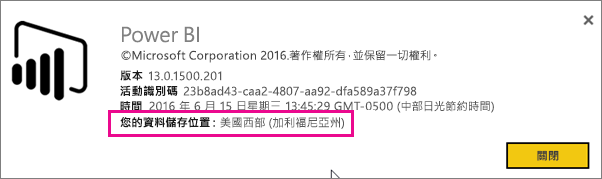
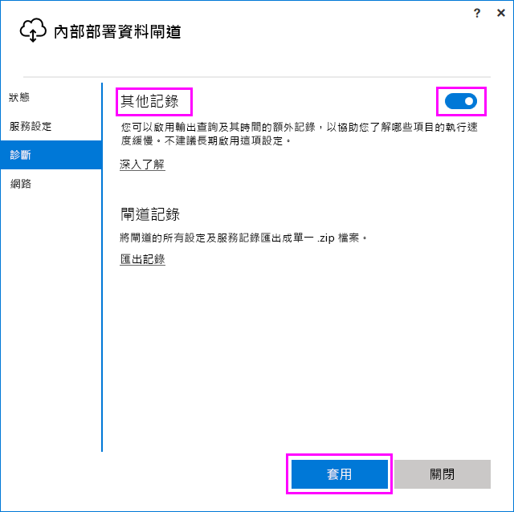
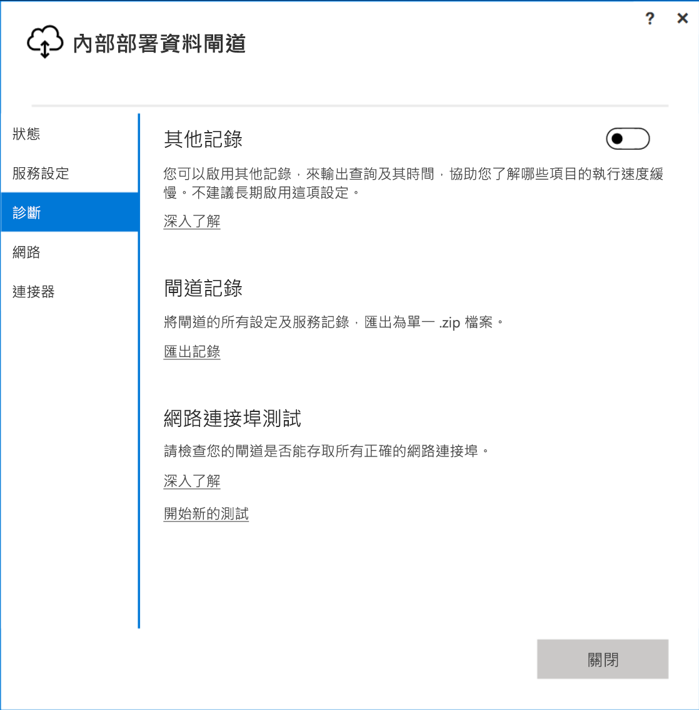
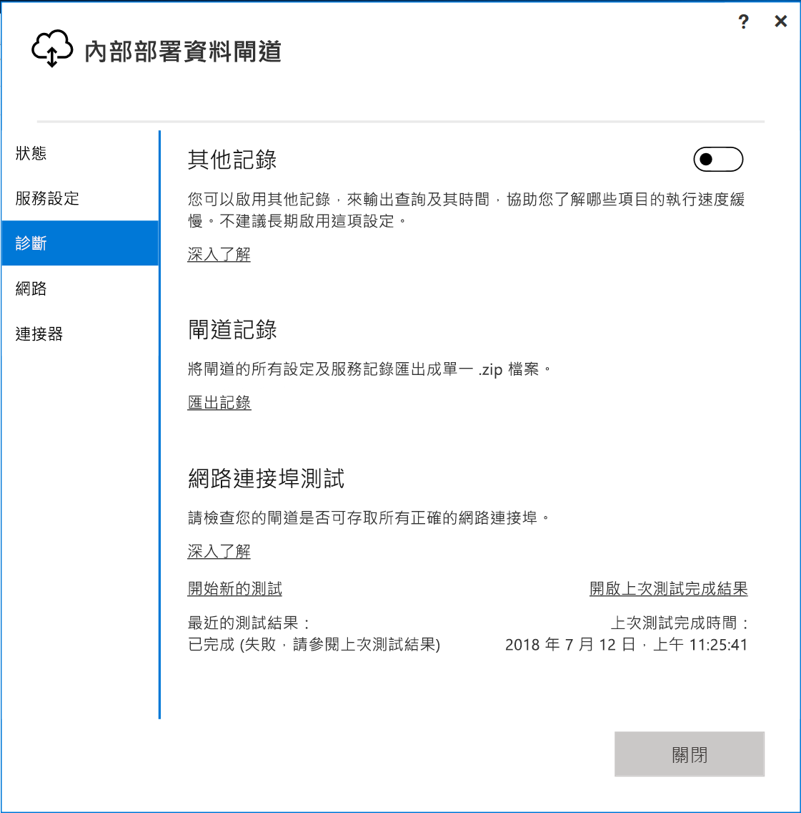

# <a name="troubleshooting-the-on-premises-data-gateway"></a>為內部部署資料閘道進行疑難排解

此文章探討使用**內部部署資料閘道**時的一些常見問題。

<!-- Shared Community & support links Include -->
[!INCLUDE [gateway-onprem-tshoot-support-links-include](./includes/gateway-onprem-tshoot-support-links-include.md)]

<!-- Shared Troubleshooting Install Include -->
[!INCLUDE [gateway-onprem-tshoot-install-include](./includes/gateway-onprem-tshoot-install-include.md)]

## <a name="configuration"></a>設定

### <a name="how-to-restart-the-gateway"></a>如何重新啟動閘道

閘道以 Windows 服務的形式執行，因此您可以用幾種方式加以啟動及停止。 例如，您可以在閘道執行的電腦上開啟提高權限的命令提示字元，然後執行下列其中一個命令：

* 若要停止服務，請執行這個命令：

    '''   net stop PBIEgwService   '''

* 若要啟動服務，請執行這個命令：

    '''   net start PBIEgwService   '''

### <a name="log-file-configuration"></a>記錄檔設定

閘道服務記錄檔分類為三個貯體：資訊、錯誤和網路。 此類別提供進一步的疑難排解體驗，可讓您根據錯誤或問題，專注於特定區域。 您可以從閘道設定檔中看到下列程式碼片段中的三個類別：`GatewayInfo.log,GatewayErrors.log,GatewayNetwork.log`。

```xml
  <system.diagnostics>
    <trace autoflush="true" indentsize="4">
      <listeners>
        <remove name="Default" />
        <add name="ApplicationFileTraceListener"
             type="Microsoft.PowerBI.DataMovement.Pipeline.Common.Diagnostics.RotatableFilesManagerTraceListener, Microsoft.PowerBI.DataMovement.Pipeline.Common"
             initializeData="%LOCALAPPDATA%\Microsoft\On-premises data gateway\,GatewayInfo.log,GatewayErrors.log,GatewayNetwork.log,20,50" />
      </listeners>
    </trace>
  </system.diagnostics>
```

此檔案的預設位置是：*\Program Files\On-premises data gateway\Microsoft.PowerBI.EnterpriseGateway.exe.config*。若要設定保留的記錄檔數目，請變更第一個數字 (在此範例中為 20)：`GatewayInfo.log,GatewayErrors.log,GatewayNetwork.log,20,50`。

### <a name="error-failed-to-create-a-gateway-try-again"></a>錯誤：無法建立閘道。 請再試一次

所有詳細資料都可以使用，但呼叫 Power BI 服務會傳回錯誤。 系統會顯示錯誤和活動識別碼。 這個錯誤發生的原因有好幾個。 您可以如下所述收集並檢閱記錄檔，以取得詳細資訊。

這也可能是由於 Proxy 設定問題。 使用者介面現在允許 Proxy 設定。 您可以深入了解 [Proxy 設定變更](service-gateway-proxy.md)相關資訊

### <a name="error-failed-to-update-gateway-details-please-try-again"></a>錯誤：無法更新閘道詳細資訊。 請再試一次

已從連接到閘道的 Power BI 服務收到資訊。 此資訊已傳遞到本機 Windows 服務，但無法傳回。 或者，對稱金鑰產生作業失敗。 [顯示詳細資料] 底下會顯示內部例外狀況。 若要取得詳細資訊，您可以如下所述收集並檢閱記錄。

### <a name="error-power-bi-service-reported-local-gateway-as-unreachable-restart-the-gateway-and-try-again"></a>錯誤：Power BI 服務回報無法連繫區域閘道。 請重新啟動閘道，然後再試一次

設定結束時，會再次呼叫 Power BI 服務以驗證閘道。 Power BI 服務未將閘道報告為「即時」 。 重新啟動 Windows 服務可能會讓通訊成功。 您可以如下所述收集並檢閱記錄檔，以取得詳細資訊。

### <a name="script-error-during-sign-into-power-bi"></a>登入 Power BI 期間發生指令碼錯誤

登入屬於內部部署資料閘道設定一部分的 Power BI 時，您可能會收到指令碼錯誤。 安裝下列安全性更新可解決問題。 這可以透過 Windows Update 安裝。

[MS16-051：Internet Explorer 的安全性更新︰2016 年 5 月 10 日 (KB 3154070)](https://support.microsoft.com/kb/3154070)

### <a name="gateway-configuration-failed-with-a-null-reference-exception"></a>閘道設定失敗，發生 null 參考例外狀況

您可能會遇到類似下列的錯誤。

        Failed to update gateway details.  Please try again.
        Error updating gateway configuration.

這會包含堆疊追蹤，而且該堆疊追蹤可能會包含下列訊息。

        Microsoft.PowerBI.DataMovement.Pipeline.Diagnostics.CouldNotUpdateGatewayConfigurationException: Error updating gateway configuration. ----> System.ArgumentNullException: Value cannot be null.
        Parameter name: serviceSection

如果您從舊版的閘道升級，我們將會保留設定檔。 可能有遺漏的區段。 當閘道嘗試加以讀取時，我們可取得上述 Null 參考例外狀況。

若要修正此問題，請執行下列步驟。

1. 將閘道解除安裝。
2. 刪除下列資料夾。

        c:\Program Files\On-premises data gateway
3. 重新安裝該閘道。
4. 選擇性地套用修復金鑰，以還原現有的閘道。

## <a name="support-for-tls-12"></a>對 TLS 1.2 的支援

根據預設，內部部署的資料閘道會使用傳輸層安全性 (TLS) 1.2 來與 Power BI 服務通訊。 若要確保所有閘道流量使用 TLS 1.2，您可能必須在執行閘道服務的電腦上新增或修改下列登錄機碼：

```
[HKEY_LOCAL_MACHINE\SOFTWARE\Microsoft\.NETFramework\v4.0.30319]"SchUseStrongCrypto"=dword:00000001
[HKEY_LOCAL_MACHINE\SOFTWARE\Wow6432Node\Microsoft\.NETFramework\v4.0.30319]"SchUseStrongCrypto"=dword:00000001
```

> [!NOTE]
> 新增或修改這些登錄機碼會將變更套用至所有 .NET 應用程式。 如需影響其他應用程式之 TLS 之登錄變更的資訊，請參閱 [Transport Layer Security (TLS) registry settings](https://docs.microsoft.com/windows-server/security/tls/tls-registry-settings) (傳輸層安全性 (TLS) 登錄設定)。

## <a name="data-sources"></a>資料來源

### <a name="error-unable-to-connect-details-invalid-connection-credentials"></a>錯誤：無法連接。 詳細資訊：「連接認證無效」

在 [顯示詳細資料] 中，會顯示從資料來源收到的錯誤訊息。 若是 SQL Server，您會看到類似如下的訊息。

    Login failed for user 'username'.

請確認您擁有正確的使用者名稱和密碼。 另請確認這些認證可成功連接到資料來源。 請確定使用的帳戶符合 **驗證方法**。

### <a name="error-unable-to-connect-details-cannot-connect-to-the-database"></a>錯誤：無法連接。 詳細資訊：「無法連接到資料庫」

我們可以連接到伺服器，但無法連接到提供的資料庫。 請確認資料庫的名稱，以及使用者認證具有存取該資料庫的適當權限。

在 [顯示詳細資料] 中，會顯示從資料來源收到的錯誤訊息。 若是 SQL Server，您會看到類似如下的訊息。

    Cannot open database "AdventureWorks" requested by the login. The login failed. Login failed for user 'username'.

### <a name="error-unable-to-connect-details-unknown-error-in-data-gateway"></a>錯誤：無法連接。 詳細資訊：「資料閘道發生不明錯誤」

這個錯誤可能有數個不同的發生原因。 請務必驗證您可以從裝載閘道的電腦連接到資料來源。 這可能是由於無法存取伺服器所致。

在 [顯示詳細資料] 中，您可能會看到錯誤碼 **DM_GWPipeline_UnknownError**。

您也可以查看 [事件記錄檔] > [應用程式及服務記錄檔] > [內部部署資料閘道服務]，以取得詳細資訊。

### <a name="error-we-encountered-an-error-while-trying-to-connect-to-server-details-we-reached-the-data-gateway-but-the-gateway-cant-access-the-on-premises-data-source"></a>錯誤：嘗試連接 <server> 時發生錯誤。 詳細資訊：「已連線到資料閘道，但該閘道無法存取內部部署資料來源。」

我們無法連接到指定的資料來源。 請務必驗證為該資料來源提供的資訊。

在 [顯示詳細資料] 中，您可能會看到錯誤碼 **DM_GWPipeline_Gateway_DataSourceAccessError**。

如果出現類似下面的基礎錯誤訊息，則表示為此資料來源所使用的帳戶不是該 Analysis Services 執行個體的伺服器管理員。 [深入了解](https://docs.microsoft.com/sql/analysis-services/instances/grant-server-admin-rights-to-an-analysis-services-instance)

    The 'CONTOSO\account' value of the 'EffectiveUserName' XML for Analysis property is not valid.

如果基礎錯誤訊息類似於下列訊息，這可能表示 Analysis Services 的服務帳戶可能遺漏了 [token-groups-global-and-universal](https://msdn.microsoft.com/library/windows/desktop/ms680300.aspx) (TGGAU) 目錄屬性。

    The username or password is incorrect.

具有 Windows 2000 之前版本相容性存取權的網域會啟用 TGGAU 屬性。 不過，最新建立的網域預設不會啟用此屬性。 您可以在[這裡](https://support.microsoft.com/kb/331951)閱讀更多相關資訊。

您可以透過下列方式加以確認。

1. 在 SQL Server Management Studio 中連接至 Analysis Services 電腦。 在進階連線屬性中，替有問題的使用者包括 EffectiveUserName，並查看這是否會重現錯誤。
2. 您可以使用 dsacls Active Directory 工具，以驗證屬性是否列出。 此工具可以在網域控制站上找到。 您必須知道帳戶的可辨別網域名稱為何，並將其傳遞至工具。

        dsacls "CN=John Doe,CN=UserAccounts,DC=contoso,DC=com"

    您會想要在結果中看到類似下列的項目。

            Allow BUILTIN\Windows Authorization Access Group
                                          SPECIAL ACCESS for tokenGroupsGlobalAndUniversal
                                          READ PROPERTY

若要修正此問題，您必須在用於 Analysis Services Windows 服務的帳戶上啟用 TGGAU。

#### <a name="another-possibility-for-username-or-password-incorrect"></a>另一種使用者名稱或密碼不正確的可能性

如果 Analysis Services 伺服器和使用者位在不同的網域，而且沒有建立雙向信任關係，也會發生此錯誤。

您必須和網域系統管理員合作，以驗證網域之間的信任關係。

#### <a name="unable-to-see-the-data-gateway-data-sources-in-the-get-data-experience-for-analysis-services-from-the-power-bi-service"></a>無法從 Power BI 服務查看 Analysis Services「取得資料」體驗中的資料閘道資料來源

請確定閘道設定內資料來源的 [使用者] 索引標籤中已列出您的帳戶。 若您沒有閘道存取權，請洽詢閘道管理員並請求驗證。 只有**使用者**清單中的帳戶才能查看 Analysis Services 清單所列出的資料來源。

### <a name="error-you-dont-have-any-gateway-installed-or-configured-for-the-data-sources-in-this-dataset"></a>錯誤: 您在此資料集中沒有任何為資料來源安裝或設定的閘道

請確認您已將一或多個資料來源新增至閘道，如[新增資料來源](service-gateway-manage.md#add-a-data-source)中所述。 若閘道未在管理入口網站中的 [管理閘道] 下出現，請嘗試清除您的瀏覽器快取或登出服務，然後重新登入。

## <a name="datasets"></a>資料集

### <a name="error-there-is-not-enough-space-for-this-row"></a>錯誤：這個資料列沒有足夠空間

如果您有大小超過 4 MB 的單一資料列，就會發生這個情況。 您必須從資料來源判斷那是什麼資料列，並嘗試加以篩選或縮減該資料列的大小。

### <a name="error-the-server-name-provided-doesnt-match-the-server-name-on-the-sql-server-ssl-certificate"></a>錯誤︰提供的伺服器名稱不符合 SQL Server SSL 憑證上的伺服器名稱

當憑證 CN 代表伺服器的完整網域名稱 (FQDN)，但您只提供伺服器的 NetBIOS 名稱時，就會發生這個情況。 這會導致憑證不相符。 若要解決此問題，您必須讓閘道資料來源及 PBIX 檔案內的伺服器名稱使用伺服器的 FQDN。

### <a name="i-dont-see-the-on-premises-data-gateway-present-when-configuring-scheduled-refresh"></a>我在設定排程的重新整理時，沒有看到任何內部部署資料閘道

這可能是因為下列幾個不同的情況。

1. 在 Power BI Desktop 中輸入的伺服器和資料庫名稱，不符合閘道已設定的資料來源。 這些必須是相同的值。 它們不區分大小寫。
2. 您的帳戶未列於閘道組態內資料來源的 [使用者] 索引標籤中。 您必須將閘道管理員新增至該清單。
3. 您的 Power BI Desktop 檔案中有多個資料來源，但並非所有資料來源都是使用閘道設定。 您必須使用閘道定義每個資料來源，才能在排程的重新整理期間顯示閘道。

### <a name="error-the-received-uncompressed-data-on-the-gateway-client-has-exceeded-the-limit"></a>錯誤：閘道用戶端上所收到未經壓縮的資料超過限制

確切的限制為每個資料表 10 GB 未壓縮的資料。 如果即將達到此限制，您有適當的選項可最佳化及避免此問題。 減少使用高度固定的長字串值並改用標準化索引鍵，或移除資料行 (如果不在使用中) 特別會有幫助。

## <a name="reports"></a>報表

### <a name="report-could-not-access-the-data-source-because-you-do-not-have-access-to-our-data-source-via-an-on-premises-data-gateway"></a>因為您無法透過內部部署資料閘道存取我們的資料來源，所以報表無法存取資料來源

此情形通常由下列其中一個項目所造成。

1. 資料來源資訊與基礎資料集中的項目不符合。 伺服器和資料庫名稱必須與為內部部署資料閘道定義的資料來源，或是您在 Power BI Desktop 內提供的名稱相符。 如果您在 Power BI Desktop 中使用 IP 位址，則內部部署資料閘道的資料來源也必須使用 IP 位址。
2. 組織內任何閘道上都沒有可用的資料來源。 您可以在全新或現有的內部部署資料閘道上設定資料來源。

### <a name="error-data-source-access-error-please-contact-the-gateway-administrator"></a>錯誤︰資料來源存取錯誤。 請連絡閘道管理員

如果這份報表使用即時 Analysis Services 連線，您可能會遇到將值傳遞至 EffectiveUserName 的問題，該值不是無效，就是在 Analysis Services 電腦上沒有權限。 一般而言，驗證問題是因為傳入的 EffectiveUserName 的值不符合本機使用者主體名稱 (UPN)。

若要確認這一點，您可以執行下列動作。

1. 在[閘道記錄檔](#logs)內尋找有效的使用者名稱。
2. 傳遞值之後，驗證其正確性。 如果是您的使用者，您可以從命令提示字元使用下列命令，以查看 UPN。 UPN 看起來像電子郵件地址。

        whoami /upn

您可以選擇性地查看 Power BI 從 Azure Active Directory 取得哪些項目。

1. 瀏覽至 [https://developer.microsoft.com/graph/graph-explorer](https://developer.microsoft.com/graph/graph-explorer)。
2. 選擇右上角的 [登入]。
3. 執行下列查詢。 您會看到相當大的 JSON 回應。

        https://graph.windows.net/me?api-version=1.5
4. 尋找 **userPrincipalName**。

如果您的 Azure Active Directory UPN 不符合您的本機 Active Directory UPN，您可以使用[對應使用者名稱](service-gateway-enterprise-manage-ssas.md#map-user-names)功能，以有效的值加以取代。 或者，您可以和您的租用戶系統管理員或本機 Active Directory 系統管理員合作，以變更您的 UPN。

<!-- Shared Troubleshooting Firewall/Proxy Include -->
[!INCLUDE [gateway-onprem-tshoot-firewall-include](./includes/gateway-onprem-tshoot-firewall-include.md)]

您可以執行下列動作來找到您所在的資料中心區域︰

1. 在 Power BI 服務的右上角，選取 [?] 。
2. 選取 [關於 Power BI]。
3. 您的資料區域會列在 [您的資料儲存位置] 中。

    

如果您仍然無法取得任何進展，您可以嘗試使用 [fiddler](#fiddler) 或 netsh 之類的工具進行網路追蹤，雖然這些都是進階的收集方法，而且您可能需要其他協助來分析收集到的資料。 您可以連絡[支援](https://support.microsoft.com)以取得協助。

## <a name="performance"></a>效能

<iframe width="560" height="315" src="https://www.youtube.com/embed/IJ_DJ30VNk4?showinfo=0" frameborder="0" allowfullscreen></iframe>

### <a name="performance-counters"></a>效能計數器

您可使用數種效能計數器來量測閘道的活動。 這些計數器有助於您了解活動負載是否很大，而可能需要設定新的閘道。 這些計數器並不會反映某個項目花多少時間。

您可以透過 Windows 效能監視器工具存取這些計數器。


這些計數器的一般分組如下：

| 計數器類型 | 描述 |
| --- | --- |
| ADO.NET |適用於任何 DirectQuery 連線。 |
| ADOMD |適用於 Analysis Services 2014 及更早版本。 |
| OLEDB |特定資料來源會使用此類型。 其中包括 SAP HANA 和 Analysis Service 2016 或更新版本。 |
| Mashup |其中包括任何匯入的資料來源。 如果您要排程重新整理或執行依需求的重新整理，則會透過交互式 Web 應用程式 (Mashup) 引擎進行。 |

以下是可用的效能計數器清單。

| 計數器 | 描述 |
| --- | --- |
| # of ADO.NET open connection executed / sec |每秒執行的 ADO.NET 開放連線動作次數 (成功或失敗)。 |
| # of ADO.NET open connection failed / sec |每秒失敗的 ADO.NET 開放連線動作次數。 |
| # of ADO.NET queries executed / sec |每秒執行的 ADO.NET 查詢次數 (成功或失敗)。 |
| # of ADO.NET queries failed / sec |每秒執行的 ADO.NET 查詢失敗次數。 |
| # of ADOMD open connection executed / sec |每秒執行的 ADOMD 開放連線動作次數 (成功或失敗)。 |
| # of ADOMD open connection failed / sec |每秒失敗的 ADOMD 開放連線動作次數。 |
| # of ADOMD queries executed / sec |每秒執行的 ADOMD 查詢次數 (成功或失敗)。 |
| # of ADOMD queries failed / sec |每秒執行的 ADOMD 查詢失敗次數。 |
| # of all open connection executed / sec |每秒執行的開放連線動作次數 (成功或失敗)。 |
| # of all open connection failed / sec |每秒執行的開放連線動作失敗次數。 |
| # of all queries executed / sec |每秒執行的查詢次數 (成功或失敗)。 |
| # of items in the ADO.NET connection pool |ADO.NET 連接集區中的項目數。 |
| # of items in the OLEDB connection pool |OLEDB 連接集區中的項目數。 |
| # of items in the Service Bus pool |服務匯流排集區中的項目數。 |
| # of Mashup open connection executed / sec |每秒執行的 Mashup 開放連線動作次數 (成功或失敗)。 |
| # of Mashup open connection failed / sec |每秒失敗的 Mashup 開放連線動作次數。 |
| # of Mashup queries executed / sec |每秒執行的 Mashup 查詢次數 (成功或失敗)。 |
| # of Mashup queries failed / sec |每秒執行的 Mashup 查詢失敗次數。 |
| # of OLEDB multiple result set queries failed / sec |每秒執行的 OLEDB 多個結果集查詢失敗次數。 |
| # of OLEDB multiple result sets of queries executed / sec |每秒執行的 OLEDB 多個結果集查詢次數 (成功或失敗)。 |
| # of OLEDB open connection executed / sec |每秒執行的 OLEDB 開放連線動作次數 (成功或失敗)。 |
| # of OLEDB open connection failed / sec |每秒失敗的 OLEDB 開放連線動作次數。 |
| # of OLEDB queries executed / sec |每秒執行的 OLEDB 多個結果集查詢次數 (成功或失敗)。 |
| # of OLEDB queries failed / sec |每秒執行的 OLEDB 多個結果集查詢失敗次數。 |
| # of OLEDB single result set queries executed / sec |每秒執行的 OLEDB 單一結果集查詢次數 (成功或失敗)。 |
| # of queries failed / sec |每秒執行的查詢失敗次數。 |
| # of single result set OLEDB queries failed / sec |每秒執行的 OLEDB 單一結果集查詢失敗次數。 |

## <a name="reviewing-slow-performing-queries"></a>檢閱執行緩慢的查詢

您可能會發現透過閘道的回應很慢。 這可能發生在 DirectQuery 查詢，或重新整理匯入的資料集時。 您可以啟用輸出查詢及其時間的額外記錄，以協助您了解哪些項目的執行速度緩慢。 當您發現執行很久的查詢時，可能需要在資料來源進行其他修改，以調整查詢效能。 例如，調整 SQL Server 查詢的索引。

您必須修改下列兩個組態檔來判斷查詢的持續時間。

### <a name="microsoftpowerbidatamovementpipelinegatewaycoredllconfig"></a>Microsoft.PowerBI.DataMovement.Pipeline.GatewayCore.dll.config

在 *Microsoft.PowerBI.DataMovement.Pipeline.GatewayCore.dll.config* 檔案中，將 `EmitQueryTraces` 值從 `False` 變更為 `True`。 根據預設，這個檔案位於 *C:\Program Files\On-premises data gateway* 。 啟用 `EmitQueryTraces` 時，就會開始記錄從閘道傳送到資料來源的查詢。

> [!IMPORTANT]
> 根據閘道的使用方式，啟用 EmitQueryTraces 可能會大幅增加記錄大小。 在您完成檢閱記錄後，可能需要將 EmitQueryTraces 設定為 False。 不建議長期啟用此設定。

```
<setting name="EmitQueryTraces" serializeAs="String">
    <value>True</value>
</setting>
```

**範例查詢項目**

```
DM.EnterpriseGateway Information: 0 : 2016-09-15T16:09:27.2664967Z DM.EnterpriseGateway    4af2c279-1f91-4c33-ae5e-b3c863946c41    d1c77e9e-3858-4b21-3e62-1b6eaf28b176    MGEQ    c32f15e3-699c-4360-9e61-2cc03e8c8f4c    FF59BC20 [DM.GatewayCore] Executing query (timeout=224) "<pi>
SELECT
TOP (1000001) [t0].[ProductCategoryName],[t0].[FiscalYear],SUM([t0].[Amount])
 AS [a0]
FROM
(
(select [$Table].[ProductCategoryName] as [ProductCategoryName],
    [$Table].[ProductSubcategory] as [ProductSubcategory],
    [$Table].[Product] as [Product],
    [$Table].[CustomerKey] as [CustomerKey],
    [$Table].[Region] as [Region],
    [$Table].[Age] as [Age],
    [$Table].[IncomeGroup] as [IncomeGroup],
    [$Table].[CalendarYear] as [CalendarYear],
    [$Table].[FiscalYear] as [FiscalYear],
    [$Table].[Month] as [Month],
    [$Table].[OrderNumber] as [OrderNumber],
    [$Table].[LineNumber] as [LineNumber],
    [$Table].[Quantity] as [Quantity],
    [$Table].[Amount] as [Amount]
from [dbo].[V_CustomerOrders] as [$Table])
)
 AS [t0]
GROUP BY [t0].[ProductCategoryName],[t0].[FiscalYear] </pi>"
```

### <a name="microsoftpowerbidatamovementpipelinediagnosticsdllconfig"></a>Microsoft.PowerBI.DataMovement.Pipeline.Diagnostics.dll.config

在 *Microsoft.PowerBI.DataMovement.Pipeline.Diagnostics.dll.config* 檔案中，將 `TracingVerbosity` 值從 `4` 變更為 `5`。 根據預設，這個檔案位於 *C:\Program Files\On-premises data gateway* 。 變更此設定時，就會開始將詳細資訊項目記錄至閘道記錄。 包括顯示持續期間的項目。 您也可以在內部部署閘道應用程式中啟用 [其他記錄] 按鈕，以啟用詳細資訊項目。

   

> [!IMPORTANT]
> 將 TracingVerbosity 啟用為 `5`，可能會根據閘道使用量而大幅增加記錄大小。 在您完成檢閱記錄後，需要將 TraceVerbosity 設定為 `4`。 不建議長期啟用此設定。

```
<setting name="TracingVerbosity" serializeAs="String">
    <value>5</value>
</setting>
```

<a name="activities"></a>

### <a name="activity-types"></a>活動類型

| 活動類型 | 描述 |
| --- | --- |
| MGEQ |透過 ADO.NET 所執行的查詢。 其中包括 DirectQuery 資料來源。 |
| MGEO |透過 OLED 所執行的查詢。 其中包括 SAP HANA 和 Analysis Service 2016。 |
| MGEM |從 Mashup Engine 所執行的查詢。 此項目可搭配匯入的資料集使用 (該資料集使用排定的重新整理或隨選重新整理)。 |

### <a name="determine-the-duration-of-a-query"></a>判斷查詢的持續時間
若要判斷查詢資料來源所花費的時間，您可以執行下列動作：

1. 開啟閘道記錄檔。
2. 搜尋[活動類型](#activities) 以尋找查詢。 MGEQ 即為其中一個範例。
3. 請記下第二個 GUID，因為這是要求識別碼。
4. 繼續搜尋 MGEQ，直到您找到含有持續時間的 FireActivityCompletedSuccessfullyEvent 項目。 您可以驗證項目是否有相同的要求 ID。持續時間是以毫秒為單位。

        DM.EnterpriseGateway Verbose: 0 : 2016-09-26T23:08:56.7940067Z DM.EnterpriseGateway    baf40f21-2eb4-4af1-9c59-0950ef11ec4a    5f99f566-106d-c8ac-c864-c0808c41a606    MGEQ    21f96cc4-7496-bfdd-748c-b4915cb4b70c    B8DFCF12 [DM.Pipeline.Common.TracingTelemetryService] Event: FireActivityCompletedSuccessfullyEvent (duration=5004)

   > [!NOTE]
   > FireActivityCompletedSuccessfullyEvent 是詳細資料項目。 除非 TraceVerbosity 位於層級 5，否則不會記錄此項目。

## <a name="firewall-or-proxy"></a>防火牆或 Proxy

若要了解如何為您的閘道提供 Proxy 資訊，請參閱[進行 Power BI 閘道的 Proxy 設定](service-gateway-proxy.md)。

您可以從 PowerShell 提示字元執行 [Test-NetConnection](https://docs.microsoft.com/powershell/module/nettcpip/test-netconnection) 進行測試，以了解您的防火牆 (或 Proxy) 是否封鎖連線。 這會測試 Azure 服務匯流排連線。 這只會測試網路連線，不會動用雲端伺服器服務或閘道。 其可協助判斷您的電腦是否可以連出網際網路。

    Test-NetConnection -ComputerName watchdog.servicebus.windows.net -Port 9350

> [!NOTE]
> Test-NetConnection 僅可在 Windows Server 2012 R2 及更新版本使用。 也適用於 Windows 8.1 和更新版本。 在較舊的 OS 版本上，您可以使用 Telnet 來測試連接埠連線能力。

結果類似如下。 差異在於 TcpTestSucceeded。 若 **TcpTestSucceeded** 不是 *True*，則您可能遭到防火牆封鎖。

    ComputerName           : watchdog.servicebus.windows.net
    RemoteAddress          : 70.37.104.240
    RemotePort             : 5672
    InterfaceAlias         : vEthernet (Broadcom NetXtreme Gigabit Ethernet - Virtual Switch)
    SourceAddress          : 10.120.60.105
    PingSucceeded          : False
    PingReplyDetails (RTT) : 0 ms
    TcpTestSucceeded       : True

若您想獲得完全相同的結果，請以[連接埠](https://docs.microsoft.com/power-bi/service-gateway-onprem#ports)列出的內容替代 **ComputerName** 和**Port** 的值。

防火牆也可能會封鎖 Azure 服務匯流排對 Azure 資料中心的連線。 如果是這樣，您可以將您區域內這些資料中心的 IP 位址加入白名單 (解除封鎖)。 您可以在[這裡](https://www.microsoft.com/download/details.aspx?id=41653)取得一份 Azure IP 位址清單。

### <a name="network-ports-test"></a>網路連接埠測試

網路連接埠測試工具可用來檢查您的閘道是否可以存取正確的連接埠，以便您閘道所需的所有遠端伺服器都能傳輸資料。 如果網路連接埠測試無法連線到任何連接埠，您的閘道可能遇到網路問題。 如果您的閘道目前遇到網路問題，請執行網路連接埠測試，以確保您有最佳的網路環境。  

#### <a name="start-a-new-test"></a>開始新的測試

若要執行新的網路連接埠測試，請在內部部署資料閘道使用者介面中。



執行網路連接埠測試時，您的閘道會從 Azure 服務匯流排擷取一份連接埠和伺服器清單，然後它會嘗試連線到所有伺服器和連接埠。 當 [開始新的測試] 連結重新出現時，網路連接埠測試即已完成執行。  

#### <a name="test-results"></a>測試結果

測試摘要可能會在 [開始新的測試] 連結底下顯示為 [最近的測試結果]。 兩個結果分別為 [已完成 (成功)] 和 [已完成 (失敗，請查看上次測試結果)]。 如果測試成功，則您的閘道已成功連線到所有必要的連接埠。 如果測試失敗，則您的網路環境可能正在封鎖這些必要的連接埠和伺服器。 



若要檢視上次完成的測試結果，請選取 [開啟上次完成的測試結果] 連結，如下所示。 測試結果會以 Windows 的預設文字編輯器開啟。  

測試結果會列出您閘道所需的所有伺服器、連接埠和 IP 位址。 如果測試結果顯示「已針對任何連接埠關閉」(如下所示)，請確保您的網路環境未封鎖連線。 您可能需要連絡網路系統管理員以開啟必要的連接埠。


## <a name="kerberos"></a>Kerberos

如果未針對 [Kerberos 限制委派](service-gateway-sso-kerberos.md)正確設定基礎資料庫伺服器和內部部署資料閘道，請啟用閘道上的[詳細資訊記錄](#microsoftpowerbidatamovementpipelinediagnosticsdllconfig)，並根據閘道記錄檔中的錯誤/追蹤進行調查以作為疑難排解的起點。

### <a name="impersonationlevel"></a>ImpersonationLevel

ImpersonationLevel 與 SPN 設定或本機原則設定有關。

```
[DataMovement.PipeLine.GatewayDataAccess] About to impersonate user DOMAIN\User (IsAuthenticated: True, ImpersonationLevel: Identification)
```

**解決方案**

遵循下列步驟來解決此問題：
1. 針對內部部署閘道設定 SPN
2. 在 Active Directory (AD) 中設定限制委派

### <a name="failedtoimpersonateuserexception-failed-to-create-windows-identity-for-user-userid"></a>FailedToImpersonateUserException：無法針對使用者的使用者識別碼建立 Windows 身分識別

如果您不能代表其他使用者進行模擬，就會發生 FailedToImpersonateUserException。 如果您嘗試模擬的帳戶來自閘道服務網域所在網域以外的其他網域 (這是限制)，也會發生此問題。

**解決方案**

* 確認已根據上述＜ImpersonationLevel＞一節中的步驟正確進行設定
* 確定它正嘗試模擬的使用者識別碼是有效的 AD 帳戶

### <a name="general-error-1033-error-while-parsing-the-protocol"></a>一般錯誤；剖析通訊協定時發生 1033 錯誤

如果使用者是使用 UPN (alias@domain.com) 來模擬的，則當您在 SAP HANA 中設定的外部識別碼與登入不符時，就會收到 1033 錯誤。 在記錄中，您會在錯誤記錄檔上方看到「已將原始 UPN 'alias@domain.com' 取代為新的 UPN 'alias@domain.com'，如下所示」。

```
[DM.GatewayCore] SingleSignOn Required. Original UPN 'alias@domain.com' replaced with new UPN 'alias@domain.com.'
```

**解決方案**

* SAP HANA 會要求模擬使用者在 AD 中使用 sAMAccountName 屬性 (使用者別名)。 如果這不正確，您會看到 1033 錯誤。

    

* 您會在記錄中看到 sAMAccountName (別名) 而不是 UPN，其為後面接著網域的別名 (alias@doimain.com)

    

```
      <setting name="ADUserNameReplacementProperty" serializeAs="String">
        <value>sAMAccount</value>
      </setting>
      <setting name="ADServerPath" serializeAs="String">
        <value />
      </setting>
      <setting name="CustomASDataSource" serializeAs="String">
        <value />
      </setting>
      <setting name="ADUserNameLookupProperty" serializeAs="String">
        <value>AADEmail</value>
```

### <a name="sap-aglibodbchdb-dllhdbodbc-communication-link-failure-10709-connection-failed-rte-1-kerberos-error-major-miscellaneous-failure-851968-minor-no-credentials-are-available-in-the-security-package"></a>[SAP AG][LIBODBCHDB DLL][HDBODBC] 通訊連結失敗;-10709 連線失敗 (RTE:[-1] Kerberos 錯誤。 主要: "其他失敗 [851968]"，次要: "安全性套件沒有可供使用的認證

如果未在 AD 中正確設定您的委派，您會收到 -10709 連線失敗錯誤訊息。

**解決方案**

* 針對閘道服務帳戶，在 AD 中的 [委派] 索引標籤上，確定您有 SAP Hana 伺服器

   

<!-- Shared Troubleshooting tools Include -->
[!INCLUDE [gateway-onprem-tshoot-tools-include](./includes/gateway-onprem-tshoot-tools-include.md)]

### <a name="refresh-history"></a>重新整理歷程記錄

使用閘道進行排程的重新整理時，[重新整理記錄] 可以協助您查看發生了哪些錯誤，以及在需要建立支援要求時提供有用的資料。 您可以同時檢視已排程及依需求的重新整理。 以下是取得 **重新整理記錄**的方式。

1. 在 Power BI 瀏覽窗格中，於 [資料集]  中選取資料集 &gt; [開啟功能表]&gt; [排程重新整理] 。

    
2. 在 [設定...]  中&gt; [排程重新整理] ，選取 [重新整理記錄]。

    

    

如需針對重新整理案例進行疑難排解的其他資訊，請參閱[針對重新整理案例進行疑難排解](refresh-troubleshooting-refresh-scenarios.md)文章。

## <a name="next-steps"></a>後續步驟
[進行 Power BI Gateway 的 Proxy 設定](service-gateway-proxy.md)  
[內部部署資料閘道](service-gateway-onprem.md)  
[內部部署資料閘道 - 深入資訊](service-gateway-onprem-indepth.md)  
[管理您的資料來源─Analysis Services](service-gateway-enterprise-manage-ssas.md)  
[管理您的資料來源 - SAP HANA](service-gateway-enterprise-manage-sap.md)  
[管理您的資料來源 - SQL Server](service-gateway-enterprise-manage-sql.md)  
[管理您的資料來源 - 匯入/已排程的重新整理](service-gateway-enterprise-manage-scheduled-refresh.md)  
有其他問題嗎？ [試試 Power BI 社群](http://community.powerbi.com/)
