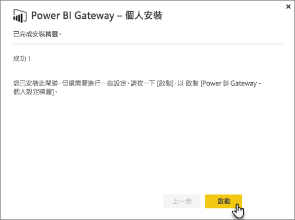
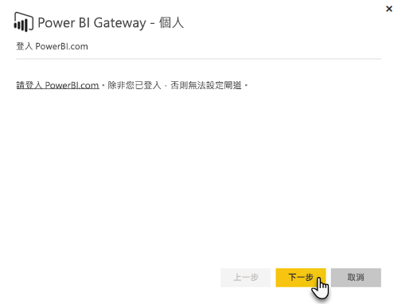
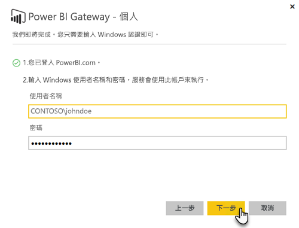

# 內部部署資料閘道

內部部署資料閘道會用來作為橋接器，在內部部署資料 (非位於雲端的資料) 與 Power BI、Microsoft Flow、Logic Apps 以及 PowerApps 服務之間，提供快速且安全的資料轉送。

您可以同時以不同服務使用單一閘道。 如果您同時使用 Power BI 與 PowerApps，單一閘道亦可同時用於兩者。 其取決於您登入時使用的帳戶。

> [!NOTE]
> 內部部署資料閘道會在所有模式中實作資料壓縮和傳輸加密。

<!-- Shared Requirements Include -->
[!INCLUDE [gateway-onprem-requirements-include](./includes/gateway-onprem-requirements-include.md)]

### Analysis Services 即時連線的限制

您可以使用即時連線針對表格式或多維度執行個體。

| **伺服器版本** | **必要的 SKU** |
| --- | --- |
| 2012 SP1 CU4 或更新版本 |商業智慧和企業版 SKU |
| 2014 |商業智慧和企業版 SKU |
| 2016 |標準 SKU 或更高版本 |

* 不支援資料格層級格式化與轉譯功能。
* 動作和命名集不會公開至 Power BI，但您仍然可以連接至同樣包含動作或命名集的多維度 Cube，然後建立視覺效果和報表。

<!-- Shared Install steps Include -->
[!INCLUDE [gateway-onprem-datasources-include](./includes/gateway-onprem-datasources-include.md)]

## 下載並安裝內部部署資料閘道

請於下載功能表下選取 [資料閘道]，以下載閘道。 下載[內部部署資料閘道](http://go.microsoft.com/fwlink/?LinkID=820925)。

請注意，更新內部部署資料閘道的方式是重新安裝閘道，如此節中所述。 只要安裝較新版本的閘道，就會保留您現有的設定。 如果您安裝相同的版本，則會將其視為完整重新安裝，並不會保留您的設定。

<!-- Shared Install steps Include -->
[!INCLUDE [gateway-onprem-install-include](./includes/gateway-onprem-install-include.md)]

## 以個人模式安裝閘道

> [!NOTE]
> 個人版本閘道只能搭配 Power BI。

安裝個人閘道之後，您必須啟動 **Power BI Gateway─Personal 設定精靈**。

然後您必須登入 Power BI 以將閘道註冊至雲端服務。

您也必須提供 Windows 服務執行時會使用的 Windows 使用者名稱和密碼。 您可以指定與您自己的帳戶不同的 Windows 帳戶。 閘道器服務會使用此帳戶來執行。

安裝完成後，您必須移至您在 Power BI 中的資料集，並確定已輸入您的內部部署資料來源的認證。

## 在雲端中儲存加密的認證

當您在閘道中加入資料來源時，您必須提供該資料來源的認證。 資料來源的所有查詢都會使用這些認證來執行。 認證使用非對稱式加密安全地加密，因此在儲存到雲端之前，都無法在雲端中解密。 認證會傳送至執行閘道的內部部署電腦，並在存取資料來源時解密。

<!-- Account and Port information -->
[!INCLUDE [gateway-onprem-accounts-ports-more](./includes/gateway-onprem-accounts-ports-more.md)]

<!-- How the gateway works -->
[!INCLUDE [gateway-onprem-how-it-works-include](./includes/gateway-onprem-how-it-works-include.md)]

## 限制與考量

* 目前不支援 [Azure 資訊保護](https://docs.microsoft.com/microsoft-365/enterprise/protect-files-with-aip
) \(機器翻譯\)
* 目前不支援[線上存取](https://products.office.com/en-us/access)

## 租用戶層級管理

目前沒有單一位置可供租用戶系統管理員用來管理其他使用者已安裝並設定之所有閘道。  如果您是租用戶系統管理員，建議您要求組織中的使用者，將您以系統管理員身分新增至他們所安裝的每個閘道。 這可讓您透過 [閘道設定] 頁面或 [PowerShell 命令](https://docs.microsoft.com/power-bi/service-gateway-high-availability-clusters#powershell-support-for-gateway-clusters)管理組織中的所有閘道。 

## 允許連出 Azure 連線

內部部署的資料閘道仰賴 Azure 服務匯流排來獲得雲端連線能力，並對其相關 Azure 區域相應建立連出連線。 根據預設，這是您 Power BI 租用戶的位置。 請參閱[我的 Power BI 租用戶位於何處？](https://powerbi.microsoft.com/en-us/documentation/powerbi-admin-where-is-my-tenant-located/)
若防火牆封鎖了連出連線，您就必須設定防火牆，使其允許內部部署的資料閘道與其相關 Azure 區域之間的連出連線。 如需各 Azure 資料中心 IP 位址範圍的詳細資料，請參閱 [Microsoft Azure Datacenter IP Ranges](https://www.microsoft.com/download/details.aspx?id=41653) (Microsoft Azure 資料中心 IP 範圍)。
> [!NOTE]
> IP 位址範圍可能隨著時間變更，因此請務必定期下載最新資訊。 

## 疑難排解

若您在安裝和設定閘道時遇到問題，請務必參閱[為內部部署資料閘道進行疑難排解](service-gateway-onprem-tshoot.md)。 若您認為您的防火牆發生問題，請參閱疑難排解文章中的[防火牆或 Proxy](service-gateway-onprem-tshoot.md#firewall-or-proxy) 一節。

若您認為自己遇到閘道 Proxy 問題，請參閱[進行 Power BI Gateway 的 Proxy 設定](service-gateway-proxy.md)。

## 後續步驟

[管理您的資料來源─Analysis Services](service-gateway-enterprise-manage-ssas.md)  
[管理您的資料來源 - SAP HANA](service-gateway-enterprise-manage-sap.md)  
[管理您的資料來源 - SQL Server](service-gateway-enterprise-manage-sql.md)  
[管理您的資料來源 - Oracle](service-gateway-onprem-manage-oracle.md)  
[管理您的資料來源 - 匯入/已排程的重新整理](service-gateway-enterprise-manage-scheduled-refresh.md)  
[內部部署資料閘道 - 深入資訊](service-gateway-onprem-indepth.md)  
[內部部署資料閘道 (個人模式) - 新版本的個人閘道](service-gateway-personal-mode.md)  
[設定內部部署資料閘道的 Proxy 設定](service-gateway-proxy.md)  

有其他問題嗎？ [試試 Power BI 社群](http://community.powerbi.com/)
