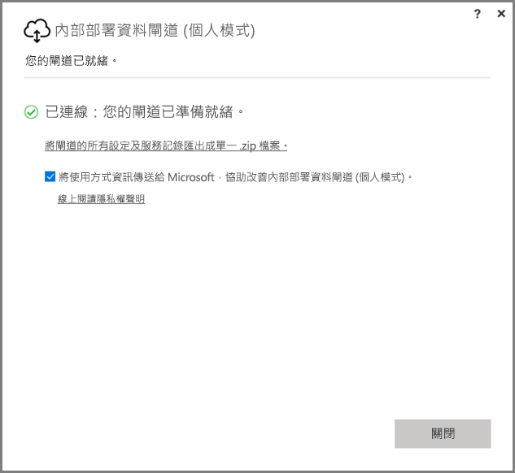
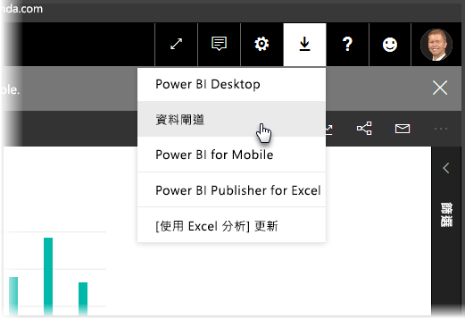
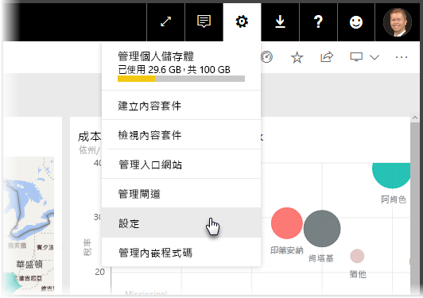
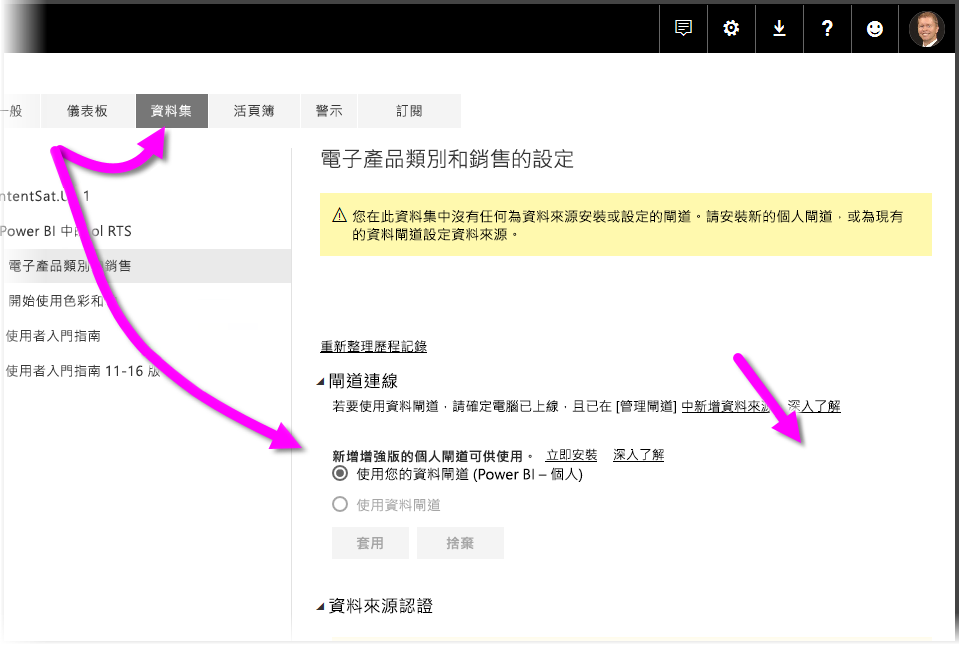
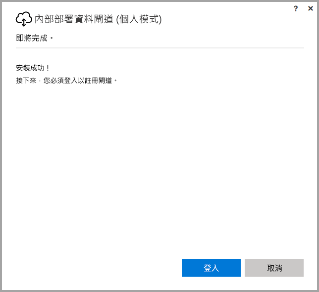
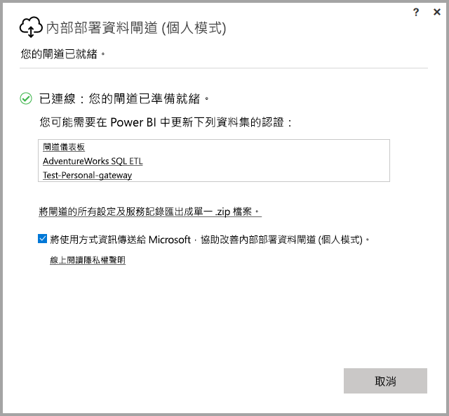

# <a name="on-premises-data-gateway-personal-mode"></a>內部部署資料閘道 (個人模式)
您可以使用內部部署資料來源，並使用閘道建立 Power BI 報表和儀表板。 **閘道**是一種軟體，可協助存取私用內部部署網路上所儲存的資料，然後可讓您使用 **Power BI 服務**這類線上服務中的資料。 **內部部署資料閘道 (個人模式)** 是最近發行的 Power BI 閘道更新，可讓個人在自己的電腦上安裝閘道，以及存取內部部署資料。



> [!NOTE]
> **內部部署資料閘道 (個人模式)** 取代先前支援的個人閘道版本 (稱為 **Power BI Gateway - Personal**)。 先前的個人閘道只會繼續運作到 2017 年 7 月 31 日。 如需如何更新為新版本的資訊，請參閱下列各節。
> 
> 

## <a name="features-of-the-on-premises-data-gateway-personal-mode"></a>內部部署資料閘道 (個人模式) 的功能
發行**內部部署資料閘道 (個人模式)** 時，也會立即提供一組改善和功能。 在舊版個人閘道 (稱為 **Power BI Gateway - Personal**) 中，其實作有一些限制。 與許多 Power BI 產品相同，我們聆聽客戶需求、要求和其使用產品的方式。 因此，**內部部署資料閘道 (個人模式)** 已從頭開始重新設計，並包括下列功能和改善：

* **改善的可靠性** - 個人閘道的新版本已因程式碼和結構軟體改善而改進舊版本的可靠性。
* **增強的擴充性** - 在結構軟體改善時，其他功能可以在可用時輕鬆地新增至個人閘道。
* **從 Power BI 服務中刪除個人閘道** - 您現在可以使用新的版本，將您的個人閘道從 **Power BI 服務**中刪除。
* **設定和服務記錄** - 新的版本可讓您只要按一下，就可以輕鬆地將設定和服務記錄匯出至 .zip 檔案。

## <a name="installing-on-premises-data-gateway-personal-mode"></a>安裝內部部署資料閘道 (個人模式)
若要安裝**內部部署資料閘道 (個人模式)**，而不安裝舊版閘道，請選取 **Power BI 服務**中的齒輪圖示，然後選取 [資料閘道]。



您也可以從[這個位置](https://go.microsoft.com/fwlink/?LinkId=820925&clcid=0x409)下載閘道。 您可以遵循安裝步驟，而且，因為安裝程序可讓您安裝任一版本的閘道 (可與其他人共用的標準閘道，或個人模式)，所以請確定您在提示輸入要安裝的閘道版本時選取**內部部署資料閘道 (個人模式)**。

### <a name="updating-from-the-previous-personal-gateway"></a>從舊版個人閘道進行更新
如果您已經安裝 **Power BI Gateway - Personal** 閘道，則當您在 **Power BI 服務**的 [設定] 下檢視 [資料集] 時，系統會提示您安裝新版和增強版的個人閘道。



如果您選取資料集，接著選取 [閘道連接]，則您會收到新版和增強版個人閘道可用的通知。 當您這麼做時，請選取 [立即安裝]。



> [!NOTE]
> 如果您將舊版 **Power BI Gateway - Personal** 執行為提高權限的程序，則也請確定以提高權限的方式啟動新的閘道安裝程序，因此可以自動更新您的資料集認證。 否則，您必須手動更新資料集認證。
> 
> 

您將進入更新程序，之後，就會看到安裝成功。 請不要關閉項目，還有最後一個步驟。



以下是最後一個步驟。 安裝新的個人閘道 (而且最後一個安裝畫面仍然可見) 之後，請登入 **Power BI 服務**，並等到您看到閘道上線，如下列影像所示。



如果您已更新與安裝舊版閘道相同的電腦上的個人閘道，則會自動更新您的認證，而且所有重新整理活動都會通過新的閘道。 如果已將舊版閘道安裝在不同的電腦上，則系統會要求您更新某些資料集上的認證。 在先前的影像中，視窗中顯示資料集清單；此清單會顯示可能需要更新過認證的資料集。 每個列出的資料集都是一個直接連結，您只要按一下，就可以輕鬆地更新您的認證。

幾乎就是這樣了。 安裝新閘道之後，就不再需要電腦上所安裝的舊版本，因此應該將它解除安裝。 搜尋電腦上的 **Power BI Gateway - Personal**，並將它解除安裝，即可執行這項作業。

### <a name="determining-which-version-of-the-personal-gateway-you-have-installed"></a>判斷您已安裝的個人閘道版本
若要判斷您目前已安裝的個人閘道版本，您可以執行下列作業：

* 舊版個人閘道稱為 **Power BI Gateway - Personal**，並使用其安裝對話方塊中的 Power BI 圖示。
* 新版個人閘道稱為**內部部署資料閘道 (個人模式)**，並使用閘道圖示 (底端有向上和向下箭號的雲端)。

您可以移至 [新增/移除程式]，並查看 **Power BI Gateway - Personal** 是否出現在清單中；如果是，則已安裝舊版個人閘道。

## <a name="using-fast-combine-with-the-personal-gateway"></a>搭配使用快速合併與個人閘道
如果您搭配使用**快速合併**與舊版閘道，則必須採取下列步驟來重新啟用**快速合併**以與**內部部署資料閘道 (個人模式)** 搭配運作：

1. 使用檔案總管，開啟下列檔案：
   
   ```
   %localappdata%\Microsoft\On-premises data gateway (personal mode)\Microsoft.PowerBI.DataMovement.Pipeline.GatewayCore.dll.config
   ```
2. 在檔案底端，新增下列文字：
   
       ```
       <setting name="EnableFastCombine" serializeAs="String">```
       <value>true</value>
       </setting>
       ```
3. 完成後，設定大約會在一分鐘內生效。 若要檢查它是否正常運作，請嘗試 **Power BI 服務**中的依需求重新整理，確認**快速合併**正常運作。

## <a name="limitations-and-considerations"></a>限制與考量
使用**內部部署資料閘道 (個人模式)** 時需要考慮幾件事，如下列清單所述。

* 如果您要使用 **Windows Hello** 或 PIN 碼來登入 Windows，則可能會發生下列錯誤： 
  * *您選取的使用者帳戶不符合此應用程式的要求。請改用其他帳戶。*
  * 若要解決這個錯誤，請選取 [使用不同的帳戶]，並重新登入。 

**內部部署資料閘道 (個人模式)** 目前不支援下列資料來源：

* ADO.NET 
* CurrentWorkbook
* FTP
* HDFS
* SAP BusinessObjects         
* Spark

預計將於 2017 日曆年度的下半年開始支援 Spark。

## <a name="frequently-asked-questions-faq"></a>常見問題集 (FAQ)
* 我可以並存執行**內部部署資料閘道 (個人模式)** 與**內部部署資料閘道** (先前稱為企業版的閘道) 嗎？
  
  * **答**：是，使用新版本時，可以同時執行兩者。
* 我可以將**內部部署資料閘道 (個人模式)** 執行為服務嗎？
  
  * **答**：否。 **內部部署資料閘道 (個人模式)** 只能執行為應用程式。 如果您需要將閘道執行為服務且 (或) 使用系統管理員模式，則需要考量[**內部部署資料閘道**](service-gateway-onprem.md) (先前稱為「企業閘道」)。
* **內部部署資料閘道 (個人模式)** 的更新頻率為何？
  
  * **答**：我們想要每月更新個人閘道。
* 為什麼要求我更新認證？
  
  * **答**：許多情況都可以觸發認證的要求。 最常見的情況是您已在與 **Power BI - Personal** 閘道不同的電腦上重新安裝**內部部署資料閘道 (個人模式)**。 這也可能會在資料來源中造成問題，而且 Power BI 無法執行測試連接，或發生逾時或系統錯誤。 您可以在 **Power BI 服務**中更新您的認證，方法是移至**齒輪圖示**，並選取 [設定]，接著選取 [資料集]，並尋找發生問題的資料集，然後按一下 [更新認證]。
* 在升級期間，我的舊版個人閘道將有多少時間離線？
  
  * **答**：將個人閘道升級為新版本應該只需要幾分鐘的時間。 
* 如果我未在 2017 年 7 月 31 日之前移轉至新的個人閘道，會發生什麼情況？
  
  * **答**：如果您要使用目前閘道來重新整理報表，則重新整理將會停止。 設定新重新整理排程的唯一方法是安裝和設定新的閘道。
* 我正在使用 R 指令碼。 這受到支援嗎？
  
  * **答**：我們很快會新增 R 指令碼的支援。
* 我為什麼在 **Power BI 服務**中看不到更新閘道的訊息？
  
  * **答**：最可能的原因是您有一或多個包含目前仍不支援之資料來源的資料集。

## <a name="next-steps"></a>後續步驟
[進行 Power BI Gateway 的 Proxy 設定](service-gateway-proxy.md)  
有其他問題嗎？ [試試 Power BI 社群](http://community.powerbi.com/)

