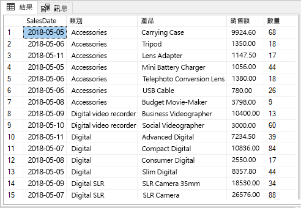
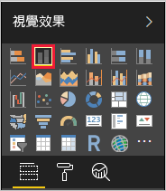
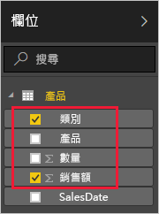
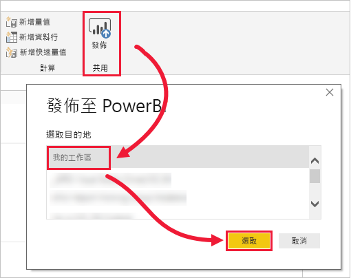
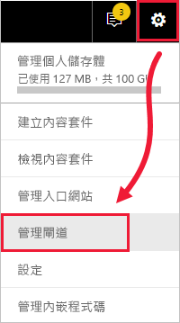
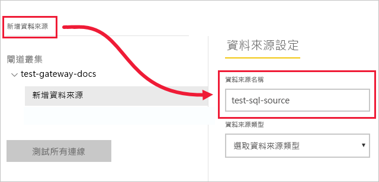
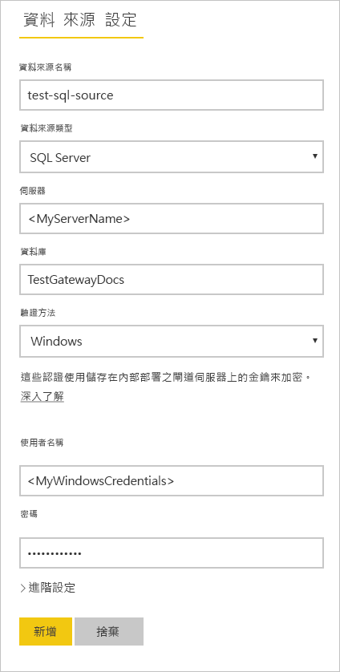
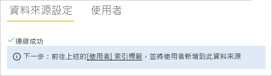
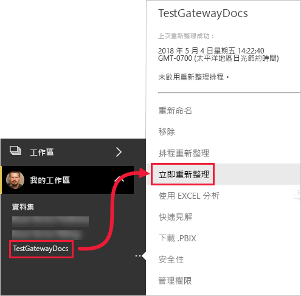
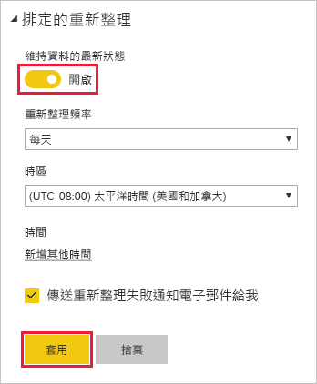

# <a name="tutorial-connect-to-on-premises-data-in-sql-server"></a>教學課程：連線到 SQL Server 中的內部部署資料

內部部署資料閘道是您在內部部署網路中安裝的軟體，它有助於存取該網路中的資料。 在本教學課程中，您將根據從 SQL Server 匯入的範例資料，在 Power BI Desktop 中建置報表。 然後，您可以將報表發行至 Power BI 服務，並設定閘道，讓服務能夠存取內部部署資料。 此存取權就表示該服務可以重新整理資料，以使報表保持最新狀態。

在本教學課程中，您會了解如何：
> [!div class="checklist"]
> * 從 SQL Server 中的資料建立報表
> * 將報表發行至 Power BI 服務
> * 加入 SQL Server 作為閘道資料來源
> * 重新整理報表中的資料

如果您尚未註冊 Power BI，請先進行[免費註冊](https://app.powerbi.com/signupredirect?pbi_source=web)再開始。


## <a name="prerequisites"></a>先決條件

* [安裝 Power BI Desktop](https://powerbi.microsoft.com/desktop/)
* 在本機電腦上[安裝 SQL Server](https://docs.microsoft.com/sql/database-engine/install-windows/install-sql-server) 
* 在相同的本機電腦上[安裝內部部署資料閘道](service-gateway-install.md) (在生產環境中，通常是另一部電腦)


## <a name="set-up-sample-data"></a>設定範例資料

首先您將範例資料加入至 SQL Server，以便在本教學課程的其餘部分使用該資料。

1. 在 SQL Server Management Studio (SSMS) 中，連線到您的 SQL Server 執行個體，並建立測試資料庫。

    ```sql
    CREATE DATABASE TestGatewayDocs
    ```

2. 在您建立的資料庫中，新增資料表並插入資料。

    ```sql
    USE TestGatewayDocs

    CREATE TABLE Product (
        SalesDate DATE,
        Category  VARCHAR(100),
        Product VARCHAR(100),
        Sales MONEY,
        Quantity INT
    )

    INSERT INTO Product VALUES('2018-05-05','Accessories','Carrying Case',9924.60,68)
    INSERT INTO Product VALUES('2018-05-06','Accessories','Tripod',1350.00,18)
    INSERT INTO Product VALUES('2018-05-11','Accessories','Lens Adapter',1147.50,17)
    INSERT INTO Product VALUES('2018-05-05','Accessories','Mini Battery Charger',1056.00,44)
    INSERT INTO Product VALUES('2018-05-06','Accessories','Telephoto Conversion Lens',1380.00,18)
    INSERT INTO Product VALUES('2018-05-06','Accessories','USB Cable',780.00,26)
    INSERT INTO Product VALUES('2018-05-08','Accessories','Budget Movie-Maker',3798.00,9)
    INSERT INTO Product VALUES('2018-05-09','Digital video recorder','Business Videographer',10400.00,13)
    INSERT INTO Product VALUES('2018-05-10','Digital video recorder','Social Videographer',3000.00,60)
    INSERT INTO Product VALUES('2018-05-11','Digital','Advanced Digital',7234.50,39)
    INSERT INTO Product VALUES('2018-05-07','Digital','Compact Digital',10836.00,84)
    INSERT INTO Product VALUES('2018-05-08','Digital','Consumer Digital',2550.00,17)
    INSERT INTO Product VALUES('2018-05-05','Digital','Slim Digital',8357.80,44)
    INSERT INTO Product VALUES('2018-05-09','Digital SLR','SLR Camera 35mm',18530.00,34)
    INSERT INTO Product VALUES('2018-05-07','Digital SLR','SLR Camera',26576.00,88)
    ```

3. 從資料表中選取資料以確認。

    ```sql
    SELECT * FROM Product
    ```

    


## <a name="build-and-publish-a-report"></a>建置並發行報表

有可供使用的範例資料之後，接著就可以連線到 Power BI Desktop 中的 SQL Server，並根據這些資料建置報表。 然後將報表發佈至 Power BI 服務。

1. 在 Power BI Desktop 的 [常用] 索引標籤上，選取 [取得資料] > [SQL Server]。

2. 在 [伺服器] 下輸入您的伺服器名稱，並在 [資料庫] 下輸入 "TestGatewayDocs"。 選取 [確定] 。 

    

3. 確認您的認證，然後選取 [連線]。

4. 在 [導覽器] 下，選取 [Product] \(產品\) 資料表，然後選取 [載入]。

    ![選取 [產品] 資料表](media/service-gateway-sql-tutorial/select-product-table.png)

5. 在 Power BI Desktop [報表] 檢視的 [視覺效果] 窗格中，選取 [堆疊直條圖]。

        

6. 選取報表畫布中的直條圖後，在 [欄位] 窗格中選取 [類別] 和 [銷售] 欄位。  

    

    圖表現在看起來應該類似如下。

    ![選取 [產品] 資料表](media/service-gateway-sql-tutorial/finished-chart.png)

    請注意，**單眼相機**是目前的銷售領導者。 當您稍後在本教學課程更新資料並重新整理報表時，這會有所變更。

7. 儲存名稱為 "TestGatewayDocs.pbix" 的報表。

8. 在 [常用] 索引標籤上，選取 [發行] > [我的工作區] > [選取]。 如果系統要求您登入 Power BI 服務，請執行這項操作。 

    

9. 在 [成功] 畫面上，選取 [在 Power BI 中開啟 'TestGatewayDocs.pbix']。


## <a name="add-sql-server-as-a-gateway-data-source"></a>加入 SQL Server 作為閘道資料來源

在 Power BI Desktop 中，您會直接連線到 SQL Server，但 Power BI 服務需要閘道作為橋接器。 現在，將您的 SQL Server 執行個體新增為先前文章中 (列在[必要條件](#prereqisites)下) 所建立閘道的資料來源。 

1. 在 Power BI 服務的右上角，選取齒輪圖示  > [管理閘道]。

    

2. 選取 [加入資料來源]，然後輸入 "test-sql-source" 作為**資料來源名稱**。

    

3. 選取 **SQL Server** 的**資料來源類型**，然後輸入其他值，如下所示。

    

    | 選項 | 值 |
    | ---    | ---   |
    | **資料來源名稱**       | test-sql-source      |
    | **資料來源類型**       | SQL Server      |
    | **伺服器**       |  您的 SQL Server 執行個體名稱 (必須與您在 Power BI Desktop 中指定的名稱相同)    |
    | **資料庫**       | TestGatewayDocs      |
    | **驗證方法**       | Windows      |
    | **使用者名稱**        |  您用來連線到 SQL Server 的帳戶，例如 michael@contoso.com     |
    | **密碼**       |  用來連線到 SQL Server 之帳戶的密碼    |

4. 選取 [加入] 。 當程序成功時，您會看到 [連線成功]。

    

    您現在可以使用此資料來源，在 Power BI 儀表板和報表中包含 SQL Server 的資料。


## <a name="configure-and-use-data-refresh"></a>設定及使用資料重新整理

您將報表發行至 Power BI 服務中，並設定 SQL Server 資料來源。 完成之後，您現在對產品資料表進行變更，並且該變更會通過閘道流向已發行的報表。 您還可以設定排定的重新整理，以處理任何未來的變更。

1. 在 SSMS 中，更新產品資料表中的資料。

    ```sql
    UPDATE Product
    SET Sales = 32508, Quantity = 252
    WHERE Product='Compact Digital'     

    ```

2. 在 Power BI 服務的左側瀏覽窗格中，選取 [我的工作區]。

3. 在 [資料集] 下，針對 **TestGatewayDocs** 資料集選取 [詳細] (**. . .**) > [立即重新整理]。

    

4. 選取 [我的工作區] > [報表] > [TestGatewayDocs]。 查看更新的流向方式，且銷售領導者現在是**輕便相機**。 

    

5. 選取 [我的工作區] > [報表] > [TestGatewayDocs]。 選取 [更多] (**. . .**) > [排程重新整理]。

6. 在 [排程重新整理] 下，將重新整理設定為 [開啟]，然後選取 [套用]。 根據預設，資料集是每天重新整理的。

    

## <a name="clean-up-resources"></a>清除資源
如果您不想再使用範例資料，請在 SSMS 中執行 `DROP DATABASE TestGatewayDocs`。 如果您不想使用 SQL Server 資料來源，請[移除資料來源](service-gateway-manage.md#remove-a-data-source)。 


## <a name="next-steps"></a>後續步驟
在本教學課程中，您已了解如何：
> [!div class="checklist"]
> * 從 SQL Server 中的資料建立報表
> * 將報表發行至 Power BI 服務
> * 加入 SQL Server 作為閘道資料來源
> * 重新整理報表中的資料

繼續閱讀下列文章以深入了解
> [!div class="nextstepaction"]
> [管理 Power BI 閘道](service-gateway-manage.md)

